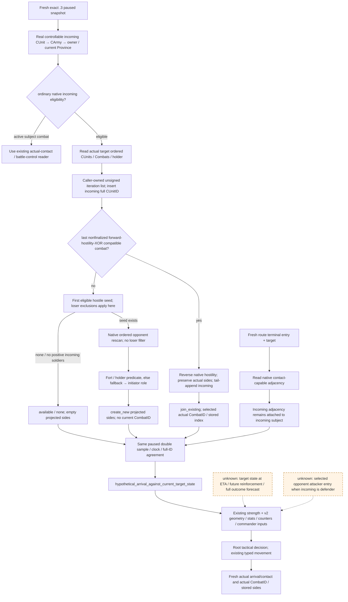

# CK3 1.20.0.3: projected contact role and participant order

The new read-only query supplies the missing remote contact input: the current combat or ordered opponent set that the native resolver would select if a real controllable incoming army arrived at the specified target **now**, and its projected attacker/defender role. Existing army-strengths and combat-v2 queries already supply the comparative strength, terrain, counters and commander inputs. This projection makes their participant partition native-derived; it does not forecast future enemy movement or a battle outcome.

Implementation status: **static-ready**. The implementation contract and native input tree were frozen before implementation. The central production reader/serializer and registered MCP fixtures are GREEN for ten new cases. Root's deployed paused-query result is pending; no new production-live credit is claimed here. Machine evidence and result slots are in [projected-contact-scope-v1-12003-evidence.json](projected-contact-scope-v1-12003-evidence.json).

## Exact build and reused evidence

This increment targets CK3 **1.20.0.3 / Steam 25652598**, EXE SHA-256 `94B55397ABB687A3DCD436805A5D885E6BE90FA6C693FEB44A9E3BBEEADE02A6`. Implementation source baseline is owner-supplied read-only `Z:/g38`, head `02e`; this lane did not verify the head with Git. Source paths retaining `ck3_12002` are reusable implementation names. `ck3_12003_adapter.cpp:46` binds the reviewed layout only after matching the exact `.3` executable; this query's capability is published only on that adapter.

`NATIVE-INPUT-FREEZE.json` remains the pre-implementation research/input ledger. Root's `INPUT-AMENDMENT.json` records an owner change during lane work: the actual Python overlay used `native_driver.py` preimage SHA `75ce828c8b914f8dc5bd4efb9cd7c9f1dcf698a87d9fb84a335ad21e8f88444b`, rather than historical freeze `8dfedf834941c064b30b120c71f5dc33efed554d84b77de2c9757ccb85f7e8fa`. The lane manifest/fixture describe the current overlay and preserve the owner delta. This amendment does not rewrite the native tree/freeze or assert that every current implementation pin still equals that earlier ledger.

Read before implementation: [native contact resolver and actual observation](actual-contact-scope.md), [army contact tree](army-contact-resolution.md), [combat input observations](combat-simulation-inputs.md), [actual Robert composition](battle-composition-actual-v34-12003.md) and the pre-implementation `.3` strength/contact packages recorded in the evidence file. The first two topics contain historical `1.19.0.6` addresses and offsets. They explain the closed branch semantics; current source bindings below own this increment's `.3` addresses. Historical `.19` or `.1` layouts must not be substituted.

| Current frozen source | Relevant contract |
|---|---|
| `ck3_12002_routes.cpp:1387` | Actual reader resolves real CUnit, CArmy, owner and target; `:1404` requires subject current Province equal target. |
| `:1432` | Ordinary native contact eligibility includes target/mode raw gates, raw state, retreat and empty-army predicate; an existing active subject uses the actual combat reader. |
| `:1447` | Actual target unit/combat arrays are read in their native unsigned full-ID order; `:1455` requires actual incoming membership. |
| `:1461` | Forward owner-to-primary hostility XOR selects the last compatible nonfinalized current combat in stored scan order. Loser exclusions accumulate only before a compatible combat has been saved. |
| `:1508` | Reverse primary-to-owner relations derive join side independently; exactly one must be true. Stored side order is preserved, then incoming is appended to its selected side if absent. |
| `:1549` / `:1608` | First eligible hostile seed uses loser exclusions. The complete opponent rescan uses seed-owner equality or reverse hostility and deliberately does not reuse that exclusion filter. Empty, retreating and active-combat opponents are excluded. |
| `:1652` | Fort/holder predicate and fallback predicate derive `initiator_is_defender`; true places incoming on defender side. Opponent first-seen native order is preserved. |
| `:1346` / `:1673` | Actual adjacency belongs to the initiating unit's native current/prior Province state. |
| `:1806` / `:1851` / `:1856` | Actual wrapper repeats subject-at-target; the paused double sample and clock/identity checks bind publication to one observed state. |

Current reviewed RVA bindings, all relative to this pinned EXE: game state `0x5C68C50`, public CUnit storage `0x5D1E380`, internal CArmy storage `0x5D1DE48`, Character storage `0x5C67568`, Combat storage `0x5D1DE70`, BattleResult storage `0x5D1FFE0`; read-only hostility `0x2C09640`, empty predicate `0x24E83C0`, active-combat predicate `0x24E8360`, holder getter `0x247D030`, holder defender predicate `0x2C09810`, fallback defender predicate `0x2C164E0`. Province units are `+0x740/count +0x74C`, combats `+0x758/count +0x764`, fort level `+0x850`. Formal business names for the two defender predicates and raw contact gates remain unresolved; their existing operand direction and side effect are the reused contract.

The frozen `.3` native strength tree corroborates current/base power at `0x2C3E850` and the `ArmyRegiment+0x38/+0x40` soldier/power operands already published by `ck3_query_army_strengths`. Native AI estimated-power-share predictor `0x1AC7540` and final-entry consumer `0x1AC92B2` are separate research. This query does not invoke that predictor or manufacture native AI stack/coordinator context.

## Native tree and projection boundary



Actual target arrays and incoming current position are observed fields. Inserting the incoming public ID into a caller-owned iteration vector, selecting a possible join/new contact and assigning projected sides are hypothetical fields. The reader does not write unit positions, Province arrays, Army backlinks or combat membership. Actual mode keeps its wrapper, sample, membership and real adjacency checks. Both modes reuse the same local relation/order decision.

## Public query and response meaning

Public tool: `ck3_query_projected_contact_scope_v1(subject_army_id, target_province_id, incoming_entry_province_id, expected_revision)`. Province IDs are positive integers. Subject and side arrays use public full CUnitIDs, including valid ID `0` and generation-zero IDs; internal CArmyIDs are diagnostic backlinks. Use the fresh public revision. Owning-thread literal is `query-projected-contact-scope-v1-<subject>-to-<target>-from-<entry>`; capability is `game.command.query-projected-contact-scope-v1-N`.

The reply object is `projected_contact_scope`. `scope_kind` is always `hypothetical_arrival_against_current_target_state`. It includes snapshot/date, real incoming identity/owner/current Province, explicit target/entry, `observed_target_public_cunit_ids`, `observed_target_combat_ids`, the selected current combat/index when applicable, projected subject side and both ordered projected side arrays, initiator-role observability/result, raw incoming adjacency and `contact_projection_inputs_complete`. Existing response binding retains source/native/public revisions.

| Transition | Selected current combat/index | Subject side / initiator role | Projected sides |
|---|---|---|---|
| `none` | `null` / `null` | `none`; initiator observability/result inapplicable | `[]` / `[]` |
| `join_existing` | Actual selected CombatID / its observed stored array index | Native reverse relation side; initiator observability/result inapplicable | Actual stored side order, incoming appended to the selected side if absent |
| `create_new` | `null` / `null` | Native derived attacker or defender; initiator observable and its derived bool | Incoming singleton vs native first-seen ordered opponents, oriented by the derived role |

Observed production serializer and registered MCP fixture shape: `projected_initiator_is_defender_observable` is a non-null bool. It is false for `join_existing`/`none`, with `projected_initiator_is_defender=null`; it is true for `create_new`, with the derived bool preserving a legitimate false. Selected current CombatID/index are null when inapplicable. A complete `none` is `status=available` and `contact_projection_inputs_complete=true`: current-target contact projection was read successfully and yields no contact. It does not claim that travel is contact-free. Failure statuses cover actual missing/unreadable/inapplicable inputs, unpaused state, native relation failure or state change; they add no warfare action gate. The query does not publish `actual_contact_scope_ready=true`, a win-odds field, or full-simulation readiness.

Use route and query receipts from the current paused context. This call example binds arguments dynamically; it is not a saved campaign result:

```python
# Read these integers from the fresh route-preview/composer receipt.
target = observed_preview_target_province_id
entry = observed_route_final_entry_province_id
reply = ck3_query_projected_contact_scope_v1(
    subject_army_id=83886367,
    target_province_id=target,
    incoming_entry_province_id=entry,
    expected_revision=fresh_snapshot["revision"],
)
```

Root's file-only composer derives entry from the terminal route edge: remove an optional leading origin; use the penultimate remaining Province, or the preview origin when only the target remains. It emits concrete typed calls after receiving the fresh preview. No dated numeric entry is a future constant.

For a `create_new` attacker result, pass the returned ordered attackers/defenders and fresh target to combat-v2; the incoming edge can supply `attacker_entry_province_id` because the incoming is the attacker. For a defender result, pass the returned arrays but **do not** use the incoming edge as the opponent attacker's entry. For a join, incoming adjacency likewise does not establish the existing attacker's original edge. Existing actual battle width/net advantage and target/current strength inputs remain useful independently. The concrete next observation for that unresolved entry is the selected attacker's native current/prior Province adjacency through the reviewed contact-adjacency layout.

These are contract examples, not actual outcomes:

| Native result | Correct side/entry interpretation |
|---|---|
| New contact, incoming attacker | Attackers `[incoming]`; defenders `ordered_opponents`; incoming route entry belongs to attacker. |
| New contact, incoming defender | Attackers `ordered_opponents`; defenders `[incoming]`; incoming route entry belongs to defender. |
| Join defender | Keep existing attackers; append incoming after the existing defender array; initiator role is inapplicable. |
| Hostile to both primary sides of every current combat, no eligible separate opponent | Forward XOR is false; active-combat units cannot seed/create opponents; complete `none` is valid. |

## Current campaign and readiness ledger

Root supplied the normal Robert `29829` campaign, public CUnit `83886367@2604` sieging, and foreign Combat `1577058305@2640` with rebel `70766` against `30097`/`35357`; Robert is outside those stored sides. This lane acquired no live frame or current revision/date. Re-read target state after the siege batch. Earlier `2640` mountains, entry `2634` and foreign `-12` base advantage remain dated facts for their own scenario/combat and are not future player fields. The query may return `none` after foreign combat changes or ends, or while it is incompatible with incoming relations.

The central focused fixture completed **production reader → native serializer → Python normalizer → NativeHeadlessGameplayDriver → GameplayBridgeService → registered MCP** for ten new cases. Native `focused-attempt-02/RESULT.json` and `REGISTERED-MCP-RESULT.json` are both GREEN; native exit code is 0 and each registered case preserves production native inner JSON. Native revision41/public revision2 are synthetic fixture bindings, not a Robert campaign frame. The transport uses the existing FakeEndpoint; no game, full DLL build or window was contacted. Old matrices were not rerun. The native fixture also checks unchanged actual-query subject-not-at-target and unchanged fixture-owned real arrays/positions.

Observed fixture examples below all use synthetic subject `16777217@2`, target3, incoming entry2 and raw adjacency2. They are contract evidence, not live campaign outcomes:

| Case | Observed production/MCP result |
|---|---|
| `remote-create-new` | Incoming attacker, observable=true/initiator=false; attackers `[16777217]`, defenders `[16777218,16777219]`; selected current combat/index null. |
| `remote-holder-defender` | Incoming defender, observable=true/initiator=true; attackers `[16777218,16777219]`, defenders `[16777217]`; entry2 remains the incoming defender's edge. |
| `compatible-join-stored-order` | Selects Combat16777218 at stored index1; incoming attacker appended after `[16777221,16777220]`; defenders remain `[16777219,16777218]`; observable=false/initiator=null. |
| `both-hostile-xor-none` | Available complete none, both projected arrays empty; selected current combat/index null, observable=false/initiator=null. |
| `public-cunit-zero` | Subject0 remains public0 and is returned in attackers `[0]`; its internal CArmy diagnostic is16777217. |
| Invalid full generation / entry / bindings | Native statuses `subject_army_not_found`, `invalid_entry_target_adjacency`, `unavailable`; the normalizer and registered MCP preserve failure rather than accepting them as none. |

Two harness REDs are retained: `focused-attempt-01/RESULT.json` records C4715 under `/WX` after renaming the legacy main without an explicit return; reader and serializer had already compiled successfully. Attempt02 extracted only the reusable memory-layout prefix, excluded old main, reused those unchanged production objects and compiled the changed harness. `focused-attempt-02/REGISTERED-MCP-ATTEMPT-01-RED.json` records `ModuleNotFoundError: No module named 'build_release'`; the tools import path was corrected and final registered receipt is GREEN without another native run. These are harness failures, not demonstrated capability failures. This lane consumed the receipts and ran no test.

| Evidence level | Current result / promotion condition |
|---|---|
| `research` | Frozen native tree, `.3` bindings and query semantics documented before implementation; retained as the implementation input. |
| `static-ready` | Central production reader/serializer and registered MCP each GREEN, ten new cases; external integrated implementation artifact available. |
| `fixture-live` | Not claimed; a native synthetic reader fixture is not a running CK3 fixture. |
| `production-live primitive` | Pending Root's combined DLL and fresh actual paused `.3` projected-query artifact. A complete `none` can establish this read-only primitive. |
| `production-live loop` | Pending an observed tactical decision, typed action and independent actual contact/outcome postcondition. |
| `complete` | Not claimed for encounter simulation, battle OODA or warfare. |

Central fixture: **GREEN**, native and registered receipts under `Z:/ck3_mod_rewrite_process_assets/g2-resume-20261003/battle-terrain-actual/future-engagement/implementation-02e/fixture/focused-attempt-02/`; all receipt and wire pins are in the evidence file. Root paused query: **pending**, receipt not supplied. No new tests, game days, SDK calls, desktop/window operations, Git commands or policy changes occurred in this documentation lane. Root owns central report/index merge, shared integration, build, deployment, real acceptance, commit and push. Further results must update the evidence and report fields from their actual receipts without crediting an ACK, schema or synthetic case as a player battle.
