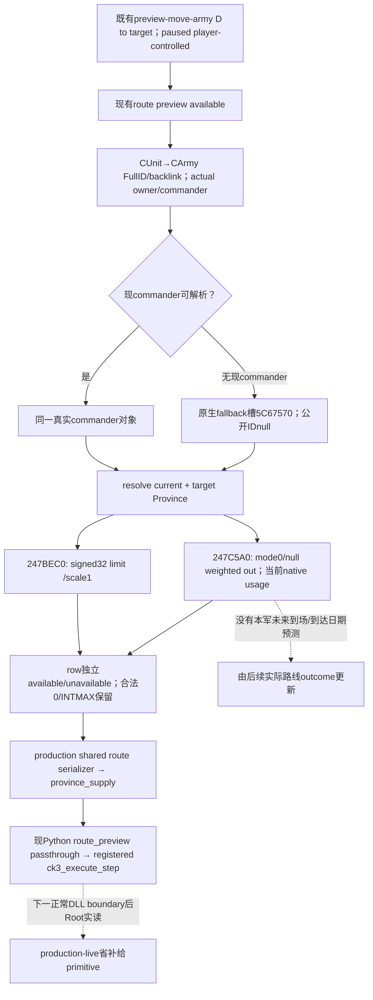

# CK3 1.20.0.3：移动预览中的省补给上限与原生占用

2026-10-04 / ISO2026-W40。源码冻结 `Z:/g53`、HEAD `89f45fa1408620b750e1a808c42284d824d03d81`，游戏 exact CK3 **1.20.0.3 / Steam25652598**、EXE SHA-256 `94B55397ABB687A3DCD436805A5D885E6BE90FA6C693FEB44A9E3BBEEADE02A6`。Root实际需求是主军到达2618后的停留，以及下一步2640解围/收复路径选择；军队自身补给/兵力字段已完备，本包补此前未发布的省级输入。

先复用 [当前月供给原生树](army-current-supply-capacity-attrition-12003.md) 与 [会合/继承边界](army-meeting-merge-supply-inheritance-12003.md)，再分别闭合两个必要leaf；树落盘后才实现。旧capacity/attrition/monthly/replenishment/merge/gathering矩阵没有重跑。readiness为 **static-ready**：新的真实生产reader/sharedserializer链及registered MCP已离线GREEN，尚未取得新DLL的Root生产paused省字段，不宣称live或战斗终态。

## 原生typed ABI与当前数据口径

| native leaf | Microsoft x64实际参数 | 返回单位与含义 |
|---|---|---|
| `0x247BEC0` supply limit | `int32_t(CProvince* RCX, CCharacter* actual_owner RDX, CCharacter* commander R8, NativeString* optional_detail R9)`；R9=null | EAX signed32、whole soldier-equivalent limit，**scale1**，无out参数。owner和commander对象均不可null。 |
| `0x247C5A0` aggregate usage | `int32_t(CProvince* RCX, CCharacter* actual_owner RDX, int32_t mode R8D, int64_t* optional_weighted_supply_out R9)`；mode0/R9=null | EAX signed32、whole supply-eligible当前兵数，**scale1**；R9不是aggregate out，也不是detail。 |

旧monthly caller在EAX后movsxd再乘100000，仅用于其内部fixed运算，不能把这两个leaf错标成Q100000或int64*out。limit入口按Province definition+8/byte+0x1B判断普通land条件；特殊路径返回`INT32_MAX`，保留原生合法值，不能当unavailable、零值或一条目的地补给保证。正常stock floor1000是原生算值的一部分，不是本项目新增策略门槛。

limit使用真实当前army owner及commander上下文，并考虑当前战争同侧友方的较高适用limit。军队无有效现commander时复用原native fallback CCharacter对象槽RVA **0x5C67570**，getter实际传该对象，公开`commander_character_id`仍null；不造一个已任命统帅。返回的current/target limit均是同一暂停帧和当前统帅上下文的值，不是实际到达时预测。

usage遍历Province+0x740 CUnit IDs /+0x74C count，统计同owner，以及`0x2C090F0(actor,other,nullptr)`证明**任意一场当前共同战争同侧**的其他owner。这不是一般alliance关系；某角色在另一战争相反侧时也没有额外general-hostility veto。每军只累计native supply资格兵团当前兵数，不能用公开total、scope内stack数或全省所有国家军队的总数代替。

mode0沿原monthly caller，保留有route/retreat状态的军队；mode1才执行另一过滤。合法零路径原生闭合，空省或无资格贡献者可以observed0。leaf没有subject army/排除ID参数：当前驻省本军自然参与native图；查询候选2640时，不自行加仍在2618的本军未来到场。旧monthly caller检测different Province后另加subject资格兵数，该补项不属于usage leaf，本查询不重复加，也不由public soldiers拼未来净占用。



完整exact证据：[limit ROOT-DELIVERY](Z:/ck3_mod_rewrite_process_assets/g2-resume-20261003/army-supply-attrition/province-supply-observer-g53/native-limit/ROOT-DELIVERY.json)、[usage ROOT-DELIVERY](Z:/ck3_mod_rewrite_process_assets/g2-resume-20261003/army-supply-attrition/province-supply-observer-g53/native-usage/ROOT-DELIVERY.json)。各包保留TREE/Mermaid、typed native-abi、完整必要span/instruction hash及日周字段；新必要分支decode一次，不展开modifier全目录或重做旧getter。

## 最小现有查询增量

复用已有 `preview_move_army_step(army_id,target_province_id)` / `preview-move-army-N-to-N` family和注册 `ck3_execute_step(step=..., expected_revision=R)`。它已有subject army、目标Province、同owning-thread paused route解析，不扩Strength虚拟接口、semantic mailbox、公开MCP、runtime flag或动作条件。

现 `route_preview` 新增 `province_supply`：

```json
{
  "status": "available | partial | unavailable",
  "unavailable_reason": null,
  "army_id": "实际public fullCUnitID",
  "native_carmy_id": "实际fullCArmyID或null",
  "owner_character_id": "实际owner FullID或null",
  "commander_character_id": "实际现commander FullID或null",
  "current": {
    "status": "available | unavailable",
    "unavailable_reason": null,
    "role": "current",
    "province_id": "实际当前ProvinceID",
    "native_supply_limit_soldiers": "signed int32或null",
    "native_supply_usage_soldiers": "signed int32或null",
    "scale": 1
  },
  "target": "同结构，role=target/真实目标ProvinceID"
}
```

缺row时保留其具体reason/null，不把失败变0；一个row available仍可独立用，另一个缺失时top partial。原路线合法性与available状态不受这两个附加读数影响。仅exact `.3`绑定新getter；`.2`未闭合对应ABI，保留其原路线查询而新增省字段unavailable。本包为战后合法move preview场景交付，不另造战斗中独立省探针。

Python已有 `native_driver.py:11988` preview分支以`**route_preview`复制完整nested值，registered MCP与service已有直接return；无需新增生产Python分支或formatter。实际Root recipe：复用fresh paused roster选仍存在的public ID和revision，对2640作一次现有preview，读取两row的真实context/scale1 limit+usage；军队目前补给、容量、月变化、attrition继续复用原Strength口。由真实值决定停留/路径，不新增任意分兵、等待门禁或未来补给保证。

## 新必要生产链fixture与接续

新focused native producer首轮 **GREEN**：生产army province reader → 与bridge同一个完整route-preview serializer，C++20 `/O2 /DNDEBUG /W4 /WX` 单次compile/run，以3个小native场景覆盖current/target、合法0/INTMAX、native fallback和target unresolved→partial。native getter为注入callback，不执行游戏EXE中的getter。

同一正常完整C++输出由新reusable registered fixture通过真正MCP Client发现并调用 `ck3_execute_step` **一次**，执行现service、NativeHeadlessGameplayDriver、protocol receiver/ingest；Python `-B -O`，13个checks首轮 **GREEN**，证实完整`province_supply`原样保留，不产生army/date变化。样例current2618 limit6000/usage2290、candidate2640 INTMAX/usage0全为callback fixture值，不能写成Robert actual。hello/state/endpoint/command envelope为offline stub，无SDK、pipe、窗口、游戏日/战斗/合军信用。

测试入口 [test_province_supply_route_preview_registered_mcp.py](../../ck3_autonomous_player/tests/unit/test_province_supply_route_preview_registered_mcp.py)，支持 `--source-root --native-fixture --output-dir`；本次native输入与registered结果分别归档 `province-supply-observer-g53/focused-attempt-01/REGISTERED-MCP-INPUT.json` 和 `registered-focused-attempt-01/RESULT.json`。旧army/route/merge/gathering矩阵没有重跑。

两个修改adapter translation units也各首次实际 `/O2 /DNDEBUG /W4 /WX` compile **GREEN**。此前一次compile harness误匹配production build target、compiler尚未启动/无obj，HARNESS-RED artifact保留；修target后并行首编验证，不重nativeproducer/registered GREEN，也未编bridge完整TU或fullbuild。

Root采用external7path源码和本篇后，在下一正常boundary统一冻结/strict DLL构建部署，再用当前真实军队→2640 preview实读两row。只有真实paused body观察到scale1有效值才升级为production-live primitive；后续实际换省/战后驻留outcome独立核验，不以ACK或fixture冒充。当前reader无需等待完整AI补给目标utility排序；具体字段已解锁可施工并待真实读取，而不是长期null schema终态。
