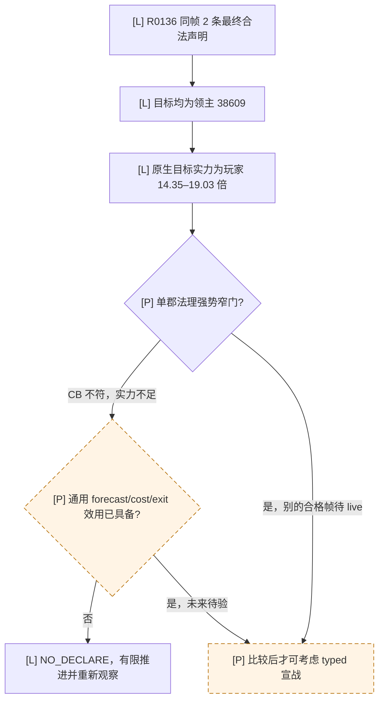

# R0136 战争机会停滞：同帧拒战复核（2026-09-23）

## 冻结范围与证据

- [production-live] R0136 使用 CK3 `1.19.0.6-steam23530548`，EXE SHA-256 `2D00FF3101EF70B566F2FCBAE292F09263199C80E9DC8F139B82D7D96F83DB86`，普通封建 `ordinary_campaign_succession/xar_off`。候选源码提交 `a092d6e04d9135d6fa60aaecd49fa2222130ced8` 的 `strategy.py` blob `63d804a6aa20d81205021eea50fb6a00df401322` 与本次核对的 master 相同。
- [production-live] [formal-report.txt](<Z:/ck3_mod_rewrite_process_assets/g2-war-h2675-continued-20260922/live-R0136/formal-report.txt>) SHA-256 `BE11AFD7CBB95F56BE3D9F70B893AD65FFB1027F122CB793FBB5A8AF130091CF`；[driver-state.json](<Z:/ck3_mod_rewrite/.task-tmp/RUN-001/war-h2675-continuation-sourcea092d6e-nolaunch-20260922-v2/state-final/native-session/driver-state.json>) SHA-256 `BF1584C1D1DC0E38BFDED7F8325788E4A7E7440C8E606C938D26361D65A7FAAE`。这些路径是交接机资产定位，其他机器须按制品映射核实。原始文件保持只读。
- [production-live] 起点 h2675/raw `53467008`，最后合法配对 checkpoint 为 h2894/raw `53501928`，**持久增加 1,455 游戏日**。随后未配对的两次 `life-advance` 到 raw `53503128`，合计只读观察跨度 1,505 天；多出的 50 天不计入持久进度。R0136 的最终 `completed-red` 来自另一原版事件 `registered_contract_requires_extended_consumer`，不是宣战命令失败。CK3 进程树已回收。

## 每次拒战的同帧原因

从 driver 的本轮 `query_sequence=1..50` 逐项对齐 `query-campaign-root-context-v1`、`query-declarable-wars` 与 `query-war-entry-assessments-v1-1-38609`：50 组的 native revision/date 均匹配。正式报告对应 50 次 `NO_DECLARE → life-advance`，0 次 typed 宣战，0 个新 WarID；不能据此声称取得领地。

| 同帧事实 | R0136 的 50 次结果 |
| --- | --- |
| 玩家与领主 | 玩家 `36403`；直属及最高领主均为 `38609`；标准封建，domain `1/3`、针对玩家的 faction `0`、月收入均为正 |
| 完整合法声明集 | 每帧恰好两条：`38609-8--1 / independence_war / 无 target title` 与 `38609-11-0 / claim_cb / title 530`；**目标都是领主 38609**。没有别的合法 target 被首项排序遗漏 |
| 原生实力 | target/actor ratio raw `1,435,019..1,902,617`，固定点 scale `100,000`，即目标约为玩家的 `14.35..19.03` 倍；玩家 total raw `1,782,000,000..2,010,000,000`，目标 total raw `28,729,100,000..38,166,500,000` |
| 策略消费 | 50 次均选择 `claim_cb` 的同 target 战略实力查询，随后 `war-entry-minimal-defer-v1 / NO_DECLARE`；五项通用战争模型输入持续缺失：participant arrival、combat forecast、campaign cost、exit assessment、calibrated utility |

[原生宣战树](war-declaration.md) 已把 CB evaluator、configuration/title 物化与最终 interaction validator 区分；当前 `declarable_wars` 是经过最终 validator 的合法行，不等于值得开战。现有 [战争入口策略](player-war-entry-policy.md) 对 `individual_county_de_jure_cb` 有独立的标准封建单郡法理强势窄门：同帧正收入/无 faction/未超 domain、双方 network 与 adjustment 为零、target/actor ratio 不高于 `0.66667`，且玩家自有 base 至少为目标 total 的 `3/2`。其它 CB 仍需完整模型。

把本轮每帧两条原始声明、配对的 native assessment 与 campaign-root 输入交给**原候选使用的同一策略函数** `_conservative_feudal_de_jure_war_entry`，100/100 次均被拒绝：`independence_war` 和 `claim_cb` 各 50 次同时命中 `declaration_outside_single_county_de_jure_slice`、`native_no_network_overmatch_gate_not_met`。因此 `automatic_declaration_enabled=false` 是这一分支的**输出**；它没有在现有安全窄门之前全局禁用宣战。聚焦 `test_war_entry_assessments_bridge.py` normal/-O 各 16/16，通过安全合成帧选择 `DECLARE`，并覆盖 power、network、government、faction、stale root、其它 CB 的拒绝；这是静态策略结果，不是罗贝尔实机战果。

## 罗贝尔新主线的最小机会入口

1. 在新主线的**新鲜 paused frame** 使用现有 `query-campaign-root-context-v1`、`query-declarable-wars`，并对每个不同合法 target 做受界 `query-war-entry-assessments-v1-1-<target>`。先运行已存在的单郡法理强势窄门；若真有符合全部字段的声明，正式策略可选 typed `declare-war-*`，随后必须独立读回新 WarID、下一 turn 消费与必要 checkpoint/恢复。R0136 不能借给新帧当资格。
2. 若合法集仍只含强大领主或没有安全候选，停止把反复 `NO_DECLARE` 长跑当作领地增长施工。当前 `campaign-root` 已列相邻外部省份持有人，但 `declarable_wars` 没有说明这些对象为何无合法 CB。下一项最小**只读** native bridge/MCP 应以同帧玩家、受界相邻目标和具体目标 title 为输入，在 exact build 的 CB evaluator 与最终 interaction validator 上定位 `individual_county_de_jure_cb`/普通 `claim_cb` 的拒绝分支，返回版本绑定的失败阶段与最小可复核前置条件（如是否缺合法宣称、目标资格或最终 interaction 阻挡）。先证明原生可读来源与安全调用线程，再定返回 schema；不要把未知原因猜为“缺宣称”或“停战”。
3. 读回指向确实缺少取得 county CB 的手段时，再按原生法理/宣称来源为该标准封建 actor 选择一个有界、可独立验后的取得途径，并补相应 typed 能力。通用战斗 forecast、战争费用与退出条款仍是 `claim_cb`、独立战争等窄门以外宣战的依赖；在观测与效用未闭合前，不能把 R0136 的 14 倍以上劣势战争改成盲宣。

本轮仅离线复核与既有聚焦测试，未启动 CK3，未修改政策阈值、存档、driver 或任何冻结运行资产。
