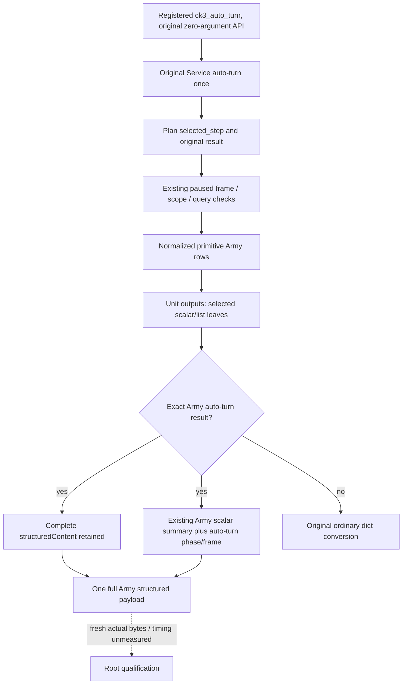

# R76 Army auto-turn output footprint

October 8, 2026 / ISO 2026-W41. This source-only investigation follows actual
R76 Army auto-turn responses of 165,999,592 bytes (010) and 168,670,364 bytes
(028), supplied by Root. Their total elapsed times do not identify individual
native, Python, or serialization costs.

## Source tree and input ledger

The active SDK baseline is `cc1e6a9e249ebeffdba1e6c910615041f090bf34`.
This private source also retains the separately qualified family and initial
succession root reuse commits d7004514 and 29f36d52. They are not revalidated.

The actual Army auto-turn path is:
`ck3_auto_turn → Service.auto_turn → _execute_planned_turn → execute_step
→ NativeDriver._execute_army_strength_query → normalize_army_strengths`.
The driver checks the starting/current paused frame, exact scope, query
sequence, and native revision before publishing rows. Service adds the Unit
entry, movement prefix, and first-edge selection outputs.

The three CC1 Unit projection modules consume selected primitive fields and
publish flat scalar/list outputs. The later qualified gb0 arrival and pre-store
disembark modules likewise select movement/context fields. None publishes
`previous_observation` or `source_inputs`, embeds the complete Army row, or
copies other Unit projections into itself. The strict movement normalizer also
selects a fixed set of primitive fields and the committed-route timeline.
This source does **not** substantiate exponential Unit projection expansion.
No numerical, readiness, frame-binding, or projection changes are justified by
that hypothesis.

A concrete envelope duplication remains: CC1
`mcp_server.py::ck3_auto_turn` returns a plain dictionary. The existing lossless
`build_army_strengths_mcp_result` only covers registered execute-step and
direct Army query. Thus the ordinary SDK conversion publishes the Army
auto-turn dictionary both as full JSON TextContent and full structuredContent.
The existing [Army serialization topic](army-strengths-mcp-result-serialization-performance-12003.md)
already records the SDK's conversion source and qualified execute/direct
fix. That qualification does not cover auto-turn.

| Input or branch | Published source | Change required |
| --- | --- | --- |
| Army primitive numerical leaves | normalized native rows | none |
| Unit date/movement/first-edge output | selected primitive operands | none |
| Arrival/disembark later output | selected movement and exact frame context | none |
| Full auto-turn result and plan | ordinary dict MCP conversion | summarize text for exact Army auto-turn; retain complete structured object |
| Fresh paused native revision and readiness | original native driver and Service | none |
| Native time / total latency attribution | no internal timing in R76 logs | unknown |

## Actual-footprint reader

The external script
`Z:/ck3_mod_rewrite_process_assets/g2-background-20261008/r76-army-result-footprint/read_actual_army_response_footprint_once.py`
was executed once by Root, never by this worker. It parses one existing response once,
does not parse its embedded JSON text, does not reserialize the actual payload,
and publishes only key counts, container footprints, and long-string lengths.
The additive character counts are explicitly not serialized bytes or timing.
Root's [actual 028 footprint](Z:/ck3_mod_rewrite_process_assets/g2-background-20261008/r76-army-result-footprint/ACTUAL028-FOOTPRINT.json)
records 168,670,364 actual file bytes, zero exact keys named
previous_observation/source_inputs/command_history, and one each of Unit
entry/movement/first-edge output. Arrival/disembark output is absent in this
actual SDK baseline. The full text value has 77,031,520 characters. Structured
Army rows have 35,566,382 additive characters; the largest leaves are native
pre-date, assault-roster, refresh, relation and Combat-role occurrence arrays.
Those are published native input arrays, not Unit projection copies, and are
preserved completely. This footprint gives no individual elapsed-time result.

## Minimal source candidate

The candidate extracts the existing scalar Army summary unchanged and adds
an auto-turn summary containing original status/selected step/phase plus that
summary. The facade only wraps a packet whose plan selects the exact Army
step, whose result reports that exact step, and whose Army rows are a list.
The zero-argument tool, original Service call and non-Army/blocked conversions
are unchanged. The original complete packet is the structuredContent object.
The existing direct/execute Army summaries retain their original shape.

Only mcp_server.py imports and the ck3_auto_turn body, plus the existing
army_strengths_mcp_result.py helper, require integration. No Service, native
driver, Unit projection, shared native header, binder, or CMake changes occur.

The sole new FIRST is
R76ArmyAutoResultFootprintTests.test_first_registered_auto_army_preserves_packet_and_reduces_duplicate_text
in tests/unit/test_r76_army_auto_result_footprint.py. It invokes the registered
production auto-turn facade and a plain-dict baseline on the same SDK with
explicitly synthetic complete Service output. It also covers ordinary,
blocked and existing nonwar dispatch behavior. It checks exact full structured
equality and unchanged schemas/Service call counts, then serializes each large
synthetic envelope once to measure reduction. It does not replay old compounds.
The native original-frame pipeline is unmodified, not requalified here.

## Qualification boundary

Any auto-turn envelope extension requires a new registered-server compound;
the existing execute/direct serialization compound is not repeated. Complete
structured equality, zero-argument input schema, output schema shape, exactly
one original Service execution, all original numbers/nulls/false values,
ordered occurrences, source bindings, and ordinary non-Army conversion must
remain intact. Synthetic wire bytes demonstrate packaging reduction only.
No gameplay, native action, future frame, event firing, full Monte Carlo, or
new live performance credit follows from this work.

This worker performs zero production imports, SDK calls, tests, builds, game
operations, or EXE reads. Root owns FIRST and any later real measurement.
