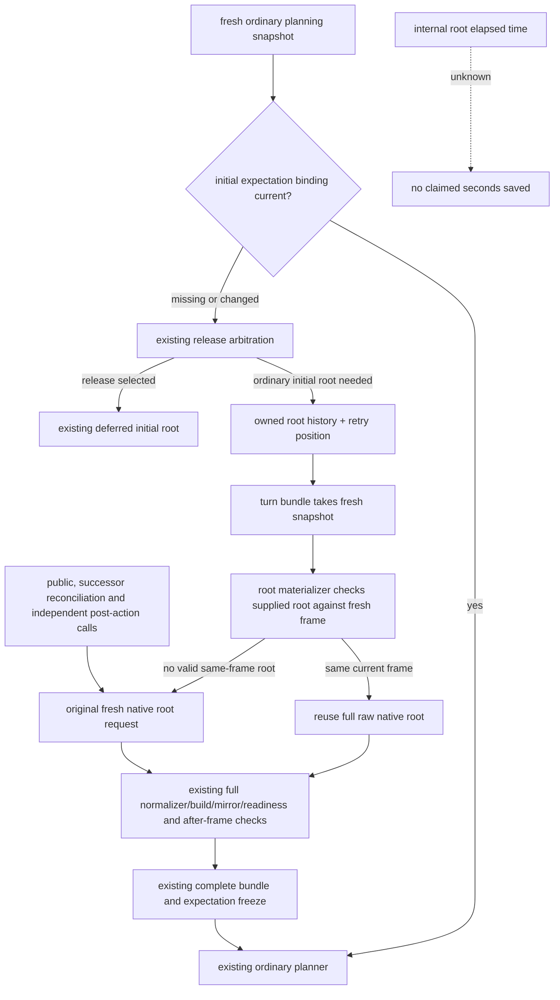

# R76 initial succession root reuses the current observed root

October8 / ISO2026-W41. Immutable actual SDK is
`cc1e6a9e249ebeffdba1e6c910615041f090bf34`. This private tree
`Z:/gbs-r76-succession-root-reuse` starts at qualified Family reuse
`d700451400a1fddcd045efa0882fb23f8712c0a9`, Root-adopted033924ce.
Root reported that distinct compound GREEN5.616s; it is not rerun.
CK3 is1.20.0.4 / Steam25734779 /
SHA98702F88A547CDE2EAF29A85F93B85F68EE4CF8148336A4F7AFAEB75319DD518.

## Concrete actual branch

R76 actual001 paused snapshot is native:2/public3/native2/date53288472.
It has no succession_expectation and no terminal reason. Actual003 then
records a successful full campaign-root query_sequence1 for that frame.
Before ordinary choices, `_prepare_succession_transition_v1` sees the
missing initial expectation and calls `query_turn_bundle_v1`, which
unconditionally calls a fresh root reader. Its existing history callback
retains only a position for rejected-read recovery; it does not reuse003.
This is a separate root IPC prerequisite from the qualified Family fix.

Outer005/006/010/013 durations are actual tool evidence already preserved
in the previous R76 packet. They have no internal root timers. Source
proves this additional native root request; no CPU attribution, total
saved seconds, duplicate strength/horizon claim or new profiling system
is introduced.

The native input is still the current local-player root and primary-title
succession projection. The native selector and readiness predicates are
unchanged. The same successful observation can initialize an expectation
while its exact public/native/date frame remains current. A later frame
must obtain a fresh root.

## Data shape and minimal source seams

Driver history stores raw native command results with queried_snapshot_id,
queried_revision and queried_native_revision. The turn bundle requires the
Service-enriched binding/build/source DTO. Therefore raw history cannot be
spliced straight into build_turn_bundle_v1. Reuse it through the existing
root Service materializer and its complete validation instead.

Only three Service seams change: initial-expectation history callback,
query_turn_bundle_v1 internal forwarding, and
query_campaign_root_context_v1's native execute-step branch. An internal
optional `_planning_root_result` carries the complete raw result.
The root materializer first takes its original fresh snapshot and validates
expected public revision, native revision, date, backend/capability and
snapshot identity. The existing same-frame root validator accepts the
candidate only for that fresh frame. All original normalization, mirrors,
native build and readiness checks plus after-snapshot checks still run.

Defaults still execute the original native query. Public root/bundle,
actual successor reconciliation and post-action independent callers do not
supply the internal argument. Rejected-read retry still runs the original
fresh path. Initial deferred-release arbitration and Family d700 are
unchanged. No new readiness gate, runtime profile or schema is introduced.

The new sole software compound covers a seeded current root, stale native
frame, stale date and date changing before the bundle's fresh snapshot.
Each case runs the ordinary Service path and real bundle/root/expectation
functions with deterministic offline backend reads. The current-root case
must add0 native root calls; changed frames each add1. The retained
expectation must bind the current date/native frame with original full
readiness. Explicit public root/bundle calls still add a fresh query.
FIRST0, build/test/import/Game/SDK/EXE0; actual future/live gain unclaimed.
