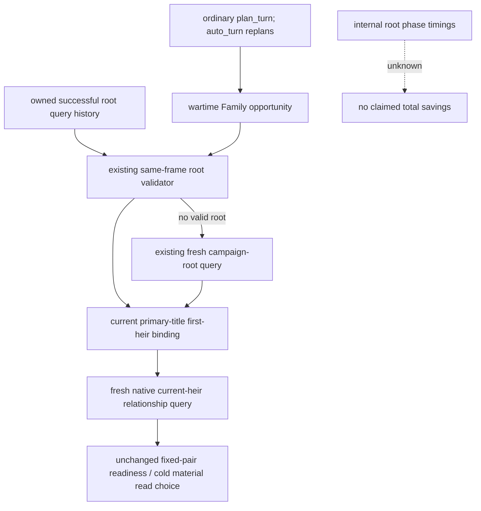

# R76 ordinary wartime Family planning reuses its current root

October 8 / ISO2026-W41. Actual SDK source is
`cc1e6a9e249ebeffdba1e6c910615041f090bf34`, immutable
`Z:/gbs-m4-construction-cli-35dd`. Candidate worktree is the independent
`Z:/gbs-r76-family-root-reuse`. Root owns runtime, game and FIRST execution.
CK3 target is1.20.0.4, Steam25734779, EXE SHA256
`98702F88A547CDE2EAF29A85F93B85F68EE4CF8148336A4F7AFAEB75319DD518`.

## Actual trigger and source evidence

R76 operator is
`MIG/managed-full-h9658-startup30restore01/operator` (MIG is
`Z:/ck3_mod_rewrite_process_assets/g2-background-20261007/upstream-build-migration`).
The small003 successful campaign-root response has query_sequence1,
queried_snapshot_id native:2, queried_revision3, queried_native_revision2,
rawdate53288472 and player29829. Same-frame ordinary plan005 exposes its
current first-heir relationship root_query_sequence3, auto006 exposes4,
and plan007 exposes6. Source confirms a fresh root request before each
of these relationship observations.

The outer tool envelope durations are005143.950598s,00691.831961s,
010148.229844s and013265.437656s.013 is complete in the observed file,
not pending. These are complete tool durations. No internal phase timings
are present in this evidence; no duration or CPU attribution to the
redundant root requests is claimed. Root003 itself is30.987060s, also a
whole-tool duration, not an estimate of savings.

`GameplayBridgeService.auto_turn` calls `plan_turn` again.
Its wartime Family branch calls `_plan_private_family_opportunity_v1`
without a campaign_root_result. The current betrothal consumer forwards
that missing argument to the native first-heir relationship transport.
That transport snapshots its current paused frame, validates any supplied
root via `_same_frame_campaign_root_result`, and calls
`_execute_campaign_root_context_v1_query` when no valid root was supplied.
It then performs its separate current relationship query. Existing
nonwar/Council paths already reuse an explicit root through this exact
validator; the ordinary wartime opportunity path does not.

The actual native input is the public root's current primary-title
first-heir ID. This optimization changes its source from a duplicate
same-frame query to the same successful native observation already owned
by the Driver history. It does not change native selection, the first-heir
relationship receiver, source/build schema, or counter-policy.

## Minimum change and preserved semantics

The method already inspects the in-process owned history to retain its
position for rejected-read recovery. Reuse that same callback to also
select the newest successful campaign-root result passing the existing
frame validator. Forward it only if the caller supplied no explicit root.
No additional history snapshot, query cache, profiling system or readiness
gate is introduced. The candidate changes only that method in service.py.
M7 ownership is separate: its normal Council-tail wrappers and typed Crown
dispatch remain owned by g2_12004_army_dates.

The existing validator binds public snapshot/revision, native revision,
root native revision/date, living player's full ID and successful query
sequence/status. The relationship transport validates again against its
fresh before-frame. A changed frame still takes the original fresh root
path, then the current relationship query. The full existing root object
is supplied; it is not reconstructed from a partial summary. Explicit
callers and rejected-root retry keep their prior behavior. Public root
queries and post-action independent readbacks are unchanged.

A new sole offline compound will run the real ordinary Service planner,
fixed-pair consumer and current relationship transport over deterministic
backend replies. Two repeated same-frame cold-marriage plans must retain
the material-read step and perform two fresh relationship reads with zero
extra root calls beyond the seeded history observation. Changed native
revision and changed date cases must each fall back to a new root read.
The setup reuses only committed fixture data/helper definitions; no old
test function or suite is rerun. Source/fixture FIRST remains NOTRUN.
