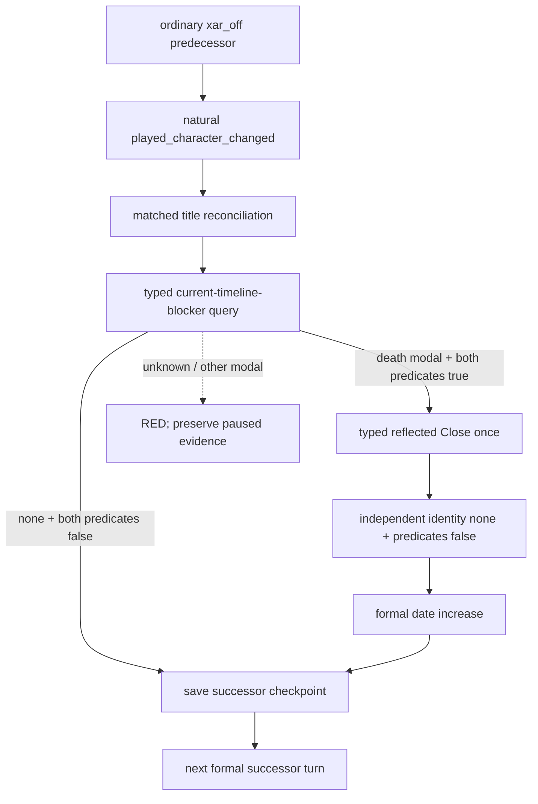

# R793 ordinary natural-event and succession long-run contract

Status: **static-ready; R792 continuation live pending on a rebuilt agent**. This
review is based on `origin/master@6415d6866af5fc637a51be6dbd6889fdd7ae167e`,
CK3 `1.19.0.6`, and executable SHA-256
`2D00FF3101EF70B566F2FCBAE292F09263199C80E9DC8F139B82D7D96F83DB86`.
No CK3 process, screen input, forced event, or fixture event was used.

## Evidence boundary

R792 is the current ordinary `xar_off`, standard-feudal campaign tail. It cold
restored the R791 controlled-stop pair in a distinct CK3 process, completed
`5/5` formal turns, retained actor/episode/war intent, advanced date
`53146512 -> 53146608`, issued no duplicate declaration, and wrote checkpoint
SHA-256 `DE8BA3330DFC2586CEE4E754C2C3C43F7F41B5BDB52F2F2FDEA2A9C8C6AF2F1`.
The report SHA-256 is
`B1E8FA374421A7DF25C822E2E8451FEF5C5EEE907610D8E80BD851F4EF977F97`;
the ZIP-bound evidence index is
`D:/ck3_mod_rewrite_process_assets/g2-preview-ordinary-r783-stage-20260916T134805Z-6cfba744/live-qualification-r790-r792.json`.

R775 and R781 are `xar_on`, signed-pact one-life evidence. They prove a real
played-character change, title reconciliation, the succession-modal blocker,
one reflected Close, independent predicate clearance, and one day of resumed
time. They cannot prove ordinary continuation because `xar.1001` deliberately
terminates player control in that profile. Their reusable conclusion is the
exact typed query/action/result ABI, not campaign eligibility.

## Event code review

No new event query/action/result code is needed for the two named events:

- `ck3_query_current_event_window_context_v1` binds the exact event key,
  instance, root/scopes, and shown/enabled native options.
- The versioned registry recommends `tgp_travel_events.0030` authored option 2
  / native index 1 and `death_management.1007` authored option 1 / native
  index 0.
- The formal event action binds the current instance and revision, submits
  once, proves the old instance advanced, and runs the registered same-character
  stress comparator.
- `native-auto-run` rejects a missing/failed registered material result, records
  `verified_change` separately from `verified_no_change`, consumes the later
  paused state on the next formal turn, and writes a final checkpoint when that
  gameplay tail is still dirty.

`tgp_travel_events.0030` cannot naturally occur in R792. The exact definition
requires TGP plus `celestial_government`; R792 is frozen standard feudal.
Changing government or forcing the event would invalidate the ordinary
candidate and would not satisfy the natural gate. This event must remain a
separate naturally encountered celestial bounded scene.

`death_management.1007` can be observed in the same ordinary campaign. It is
encounter-driven: the living played ruler's current close-family heir must die,
a replacement heir must exist when the modal opens, and higher-priority
prisoner/house-arrest/battle-death branches must not take the dispatch.

## Ordinary natural-succession code gap closed

Before this package, `native-auto-run` accepted
`continue-as-reconciled-successor` and immediately saved a successor checkpoint.
It never consumed the independent succession controller row. R775 showed why
that is a long-run B0: ordinary queries and other actions may still work while
the succession modal holds the simulation clock.

The bounded owner now enables the already private, unadvertised timeline query
and reflected Close only for a profile that is already bound to
`ordinary_campaign_succession`. Immediately after matched reconciliation it:

1. queries the new successor's exact paused frame;
2. accepts either independently clear predicates or the exact
   `death_succession_modal` with `can_continue`, `blocks_simulation`, and
   `has_open_succession` all true;
3. for the modal case, invokes the typed reflected Close exactly once;
4. requires an independent later query with identity `none`, both succession
   predicates false, and a formal date increase;
5. refreshes the successor binding and only then saves the successor
   checkpoint.

If the proof advance naturally opens an ordinary event or pending interaction,
the owner records the successor checkpoint as `deferred_player_decision`, lets
the next formal turn consume that typed decision, and checkpoints the later
clean paused tail. It does not save through a known modal.

Unknown, game-over, select-destiny, unavailable, identity drift, missing
material proof, and submitted-but-unconfirmed Close all remain RED. The latter
result is retained in `natural_succession_transitions[].timeline_blocker_continuation`
so a submitted action is never made safe to retry by losing its receipt.
The public adapter registry, MCP tool list, and capability advertisement remain
unchanged.

## Assertions for the next bounded runs

### R792 ordinary continuation

Use the physical R792 save/driver pair as the next campaign prefix after the
integrated agent is rebuilt and its versions are frozen. Do not claim the old
R792 ZIP contains this patch.
Copy the pair into a new state directory and use the existing versioned
ordinary-seed rebinder to bind that copy to the new prepared environment; keep
the frozen R792 source pair and its hashes unchanged.

For every formal turn, retain event key/instance, played CharacterID, public
and native revisions, selected step, result, and checkpoint identity. If
`death_management.1007` appears naturally, require:

1. player root, saved `new_memory`, distinct `dead_character`, saved
   `deceased_character_stress`, one shown/enabled native option 0, and
   same-frame player stress;
2. registry status `recommended`, native index 0, and a ready material
   expectation;
3. exactly one typed selection for that instance;
4. independent old-instance disappearance and the same CharacterID with
   `post_stress > pre_stress`; equality is lifecycle-only evidence and leaves
   the G2 material gate open;
5. one later normal `native-auto-run` turn that does not repeat the instance,
   followed by a paired checkpoint.

If the played ruler dies naturally, require the pre-death per-title heir
expectation, matched actual successor/title distribution, zero command/restart
Python rebinding, the timeline query/Close result above, a checkpoint after the
modal is clear, later successor gameplay, and a distinct-process cold restore
that preserves the high-level plan and does not repeat an effective predecessor
action.

### Separate celestial natural scene

For `tgp_travel_events.0030`, use a naturally eligible celestial/TGP campaign;
do not relabel R792. Require natural travel-movement provenance, the exact
`travel_plan` and `poem_province` scopes, two shown/enabled options, registry
native index 1, one typed selection, same CharacterID with
`post_stress < pre_stress`, one later formal turn, and a paired checkpoint.
Timeout or a bounded slice without the event is `evidence_not_observed`, not
GREEN and not RED.
