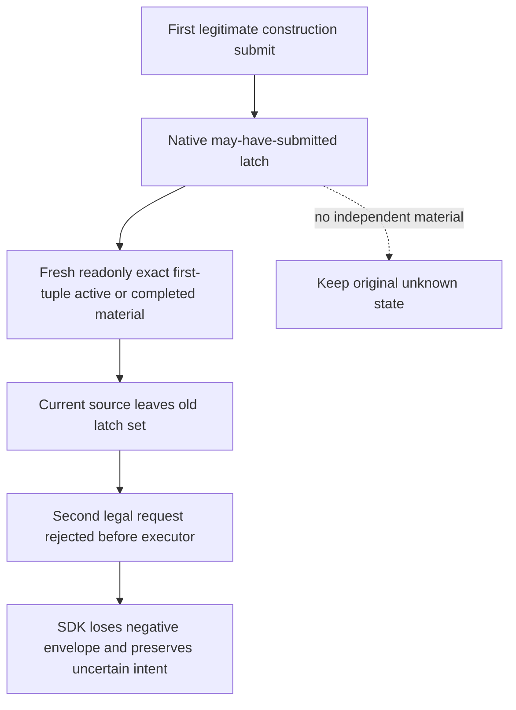

# R81 second construction: retained native latch blocks later legal work

Status: actual functional fault, source-only repair in progress. Game build is
1.20.0.4; Native46 is compiled `088fed39`, current SDK is `45a3e6a4`.
The repair derives from complete Native47 source
`e5fd088cde640b0a1ea29ff40888af95d9300c95`. Root owns every build, FIRST,
new-binary hash, SDK/game operation and live result.

After the first independently verified construction **2103/2635/type604/slot3**
and a real one-day advance to date **53288592**, HOT05 ordinary009 failed at
06:00:59.344198–06:02:24.842364 UTC (**85.498166 s**) with
`construction native submit uncertain; query state before retry`.
The newly durable intent is
`construction-submit-f085547b9f4e4817a6ee5b01a98629b5`, actor29829,
native9/public5/proof581228, **2106/2644/type604/slot2**, empty slot,
quoted cost14250000 and gold-before69417022. This is a new action; the original
successful `6348...` receipt remains separate, and the old R80 mismatch is
not this failure. One small-ledger projection found no native ACK or returned
submit body for the new request. `_send` did not return a qualified envelope,
and the outer exception text alone does not identify a transport timeout.

Root's independent WORLD011 at 06:07:06.445835–06:07:37.479243 UTC
(**31.033408 s**) is material_source, native9/public5, same actor/date,
proof620000. It observes the first construction still active with work109333334
and divisor60000. The new holding2106 is inactive, has temple_01 at slot0 and
monastic_schools_01 at slot1, and the intended cereal_fields_01/type604/slot2
is still legal at cost14250000. Gold remains69417022; the new expected
post-spend55167022 is not observed. No new construction material is claimed.

The finite source cause is `bridge.cpp`'s global
`g_player_world_building_private_action_may_have_submitted_v1`. It becomes true
when a private construction mailbox is submitted. A later private action
then returns `ok=false` with
`prior private building command material state unresolved` before entering
any construction executor. The only clearing assignment covers an unready
candidate or zero materialize/receiver calls. Successful readonly construction
material queries never clear it. Thus the first genuine submitted construction
leaves a permanent one-shot limit even after its exact independent material
receipt. The SDK subsequently rejects and discards the negative envelope,
which explains its broader submit-uncertain text. The exact original envelope
was not retained, but the old successful submit, immutable latch assignments,
and current independent absence of the second material bind this source cause.

The minimal repair caches the existing submitted native candidate beside the
existing latch. On a successful fresh readonly construction query, matching
actual active material or observed completed inventory for that exact
candidate, actor/frame and later proof releases that specific latch. No ACK
is converted into material. If the submitted tuple is unobserved, the latch
remains unresolved. The native action request and public DTO are unchanged;
there is no new ledger, WAL, protocol, broad gate or serializer field. Only
`bridge.cpp` is a changed production body, with one private inline helper.
The current f085 pending is not rewritten or replayed by this source change.

The new sole native fixture will call the real actual4 selector/submit path,
observe first active material through the same latch helper used by Bridge,
and select/submit a different legal second construction. Separate cases keep
the unresolved state without material and release it on observed completed
inventory. Native calls use explicit offline callback seams and synthetic
DTOs, not live definition ordinals. The SDK diagnostic addition only records
the actual exception type/message in the existing pending record when submit
throws; it neither changes ACK admission nor retroactively recovers009.

Saved responses are under
`Z:/ck3_mod_rewrite_process_assets/g2-background-20261009/r81-sdk-process-time-hot05/operator/gameplay-responses/`,
009 and011. Once-only current state/world projections, existing readonly
recovery recipe and report fields are under
`Z:/ck3_mod_rewrite_process_assets/g2-background-20261009/r81-hot05-construction-submit-uncertain-source/`.
The new native source remains NOTRUN until Root qualification. No worker
Game/SDK/CIM/test/import/build/hash calls or capability credit are asserted.
