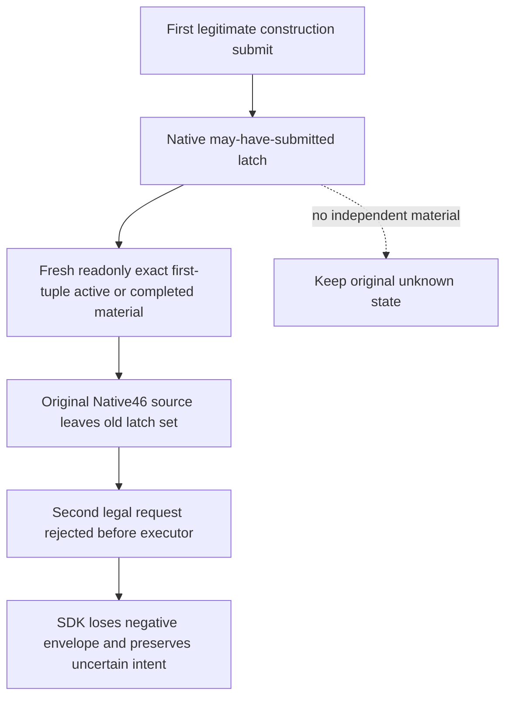
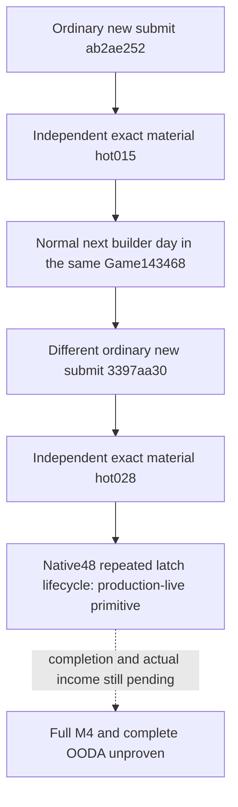

# R81 second construction: latch fault and Native48 live repair

Status: Native48 latch lifecycle is a **production-live primitive** after two
new ordinary submits and their independent material receipts on the same
R82 Game process on 2026-10-09. Building completion, income increase, full M4
and complete OODA remain unproven; G2 remains **5/8**. The
original R81 fault was observed on game 1.20.0.4, compiled Native46
`088fed39` and SDK `45a3e6a4`.
The repair derives from complete Native47 source
`e5fd088cde640b0a1ea29ff40888af95d9300c95`. Root owns every build, FIRST,
new-binary hash, SDK/game operation and live result.

After the first independently verified construction **2103/2635/type604/slot3**
and a real one-day advance to date **53288592**, HOT05 ordinary009 failed at
06:00:59.344198–06:02:24.842364 UTC (**85.498166 s**) with
`construction native submit uncertain; query state before retry`.
The newly durable intent is
`construction-submit-f085547b9f4e4817a6ee5b01a98629b5`, actor29829,
native9/public5/proof581228, **2106/2644/type604/slot2**, empty slot,
quoted cost14250000 and gold-before69417022. This is a new action; the original
successful `6348...` receipt remains separate, and the old R80 mismatch is
not this failure. One small-ledger projection found no native ACK or returned
submit body for the new request. `_send` did not return a qualified envelope,
and the outer exception text alone does not identify a transport timeout.

Root's independent WORLD011 at 06:07:06.445835–06:07:37.479243 UTC
(**31.033408 s**) is material_source, native9/public5, same actor/date,
proof620000. It observes the first construction still active with work109333334
and divisor60000. The new holding2106 is inactive, has temple_01 at slot0 and
monastic_schools_01 at slot1, and the intended cereal_fields_01/type604/slot2
is still legal at cost14250000. Gold remains69417022; the new expected
post-spend55167022 is not observed. No new construction material is claimed.

The finite source cause is `bridge.cpp`'s global
`g_player_world_building_private_action_may_have_submitted_v1`. It becomes true
when a private construction mailbox is submitted. A later private action
then returns `ok=false` with
`prior private building command material state unresolved` before entering
any construction executor. The only clearing assignment covers an unready
candidate or zero materialize/receiver calls. Successful readonly construction
material queries never clear it. Thus the first genuine submitted construction
leaves a permanent one-shot limit even after its exact independent material
receipt. The SDK subsequently rejects and discards the negative envelope,
which explains its broader submit-uncertain text. The exact original envelope
was not retained, but the old successful submit, immutable latch assignments,
and current independent absence of the second material bind this source cause.

The minimal repair caches the existing submitted native candidate beside the
existing latch. On a successful fresh readonly construction query, matching
actual active material or observed completed inventory for that exact
candidate, actor/frame and later proof releases that specific latch. No ACK
is converted into material. If the submitted tuple is unobserved, the latch
remains unresolved. The native action request and public DTO are unchanged;
there is no new ledger, WAL, protocol, broad gate or serializer field. Only
`bridge.cpp` is a changed production body, with one private inline helper.
The current f085 pending is not rewritten or replayed by this source change.

The sole native fixture calls the real actual4 selector/submit path,
observes first active material through the same latch helper used by Bridge,
and selects/submits a different legal second construction. Separate cases keep
the unresolved state without material and release it on observed completed
inventory. Native calls use explicit offline callback seams and synthetic
DTOs, not live definition ordinals. The SDK diagnostic addition only records
the actual exception type/message in the existing pending record when submit
throws; it neither changes ACK admission nor retroactively recovers009.

Saved responses are under
`Z:/ck3_mod_rewrite_process_assets/g2-background-20261009/r81-sdk-process-time-hot05/operator/gameplay-responses/`,
009 and011. Once-only current state/world projections, existing readonly
recovery recipe and report fields are under
`Z:/ck3_mod_rewrite_process_assets/g2-background-20261009/r81-hot05-construction-submit-uncertain-source/`.
Root's actual Native48 qualification is recorded below. No worker
Game/SDK/CIM/test/import/build/binary-hash calls or capability credit are asserted.

## Native48 actual offline qualification, 2026-10-09

Root sealed GREEN at **10:09:15 UTC**. The independent lifecycle fixture
returned `scenes=3`, `actual4_submit_calls=4`, `live=false`, `game_calls=0`.
It covers active exact old material releasing a different legal second submit,
unobserved old material retaining the latch without a second receiver, and
completed exact old inventory releasing the latch. These are offline callback
scenes through the actual selector/submit path and shared private helper.
They do not establish independent live second-construction behavior.

| Source role | Actual pin |
| --- | --- |
| Production Bridge compile, reused from attempt01 | `dd302e80ed5eb6513a3bea1f9ea39c6abd305f5f` |
| Fixture-only ADL repair and retry02 compile | `91da7f983d6896040fc9c5f26975f4422fd2d72f` |
| Qualification/public adoption | `725e7a569ccd7a178d28a792c6a147986bd6379a` |
| Retained Native47 Runtime archive | `e5fd088cde640b0a1ea29ff40888af95d9300c95` |

Attempt01 remains RED: the production Bridge compile was GREEN in
**16.4003045 s**, while the fixture failed with C2668 because unqualified
`SubmitPlayerWorldBuildingDirectActionV1` was ambiguous through ADL. The
fixture-only fix explicitly names the actual4 `xar::ck3_12004` function.
Retry02 reused that exact GREEN production object and receipt, compiled only
the fixture (**2.8403586 s**), linked the DLL (**0.9568291 s**) and fixture
(**0.9026962 s**), and ran the sole new native FIRST (**0.2225898 s**).
No archive, registered MCP consumer, whole-native packet or old FIRST replay
was run for this increment. The failed attempt is retained separately.

The canonical closure is **734 production owners**: Bridge299, Runtime434,
Protocol1, with **733 retained owners** and **502 compiler-command rows**.
The new DLL is **13,418,496 bytes**, Root-recorded SHA-256
`faab4ed56cb1fe571b2686f6879c838995a20f8be4cae6ad1de02794b3eb23d9`.
Only Bridge's existing production owner and its private inline latch helper
changed; Runtime, public DTO and request layouts remain at their prior pins.
The two SDK fields are existing pending-error diagnostics, with no newly
qualified consumer behavior.

Canonical metadata is under
`Z:/ck3_mod_rewrite_process_assets/g2-background-20261007/upstream-build-migration/entry-live-fix48/`:
`ROOT-CONSTRUCTION-ONE-SHOT-LATCH-QUALIFICATION.json`,
`ROOT-PARENT-RUNTIME-INCREMENTAL-DLL.json`, `manifest.json`, and
`BUILD-RESULT.json`. The original RED and selected GREEN results are
`Z:/g2-native48-build01/attempt01/ROOT-NATIVE48-RESULT.json` and
`Z:/g2-native48-build01/attempt02/ROOT-NATIVE48-RESULT.json`.
This qualification advances the repair to **static-ready** only. It records
no deployment, Game call, production-live primitive/loop, fullPerson, action,
action-day or G2 credit; Root must separately retain the next actual live result.

## R82 same-process repeated construction: actual live result

Root subsequently restored and operated the ordinary Robert 29829 campaign
with Native48 on minimized, paused **Game143468**, creation time
`20261009101637.326052+000`. The compiled native source remains `dd302e80`
and canonical qualification `725e7a56`, recorded above. The hot SDK consumer
uses the separately qualified normal pending recovery described in
[the R82 recovery topic](r82-construction-unapplied-cold-recovery-12004.md).
That recovery preserves the old f085 intent as not applied; the following
two rows are **new requests**, not replays or fabricated material for f085.

| New pair | Exact barony/province/type/slot | Date raw | Submit native/public → material native/public | Submit proof → material proof | Gold before → material gold |
| --- | --- | --- | --- | --- | --- |
| hot014 → hot015, `ab2ae252` | `2106/2644/604/2` | 53288616 | `5/4 → 6/5` | `359543 → 377219` | `69417022 → 55167022` |
| hot027 → hot028, `3397aa30` | `2143/2619/604/4` | 53288640 | `9/8 → 10/9` | `511237 → 524661` | `55167022 → 40917022` |

The complete request IDs are
`construction-submit-ab2ae25236204694a55e5d2a207b47a5` and
`construction-submit-3397aa302b51493ca9fa7d19bfb5f0cc`.
Both are ordinary `private-submit-player-construction-v1` choices for
cereal_fields_01 in an observed empty slot, quoted native cost **14250000**.
Each actual native ACK reports production_native_path=true,
candidate/native_failure=none and validator/materialize/receiver calls=1.
The ACK remains pending_receipt/applied=false. Each **separate ordinary
material query** then returns applied/postcondition_verified=true,
completion_status=in_progress, matching its original request and exact tuple,
and independently observes the exact quoted gold debit. Both submit and
material receipts retain the same Game PID and creation instant.

The first submit takes **106.015510 seconds** and its material query
**141.011334 seconds**. The second submit runs at
11:28:38.793546–11:30:35.382628 UTC (**116.589082 seconds**), followed by its
independent receipt at 11:30:35.890700–11:32:48.299833 UTC
(**132.409133 seconds**). The normal batch stops specifically at
`second_new_construction_material_observed`. No process restart is used
between the first new submit/material pair and the different legal second
submit/material pair on the next builder day.

The private global latch is not published as a wire field. This is observed
**lifecycle behavior**: after the first submitted tuple receives independent
material, the same Native48 process accepts a different ordinary native
construction and independently verifies it. The old permanent one-shot
failure therefore no longer blocks this actual sequence. There is no claim
that an ACK directly exposes or proves the private bool's value.

Each new construction's independent start receipt records in_progress,
remaining work **109500000** and actual progress divisor **0** on its own
material frame. Those raw values are retained;
the old 60000 divisor is not substituted. The first target's province income
is **49164 before and after**, the second **140896 before and after**, and
observed player gross income is **609217 before and after**. Completion dates
and observed income deltas remain null. Authored prospective income50 is
not an observed income increase. This establishes the Native48 repeated
construction latch **production-live primitive**, not building completion,
an income outcome, whole M4, a new G2 milestone or complete OODA. G2 stays
**5/8**.

The saved ordinary responses are hot014, hot015, hot027 and hot028 under
`Z:/ck3_mod_rewrite_process_assets/g2-background-20261009/r82-sdk-pending-recovery-hot01/operator/gameplay-responses/`.
The batch receipt is
`Z:/ck3_mod_rewrite_process_assets/g2-background-20261009/r82-sdk-pending-recovery-hot01/ROOT-NORMAL-BATCH03-RESULT.json`.
The thin pair projections and aggregate are under
`Z:/ck3_mod_rewrite_process_assets/g2-background-20261009/r82-native48-pending-recovery-source/`:
`HOT014-NEW-SUBMIT-THIN-EVIDENCE.json`,
`HOT015-FIRST-NEW-MATERIAL-THIN-EVIDENCE.json`,
`HOT027-028-SECOND-NEW-PAIR-THIN-EVIDENCE.json` and
`NATIVE48-TWO-NEW-PAIRS-SAME-PROCESS-EVIDENCE.json`.
Research decodes only bounded structured-result fragments; it does not parse
large native histories or Driver state, rerun qualified tests, hash binaries,
query the live SDK/Game, or rewrite ledgers. Root owns the subsequent paused
snapshot and SAVE.
