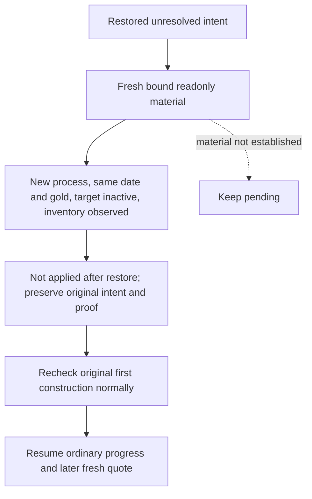

# R82: resolve the restored, unapplied second construction intent

The actual Native48 cold restore keeps the original f085 construction intent
from PID175696. The new PID143468 starts at native2/public3, below the old
native9/public5. Ordinary002 spends 97.144593 seconds in a material query and
returns `construction material not yet observed; keep pending`.

This is **not a native counter comparison bug**. Both the planner and receipt
transport already recognize a different process; native revision and proof
epoch are compared with the old intent only in the same process. The actual
error is reached after the frame and proof checks, at the no-material branch.
Native48 repairs future native latch release but intentionally leaves this
opaque unknown intent unchanged.

Root's independent WORLD004 (25.052563 seconds) observes actor29829, the same
date53288592, native2/public3/proof47307 and gold69417022. The target
2106/2644 is inactive. Completed inventory is observed and contains only
type796/slot0 and type808/slot1, without the intended type604/slot2. The first
construction2103/2635/604/3 is still active. Its current progress divisor is
zero; this observation is preserved and is not replaced by an older divisor.
The world query has checks_truncated=true and cost_ready=false, and does not
grant action readiness.

The old `restored_before_action` branch handles applied receipts, not an
unresolved pre-submit intent. The minimal Python repair resolves this specific
case after a fresh material query in a different process: same original date,
unchanged pre-action gold, a directly observed inactive target holding and
observed completed inventory without the exact intended tuple. The result is
`not_applied_after_restore`, with requested/material/postcondition flags all
false. It preserves the original pending and independent query/frame/proof in
the existing ledger's `last_not_applied_resolution`, clears only `pending`,
and retains the old applied receipt and prior receipts unchanged. It neither
submits a command nor claims material success, income, M4 credit or knowledge
of the lost original native envelope. A different process's lower counters
are recorded as observed, not increased to satisfy the old process counters.

The normal receipt consumer recognizes this non-success outcome. Subsequent
ordinary planning still independently rechecks the first applied construction
on the cold process, then resumes its existing normal progression and later
fresh quote logic. The old request is never replayed. Missing inventory,
active target, changed resources or a later date remain unresolved through
the existing no-material path; no broader protocol or schema version changes.

The sole connected registered MCP fixture uses the saved WORLD004 and the
actual small construction ledger. Outer endpoint/process identity and LIFE
chooser are fixture seams. Production material parsing, ordinary receipt,
ledger update and registered follow-up planning remain real. Root alone runs
FIRST and live SDK recovery. Source preparation does not modify actual state,
execute Game/SDK/build/tests or claim live readiness.

## Root's unique connected FIRST

Root executed the sole registered compound on combined complete source
`61819ef19d2cdc35da185fbc8d071c7f3ea3fafd` at
`Z:/gbs-r82-pending-recovery-hot-root-source`. This source derives from
compiled Native48/SDK baseline `dd302e80` and adopts recovery author commit
`6514d889` as `2275...`, plus already qualified compact/Army-copy work. It
does not include Native49 policy work. The compiled native binary remains
the existing DD/canonical725e; this is a Python consumer qualification.

The actual Root invocation is **GREEN**, elapsed **5.3788908 seconds**, with
pytest `1 passed in 4.69s`. It consumes the actual saved WORLD004 and the R82
small ledger copied into temporary fixture state. Three registered MCP calls
and two readonly native endpoint queries classify the restored intent without
material success, independently recheck the first construction (preserving
its observed zero divisor), and resume the ordinary `life-advance` plan.
There are **zero submits, zero game calls and zero live-state writes**.

The actual receipts are
`Z:/g2-r82-construction-recovery-first01/ROOT-ACTUAL-RESULT.json` and
`Z:/g2-r82-construction-recovery-first01/COMPOUND-RESULT.json`.
No worker reran or imported the test. Readiness is **static-ready with a
qualified connected fixture**; same-Game hot SDK recovery and normal live
outcome remain pending Root verification. This FIRST does not grant M4 or
production-live-loop credit. Historical ordinary002 failure and the original
f085 intent/proof remain preserved.

## Same-Game normal recovery and the next construction opportunity

Root subsequently hot-restored the qualified SDK on the same minimized,
paused Game143468. Ordinary hot002 actually classified f085 as
`not_applied_after_restore` (about 105.12 seconds); hot003 independently
rechecked the first construction as applied/in_progress (about 42.38 seconds).
The original unknown intent is preserved in the non-success resolution;
neither outcome submits the second construction or earns M4 credit. These are
live consumer recovery results, not proof of two new Native48 submissions.

The following ordinary turns resolve heir/war-options/army-strengths/contact
horizon/release work. Actual hot011 selects
`advance-route-contact-horizon-v1-218104048-to-2615-h-1-134218098`, with phase
`native_war_route_contact_horizon_progress`, and advances one game day from
53288592 to 53288616 before pausing at native5/public4. The first construction's
latest receipt remains post_native_revision3/post_date_raw53288592, so both
existing requirements for a later new spend are now satisfied: a later native
frame **and** a later date. There is no requirement to finish that construction
or wait for its monthly completion watch before considering another holding.
The 720-hour completion watch concerns the old construction's next completion
read, not admission of a distinct legal new construction.

Actual hot012 selects `query-army-strengths-v1`. Its saved plan also contains a
same-frame wartime construction observation: status=observed,
native_source_status=selected, candidate 2106/2644/type604/slot2,
cereal_fields_01, cost14250000/gold69417022, authored net income 50 and an
observed empty slot. The source is native5/public4/date53288616/proof322645,
query `construction-read-77311c06fac249cc99fe058852e4cd63`; wars=1/armies=1.
Positive-income coverage is incomplete. `formal_action_ready=false` is the
readonly wartime observation function's explicit contract; it is not a newly
discovered cooldown or permission block. This observation is not reused as
a submit credential or converted into action readiness.

`plan_construction_private` explicitly admits a normal quiet route advance as
a new-building opportunity alongside life-advance and existing prewar
arbitration. Military query/action work retains its priority. Once normal
strength/horizon refresh reaches the next contact-free route advance, the
existing construction route can request its fresh feudal/root observation,
current cash budget and new native quote before deciding a typed submit.
The next executable operator step remains ordinary `ck3_auto_turn {}`;
there is no forced construction step, direct ledger edit or planner bypass.
Cash/budget deferral or source failure is assessed only from that actual
future normal quote, not inferred from the current readonly projection.

The relevant saved responses are hot009 through hot012 under
`Z:/ck3_mod_rewrite_process_assets/g2-background-20261009/r82-sdk-pending-recovery-hot01/operator/gameplay-responses/`.
The 87.9MB hot012 was not deserialized: source research read a 262KB prefix to
locate the small observation and a 6KB bounded slice for its object. No large
native history or Driver state was consumed. No source policy change or new
test is justified by these outcomes. Native48 repeated-submit/independent
material-loop credit remains pending the actual next ordinary constructions.
