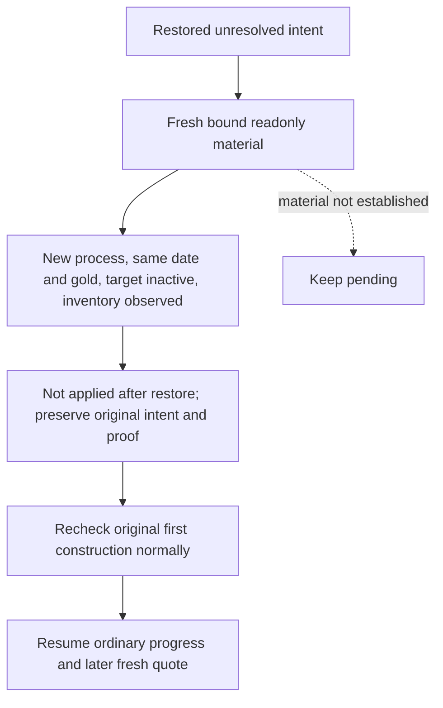

# R82: resolve the restored, unapplied second construction intent

The actual Native48 cold restore keeps the original f085 construction intent
from PID175696. The new PID143468 starts at native2/public3, below the old
native9/public5. Ordinary002 spends 97.144593 seconds in a material query and
returns `construction material not yet observed; keep pending`.

This is **not a native counter comparison bug**. Both the planner and receipt
transport already recognize a different process; native revision and proof
epoch are compared with the old intent only in the same process. The actual
error is reached after the frame and proof checks, at the no-material branch.
Native48 repairs future native latch release but intentionally leaves this
opaque unknown intent unchanged.

Root's independent WORLD004 (25.052563 seconds) observes actor29829, the same
date53288592, native2/public3/proof47307 and gold69417022. The target
2106/2644 is inactive. Completed inventory is observed and contains only
type796/slot0 and type808/slot1, without the intended type604/slot2. The first
construction2103/2635/604/3 is still active. Its current progress divisor is
zero; this observation is preserved and is not replaced by an older divisor.
The world query has checks_truncated=true and cost_ready=false, and does not
grant action readiness.

The old `restored_before_action` branch handles applied receipts, not an
unresolved pre-submit intent. The minimal Python repair resolves this specific
case after a fresh material query in a different process: same original date,
unchanged pre-action gold, a directly observed inactive target holding and
observed completed inventory without the exact intended tuple. The result is
`not_applied_after_restore`, with requested/material/postcondition flags all
false. It preserves the original pending and independent query/frame/proof in
the existing ledger's `last_not_applied_resolution`, clears only `pending`,
and retains the old applied receipt and prior receipts unchanged. It neither
submits a command nor claims material success, income, M4 credit or knowledge
of the lost original native envelope. A different process's lower counters
are recorded as observed, not increased to satisfy the old process counters.

The normal receipt consumer recognizes this non-success outcome. Subsequent
ordinary planning still independently rechecks the first applied construction
on the cold process, then resumes its existing normal progression and later
fresh quote logic. The old request is never replayed. Missing inventory,
active target, changed resources or a later date remain unresolved through
the existing no-material path; no broader protocol or schema version changes.

The sole connected registered MCP fixture uses the saved WORLD004 and the
actual small construction ledger. Outer endpoint/process identity and LIFE
chooser are fixture seams. Production material parsing, ordinary receipt,
ledger update and registered follow-up planning remain real. Root alone runs
FIRST and live SDK recovery. Source preparation does not modify actual state,
execute Game/SDK/build/tests or claim live readiness.
