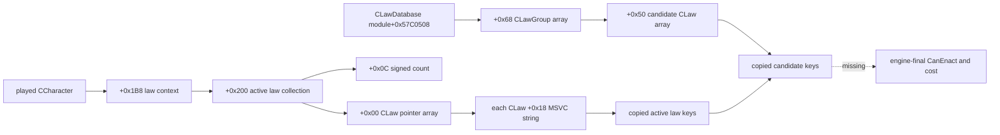
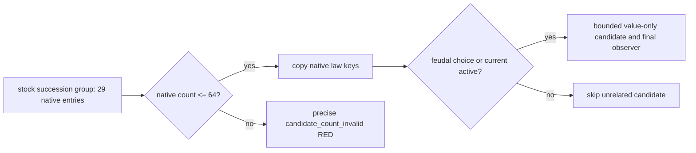

# H3911 realm law active collection: first read-only native anchor

Status: `static-ready private active and candidate key read`; no CK3 was launched for this work
package. This does not qualify a law candidate or enable a law action.

## Why this frame matters

The official H3911/raw53219928 pair identifies the played Robert character as
`29829`, with `feudal_government` and
`government_uses_crown_authority`. Its last `query-campaign-root-context-v1`
shows title 2173's first heir as 38988 while primary duchy 2141 and the other
listed titles have first heir 38822. The same driver records
`succession_expectation.risk_state=split_successors`. The 3,921 recorded
commands contain no law query or law action, and the campaign-root response has
no active law, candidate, native final legality or cost field. The split is a
reason to observe a law opportunity; it does not prove a particular enactment
is legal or valuable after cost.

Source identity is the R0321 H3911 `SOURCE-PAIR-IDENTITY.json`, whose save SHA-256
is `5EFB3B3CF3EE7368C6C12D4C984B4A0366AA8A971409165016E3DC24725A4746`
and driver SHA-256 is
`DE09EA8B3648FAE89F90E5459991BC66AE52154971948DB39C353D05EEAAEE33`.
This package only read that existing paired driver; it did not add a game date,
query receipt or new game action.

## Exact-build chain

The executable is CK3 1.19.0.6, SHA-256
`2D00FF3101EF70B566F2FCBAE292F09263199C80E9DC8F139B82D7D96F83DB86`.
The new machine-readable contract
`realm_law_active_collection_11906_abi.json` freezes four instruction spans:

`0x260AC30` returns `CCharacter+0x1B8 -> +0x200`, or the native empty
fallback if that context is absent. `0x260ACB0` and `0x28BC040` independently
walk the collection's data pointer and signed count as an array of `CLaw*`.
`0x2C7B300` reads the law object's MSVC string at `+0x18`; its size and
capacity fields are at `+0x28/+0x30`, with inline characters or a heap pointer
at `+0x18`. The current private reader copies these keys through a supplied
read-memory callback and returns no native pointers. `0x2A55F50` stores the
`CLawDatabase` singleton at module `+0x57C0508`; `0x25FF5D5` enumerates its
group pointer array at `+0x68` with signed count at `+0x74`. The same routine
compares each active `CLaw+0x38` with a database group pointer, proving the
field is its `CLawGroup*`. `0x2C7F300` enumerates each group's candidate law
array at `+0x50` with signed count at `+0x5C`; `0x2C7F410` reads the group's
MSVC key at `+0x18`. The private candidate reader admits only
`crown_authority` and `succession_order_laws`, copying group and candidate keys
and indicating which candidate is enacted. It does not evaluate legal passage.

The readers live in `realm_law_active_collection_11906.cpp` and
`realm_law_candidate_collection_11906.cpp`. They are not wired to
shared bridge, CMake, mailbox, protocol or MCP. The caller must still supply a
fresh full-generation played-character resolution on the paused application
main thread; this work does not add that caller. The exact span verifier ran in
normal Python and `-O`, both 9/9 GREEN. Its standalone reader fixture ran under
MSVC `/std:c++20 /W4 /WX` in `/Od` and `/O2`, both 6/6 GREEN. Fixture memory is
not a CK3 paused readback.

## R0332 H3922 paused read failure and bounded correction

R0332 loaded the paired H3922 Robert frame (actor 29829, paused,
raw53219928) and invoked the private realm-law query once. The query returned
`native_law_collection_red` before any candidate visitor ran; no law command,
date advance, or durable save change occurred. The old error string hid the
candidate reader's own failure enum, so that one report cannot prove which
pre-visitor read was first to fail.

The stock `common/laws/00_succession_laws.txt` defines 29 entries inside
`succession_order_laws`, including government-specific and holy-order laws.
The previous reader required a whole native group to fit into its 24-row
output buffer **before** filtering. Consequently, reaching this stock group
deterministically returns `candidate_count_invalid`, even though only four
standard feudal succession choices are needed for the current split-successor
decision. The 24-row fixture contained only two entries and did not cover the
stock collection size.

The revised reader bounds the native group at 64 entries, copies only the four
`crown_authority` levels and the four standard partition/single-heir laws,
and retains a currently enacted law even if its key is outside that small
choice set. It never invokes final-term evaluation for an unrelated
holy-order candidate. Its value-only output is bounded at eight rows per
group. Candidate and active-collection failure names now reach the private
RED string, so the next paused read identifies the actual native stage if a
different read is still failing. The normal/optimized fixture exercises a
29-entry succession group and confirms the holy-order entry does not reach
the observer; these are source tests pending a new paused CK3 result.

## Next exact input

Resolve the current H3911 active and candidate keys in a paused frame. For each
relevant candidate, read the same-source final `can_have`, `can_pass`,
`CanEnact`, opaque failure reason and charged currency cost. LAW3's existing
two-sample source adapter can then compare the full value snapshot. A legal
beneficial action and its formal consumer remain separate later gates. No
religious law group or government matrix is included.
