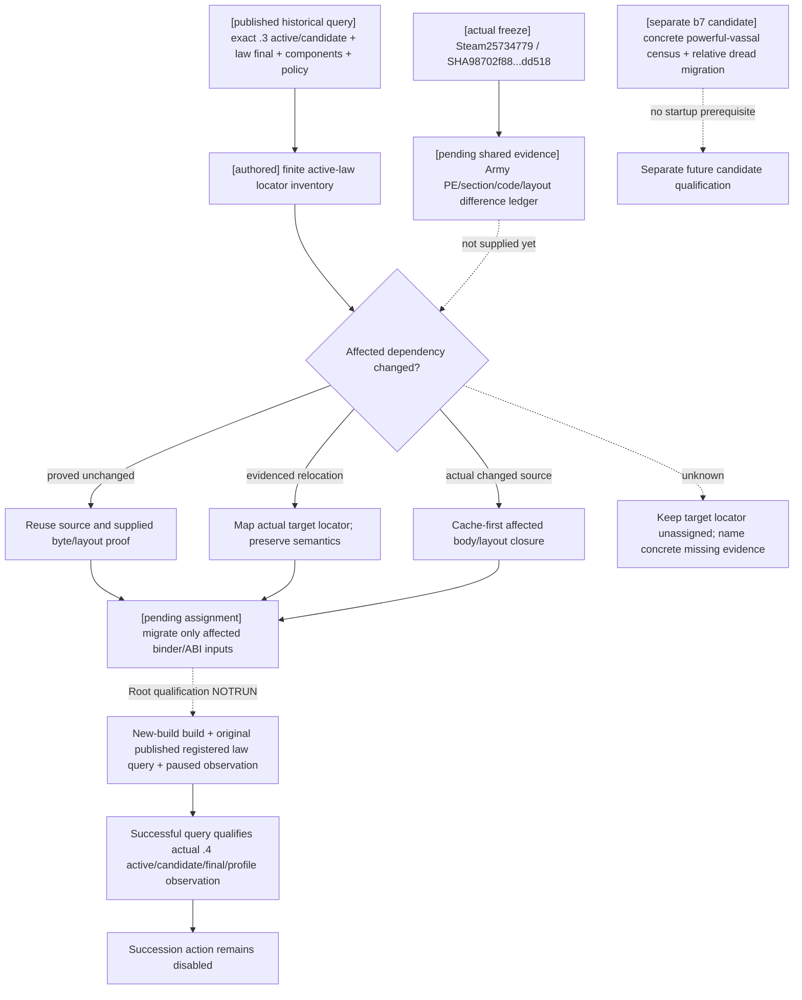

# CK3 1.20.0.4: published realm-law query migration

The actual new freeze is `artifacts/migrations/2026-10-07/installed-build/BUILD-FREEZE.json`: frozen at `2026-10-06T17:28:09.277542+00:00`, Steam build **25734779**, EXE **101040248 bytes**, SHA-256 **`98702f88a547cde2eaf29a85f93b85f68ee4cf8148336a4f7afaeb75319dd518`**. The freeze records `exe_changed=true` and `native_abi_migration_required=true`. Its Windows `FileVersion` and `ProductVersion` are null. Root subsequently confirmed the actual **1.20.0.4** native ASCII at file offset **71866624**, RVA **71871232**. The supplied semantic version receipt is [NEW-PE-METADATA.json](Z:/ck3_mod_rewrite_process_assets/g2-background-20261007/upstream-build-migration/global-pe-diff/NEW-PE-METADATA.json), ASCII entries5822..5826. This is supplied exact-build evidence, not an inferred version or a Windows metadata value. Unified EXCEPTION metadata has been parsed once by its owner; actual law function mapping remains queued after Core closure. This gate owner did not reread that metadata or an EXE, and has assigned no target law or dread RVA.

The previous exact `.3` build remains historical source evidence: Steam25652598 / SHA `94B55397ABB687A3DCD436805A5D885E6BE90FA6C693FEB44A9E3BBEEADE02A6`. Its law-final/components migration proofs are reused without rerunning old qualification. The prior R0051 SDK009 published law query remains an observation of that prior build and does not qualify the new build. Its active/candidate/final/profile path is the startup migration target. The powerful-vassal census and relative-dread source remain a separate candidate; they are not prerequisites for starting the new build or publishing the existing law query.

The active production baseline is full HEAD **`ea222238efe45f4916057d90b2830d01e7fd57c7`**, supplied by Root from `Z:/gb0`. Parent created the exclusive tree **`C:/codex-ck3-background/parallel-integrations-20261007/realm-law-12004-active`** clean at that HEAD, clone/checkout exit0 at **17:57:43 UTC**. It includes g106 and excludes the separate b7 census candidate. This owner copied and updated only this topic into that authorized active tree; no duplicate checkout or source check was performed.

The gate owner owns the actual `.4` active/candidate collection helpers, final operations binder and mapped succession profile reader after mapper closure. Root owns shared runtime/consumer integration, build/live qualification and reporting; parent handles the existing three capture/header/mailbox hooks and CMake. The b7 census branch remains separate, with its native membership/imprisonment/Dread migration owned by that candidate's owners. No production helper source has been changed for the new freeze at this stage.

Root's supplied unchanged stock proof is GameContent **depot1158311**, manifest **5078208590259867811**, size **19091661807 bytes**. Reuse that proof for the authored laws/triggers; no stock scan or duplicate content hash is required. Native final terms still describe the loaded query result.

## Existing source dependencies to match against the shared difference ledger

The historical machine-readable locator map is [DEPENDENCY-LOCATOR-INVENTORY.json](Z:/ck3_mod_rewrite_process_assets/g2-parallel-20261007/realm-powerful-vassal/migration/new-build-25734779/gate/DEPENDENCY-LOCATOR-INVENTORY.json). Its 125 metadata rows preserve existing source spans, known call/data references, exact prior proof paths and old span hashes. They are reuse inputs, not a proposed batch of executable reads. The already sent direct request to mapper `/root/ally_diagnostics` remains [FINITE-LAW-MAPPER-REQUEST.json](Z:/ck3_mod_rewrite_process_assets/g2-parallel-20261007/realm-powerful-vassal/migration/new-build-25734779/gate/FINITE-LAW-MAPPER-REQUEST.json): 41 actual named source spans/anchors with zero new executable reads requested. The law collection/final/component/policy/cost/reason and resource-layout rows serve the active query migration. Its Dread row joins the separate census candidate's five-getter request and does not gate active-query startup. Every target law RVA remains unassigned until actual shared mapping supplies evidence. The active-tree scope receipt is [ACTIVE-LAW-GATE-DELIVERY.json](Z:/ck3_mod_rewrite_process_assets/g2-parallel-20261007/realm-powerful-vassal/migration/new-build-25734779/active-law/gate/ACTIVE-LAW-GATE-DELIVERY.json).

| Surface | Existing exact `.3` dependency, not a target-build claim | Existing proof |
| --- | --- | --- |
| Native final terms | GUI `0x41D5270`; kind `0x30B2B40`; active `0x2BA97F0`; final `0x30B1B70`; full reason `0x30B1CE0`; numeric cost `0x30B26D0`; engine cost `0x310CEE0`; reason destructor `0x856050` | `ck3_12002_realm_law_final_terms_abi.json` and Oct2 `.2→.3` comparison PASS, including complete runtime bodies and call anchors |
| Compiled law components | Actor scope `0xB17C70`; compiled evaluator `0x372DF30`; parser evidence `0x30AEB6D`, `0x30AEC15`, `0x30AEDF7`; cleanup callsite `0x30B1C51`; bound cleanup `0x889700` / `0x889780` | `ck3_12002_realm_law_components_abi.json`, Oct2 comparison PASS and actual component binder source |
| Succession policy data | Constructor `0x253FA10`; property parser `0x253FA70`; CLaw construction anchor `0x30AE759`; four enum arrays `0x473B2D8`, `0x473B2E0`, `0x473B2E8`, `0x473B348` | Same component ABI and comparison PASS; policy reader is integrated in `ck3_12002_realm_law_components.cpp` |
| Separate census candidate: relative dread canonical binding | Literal `0x47F78E8`; enum description `0x47F7D00`; registrar `0x5AAE90`; factory table `0x47F9BD8` / factory `0x2B759C0`; trigger table `0x47FC228` slot+0xC8 / evaluator `0x2B73750` | [Closed `.3` source contract](Z:/ck3_mod_rewrite_process_assets/g2-parallel-20261007/realm-powerful-vassal/gate/relative-dread-cache/RELATIVE-DREAD-SOURCE-CONTRACT.json); outside active startup dependencies |
| Separate census candidate: relative dread typed reader and GUI | Complete native leaf `0x2C4CA50..0x2C4CB09`; GUI literal `0x44E4778`, registrar `0x99030`, callback `0xD05050` | Same contract; no new active-query prerequisite |

The locator map also carries the prior proof's runtime-function, unwind, byte-anchor, token and canonical-data references. Source-referenced entries without an owned complete span retain an unknown span length: component cleanup, native affordability, the existing early-true inputs, and relative dread's internal native helpers. Their presence does not request new recursive research. The shared difference ledger determines whether any relevant code or layout actually changed.

Old semantic layouts to preserve or update from actual differences are:

- Law conditions: `CLaw+0x3A0` can_pass, `+0x540` can_have and `+0x610` can_keep; actor scope size `0x168`, native cleanup tail `+0x118` and the two existing row/allocator layouts.
- Native final terms: compiled cost `CLaw+0xC40`, ten native cost slots at scale100000; 32-byte native reason object with size `+0x10`, capacity `+0x18` and inline capacity15.
- Succession policy: `CLaw+0xBD8`; order `+0`, traversal `+1`, rank `+3`, division `+4`, int64 minimum share `+0x60` at scale100000. The all-default `9/3/2/2` plus zero share remains a meaningful absent policy; partial selectors retain the current semantics.
- Relative dread: Microsoft-x64 native signature `int32(target, scope)`, census call `(player, vassal)`, enum `0/1/2`; `<2` remains the authored opposition comparison if its actual source is unchanged. GUI `+1` is solely an icon-frame adjustment.

Current authored opposition reference is `common/scripted_triggers/00_legal_triggers.txt`: native powerful direct vassal, not imprisoned, vassal opinion of liege `<0`, relative dread level toward liege `<2`. Partition and general authority flags differ, and other law conditions still apply. The unchanged GameContent depot proof supplied by Root supports retaining these stock references. The active query consumes fresh native final terms; it does not require a separately published concrete powerful-vassal census.

## Compatibility migration sequence

Army owner supplies the single exact PE/section/code/layout difference ledger and reusable cached excerpts. The gate owner joins that ledger to the existing dependency ranges. Code/data proved unchanged are reused without repeated body reads or source rewrites. A relocated but semantically equivalent dependency receives the evidenced target locator. An actual changed body, layout or authored branch is reopened only for that affected source, using supplied cache first; any necessary finite read is named by range and cap before it occurs. The historical module names and schemas do not need wholesale renaming merely because the freeze changed.

Core owner `/root/entry_next_stage_research` supplies an actual `ck3_12004.hpp` namespace/API backed by mapped `.4` Core evidence. Root confirmed the API at `C:/codex-ck3-background/ck3-12004-interface-migration/source01/ck3_autonomous_player/native_bridge/include/xar_bridge/ck3_12004.hpp` and `ck3_12004_adapter.hpp`: actual `.4` `BindCoreImage`, `ResolveCoreCharacter`, `ReadCoreSnapshot` and `IsCk3_12004Descriptor`. Those shared headers remain Root-owned and are not copied into this lane's commit. The new law operations consume that actual API and mapped function/data/layout proof; they do not admit the new module by passing an old `.2` hash to an alias.

After actual mapped closure, this gate owner owns the new `.4` active/candidate collection helper, final-operations binder and mapped succession-profile reader in the **ea active tree**, using `ck3_12004::private_law`. Planned API names supplied by parent are `ReadRealmLawCandidateCollectionWithObserver12004`, `BindRealmLawFinalTermsImage12004` and `ReadRealmLawSuccessionProfile12004`; the profile reader returns the existing `.3` DTO and reuses value algorithms only where actual layout evidence permits. No production implementation or locator assignment is made while mapping is queued. Parent owns the existing three capture/header/mailbox hooks and CMake; shared runtime integration, strict consumer qualification and live work remain Root-owned. Concrete census implementation and its native Dread binding stay in the separate b7 candidate tree.

The existing `0x30B1B90..0x30B1BA9` early-true branch remains a source unknown in the historical tree. Migration does not invent its meanings or infer compiled-component success from final `true`. Fresh native final terms remain the law enact authority. This work does not design a counter-policy, change an action route or repeat the old CA1 loop.

Status is **research / active published-query migration inventory authored**. Actual shared mapping and new-build qualification are pending. Production helper implementation waits that mapper evidence. This topic/base/scope shift used parent-supplied creation and unchanged-stock receipts, with no duplicate check or source read. Worker new or old EXE bytes/hash, project imports, FIRST, tests, builds, game, SDK, process and Git operations are all **0**. Root retains the sole first build/fixture/registered/live route. No historical `.3` source-ready/live result is promoted to the new build, and the separate census candidate is not a startup dependency.
