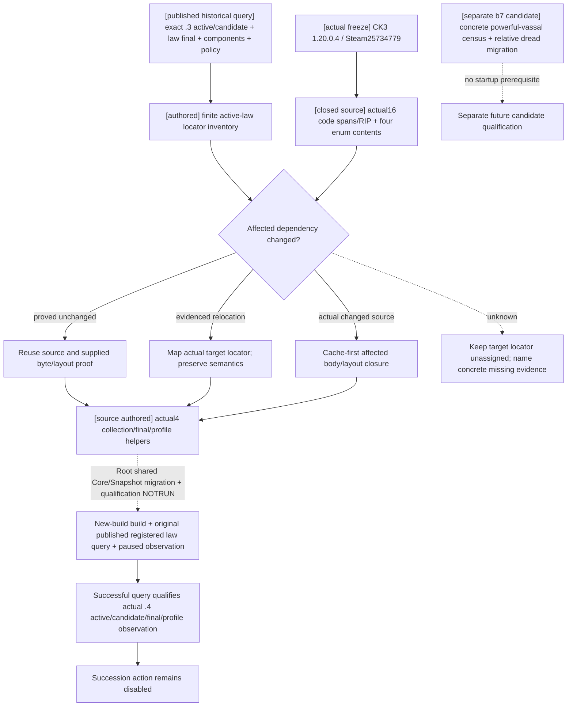

# CK3 1.20.0.4: published realm-law query migration

The actual new freeze is `artifacts/migrations/2026-10-07/installed-build/BUILD-FREEZE.json`: frozen at `2026-10-06T17:28:09.277542+00:00`, Steam build **25734779**, EXE **101040248 bytes**, SHA-256 **`98702f88a547cde2eaf29a85f93b85f68ee4cf8148336a4f7afaeb75319dd518`**. The freeze records `exe_changed=true` and `native_abi_migration_required=true`. Its Windows `FileVersion` and `ProductVersion` are null. Root confirmed the actual **1.20.0.4** native ASCII at file offset **71866624**, RVA **71871232**, preserved in [NEW-PE-METADATA.json](Z:/ck3_mod_rewrite_process_assets/g2-background-20261007/upstream-build-migration/global-pe-diff/NEW-PE-METADATA.json), ASCII entries5822..5826. The unified function mapper has now closed the active law code/layout locators. Root subsequently delegated the four exact enum pairs solely to this gate owner: the only EXE reads here were **64 bytes per frozen file, 128 bytes combined, eight reads/seeks** using the cached `.rdata` section mapping. No headers, PE parsing, hashes, body reruns or whole images were read.

The previous exact `.3` build remains historical source evidence: Steam25652598 / SHA `94B55397ABB687A3DCD436805A5D885E6BE90FA6C693FEB44A9E3BBEEADE02A6`. Its law-final/components migration proofs are reused without rerunning old qualification. The prior R0051 SDK009 published law query remains an observation of that prior build and does not qualify the new build. Its active/candidate/final/profile path is the startup migration target. The powerful-vassal census and relative-dread source remain a separate candidate; they are not prerequisites for starting the new build or publishing the existing law query.

The active production baseline is full HEAD **`ea222238efe45f4916057d90b2830d01e7fd57c7`**, supplied by Root from `Z:/gb0`. Parent created the exclusive tree **`C:/codex-ck3-background/parallel-integrations-20261007/realm-law-12004-active`** clean at that HEAD, clone/checkout exit0 at **17:57:43 UTC**. It includes g106 and excludes the separate b7 census candidate. This owner copied and updated only this topic into that authorized active tree; no duplicate checkout or source check was performed.

The gate owner has authored the actual `.4` active/candidate collection helpers, final operations binder and mapped succession profile reader in `realm_law_12004_native.hpp/.cpp`, with the ABI facts in `research/realm_law_12004_active_query_abi.json`. Root owns shared runtime/consumer integration, build/live qualification and reporting; parent handles the existing three capture/header/mailbox hooks and CMake. The b7 census branch remains separate. Shared Core/Snapshot treasury/world migration remains with Root and its Core owner; local law source closure does not qualify that shared runtime or the new law query.

Root's supplied unchanged stock proof is GameContent **depot1158311**, manifest **5078208590259867811**, size **19091661807 bytes**. Reuse that proof for the authored laws/triggers; no stock scan or duplicate content hash is required. Native final terms still describe the loaded query result.

## Existing source dependencies to match against the shared difference ledger

The historical machine-readable locator map is [DEPENDENCY-LOCATOR-INVENTORY.json](Z:/ck3_mod_rewrite_process_assets/g2-parallel-20261007/realm-powerful-vassal/migration/new-build-25734779/gate/DEPENDENCY-LOCATOR-INVENTORY.json). The source trace narrowed the initial 41-row request to [MINIMAL-ACTIVE-QUERY-DEPENDENCIES.json](Z:/ck3_mod_rewrite_process_assets/g2-parallel-20261007/realm-powerful-vassal/migration/new-build-25734779/active-law/gate/MINIMAL-ACTIVE-QUERY-DEPENDENCIES.json): **six direct native final functions**, copied collection/singleton layouts, and copied policy constructor/parser/enum evidence. Standalone compiled-condition, scope-cleanup and resource helpers are source ledger entries and are not called by this published query. The Dread/census row remains separate. The final active-tree receipt is [ACTIVE-LAW-GATE-DELIVERY.json](Z:/ck3_mod_rewrite_process_assets/g2-parallel-20261007/realm-powerful-vassal/migration/new-build-25734779/active-law/gate/ACTIVE-LAW-GATE-DELIVERY.json).

| Surface | Existing exact `.3` dependency, not a target-build claim | Existing proof |
| --- | --- | --- |
| Native final terms | GUI `0x41D5270`; kind `0x30B2B40`; active `0x2BA97F0`; final `0x30B1B70`; full reason `0x30B1CE0`; numeric cost `0x30B26D0`; engine cost `0x310CEE0`; reason destructor `0x856050` | `ck3_12002_realm_law_final_terms_abi.json` and Oct2 `.2→.3` comparison PASS, including complete runtime bodies and call anchors |
| Compiled law components | Actor scope `0xB17C70`; compiled evaluator `0x372DF30`; parser evidence `0x30AEB6D`, `0x30AEC15`, `0x30AEDF7`; cleanup callsite `0x30B1C51`; bound cleanup `0x889700` / `0x889780` | `ck3_12002_realm_law_components_abi.json`, Oct2 comparison PASS and actual component binder source |
| Succession policy data | Constructor `0x253FA10`; property parser `0x253FA70`; CLaw construction anchor `0x30AE759`; four enum arrays `0x473B2D8`, `0x473B2E0`, `0x473B2E8`, `0x473B348` | Same component ABI and comparison PASS; policy reader is integrated in `ck3_12002_realm_law_components.cpp` |
| Separate census candidate: relative dread canonical binding | Literal `0x47F78E8`; enum description `0x47F7D00`; registrar `0x5AAE90`; factory table `0x47F9BD8` / factory `0x2B759C0`; trigger table `0x47FC228` slot+0xC8 / evaluator `0x2B73750` | [Closed `.3` source contract](Z:/ck3_mod_rewrite_process_assets/g2-parallel-20261007/realm-powerful-vassal/gate/relative-dread-cache/RELATIVE-DREAD-SOURCE-CONTRACT.json); outside active startup dependencies |
| Separate census candidate: relative dread typed reader and GUI | Complete native leaf `0x2C4CA50..0x2C4CB09`; GUI literal `0x44E4778`, registrar `0x99030`, callback `0xD05050` | Same contract; no new active-query prerequisite |

The historical locator map also carries the prior proof's runtime-function, unwind, byte-anchor, token and canonical-data references. Extra standalone component cleanup, native affordability and Dread internals do not expand this query's startup dependencies. The existing early-true branch remains an explicit semantic unknown; fresh native final terms still decide the result.

## Actual .4 source closure and implemented helpers

The mapper's authoritative code receipts are [LAW-FUNCTION-MAP.json](Z:/ck3_mod_rewrite_process_assets/g2-background-20261007/upstream-build-migration/function-match-law-active/LAW-FUNCTION-MAP.json) and [LAW-ACTUAL-RIP-TARGET-PAIRS.json](Z:/ck3_mod_rewrite_process_assets/g2-background-20261007/upstream-build-migration/function-match-law-active/LAW-ACTUAL-RIP-TARGET-PAIRS.json). Fifteen requested instruction spans normalize identically with ordered edges preserved. The kind predicate's80-byte span is proved as40 bytes of code plus ten DWORD inline cases, rather than treating that inline table as instructions. Actual full-reason code calls the mapped kind entry. The130-byte candidate-array span is an instruction/layout proof crossing runtime intervals, not a whole logical-function claim.

| Direct binding | Actual `.4` RVA and exclusive span end |
| --- | --- |
| Candidate kind | `0x30B2B20..0x30B2B70`; explicit code/table split, cases0..9 yield1/1/1/1/1/1/0/0/0/1, >9 false |
| Already active | `0x2BA97D0..0x2BA9861` |
| Engine final CanEnact | `0x30B1B50..0x30B1CBD` |
| Full CanEnact and reason | `0x30B1CC0..0x30B1DF5` |
| Numeric cost | `0x30B26B0..0x30B27CD` |
| Native reason destructor | `0x856050..0x8560AE` |

Actual singleton store `0x2E79470..0x2E7948A` and database getter `0x28A9B6D..0x28A9BCD` independently target **`0x5D202F0`**. Actual copied collection/string instruction operands preserve actor context `+0x1C0`, active vector `+0x200`, group database vector/count `+0x50/+0x5C`, candidate vector/count `+0x58/+0x64`, law owning group `+0x40`, and native key string `+0x18`. This helper admits the actual `.4` SHA and copies the existing query algorithms with those proved offsets. It does not pass an old SHA to a reader.

Actual policy constructor `0x253F9F0`, parser `0x253FA50` and CLaw construction span `0x30AE739..0x30AE745` preserve `CLaw+0xBD8`, copied size `0x68`, selector bytes0/1/3/4, `create_primary_tier_titles` byte6 and int64 minimum share `+0x60`. The authoritative [FOUR-ENUM-ACTUAL-DATA.json](Z:/ck3_mod_rewrite_process_assets/g2-parallel-20261007/realm-powerful-vassal/migration/new-build-25734779/active-law/gate/four-enum-data/FOUR-ENUM-ACTUAL-DATA.json) preserves exact raw bytes and uint32 parser token IDs. All four old/new spans are byte-equal at these actual parser RIP targets:

| Enum | Actual `.4` data RVA | Bytes | Native tokens in ordinal order |
| --- | --- | --- | --- |
| Order | `0x473B2F8` | 36 | 11474,11473,11605,12242,12616,12040,15882,12710,14676 |
| Traversal | `0x473B358` | 12 | 11609,11870,10254 |
| Rank | `0x473B2E8` | 8 | 11616,11617 |
| Division | `0x473B2F0` | 8 | 11619,11620 |

These uint32s are parser token IDs. The wire's selected enum byte is the ordinal, with unset sentinels9/3/2/2. The existing typed key mapping and absent/optional semantics are therefore reused as **C++ value algorithms**. `ReadRealmLawSuccessionProfile12004` copies actual `.4` policy bytes while the candidate is held, then returns the existing profile DTO. It adds no native parser/constructor/evaluator call. The six-function binder uses actual mapped `.4` functions and `ck3_12004::kExecutableSha256`; the final value reader uses proved compiled-cost offset `+0xC40`, ten q100000 cost slots and the native32-byte reason string layout.

Old semantic layouts to preserve or update from actual differences are:

- Law conditions: `CLaw+0x3A0` can_pass, `+0x540` can_have and `+0x610` can_keep; actor scope size `0x168`, native cleanup tail `+0x118` and the two existing row/allocator layouts.
- Native final terms: compiled cost `CLaw+0xC40`, ten native cost slots at scale100000; 32-byte native reason object with size `+0x10`, capacity `+0x18` and inline capacity15.
- Succession policy: `CLaw+0xBD8`; order `+0`, traversal `+1`, rank `+3`, division `+4`, int64 minimum share `+0x60` at scale100000. The all-default `9/3/2/2` plus zero share remains a meaningful absent policy; partial selectors retain the current semantics.
- Relative dread: Microsoft-x64 native signature `int32(target, scope)`, census call `(player, vassal)`, enum `0/1/2`; `<2` remains the authored opposition comparison if its actual source is unchanged. GUI `+1` is solely an icon-frame adjustment.

Current authored opposition reference is `common/scripted_triggers/00_legal_triggers.txt`: native powerful direct vassal, not imprisoned, vassal opinion of liege `<0`, relative dread level toward liege `<2`. Partition and general authority flags differ, and other law conditions still apply. The unchanged GameContent depot proof supplied by Root supports retaining these stock references. The active query consumes fresh native final terms; it does not require a separately published concrete powerful-vassal census.

## Compatibility migration sequence

The unified mapper supplies code/edge/offset/RIP evidence, and this owner's one explicitly delegated128-byte enum capture completes the actual data comparison. The existing DTO/value algorithms are reused while native admission, function locators and collection/profile reads live in `xar::ck3_12004::private_law`. Historical module names and schemas remain compatible without an old-version native alias.

Core owner `/root/entry_next_stage_research` supplies an actual `ck3_12004.hpp` namespace/API backed by mapped `.4` Core evidence. Root confirmed the API at `C:/codex-ck3-background/ck3-12004-interface-migration/source01/ck3_autonomous_player/native_bridge/include/xar_bridge/ck3_12004.hpp` and `ck3_12004_adapter.hpp`: actual `.4` `BindCoreImage`, `ResolveCoreCharacter`, `ReadCoreSnapshot` and `IsCk3_12004Descriptor`. Those shared headers remain Root-owned and are not copied into this lane's commit. The new law operations consume that actual API and mapped function/data/layout proof; they do not admit the new module by passing an old `.2` hash to an alias.

The implemented single header is `xar_bridge/realm_law_12004_native.hpp`, with four agreed functions: `ReadRealmLawCandidateCollectionWithObserver12004`, `BindRealmLawFinalTermsImage12004`, `ReadRealmLawFinalTerms12004` and `ReadRealmLawSuccessionProfile12004`. Parent owns the existing three capture/header/mailbox hooks and CMake; shared runtime integration, strict consumer qualification and live work remain Root-owned. Concrete census implementation and its native Dread binding stay in the separate b7 candidate tree. Existing law action routes are unchanged by this read-only migration.

The existing `0x30B1B90..0x30B1BA9` early-true branch remains a source unknown in the historical tree. Migration does not invent its meanings or infer compiled-component success from final `true`. Fresh native final terms remain the law enact authority. This work does not design a counter-policy, change an action route or repeat the old CA1 loop.

Status is **research / actual active-query source closed and implemented**. Local law code, copied layouts and enum meanings are closed; all four helper definitions are authored. Root's shared Core/Snapshot migration and new-build qualification remain separate pending work. This gate owner read exactly **64 old +64 new EXE bytes in eight reads/seeks**; whole EXE, headers, PE parsing, hashes, body reruns, project imports, FIRST, tests, builds, game, SDK, process and Git operations are **0**. Parent integrates the source; Root retains the sole first build and actual registered paused law query. No historical `.3` source-ready/live result is promoted to the new build, and the separate census candidate is not a startup dependency.
