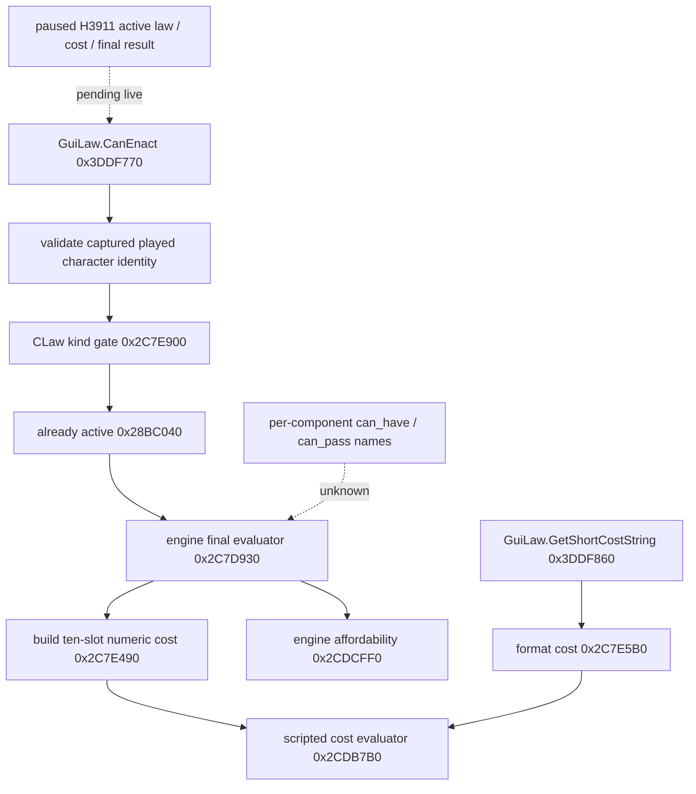
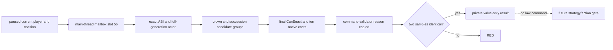
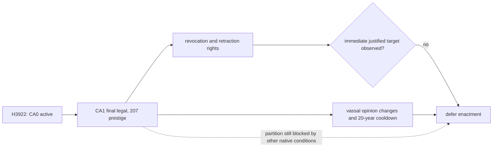

# Realm law final legality and numeric cost, CK3 1.19.0.6

Status: **H3922 private read-only production-live primitive; no law action**.
The original ABI work was static-only; the later R0334 result is recorded
below. No H3911 law, cost, or legality was observed. The
executable is `binaries/ck3.exe`, 95,206,008 bytes, SHA-256
`2D00FF3101EF70B566F2FCBAE292F09263199C80E9DC8F139B82D7D96F83DB86`.
The machine proof is
`ck3_autonomous_player/native_bridge/research/realm_law_final_terms_11906_abi.json`.

## Why this read is needed

The legally paired H3911 Robert driver state has `feudal_government`,
`government_uses_crown_authority`, and `split_successors`. Its held-title
partition sends county `2173` to character `38988`, while the primary duchy
`2141` and other titles first go to `38822`. The latest campaign-root query
does not publish the active crown law, a candidate's final CanEnact, or its
native cost. This gives a specific governance decision to observe; it does
not establish that changing a law is legal or beneficial in H3911.

The original tree and scripts are described in
[laws-contracts-and-succession.md](laws-contracts-and-succession.md).
`common/laws/00_realm_laws.txt` says `crown_authority_2` grants
`can_change_succession_laws` and changes vassal tax and levy contributions.
The crown authority pass cost is scripted prestige. Whether a target law
changes H3911's successor split remains an unobserved outcome and cannot be
inferred from the script flag alone.

## Exact same-source native path



`0x3DDF770` checks the captured full-generation player ID, resolves the
current character, requires its law context, then calls the type gate,
already-active check, and `0x2C7D930` in that order. A direct call to
`0x2C7D930` alone does not reproduce the complete GUI predicate.

Within `0x2C7D930`, the sequence at `0x2C7D9DF..0x2C7DA0A` passes
`CLaw+0xCD8` and the actor's full ID to `0x2C7E490`, then passes the
resulting 80-byte vector to `0x2CDCFF0` for affordability. The numeric
helper first builds the same native script context as the GUI formatted-cost
path via `0x98C0F0`, then calls `0x2CDB7B0`. The latter evaluates ten
compiled cost rows at `cost_block+0x38+i*0x108`, accumulates signed Q100000
amounts, then applies its authored clamp/round flags. Do not recompute a
scripted prestige formula outside that engine path.

The ten ordinals use the already frozen generic cost mapping in
`pending_character_interaction_context_v1_abi.json`: gold, prestige, piety,
renown, influence, herd, treasury, treasury_or_gold, merit, barter_goods.
Slot 7 is routed to treasury or gold by the engine; it is not another
independent balance. The current LAW2 value type has a six-entry cost array,
so production registration must preserve the complete native vector and
represent slot 7 correctly. A six-slot projection would lose cost terms.

The new `realm_law_final_terms_11906` reader is a one-callback private seam.
It receives freshly resolved native law and actor pointers plus actor ID,
replays the three GUI gates, and copies all ten numeric cost terms. It does
not retain pointers or submit a command. Its operation table must be bound
only after the exact ABI proof and inside an application-main paused query.
The existing LAW2 source adapter remains responsible for frame consistency,
two samples, title baseline, and value-only publication.

## Readiness and unresolved fields

The engine final Boolean includes compiled trigger and affordability checks.
Three compiled trigger objects at `CLaw+0x398`, `+0x558`, and `+0x638` are
evaluated by `0x2C7D930`, but their individual `can_have`, `can_pass`, and
realm applicability names are not yet proved. `GetCanEnactDescription`
ultimately uses the command validator with an engine-owned error sink; its
safe copied reason format is also unresolved. The private reader therefore
reports an opaque engine-blocked status and does not fill LAW2's separate
component or reason fields with guesses.

Next, register this read with the candidate collection from
[realm-law-active-collection-11906.md](realm-law-active-collection-11906.md),
close the component/reason ABI only if needed by the current decision, and
run one matched, paused H3911 observation. Record active law, all relevant
candidates, full costs, final CanEnact, and the same-frame resource and
successor baseline. A read-only result is still not an enactment receipt.

## Private paused query candidate (2026-09-29)

The default-off `query-realm-law-final-terms-v1-private` step now binds the
current full-generation player character through the exact component storage,
then visits only the two frozen feudal law groups. Each candidate is evaluated
on the application-main thread by the GUI type/active/final path and the
ten-slot numeric cost helper. The same command validator at `0x2C7DAA0`
copies its engine reason into an engine-owned MSVC string sink; the native
destructor at `0x7E97D0` releases the sink after copying. The collector takes
two complete samples inside the same paused callback and rejects any key,
membership, final status, cost, or reason difference. The pipe handler also
checks the published frame and its revision before and after the callback.



The CMake option is OFF by default. The Python one-shot operator opt-in exits
after this read without submitting a law command or advancing a date. The
result retains all ten signed Q100000 slots and reports current active key,
candidate key, `final_can_enact`, status, and copied reason. A blank native
reason remains blank; it is not replaced by a guessed script cause. H3911 has
not been queried; the subsequent paired H3922 result appears below.

The exact-build binder currently uses the published mutation ABI proof for
the command validator and final evaluator, plus the pinned EXE identity and
the numeric helper ABI in `realm_law_final_terms_11906_abi.json`. The private
query does not fill the old six-slot LAW2 schema or advertise a public law
action. A later formal decision must compare the observed successor baseline
and resources with the candidate value, then submit and independently read
the enacted law and successors.

The focused normal/optimized MSVC candidate fixture is 8/8 in each mode;
the private route builds with its option enabled in VS 18 Release. The
no-launch Python transport checks full ten-slot preservation, frame change,
and default-off gating. These are source and fixture evidence, not live proof.

## R0334 H3922 lawful CA1 opportunity and conservative decision

The exact-master `9659eb69cf85319aa42b2598c6758c90d4b1b741` frozen
candidate used CK3 1.19.0.6 (EXE SHA above) and its default-off private query.
Its formal R0334 report is
`Z:\ck3_mod_rewrite_process_assets\realm-law-h3922-paused-v2-master9659\operator-runs\law-h3922-read-2\formal-report.txt` and
has SHA-256 `522BCD5AE66297AA2C518C2CC006247977D1D7DF32F150D057B64B8D2C7B973B`.
The paused/map-ready Robert actor was `29829` at `raw53219928`, native revision
3. The one-turn read was `private_realm_law_paused_observed`, with the same
source and post date, no law action, and no date advance. The candidate's save
was unchanged; this is a real read-only primitive, not an enactment outcome.

The native final result reports active `crown_authority_0` and a legal
`crown_authority_1` (`final_can_enact=true`, `final_status=can_enact`). Its ten
cost slots are `[0, 20700000, 0, 0, 0, 0, 0, 0, 0, 0]` at scale 100000.
The frozen ordinal table makes slot 1 **prestige**: 207 prestige versus
Robert's same-frame `played_character_prestige.raw=253741850` (2537.4185).
Gold is a distinct slot 0 and is not charged. CA2/CA3 were engine-blocked.
The active succession law was `confederate_partition_succession_law`;
`partition`, `high_partition`, and `single_heir` all remained engine-blocked.
The copied partition reason includes authority, powerful-vassal opinion, and
the missing hereditary-rule innovation; the reason contains engine formatting
bytes, so this description uses only stable tokens and the corresponding
original scripts. It does not infer that CA1 alone unlocks partition.

The exact original `common/laws/00_realm_laws.txt` defines CA1 at lines
51–125. Relative to CA0, it grants `title_revocation_allowed`,
`vassal_retraction_allowed`, and `can_change_partition_succession_laws`, but
no direct tax or levy modifier. Its opinion modifiers change by +15 for
belligerent, -50 for barons/minor landholders, -25 each for glory hound and
parochial, -10 for courtly, and -10 for minority vassals. Its `on_pass` sets
`crown_authority_cooldown` for **20 years** (`@crown_authority_cooldown_years`
at line 1). The exact `common/script_values/00_law_values.txt` prestige
formula starts at 100 and adds a realm-size term; the observed 207 is the
engine-final cost and takes precedence over an external recomputation.
`common/scripted_triggers/00_legal_triggers.txt` also requires absence of a
powerful vassal opposing a partition change, while
`common/scripted_triggers/00_law_triggers.txt` requires the hereditary-rule
innovation for ordinary partition. CA2 additionally requires its preceding
authority law and royal-prerogative innovation in the original law tree.



**Current policy verdict: defer CA1 enactment.** Affordability is established,
but the R0334 frame supplies no immediately justified revocation/retraction
target, no fresh powerful-vassal opinion distribution or law-induced faction
risk, and no legal next succession-law action. The ongoing defensive war adds
an immediate stability concern. A cached campaign-root count of zero
player-targeting factions cannot establish that the CA1 opinion loss is safe.
The 20-year cooldown can delay later crown-authority options; it is a real
long-term commitment, not a zero-cost wait. Consequently the net benefit on
this frame is not established and the typed law action remains OFF.

The next narrow value read, if normal play produces an actual revocation or
succession need, is the current powerful-vassal identities/opinions and faction
power or membership on the **same paused version** as final law terms, plus
the concrete target's native revocation/retraction legality or a newly legal
succession candidate. Reuse the existing faction alert and opinion receivers
where they apply; do not substitute an old cached zero faction count or treat
missing opinion as zero. Only a positive comparison after these reads warrants
wiring the existing typed LAW5/Law6 action, its next paused receipt, next turn,
and cold restore into the formal runner.

## Focused verification commands

```text
py ck3_autonomous_player/native_bridge/research/verify_realm_law_final_terms_11906.py --exe "Z:\ck3_mod_rewrite\Crusader Kings III\binaries\ck3.exe"
py -O ck3_autonomous_player/native_bridge/research/verify_realm_law_final_terms_11906.py --exe "Z:\ck3_mod_rewrite\Crusader Kings III\binaries\ck3.exe"
```

The verifier checks exact EXE identity, the six native spans, exception
entries, seven relative calls, and the independent native resource-ordinal
contract. The standalone C++ fixture compiles under MSVC C++20 `/W4 /WX`
in `/Od` and `/O2`; it covers legal, kind-rejected, already-active,
engine-blocked, cost-read failure, and absent-operation cases. These checks
are static/fixture evidence only.
