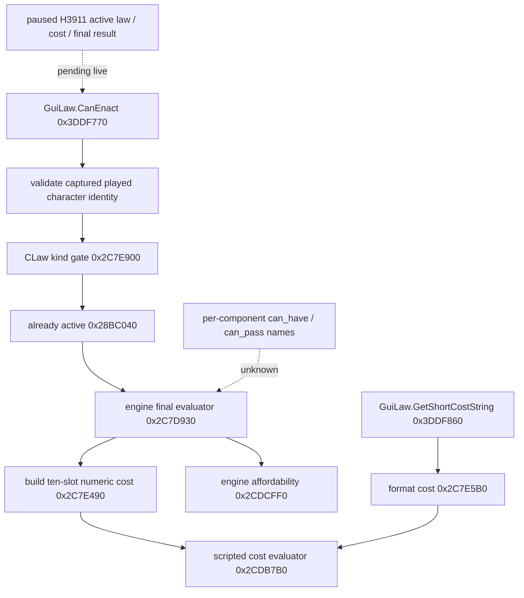

# Realm law final legality and numeric cost, CK3 1.19.0.6

Status: **exact-build static-ready, private read only**. No CK3 instance was
started for this work. No H3911 law, cost, or legality was observed. The
executable is `binaries/ck3.exe`, 95,206,008 bytes, SHA-256
`2D00FF3101EF70B566F2FCBAE292F09263199C80E9DC8F139B82D7D96F83DB86`.
The machine proof is
`ck3_autonomous_player/native_bridge/research/realm_law_final_terms_11906_abi.json`.

## Why this read is needed

The legally paired H3911 Robert driver state has `feudal_government`,
`government_uses_crown_authority`, and `split_successors`. Its held-title
partition sends county `2173` to character `38988`, while the primary duchy
`2141` and other titles first go to `38822`. The latest campaign-root query
does not publish the active crown law, a candidate's final CanEnact, or its
native cost. This gives a specific governance decision to observe; it does
not establish that changing a law is legal or beneficial in H3911.

The original tree and scripts are described in
[laws-contracts-and-succession.md](laws-contracts-and-succession.md).
`common/laws/00_realm_laws.txt` says `crown_authority_2` grants
`can_change_succession_laws` and changes vassal tax and levy contributions.
The crown authority pass cost is scripted prestige. Whether a target law
changes H3911's successor split remains an unobserved outcome and cannot be
inferred from the script flag alone.

## Exact same-source native path



`0x3DDF770` checks the captured full-generation player ID, resolves the
current character, requires its law context, then calls the type gate,
already-active check, and `0x2C7D930` in that order. A direct call to
`0x2C7D930` alone does not reproduce the complete GUI predicate.

Within `0x2C7D930`, the sequence at `0x2C7D9DF..0x2C7DA0A` passes
`CLaw+0xCD8` and the actor's full ID to `0x2C7E490`, then passes the
resulting 80-byte vector to `0x2CDCFF0` for affordability. The numeric
helper first builds the same native script context as the GUI formatted-cost
path via `0x98C0F0`, then calls `0x2CDB7B0`. The latter evaluates ten
compiled cost rows at `cost_block+0x38+i*0x108`, accumulates signed Q100000
amounts, then applies its authored clamp/round flags. Do not recompute a
scripted prestige formula outside that engine path.

The ten ordinals use the already frozen generic cost mapping in
`pending_character_interaction_context_v1_abi.json`: gold, prestige, piety,
renown, influence, herd, treasury, treasury_or_gold, merit, barter_goods.
Slot 7 is routed to treasury or gold by the engine; it is not another
independent balance. The current LAW2 value type has a six-entry cost array,
so production registration must preserve the complete native vector and
represent slot 7 correctly. A six-slot projection would lose cost terms.

The new `realm_law_final_terms_11906` reader is a one-callback private seam.
It receives freshly resolved native law and actor pointers plus actor ID,
replays the three GUI gates, and copies all ten numeric cost terms. It does
not retain pointers or submit a command. Its operation table must be bound
only after the exact ABI proof and inside an application-main paused query.
The existing LAW2 source adapter remains responsible for frame consistency,
two samples, title baseline, and value-only publication.

## Readiness and unresolved fields

The engine final Boolean includes compiled trigger and affordability checks.
Three compiled trigger objects at `CLaw+0x398`, `+0x558`, and `+0x638` are
evaluated by `0x2C7D930`, but their individual `can_have`, `can_pass`, and
realm applicability names are not yet proved. `GetCanEnactDescription`
ultimately uses the command validator with an engine-owned error sink; its
safe copied reason format is also unresolved. The private reader therefore
reports an opaque engine-blocked status and does not fill LAW2's separate
component or reason fields with guesses.

Next, register this read with the candidate collection from
[realm-law-active-collection-11906.md](realm-law-active-collection-11906.md),
close the component/reason ABI only if needed by the current decision, and
run one matched, paused H3911 observation. Record active law, all relevant
candidates, full costs, final CanEnact, and the same-frame resource and
successor baseline. A read-only result is still not an enactment receipt.

## Focused verification

```text
py ck3_autonomous_player/native_bridge/research/verify_realm_law_final_terms_11906.py --exe "Z:\ck3_mod_rewrite\Crusader Kings III\binaries\ck3.exe"
py -O ck3_autonomous_player/native_bridge/research/verify_realm_law_final_terms_11906.py --exe "Z:\ck3_mod_rewrite\Crusader Kings III\binaries\ck3.exe"
```

The verifier checks exact EXE identity, the six native spans, exception
entries, seven relative calls, and the independent native resource-ordinal
contract. The standalone C++ fixture compiles under MSVC C++20 `/W4 /WX`
in `/Od` and `/O2`; it covers legal, kind-rejected, already-active,
engine-blocked, cost-read failure, and absent-operation cases. These checks
are static/fixture evidence only.
