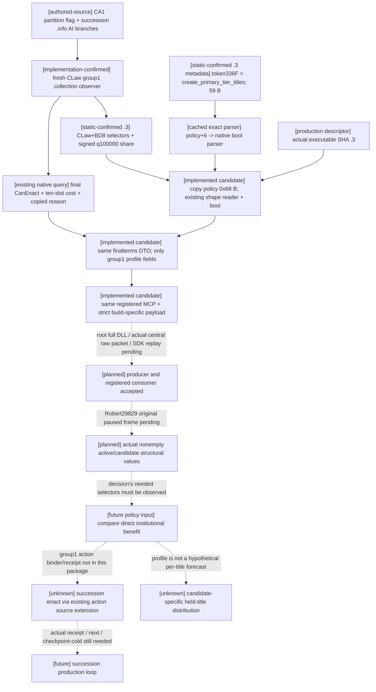

# Realm-law 候选继承收益观测：1.20.0.3

2026-10-06；源研究基线 `df87fd85`，实际独占接入基线 `be06a134b9a5472275e08ea452a8e3542b192fb8`。本片已把 C++/Python 观测候选、fixture 和 CMake 入口接入 Root 创建的独占树，等待 cherry-pick 与首次 joint-batch 资格；未运行 imports/tests/build/SDK/CK3。exact build 复用 Root 已冻结 CK3 `1.20.0.3` / Steam `25652598`，EXE SHA-256 `94B55397ABB687A3DCD436805A5D885E6BE90FA6C693FEB44A9E3BBEEADE02A6`。唯一 live 入口仍为 Robert `29829` 的原普通战役，Root 独占游戏、SDK、pipe、进程、shared hooks、主报告及主树 Git。战争和宗教领域均已开放。

## 选择及独立价值

[implementation-confirmed] 既有 `query-realm-law-final-terms-v1-private` / `ck3_query_realm_law_final_terms_private_v1` 已在同一 actor/frame 枚举 `crown_authority` 与 `succession_order_laws`。现生产 serializer 每个候选只有 law key、active、final status/can-enact、native reason、十槽 cost；Python strict transport 接受这六项字段。因此当前真实 eligibility 和动态费用已可见，缺的是候选实际继承制度结构。

[implementation-confirmed] 现有完整 action source 的 `ObserveCandidate` 仅在 `group == 0` 读取 component 与 succession shape；`Container` 固定 `group_count=1`，`Candidate`/`ResolveRealmLawCrownTarget12002` 只接受 crown group/key。已有内部 shape 类型不能代替 group1 查询发布，也不能让 crown-only action 修改继承法。

[production-live loop, historical evidence] Robert CA0→CA1 的一次 enact、独立 material、next、checkpoint 与新 PID cold 已在 2026-10-02 闭合，见旧 crown-source-and-receipt 专题和 `ACTUAL-ROBERT-CA1-PRODUCTION-LOOP-PROOF.json`。本片复用，不重验、重发或赋予新动作/整体 M6 信用。

本片只扩充同一 query 的 exact `.3` group1 succession profile，让 dynasty-continuity 能回答“合法候选改变哪项继承结构”。confederate 与 ordinary partition 的 order/traversal/rank/division 相同，必须额外读 `create_primary_tier_titles` 才能识别“不再新建同级头衔”这一直接制度收益；high partition 的主继承最低份额与 single-heir division 也直接来自实际 native policy。此信息不预测每个持有头衔的 hypothetical 分配。

## 先读 authored/native AI 输入

[authored-source observed; loaded runtime value not claimed] 只读当前参考树 `00_realm_laws.txt`：CA1 已有 `can_change_partition_succession_laws`（63），CA2 才追加 `can_change_succession_laws`（142）。不能把先升 CA2 一概当作改变分割继承的唯一前置。CA2/CA3 的 contribution `0.1/0.25`、战争限制、继承离境限制与指定继承人仍只是当前 authored 规则；cumulative group 的单行 modifier 不能冒充完整 net delta 或实际月收入。

`00_succession_laws.txt` 中，原生 `.info` 驱动的既有树有以下输入。本片不在 Python 重写 eligibility trigger，也不照抄 AI 分数为策略：

| 候选 | authored 结构 | authored AI 分支 |
| --- | --- | --- |
| confederate partition | inheritance/children/oldest/partition；create yes（63–69） | 未定义正分 |
| ordinary partition | 相同 selectors；未设置 create（148–153） | 当前 confederate 时 1（166–170） |
| high partition | partition；最低主继承份额 0.5（209–215） | 当前前两项时 2（226–235） |
| single heir | inheritance/children/oldest/single-heir（291–296） | 3（323–325） |

[static-confirmed boundary] 当前是否可以 enact、阻断原因及费用仍取已有 native final evaluator。独立 `can_have/can_pass` 不能代替 final evaluator 的 early-true 分支。CA1 的 authored flag 不表示当前帧一定合法。旧 law 专题的宗教排除/战争暂缓是历史授权，不作为本次禁令。

## Exact source closure

[static-confirmed] 复用已有 `.2` law ABI 和完整缓存：原生 policy 在 `CLaw+0xBD8`；order `+0`、traversal `+1`、rank `+3`、division `+4`；signed int64 minimum share `+0x60`，q100000。默认 selectors 为 `9/3/2/2`，全默认且 share0 时旧 shape absent；合法 share0 要原样保留。

[static-confirmed exact .3] Oct2 **nonwar-supplement** 的 `ck3_12002_realm_law_components_abi-comparison.json` 为 PASS，包含完整 policy defaults `0x253FA10`（91 B）、parser `0x253FA70`（1487 B）、CLaw constructor `0x30AE340`（1180 B）、handoff `0x30AE759`、四 enum 与已有 property tokens 的 `.2/.3` byte equivalence。core-comparison 的28模块本身没有 law；不能用 core 概数替代这项 supplement。上述 body 均未重读。

[static-confirmed exact .3, newly closed] 缓存同 parser 在 `0x253FDBB/0x253FDC2` 匹配 token `0x336F` 后到 `0x253FF04`，把 native bool parser `0x3F980D0` 的目标设为 policy `+6`。Root 审阅 `ROOT-SOURCE-REQUEST.json` 后只批准 registry32 B，再跟其首行 referenced literal 至 NUL≤128 B。本片用已缓存 PE mapping 读取 registry RVA `0x46F2050` **32 B**，首行 token `0x336F` 指向 literal RVA `0x46CB8C8`，实际读取 **27 B**（包括 NUL），得到 canonical key **`create_primary_tier_titles`**。总计 **59 B**，新 header/body/whole-image/hash/callback/game 读取均0。原 bytes 与 `Z:/ck3_mod_rewrite_process_assets/g2-parallel-20261006/realm-law/root-source-cache/RECEIPT.json` 已保留，无扫描扩大。



## Actual implementation candidates

Owned new header `realm_law_succession_profile_12003.hpp` defines a value-only profile DTO, a read-only helper and field serializer. The helper copies policy `0x68 B` through the existing `access.read_memory` while the original candidate observer holds the native CLaw lifetime, calls existing `ReadRealmLawSuccessionShape12002` on the copy, then reads byte `+6`. No native callback, query identity or hook is added.

The narrow three-file native patch adds a group1 profile array to existing readback, invokes the helper only for exact `.3` group1, and appends copied profile values to the original serializer. The original application-main mailbox passes **actual** `adapter.descriptor().executable_sha256`; it does not infer `.3` from the normalized `.2` ABI hash. The header-only helper needs no CMake source addition. Existing finalterms semantics, group0 and `.2` response keys remain unchanged.

The actual Python replacement retains the original query/step, default-off private flag, paused living current-player frame, native revision/actor/date checks and real provenance. Exact `.3` group1 requires the two added fields; older builds and group0 require the old six candidate keys. Missing `.3` profiles cannot silently count as the new observation.

For `available`, `succession_profile` contains exactly:

```json
{
  "order": "inheritance",
  "traversal": "children",
  "rank": "oldest",
  "division": "partition",
  "primary_heir_minimum_share_raw": 0,
  "primary_heir_minimum_share_scale": 100000,
  "create_primary_tier_titles": true
}
```

Selectors use the existing canonical native enum keys. An observed native unset selector is `null`, not a failed read; normally group1 authored inheritance order is non-null. All-sentinel shape with create true is still an available bool-only profile; all-sentinel shape, share0 and create false is `absent/null`. Read failure or invalid enum mapping is `unavailable/null`. Signed share is not clipped; zero and typed false are complete data. Python distinguishes booleans from integers and accepts only the exact native canonical keys/q100000 scale.

The consumer validates observations without adding a policy/readiness payload. For a structural comparison, readiness requires the active law and the relevant target candidate to have `available` profiles, same paused actor/date source, finalterms and the selectors **that comparison actually needs**. An observed nullable appointment branch need not block an independent inheritance comparison, but required `order/division` cannot stay null. No generic `null=done` claim is made.

## Concrete acceptance and boundaries

`ROOT-INTEGRATION-RECIPE.md` supplies adoption and root-only verification. First build complete production `xar_ck3_bridge` under Root's existing exact `.3` query configuration and strict checks. Then retain actual raw packets from `bridge.cpp:13868 HandleNonwarPrivate12002` → router602 → `ReadRealmLawOnApplicationMain12002` → owning capture/serializer → `ReadOnlyFrame` → bridge13876 write. This is the current central route; the bridge legacy branch is not its replacement.

Python's actual private registration directly invokes `NativeHeadlessGameplayDriver`; `GameplayBridgeService` is constructed by `create_server` but does not own this private method. The external replay script consumes Root's full `hello/initial-state/response/final-state` production packets and invokes real `NativeProtocolState`, the real driver method and actual registered MCP SDK tool. It changes only request correlation. A synthetic DTO inserted into a hand-built reply is not wholeService producer evidence.

After the complete build, one external focused CMake fixture compiles the **actual integrated** provider/serializer and new helper with synthetic native-layout memory. It preserves the current collection's four-law allowlist, demonstrates confederate true vs partition false, share0 vs high-partition50000 and single-heir division, and independently checks absence/bool-only/unreadable profile semantics plus unchanged `.2` capture. Explicit failure checks remain active with NDEBUG. It emits only a labelled synthetic DTO and has not been compiled or run here.

Root then performs one fresh read in the Robert29829 original ordinary paused scene. Require an actual nonempty active succession profile and the real candidate set with final statuses/costs/reasons; retain literal law keys/selectors/share/bool and any unavailable rows. Do not fabricate legal candidates or assume today's profile from an old paused artifact. A genuine paused observation can later earn `production-live primitive` for this slice; actual legality is useful even if no law-change opportunity exists.

No law command, GUI click, CA1 replay, new succession policy, action binder or receipt is in this candidate. The next action package, if a real succession opportunity demands it, extends the existing group1 action source/leases and independent active-law/resources/actual-heirs receipt. Before actual action → verify → next → checkpoint/cold, there is no succession production loop, complete governance, full OODA or new overall G2/M6 credit.

## Mergeable Oct6/W41 fields

Completed: existing query/action/native-tree scope confirmed; exact-.3 law supplement reused; canonical title-creation token closed with root-approved59 B; actual group1 DTO/helper/serializer and strict Python candidate authored; strict focused fixture, registered replay and whole-production-first recipe delivered.

In progress: Root adoption, complete production build, actual central raw-packet output, registered replay and one actual paused read. Why: final legality/cost already exists, but dynasty-continuity needs real candidate structure to compare independent制度收益。

Readiness: source identity/ABI is static-confirmed; implementation files are unvalidated candidates. Selected observation remains research until Root's actual checks/paused artifact. Existing CA1 production-live loop remains historical. No new harness/capability RED, no new live/action/overall credit.

源研究和外置候选阶段：exactly1 bounded offline EXE capture,59 metadata B；0 new hash/body/header、imports/tests/builds/game/SDK/pipe/process/native callbacks/actions/commit/push。后续独占树接入只新增一次 diff check 与英文 commit，无 push；准备/拷贝工具不构成生产资格。Root 首次 joint batch 填入实际 validation artifacts，再负责主树采纳及推送。

## Source references

- `Z:/gb0/docs/ck3-native-ai/README.md`, `laws-contracts-and-succession.md`, `ck3-1.20.0.2-realm-law-components.md`, `ck3-1.20.0.2-realm-law-final-terms.md`, `ck3-1.20.0.2-realm-law-crown-source-and-receipt.md`.
- `Z:/gb0/ck3_autonomous_player/native_bridge/src/ck3_12002_realm_law.cpp`, `ck3_12002_realm_law_source_adapter.cpp`, `ck3_12002_realm_law_components.cpp`, `ck3_12002_realm_law_mailbox.cpp`, `ck3_12002_nonwar_router.cpp`, `bridge.cpp`; corresponding headers.
- `Z:/gb0/ck3_autonomous_player/src/xar_autoplayer/bridge/realm_law_paused_private_transport.py`, `native_driver.py`, `mcp_server.py`.
- Current authored `Z:/ck3_mod_rewrite/Crusader Kings III/game/common/laws/00_realm_laws.txt`, `00_succession_laws.txt` (source reference, not loaded-runtime claim).
- `Z:/ck3_mod_rewrite/artifacts/g2-offline-2026-10-01/law/mutation/succession_parser_annotated.txt`, `components-result.json`; Oct2 `abi-comparison/nonwar-supplement/modules/ck3_12002_realm_law_components_abi-comparison.json`.
- `root-source-cache/RECEIPT.json`, `registry-046f2050.bin`, `first-row-literal.bin`; uses Root's cached `abi-comparison/intake.json` mapping.
- Historical `Z:/ck3_mod_rewrite/artifacts/g2-maintainer-2026-10-02/resume-12003/m6-law/robert-v17-readonly/ACTUAL-ROBERT-CA1-PRODUCTION-LOOP-PROOF.json`.


## 2026-10-06 独占树实际接入与 Root 首次资格

Root 于13:06:31 UTC 建立 clean `be06a134` 专属树
`C:/codex-ck3-background/parallel-integrations-20261006/realm-law`。
本次接入只包含 owned header、三处原 native readback/provider/mailbox 改动、原 Python strict transport、新 registered replay、四候选 fixture、一个 modular CMake include 与本专题。未增加策略、action、query registration 或 shared runtime hook。

Root joint batch 先完整生产 `xar_ck3_bridge`，随后才执行
`xar_ck3_12003_realm_law_succession_profile_wire_test`；其 CTest 名相同，
输出 `${CMAKE_CURRENT_BINARY_DIR}/realm_law_succession_profile_12003.synthetic.json`。
Fixture 保留现 collection 的四个 stock succession allowlist；additional absent/bool-only/unreadable helper case 不改变 native admission。
此输出仅是 synthetic DTO，不能 self-wrap 为 wholeService producer packet。

实际注册 consumer 工具为
`ck3_autonomous_player/tools/replay_realm_law_registered_fixture.py`。
Root 在保存真实 central/application-main packet bundle 后可运行：

```bat
ROOT-PYTHON -B -X utf8 ck3_autonomous_player/tools/replay_realm_law_registered_fixture.py --source-root ROOT-INTEGRATED-CHECKOUT --bundle ROOT-ACTUAL-PRODUCER-BUNDLE --output ROOT-OUTPUT/realm-law-registered-replay.json
```

消费者仍只变更 request correlation，并使用真实 `create_server`/driver/state/SDK。
没有生产 packet bundle 时，不以 fixture DTO 或本文件替代。
本工作只做一次 diff check 后生成英文 commit，不 push；首次 imports/测试/构建与实际 paused read 均由 Root 执行。本片 readiness 仍 research，不能以 commit、schema、合法 sentinel null 或 ACK 授予 live/loop 信用。
