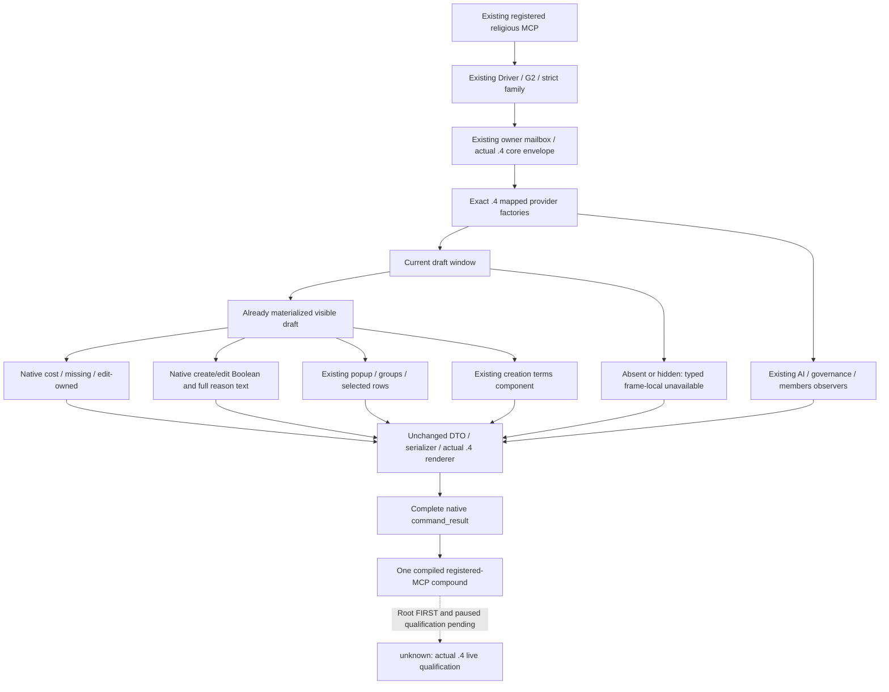

# Existing religion provider migration to CK3 1.20.0.4

This continuation restores existing adopted providers which the first narrow
`.4` package left unbound. The first package is frozen at
`1262d56385f3ae28cd0b4bb18528a57e971eff2c`; it covers current basic religion,
Doctrine knowledge and Tenet observations. It does not prove that every
previously enabled religious MCP has migrated.

The installed identity remains actual `1.20.0.4`, Steam build `25734779`, EXE
size `101040248` and retained SHA
`98702F88A547CDE2EAF29A85F93B85F68EE4CF8148336A4F7AFAEB75319DD518`.
No identity/hash or whole EXE read is repeated. This is source work; build,
FIRST, imports, SDK and game execution are Root-owned and **NOTRUN** here.

## Original coverage and the actual gap

The actual 117-option argv is retained at
`Z:/ck3_mod_rewrite_process_assets/g2-background-20261007/production-core-binding-inventory/adopted-mcp-coverage/ACTUAL-BUILD-ARGV-CACHE.json`.
The ON flags and registered tools are source evidence, not paused live proof.

| Existing provider | Original production construction | What must be restored |
| --- | --- | --- |
| Piety cost/missing/edit-owned | `religion_reform12002_query_runtime.cpp:225` assigns `BindRiteCreationCostsImage12002`; the reviewed `.3` handler supplies its accepted ABI hash | Exact `.4` three native getters and retained draft fields |
| Final create/edit eligibility and reason text | Runtime line226 assigns `BindEligibilityImage12002`, with native create/edit callbacks and reason CString destructor | Exact `.4` callbacks, command data roles and full reason output |
| Materialized popup and selected Doctrine gates | Runtime line227 assigns `BindCurrentDraftChoices12002` | Exact `.4` popup callbacks, definitions and materialized arrays |
| Creation terms | Old non-`.4` reform mailbox lines184–186 separately assigns `BindDraftCreationTermsImage12003` with actual descriptor SHA | Exact `.4` same adopted component and truthful conditional wire shape |
| Draft groups/Doctrine choices/Tenet choices | Three existing ON mailboxes construct reviewed native choices/source binders | Three typed `.4` factories/readers and unchanged MCP route |
| Base resource cost quote | Existing ON resource mailbox constructs window and cost bindings | Reuse the same mapped cost factory; no duplicated capture/provider |
| Native reform AI inputs | Existing ON AI mailbox constructs actual context/schedule bindings | Mapped `.4` existing context/schedule inputs and exact metadata |
| Rite governance/member collection | Existing ON mailboxes construct reviewed current governance/member binders | Mapped `.4` current roots/layout and exact metadata |

Thus these are previously enabled providers. An absent or hidden current draft
is a frame-local unavailable result; it does not establish that the provider
was never adopted. Calling all cost, eligibility, popup and creation components
"future" in the narrow package was imprecise. They are existing providers
awaiting migration. The separate unadopted `f9a` feature is excluded.

The cached historical `.3` Murchad reform packet
`resume-12003/religion-murchad-v10-01/012-ck3_query_player_religion_reform_context_v1.json`
has an existing hidden window and unavailable popup/selection with
`current_window_hidden`. It predates the later creation-terms injection. It
does not prove visible `.3` cost/terms availability and is not this run's sole
Robert29829 paused qualification. Historical R8 resource and R4 governance/
members packets explicitly identify `.2`; R9 AI's topic pins `.2` while its raw
packet lacks a game-version field. Their live credit stays with that build.
No independent `.3` visible sample is inferred from ON flags or `.2` evidence.

## Integration and qualification

The continuation uses separate owned cost/eligibility, draft and adopted-
observer leaves. The shared actual `.4` basic factory, Core APIs, identity,
schema renderer, knowledge and Tenet proofs are reused. The composed reform
factory connects its existing cost/eligibility/choices/creation-terms members
to those exact `.4` factories. Seven existing topic handlers select their
mapped `.4` branch; old `.2/.3` factories and reviewed hash gates stay intact.

The strict reform parser follows the actual published component: without
creation terms, 18 top keys/9 readiness fields; with creation terms, 19/10.
Actual `.4` identity alone does not fabricate that component. Ordered native
collections, duplicates, literal zero/false and full UTF-8 reasons remain
business values from the producer. Knowledge does not become final legality.

Three new producer targets prepare eight complete native packets: one visible
composite cost/reasons/terms, three draft routes and four observer routes.
All use synthetic memory/callbacks with the real actual `.4` adapter, owner
mailbox, readers, serializers and renderer. One new compiled consumer calls
the real registered MCP for all eight packets. Old successful scenes are not
requested again. The original seven basic fixture scenes keep explicit partial
synthetic bindings, avoiding calls into real image addresses from fake memory.

Shared entry/Root integration applies
`cmake/religion_adopted_observers_12004.cmake` after the runtime exists, registers
the seven unchanged executors and admits only the mapped steps. Root's actual
full-Snapshot composition and positive public revision publication remain
separate runtime foundations; synthetic revision701 is fixture data and core
revision0 is not private Driver reachability.

The external continuation packet is
`Z:/ck3_mod_rewrite_process_assets/g2-migration-20261007/faith-tenet/adopted-restoration-1262/`.
Its native-costs, python-coverage and observer-coverage ledgers retain all finite
reads, reused shared proofs, historical raw records and actual Oct7/W41 fields.
Readiness remains **research / source implemented candidate** until Root runs
the new FIRST and actual paused MCP checks. The user's full adopted-MCP
migration checklist must pass before G2 resumes.
