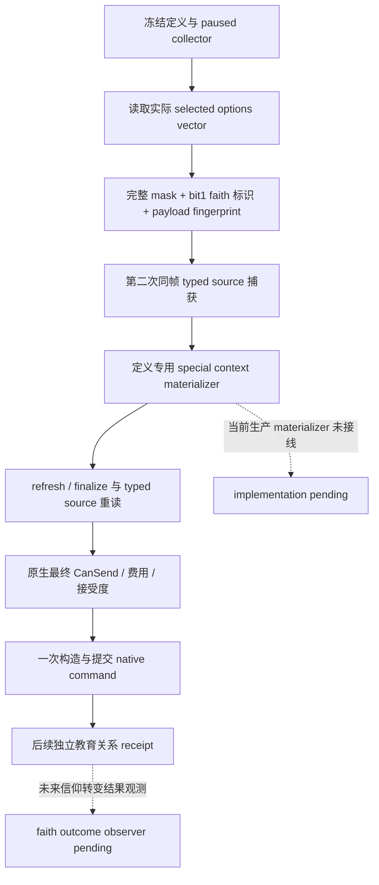

# 宗教全面授权后的原生实现边界（2026-10-02）

项目所有者于 2026-10-02 全面开放宗教研究、实现和实机验收。旧宗教暂缓及圣战/婚姻窄例外已撤销。这里记录本轮实际移除的原生权限原因和仍需施工的能力，罗贝尔唯一测试入口及战争执行开关维持原约束。

## 教育 `convert_faith` 的既有原生输入树

冻结教育 payload / proposal binder 的现有 ABI 是 **1.19.0.6**，EXE SHA `2D00FF3101EF70B566F2FCBAE292F09263199C80E9DC8F139B82D7D96F83DB86`。现运行 1.20.0.3 的 EXE SHA 为 `94B55397ABB687A3DCD436805A5D885E6BE90FA6C693FEB44A9E3BBEEADE02A6`。两个身份不能互换；本轮清理不会将旧 RVA 直接用于当前版本。

既有冻结源账本 `character_interaction_proposal_payload_source_extension_v1_abi.json` 的 `00_education_interactions.txt` SHA 为 `841CC160D73DD5C24519D3160FBA0D6098873904A736FDEB0B27781AF7393474`。三个教育定义的 authored option 顺序为 `convert_culture / convert_faith / university / hook`。生产 `ReadOptions` 读取原生 vector 的每一个实际字节，构造完整 mask，并以 bit 1 判断 `convert_faith`；已有 fingerprint 纳入完整 mask。此前只有两个项目权限分支阻止选中的 faith 选项，并把输出布尔值写死 false。

本轮撤销 source/action 的宗教权限拒绝，并传递真实 `religious_option_selected`。原有精确版本、身份、费用、接受度及 payload 重读检查继续生效。保留两个旧 failure enum 的 numeric slot 以兼容历史归档，但正常路径不再产生 `religious_option_deferred`。独立 receipt 目前验证教育关系；这不等于受教育者已改宗，不给 faith outcome 信用。

真实下一施工：将三个教育定义专用 collector/materializer 和 command copy/send 链迁移绑定到 1.20.0.3；在实际 paused Robert 候选上观测 mask、原生完整 CanSend 与 native dispatch；教育关系由现 receipt 验收，信仰转变另接角色当前 faith 的独立结果。生产 materializer 缺失仍给出 `special_context_materializer_unavailable`，旧 build 不匹配仍拒绝；两者均是实际实现缺口。

## 宗教政府

`holy_order_government`、`monastic_holy_order_government` 以及旧版 `theocracy_government` 的身份/原生 feature flag 观测已存在，专用 adapter 没有实现。本轮将原来的 `owner_deferred_religious` 状态改为 `religious_adapter_implementation_pending`，保留原 enum ordinal。原生产 reader 会在 `religious_identity_opaque=true` 时丢弃 collector 已提供的真实 flag；本轮移除此读取跳过。身份与 raw/applicable flag 现在正常投影，`core_adapter_ready=false`，不把没有 adapter 的政府当作 feudal/clan。旧 `religious_identity_opaque` 字段仅说明专用宗教行为尚未解读，不能再用来遮蔽已经观测的 flag。

真实下一施工：复用 `government_runtime_adapter_observer_v1.cpp` 的政府定义表和 `government_runtime_adapter_source_adapter_v1.cpp` 同帧 flag/DLC 输出，先冻结 1.20.0.3 的 holy-order、monastic 和头衔/雇佣最终规则，再按各政府实际需求补同一 MCP adapter 的输入与决策。旧文件名的 research JSON 仍由当前 verifier 使用，因此同步当前契约叙述，stock 与 EXE pin 不改。

## Phase 与 advantage

现有 phase operand 与 advantage constructor reader 绑定 1.20.0.2，并保留 15 个 constructor 来源。已读的 13 项不受此次授权变化影响；最后两项 `unreformed_faith_0/1` 的原生 predicate/effect 未采集，完整 phase 的宗教/rite operand 与 AST 也未闭合。旧 owner-deferred 原因改为 `phase_religion_and_rites_implementation_pending`、`religion_constructor_operand_implementation_pending` 和 `religion_constructor_sources_implementation_pending`。`available=false` 与完整模型 readiness 保持真实未实现；旧 ledger 的未应用 sentinel 不能被解释为原生零值。

真实下一施工：由 exact-build 宗教研究线程在 1.20.0.3 的 phase constructor 中闭合双方 commander/army owner 的 faith/rite 查询及 `unreformed_faith` predicate，定位所选规则 effect 与原生 append ledger；将两项真实值接入同一现有 constructor 账本。随后补宗教/rite AST sources，使用 actual paused Robert encounter 验收后再启用完整 phase；当前战争执行开关仍关闭。现有 `deferred_domains` 是旧 DTO 字段名，本轮仅将含义改为待实现域，不扩展 schema。

## 本轮验收与状态

现有当前构建的宗教观测路线由 [faith identity](religion-native-ai-faith-identity-12003.md)、[effect material](religion-native-ai-effect-material-12003.md)、[rite growth](religion-native-ai-rite-growth-12003.md) 与 [readonly plan](religion-native-ai-readonly-plan-12003.md) 维护。v20 现有宗教查询可供当前 `rite_growth.0010` 的实际精神满足度 pre/post 验收，此 gate 清理不是那条真实通知继续的先决条件。Python 撤禁同时移除 `fervor.1002` 与 `court_chaplain_task.0313` 的纯 owner 排除；两行缺少当前 definition/投影，仍为 `event_source_migration_pending`，可从正常 exact source collector 接 scope/outcome migration，不能称 available/live。

唯一外置 focused 验证已 **GREEN**：8 个实际生产 TU 使用严格 `/W4 /WX`；六项新行为覆盖三个教育定义的 mask 11、typed binder 重构/重读/提交接缝、独立教育关系 receipt、真实 materializer/version 缺口、宗教政府 raw flags 与未实现 adapter、15 项 advantage 和 phase 部分就绪。第一 attempt 的宏定义重复和 fixture serializer 参数缺失属于 harness RED，已保留；修复 harness 后只重编两项失败 TU，未重跑旧 ABI 或旧套件。没有 CK3、SDK、pipe、state 或窗口操作。官方 DLL 和实机采用由 ROOT 负责。状态为 `static-ready`，宗教授权本身不增加 G2、M2 或宗教 action 信用。测试结果与源 pins 见 `artifacts/g2-maintainer-2026-10-02/resume-12003/religion-native-authorization-cleanup/DELIVERY.json`。
