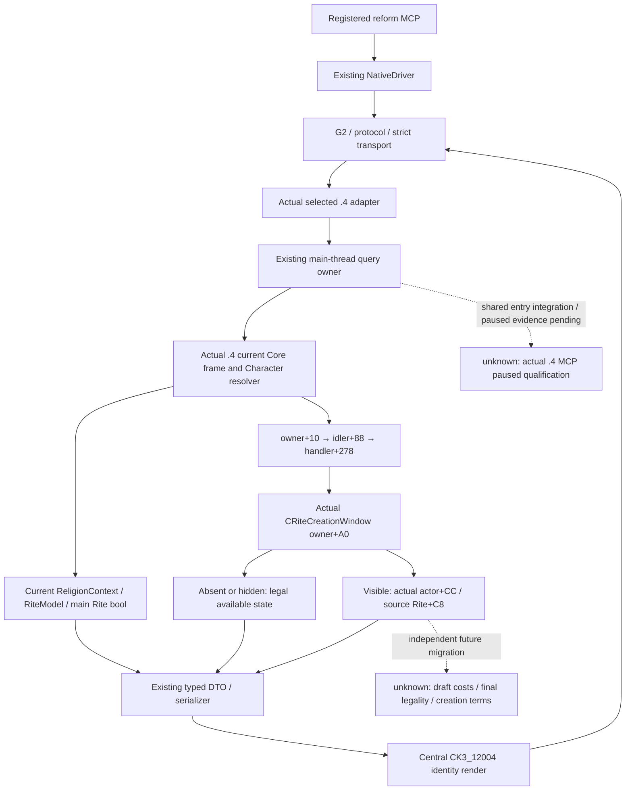

# CK3 1.20.0.4 basic religion observers migration

This packet restores the existing current religion, Rite, main Rite and current
reformation-window observations through the existing MCP family. It uses actual
.4 Core APIs and a narrow set of mapped native functions. Optional draft costs,
final legality, choices and creation terms have independent migration scopes.
Those existing adopted providers are restored by the subsequent
[provider continuation](religion-adopted-providers-12004-migration.md); calling
them future features here does not mean they were previously disabled. This
page records the frozen narrow `1262` package rather than total MCP migration.

The combined owned source now includes the exact `.4` religion profile/binder,
four existing topic mailbox branches, seven strict Python leaves and one new
seven-wire producer/registered-MCP consumer. It consumes central core-envelope
commit `6ba4132fa7a16d4a8c3af44716cf11c895e5a5b5`. Build, FIRST and paused
qualification are **NOTRUN** in this source packet; Root owns those runs.

Source baseline: `caa4adc3d1278e324cf4ec19774028e9b9138e28`. Work began at
2026-10-07 02:27:21 Asia/Shanghai. Installed Steam build `25734779` is confirmed
`1.20.0.4`, EXE size `101040248` bytes and existing freeze SHA-256
`98702F88A547CDE2EAF29A85F93B85F68EE4CF8148336A4F7AFAEB75319DD518`.
Both `.text` and `.rdata` changed. Old addresses are historical input; each new
binding below comes from retained exact paired instruction/data evidence.

## Actual source path and smallest shared hook

The registered `ck3_query_player_religion_reform_context_v1` directly calls
`NativeDriver.query_player_religion_reform_context_private_v1`:
`mcp_server.py:1931–1939`, `native_driver.py:3270–3279`. There is no Service
forwarder. The existing private step is
`query-player-religion-reform-context-v1`, with domain
`player_religion_reform_context_v1`. The strict transport, production protocol,
selected adapter, mailbox and existing DTO remain the same route.

At the frozen baseline, `ck3_12004_adapter.cpp:21–39` publishes only the
core-frame capability; `bridge.cpp:10937`, `11223`, `13597` install and dispatch
that actual .4 current-frame observer. `bridge.cpp:13968` and
`ck3_12002_nonwar_router.cpp:395,502–505` are the existing reform mailbox route.
Shared owners must connect that existing route to the .4 current owner/frame.
The old mailbox handler at `religion_reform12002_query_mailbox.cpp:154–167`
selects an old reviewed whole binder; it must select the narrow actual .4 binder.

The current reader is not enabled merely by changing an identity string.
`ck3_12002_religion_context.cpp:35–45`, `religion_reform12002_rite.cpp:18–28`
and `religion_reform12002_window.cpp:12–70` call legacy Core functions directly.
The migrated current readers must call `xar::ck3_12004::ReadCoreSnapshot` and
`ResolveCoreCharacter` from the actual .4 header/profile. Sharing old software
DTO types or serializers does not grant old native ABI bindings.

`ck3_12002_query_mailbox.cpp:53–59,110–125` currently assumes a reviewed .2/.3
owner and full `ReadSnapshot` at Capture/Finish. The shared entry owner supplies
the selected .4 current-owner frame to this existing envelope. Preserve actual
owner-pump epoch and before/after actor/date/frame checks. The existing standalone
core-frame revision `0` is not a fabricated complete gameplay revision. The .4
full `Snapshot` reader at `ck3_12002_adapter.cpp:124–126` remains independently
unavailable until its own migration. These religion binders do not read treasury,
domain, military or campaign inputs. The existing Driver still requires a fresh
positive published gameplay revision, so actual full-Snapshot composition and
publication remain a separate runtime dependency. Core revision0 does not make
the existing private MCP route independently reachable.

The central `CK3_12004` tuple already exists in `version_identity.py:33–37`.
Actual .4 adapter/render dispatch is in `ck3_12004_adapter.cpp:42–92`,
`ck3_12003_adapter.cpp:413–416` and `bridge.cpp:13146–13152`. Use those existing
identity and schema render paths. Do not expand the old whole-family SHA/version
alias in `ck3_12003_abi_profile.cpp:10–25`.

## Mapped direct current inputs

| Input | Historical .3 RVA | Actual .4 RVA | Evidence |
| --- | --- | --- | --- |
| Character Rite | 28D2F90 | 28D2F70 | Parent actor-map, reused |
| Character Faith | 289E750 | 289E730 | Parent actor-map, reused |
| Rite Faith | 24FC560 | 24FC540 | Complete61B leaf / actual operands |
| Faith Religion | 2443D40 | 2443D20 | Complete61B leaf / actual operands |
| Faith main Rite | 2444360 | 2444340 | Complete61B leaf / actual operands |
| Faith fervor | 243EA90 | 243EA70 | Signed64 native output / Faith+2F8 |
| Character spiritual fulfillment | 28BCE40 | 28BCE20 | Complete60B root / extension1C8+A0 / actual fallback edge |
| Faith tag | B801A0 | B801A0 | Complete8B leaf / Faith+E0 |
| Rite is main | 24F7E40 | 24F7E20 | Complete98B leaf / full identity relation |
| Rite divergence to main | 2BDFBA0 | 2BDFB80 | Complete280B root / actual relation and targets |
| Faith heresy threshold | 2440920 | 2440900 | Complete84B leaf / actual scalar RIP target and main Rite+7F8 |
| Faith is unreformed | 2BD8960 | 2BD8940 | Complete86B leaf / main Rite+8B0 native bool |
| Current window visibility | 21603A0 | 2160380 | Complete144B root / actual ordered control targets |

Full object references and storage geometry are retained by actual instruction
operands: object full identity `+08`, Character Rite reference `+B4`, Rite Faith
`+4B8`, Faith Religion `+8C`, Faith main Rite `+98`, storage array `+20`, count
`+2C`, entry stride `0x10`, entry object pointer `+08`. Parent owns the two
Character getters and shared Core/storage proof; those bodies were not reread.
Signed raw fixed-point outputs retain the existing `Q100000` DTO convention;
zero and native bool false remain literal values.

The finite mapper first uses cached runtime boundaries to generate candidates.
Complete instruction decode, retained non-relative immediates/member operands,
local topology and actual relative/RIP targets are then compared. Same runtime
ordinal or normalized equality alone does not grant semantic identity. Absolute
table/RVA operands were not blindly masked. This is direct source-use evidence;
it is not a claim that every transitive engine callee or gameplay action was
expanded and qualified.

## Actual window and manual field evidence

| Source-use | Actual .4 proof |
| --- | --- |
| Window construction | 14F21D0, complete1183B; publisher B07EE0 complete140B; root accessor B20140 complete191B |
| Window primary/secondary VT | 4565C40 / 4565C18; actual constructor RIP then COL/self/name CRiteCreationWindow, object offsets0/16 |
| Idler VT | 44BC418; actual ten-byte constructor RIP/install, COL/self/name CIngameInterfaceIdlerGfx |
| Handler VT | 44BA8A0; unique finite actual ordered prefix, COL/self/name CIngameInterfaceHandler |
| Window owner route | Jomini owner+10 → idler+88 → handler+278; window owner+A0 retained by actual instructions |
| Window actor/source Rite | C8/CC sentinel initialization at constructor+174; visible reader validates full actor/source Rite |
| Current Rite founder/head | Actual founder scope-link retains+4BC and Character scope type literal4; head getter retains+4C0 |
| Faith key | Native B801A0 returns Faith+E0 CString; separate from Religion definition key |
| Religion definition pointer | Actual retained CReligion+20 load; old returned+28 metadata accessor is never bound |
| Religion definition key | Actual SReligionType VT48D50D8, COL/self/name; typed virtual consumer3284160 adds+18 and uses native CString SSO/heap path |
| CString | Actual32B data-access function retains length+10, capacity+18, heap pointer+00 and SSO threshold0x10 |

The SReligionType consumer reads string length from definition `+28` at function
offset6, adds `+18` at offset16, checks CString capacity `+18` against `0x10` at
offset20 and loads the heap data pointer at offset27. This closes the actual
`CReligion+20 → SReligionType+18` source-use path. RTTI identifies the types and
subobject offsets; fields come from actual native operands. The old reflection
getter returning definition `+28` stays abandoned. Its unresolved reflection
label is not used to infer the migrated reader's type or key.

The actual CReligion primary VT is `4752F90`. Both named type proofs reuse the
retained table captures. Initial candidate generation correctly failed when a
neighboring RTTI qword lacked a function identity; the corrected first-method
candidate plus actual COL/type/self reused those bytes. No repeated EXE reads
were performed to correct that source interpretation.

## Same DTO and optional future branches

`religion_reform12002_query_runtime.cpp:17–51` reads current context, Rite model,
main Rite and window. At `52–80`, a visible actual window independently attempts
optional draft readers. At `81–100`, absent/hidden window state is legally
available and seeds the existing owner frame. Bind only the mapped current
functions and actual window metadata for the .4 basic query.

Existing disabled optional readers already return unavailable before invoking
missing callbacks: costs `60–68`, eligibility `91–97`, choices `126–128`,
selection `82–85`. A visible current window is still observed while these
families are unmigrated. Unavailable optional fields do not mean final illegal,
nor do current observations grant action readiness.

The base reform wire keeps its existing **18 top-level keys and 9 readiness
keys**. Current ready flags come from actual available current leaves. At
runtime `102–113,235–240,274–289`, creation terms and the extra readiness key
are conditional on the actual creation-terms binder. The .4 basic path keeps
that binder disabled and the base shape intact. Python's existing strict
normalizer accepts the central .4 tuple; it does not require the .3 creation
terms shape on this narrow .4 producer.

The same combined source also migrates the adopted Tenet current/main/personal/
effective, target/named queries, loaded knowledge catalogue and E0 learned/named
Doctrine queries. Their closed source ledgers are `tenet-map/SOURCE-READY.json`
and `doctrine-map/SOURCE-READY.json`; fixture and paused qualification remain
pending. E0 is Doctrine knowledge, while extra+C8 is Tenet knowledge. This
migration adds no new getter, catalogue, counter-policy or public query API.

The new native target/Ct is `xar_ck3_12004_religion_bindings_mailbox_test`, using
the real `.4` adapter factory, selected `.4` core callback, existing named owner
mailboxes, serializers and dedicated identity renderer. Seven complete native
`command_result` files cover absent/visible window, current Doctrines, duplicate
learned E0 order, named native false, combined target-Tenet/catalogue and current
Tenet-only shape. Synthetic memory/callbacks are explicit. One newly compiled
consumer calls the actual registered MCP seven times; no previous GREEN case is
requested. The native and sole consumer source is prepared, not executed.

## Qualification and retained outputs

Readiness is **research / source implemented**, not fixture-live or
production-live. The parent owns the religion topic source and isolated English
commit; the shared entry owner applies adapter/bridge/CMake hooks. Root performs
the actual build, targeted new FIRST and paused MCP qualification. This packet
ran no build, test, game, SDK, old FIRST or project import. Push is Root-owned.

The minimal paused plan uses the sole authorized Robert29829 original ordinary
campaign and existing registered MCP. First capture actual current inputs with
no draft; then capture an actual visible owner-matched window when present.
Verify exact .4 metadata, full actor/date/current frame/epoch and keys/raw values.
Current ready flags must become literal true from real reads. Legal absence is
literal absence; optional draft fields remain independently unavailable. There
is no gameplay action in this plan.

Retained external packet:

- `Z:/ck3_mod_rewrite_process_assets/g2-migration-20261007/faith-tenet/implementation-caa4/basic-map/BASIC-MAPPING-CLOSED.json`
- `.../reform/ACTUAL-RUNTIME-SOURCE-CACHE.json`
- `.../reform/SHARED-HOOK-RECIPE.json`
- `.../reform/MINIMAL-PAUSED-QUERY-PLAN.json`
- `.../reform/ROOT-DELIVERY.json` and `OCT7-W41-FIELDS.json`
- Sibling Doctrine `.../doctrine-map/SOURCE-READY.json` and parent actor `.../actor-map/FAMILY-MAP.json`, reused without repeated captures.

Actual cost: paired partial PE reads **4431 bytes / 67 calls**: new .4
**3429 bytes / 38 calls**, old .3 **1002 bytes / 29 calls**. Parent actor372B
is excluded. Exact cached metadata and runtime tables were reused; new metadata
reads, new `.pdata` reads, whole EXE reads and hash operations are all0. Execution
was `cmd.exe`, loginfalse, fullvenv Python `-B -X utf8`; the only imported helper
was the explicitly authorized standalone shared finite mapper/capstone, with no
project import. Receipts retain the initial256B/4call failed candidate attempt
and all cache reuse rather than presenting only successful reads.

Combined actor/basic/Doctrine/Tenet finite-read cost is **9250 bytes / 123 calls**:
old `.3` 3280B, actual `.4` 5970B. Every read is a declared bounded span after
cache lookup. Whole EXE/hash/new PE metadata/new `.pdata` operations remain0.
The parent delivery, exact commit, shared hook and FIRST recipes are sealed at
`.../implementation-caa4/ROOT-DELIVERY.json` and `ROOT-OCT7-W41-FIELDS.json`.
