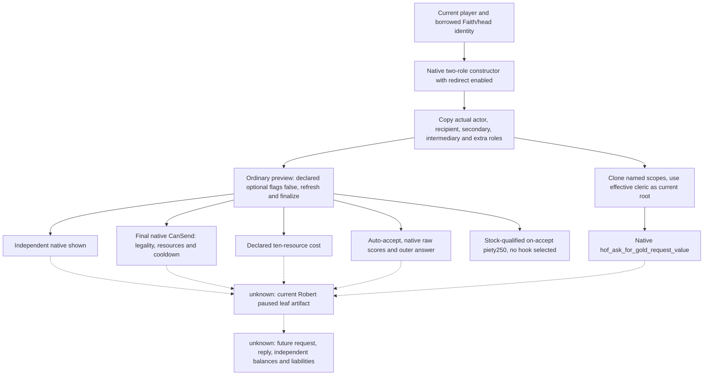

# Catholic clergy financial requests, CK3 1.20.0.3

Readiness: **research / exact stock tree and specific native construction inputs closed**. Robert `29829` is the only test entry; Catholic is ROOT's current baseline. This topic has made **no game query, interaction, letter acknowledgement, resource transfer, SDK build or shared source/Git edit**. It does not establish Robert's current shown/CanSend/quote/acceptance. Religion is fully authorized; the remaining dependency is the concrete readonly leaf described below.

Exact target is Steam `1.20.0.3`, build `25652598`, EXE SHA `94B55397ABB687A3DCD436805A5D885E6BE90FA6C693FEB44A9E3BBEEADE02A6`. Native/public source input is immutable `f30579bf6405e183192c96ea6b9bc35dddd11eec`, at `artifacts/g2-maintainer-2026-10-02/resume-12003/production-source-f30579bf`. The existing exact EXE freeze is reused; this task does not rehash it. External packet is `artifacts/g2-maintainer-2026-10-02/resume-12003/religion-head-of-faith-gold-12003/`.

## Primary route: Ask Head of Faith for Gold

`hof_ask_for_gold_interaction`, installed `common/character_interactions/00_religious_interactions.txt:6791..7152`, is a source-confirmed financial route. It exchanges a successful request for gold/treasury, normally charging piety on acceptance. Its actual paying cleric must be resolved through the interaction's redirect; Catholic alone does not prove that a request reaches the Pope.

A below-king actor who targets their religious head can be redirected to their chaplain's superior, or their own superior when the actor is a theocrat. A king or higher targeting a qualifying superior can be redirected to the spiritual head. The exact no-superior fallback can accept a duke-or-higher theocratic court chaplain. The shown tree checks a playable petitioner, spiritual head or clerical-region faith, non-ecclesiastical government, permitted religious-head/challenger/clergy recipient, same faith, and the applicable PAM antipope/challenger exclusions. `puppet_or_actor` is a native/scripted context input, not a field to replace with Robert by assumption.

The substantive validity checks include:

| Gate | Authored result |
|---|---|
| Recipient balance | Treasury when present, otherwise gold, must cover final Q |
| Religious/clergy receiver | The head/superior/theocratic-chaplain validation must pass |
| Actor piety | At least **250**, including when a hook is selected |
| PAM devotion | A secular actor needs devotion level at least3 or a theological-agent puppet; theocrat needs at least1 |
| Actor blockers | No excommunication, war with recipient, or promised pilgrimage; faith must be reformed; correct antipope/challenger route |
| Recipient cooldown | Declared **three years**, observed through the finalized native send validator |

Spiritual fulfillment and devotion level are separate inputs. Earlier governance screenshots/frames are not current piety, devotion, effective-recipient or cooldown observations. The stock `is_available` prefilters and shared AI-to-player anti-spam flags must not be applied to human Robert as extra restrictions.

### Final money and costs

The final quote is **`hof_ask_for_gold_request_value`**, at `common/script_values/01_dynamic_values.txt:351..355`. Its current root must be **the effective paying cleric**, with named `scope:actor=Robert` and `scope:recipient=that cleric` preserved from the finalized interaction context. Actor-only `head_of_faith_gold_value`, a prior holy-order loan quote, or a Python formula is not this final observation.

The stock algebra explains the dependency, without replacing native evaluation. Let era factor E be1 when culture is absent, otherwise0.75 before early medieval,1 in early,1.5 in high and3 in late medieval. Actor base B is `clamp(18 × monthly_character_income, 50, 1500 × E)` without actor treasury. With treasury it is `clamp(18 × monthly_character_treasury_variable_income, 150, 4500 × E × H)`, where H is2 only for a hegemony with culture, otherwise1. Final **Q=`max(50, min(B, 0.5 × effective_cleric_treasury_or_gold))`**. The final minimum follows the capacity cap: this is not an unconditional promise to spend at most half the cleric's balance.

The declared cost block contains influence only: **0 by default**, **60** with the qualifying influence option. The ordinary request's **250 piety debit is an on-accept effect**, not the generic declared cost vector. A valid selected hook consumes that hook and exempts the debit, while still requiring piety≥250 to send. Hook auto-accept is a distinct branch. An unselected hook must not be interpreted as a spent hook, and declared piety cost0 must not be described as a free request.

The smallest first leaf uses an explicitly ordinary request: all declared optional flags false in its disposable native context. It does not enumerate lenders, hooks, religions or alternative clerics. Hook/influence/pilgrimage variants can be later additions only when their real value warrants them; they are not required to deliver the ordinary request observation. Ordinary 250-piety consequence is **stock-qualified**, while shown, final CanSend, declared costs, Q and native acceptance are separately **native-qualified** once actually sampled.

### Acceptance and consequences

Base acceptance is **−40 score**. Ear of Clergy adds25 score, recipient→actor opinion is multiplied by0.5, and the included secular-to-ecclesiastical PAM factors can add a puppet benefit or apply secular, Rite, fulfillment and tenet penalties. Other stock inputs include recipient funds/greed, actor resources, traits/virtues/sins/devotion, relations/language, difficulty and selected options. These are score terms, not opinion points or probabilities. The complete pinned tree is in `stock/TERM-PROOF.md` and `TERM-PROOF.json`; do not manually sum a subset and call it the final answer.

Use the current effective cleric→Robert opinion when explaining the score. The existing explicit-target opinion query can supply that direction independently of an active Sway target. Church income and devotion are dependencies owned by their current work packages; this topic does not duplicate them. Native final evaluation can read those inputs directly from the same interaction context.

On acceptance, the interaction calls the real payment/piety-or-hook effect before `religious_interaction.3`. The letter then repeats effects **inside `show_as_tooltip` only**; acknowledgement does not pay again. Gold or treasury comes from the recipient's matching payment branch. Recipient AI applies−20 requested-money opinion toward the actor; qualifying zealot vassals receive−10 opinion for ten years. A sufficiently shrewd recipient can gain a favor hook over the actor under the pinned intrigue/personality conditions. Optional pilgrimage creates a ten-year promise with−25% monthly piety and blocks future requests while present. These liabilities are source facts, not current Robert outcomes.

On decline the recipient loses25 piety, and the refusal letter's major refusal-opinion effect is **AI actor only**. No actor250-piety debit appears on that decline path. The 1..5-day AI reply schedule does not prove that a particular request has been answered. This research performs no request and claims no financial gain or OODA loop.

Solid arrows describe source-confirmed construction/evaluation dependencies. Dashed arrows retain the unobserved current frame and future action boundary; they do not authorize stopping before the leaf is built.

## Exact native inputs and existing machinery

Existing `religion_rite_governance12002_head.hpp/cpp` already exposes Faith/main Rite/head title/head holder identities. The initial inventory found no exact `.3` full-span pin for the two Faith getters; the task immediately closed that concrete gap in `native/HEAD-GETTER-PROOF-12003.json` rather than leaving it as a permanent unknown:

| Exact getter | Full `.3` body | SHA-256 |
|---|---:|---|
| Faith religious head `0x2439E10` |125 bytes|`63b93a6b0be15fcdc9f7c741c94f4b3ed7cdb1dc51745d00c883ad9801bf5cd1`|
| Faith religious head title `0x2443FA0` |61 bytes|`b48cb7d3a424066f54316a90c5b1c03a9e0a4e9ad1dfab046498ada9aa0a2519`|

Both are `void* (Faith*)` returning borrowed native objects in RAX. Faith+0x300 supplies the full TitleID; the native title store requires full title ID equality at+0x10. Title+0x128 supplies the holder's full CharacterID; the character store requires full ID equality at+0x18. Native fallbacks do not establish a real head. Direct registration/thunk/reflection slices prove the getter role. **Reuse the existing heads schema and getter code**; no second identity framework is needed. Current values still need the new leaf's actual paused capture.

The current `.3` ABI reuse manifest already covers the existing Family/gift context machinery. Selected coverage is extracted once into `native/EXISTING-CONTEXT-PINS.json`; full original source pins are reused:

| Purpose | Existing exact entry/source |
|---|---|
| Loaded interaction definition | Getter`0x89DA60`, stable hash`0x3F7E240`, lookup`0xA055E0`; canonical key/full hash roundtrip like `ck3_12002_faction_gift.cpp` |
| Default roles and script redirect | `0x3076C90(ctx,def,actor,requestedHead,nullptr,true)`; booltrue calls role helper`0x3148DE0` |
| Context lifecycle | Refresh`0x3078A60`, finalize`0x3078C90`, destroy`0x30773A0`; disposable context0x338 bytes |
| Actual roles | Context actor+0x2D8, recipient+0x2DC, secondary+0x2E0/+0x2E4, intermediary+0x2E8, added role+0x2EC |
| Ordinary optional flags | Definition rows+0x2258/count+0x2264, stride0x730/flag+0x368; setter`0x30788E0` and readback`0x3078880` |
| Final sending | `0x307C040(context,nullptr)`; false is a valid sampled result |
| Final acceptance | Recipient raw`0x307C460`, intermediary raw`0x307C360`, native outer answer`0x307BC80` and existing auto-accept trigger/scalar |
| Declared costs | `0x310CEE0(definition+0x40,context+0x08,out80B)` returns **void**, writes ten fixed-point resource values |
| Final amount | Existing `ReadNamedInteractionFixedExact12002(module,context+8,effectiveRecipient,actor,effectiveRecipient,key,nativeHash,outRaw)` |

The two-role constructor's own exact proof is `native/TWO-ROLE-CONTEXT-PROOF-12003.json`: its sixth bool enables redirect, and it initializes secondary/intermediary defaults internally. It does not call the all-role overload `0x3076E50`. Do not manually copy marriage defaults or call redirect a second time. Read the effective roles from the constructed context and preserve them through the final evaluation.

The final-amount helper clones the prepared interaction scope, replaces its root with the effective cleric, and preserves named actor/recipient/puppet contexts. Its registry is the plain fixed-point value database getter`0xA07970`/lookup`0xA07830`, evaluator`0x37542F0`, with existing scope/source metadata/teardown. Reuse that helper. The actor-only loan helper cannot supply named scopes, and the scripted-modifier database is a different registry.

Independent shown is now exact closed in `native/SHOWN-PROOF.json`: **menu visibility wrapper`0x30796B0` is `bool(void* context)`**, with complete body`[0x30796B0,0x3079790)`. Its ordinary path calls shared native gate`0x307A860`, then evaluates definition+0xC88 and authored **is_shown at definition+0xD58**, each against context+8. An existing engine shortcut remains native-owned. The true UI caller redirects, refreshes, finalizes and calls this wrapper before entering the visible continuation. Use this full native visibility result as `is_shown`, independently of final CanSend. Parser builtin token/table, virtual-base offset, compiled destination and two real evaluation callers also pin authored+0xD58; do not substitute+0xAE8 or the validator. The finite proof reports12/12 byte/caller checks GREEN, **source-only**, without a Robert query or provider compilation.

The old generic `character_interaction_preview_v1` remains a private **1.19.0.6** core with a six-key allowlist excluding this request, without current `.3` wiring, shown, effective receiver or final proceeds. Editing its SHA/allowlist alone does not implement this leaf. The current specific machinery above supplies a smaller implementation seam.

## Smallest production leaf to build next

Implement one bounded `ck3_query_player_head_of_faith_gold_context_v1(expected_revision)` through the current religion opt-in, owner/main-thread mailbox, NativeDriver, existing service and MCP router. Actor is the current played character. Requested receiver is the current Faith head from the existing heads provider; native redirect determines the effective cleric. No arbitrary receiver list is required.

| Output group | Concrete construction and qualification |
|---|---|
| Frame and identity | Exact build/revision/date/epoch, current player, Faith/head source, requested and post-redirect recipient/full roles |
| Optional flags | Explicit ordinary request, all declared native flag selections false with readback; preserve named scopes |
| Shown | Independent `.3` native shown result, separate sampled/available flag |
| CanSend | Final native validator result including native cooldown; false is not an unavailable value |
| Declared costs | Ten-resource80B output with scale100000, marked declared/on-send only |
| Acceptance | Auto-accept, recipient/intermediary raw score and outer status; qualify AI versus human response semantics before exposing a `would_accept` interpretation |
| Gold proceeds | Native final Q for current effective cleric, using the exact named key and scopes, scale100000 |
| Acceptance consequences | Separate stock-qualified piety250 for ordinary request, no hook selected; source-qualified opinion/hook risks and actual execution timing |

Fields must retain their own sampled status. A definition/context/evaluator failure must not present early-return false/zero defaults as current legality, costs, acceptance or quote. The existing loan v25/v26 failures already established that lesson; do not rerun them. A completely observed negative ordinary request is useful: it identifies actual readiness, receiver, final Q and acceptance without sending anything.

The concrete external construction plan and source pins are in `native/READONLY-LEAF-PATCH-PLAN.md` and `DELIVERY.json`. ROOT remains sole shared source/Git/SDK/game owner. Implement and focus-test the new registered MCP→service→NativeDriver→main owner→native reader→production serializer path once, then capture one real paused Robert artifact. Only that changes this topic to **production-live primitive**; no current source proof, synthetic callback, schema or transport ACK counts as live. Any subsequent action must independently verify reply, resource balances and liabilities.

## Narrow reverse route: Seek Indulgences

`seek_indulgences_interaction` is a source-confirmed gold→piety route, with its own five-year recipient cooldown and capital-archbishop/head/landed-prelate/chaplain hierarchy. It requires central sacraments, permitted Rite and the valid clergy/faith/blocker tree. AI-only availability prefilters must not be applied to Robert. Exact narrow proof is `indulgence/STOCK-ALTERNATIVE.md`; this is not a second implemented capability or an action recommendation.

Its ordinary base fee is `max(0.25 × actor head_of_faith_gold_value,50)`; better-indulgences church phase then multiplies the result by0.75. Applicable criminal fee is added before the unconditional base, at2.5/2/1.5 times actor head-of-faith base for major/medium/minor priority branches. A trait-specific validity threshold alone does not prove combined affordability.

The authored ordinary reward is **100 piety**, or **200** in the better-indulgences phase, plus **10 spiritual fulfillment**. These are distinct from devotion level. Recipient AI can grant+25 pleased opinion; greedy/cynical actor can receive stress. Acceptance base75 and modifier terms are scores, not probabilities or a current result. Selecting pilgrimage or exploiting a financial cycle is outside this source-only leaf.

Here the interaction tooltip does not apply the effect: it triggers letter`religious_interaction.1010`, whose **immediate** pays and grants piety before acknowledgement. This timing differs from Ask Gold. No letter, payment or event was triggered by this research.

## Publication and continuing work

The research packet freezes exact stock and native construction inputs, closes the two missing head getters, and names the next native/MCP implementation with actual entry points. It does not stop at missing observations: ROOT's next work item is the specific ordinary-request leaf, followed by its one paused actual capture. Church income/devotion owners remain independent parallel dependencies; this task adds no war operations or global framework.

External `REPORT-FIELDS.json` supplies the daily/weekly ledger owner with readiness, source/artifact paths, absent tests/live/actions, closed getter gap and remaining implementation/capture work. Git/publication pins belong to ROOT's aggregate commit; this subagent makes no Git change.
