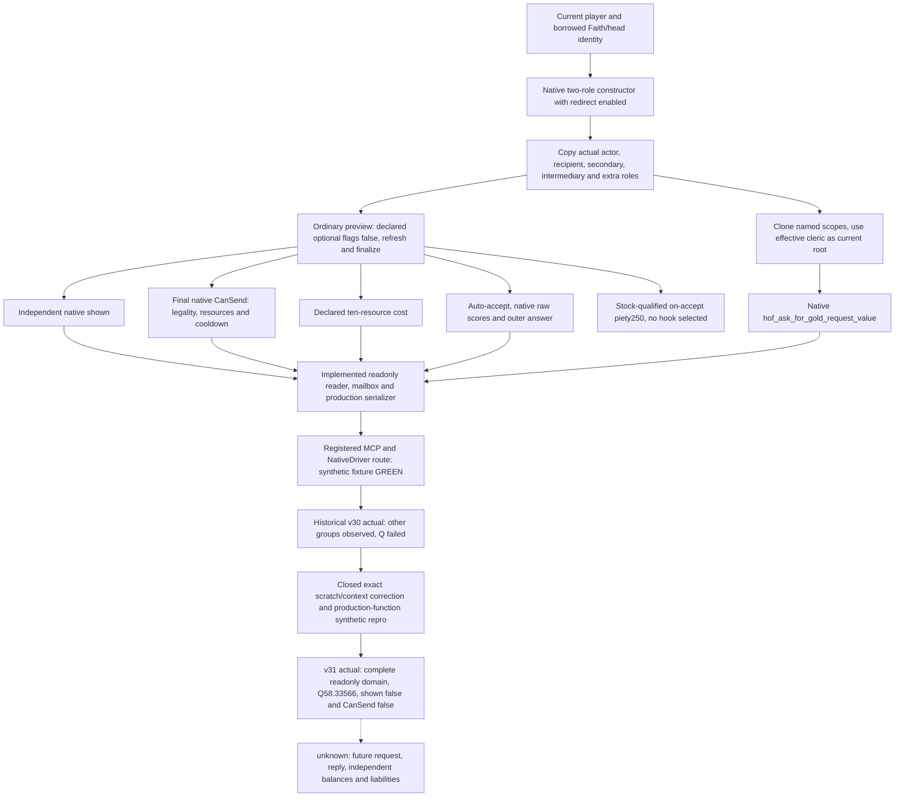

# Catholic clergy financial requests, CK3 1.20.0.3

Readiness: **production-live primitive / complete readonly ordinary HoF Gold context observed in v31**. Robert `29829` is the only test entry; Catholic is ROOT's current baseline. ROOT's one v31 registered paused query observed all groups, including native final Q raw `5833566` / scale `100000` = **58.33566 gold quote**, with overall `available=true` and status `observed`. Independent shown and final CanSend are both false, so the current ordinary route is skipped. This quote is not received money: no request, letter acknowledgement, payment, revenue or financial OODA loop was performed. The v30 actual amount failure and the intervening static production-function reproduction remain preserved. Religion is fully authorized; the concrete unavailable-amount fault is closed by actual recovery.

Exact target is Steam `1.20.0.3`, build `25652598`, EXE SHA `94B55397ABB687A3DCD436805A5D885E6BE90FA6C693FEB44A9E3BBEEADE02A6`. Research and the existing fixture inputs use immutable `f30579bf6405e183192c96ea6b9bc35dddd11eec`, at `artifacts/g2-maintainer-2026-10-02/resume-12003/production-source-f30579bf`. The implementation was rebased onto `d1b5b4c5583fa428d9226d4ebe4431e0c8db3579`; v30 actual source `3223af636a1b7807064046f1c8e38805c5732731` remains its failure input. Current v31 source/native/Python/environment is `db46311827eeffe24f5a093ecc9461e12c828b40`, frozen at `artifacts/g2-maintainer-2026-10-02/resume-12003/production-source-db463118`; actual prepared-environment SHA is `0a50491fa8f311d5abe36d341cfacfae635962bba9faa836ff032285eb8564a3`. The existing exact EXE freeze is reused; this task does not rehash it. External packet is `artifacts/g2-maintainer-2026-10-02/resume-12003/religion-head-of-faith-gold-12003/`.

## Primary route: Ask Head of Faith for Gold

`hof_ask_for_gold_interaction`, installed `common/character_interactions/00_religious_interactions.txt:6791..7152`, is a source-confirmed financial route. It exchanges a successful request for gold/treasury, normally charging piety on acceptance. Its actual paying cleric must be resolved through the interaction's redirect; Catholic alone does not prove that a request reaches the Pope.

A below-king actor who targets their religious head can be redirected to their chaplain's superior, or their own superior when the actor is a theocrat. A king or higher targeting a qualifying superior can be redirected to the spiritual head. The exact no-superior fallback can accept a duke-or-higher theocratic court chaplain. The shown tree checks a playable petitioner, spiritual head or clerical-region faith, non-ecclesiastical government, permitted religious-head/challenger/clergy recipient, same faith, and the applicable PAM antipope/challenger exclusions. `puppet_or_actor` is a native/scripted context input, not a field to replace with Robert by assumption.

The substantive validity checks include:

| Gate | Authored result |
|---|---|
| Recipient balance | Treasury when present, otherwise gold, must cover final Q |
| Religious/clergy receiver | The head/superior/theocratic-chaplain validation must pass |
| Actor piety | At least **250**, including when a hook is selected |
| PAM devotion | A secular actor needs devotion level at least3 or a theological-agent puppet; theocrat needs at least1 |
| Actor blockers | No excommunication, war with recipient, or promised pilgrimage; faith must be reformed; correct antipope/challenger route |
| Recipient cooldown | Declared **three years**, observed through the finalized native send validator |

Spiritual fulfillment and devotion level are separate inputs. Earlier governance screenshots/frames are not current piety, devotion, effective-recipient or cooldown observations. The stock `is_available` prefilters and shared AI-to-player anti-spam flags must not be applied to human Robert as extra restrictions.

### Final money and costs

The final quote is **`hof_ask_for_gold_request_value`**, at `common/script_values/01_dynamic_values.txt:351..355`. Its current root must be **the effective paying cleric**, with named `scope:actor=Robert` and `scope:recipient=that cleric` preserved from the finalized interaction context. Actor-only `head_of_faith_gold_value`, a prior holy-order loan quote, or a Python formula is not this final observation.

The stock algebra explains the dependency, without replacing native evaluation. Let era factor E be1 when culture is absent, otherwise0.75 before early medieval,1 in early,1.5 in high and3 in late medieval. Actor base B is `clamp(18 × monthly_character_income, 50, 1500 × E)` without actor treasury. With treasury it is `clamp(18 × monthly_character_treasury_variable_income, 150, 4500 × E × H)`, where H is2 only for a hegemony with culture, otherwise1. Final **Q=`max(50, min(B, 0.5 × effective_cleric_treasury_or_gold))`**. The final minimum follows the capacity cap: this is not an unconditional promise to spend at most half the cleric's balance.

The declared cost block contains influence only: **0 by default**, **60** with the qualifying influence option. The ordinary request's **250 piety debit is an on-accept effect**, not the generic declared cost vector. A valid selected hook consumes that hook and exempts the debit, while still requiring piety≥250 to send. Hook auto-accept is a distinct branch. An unselected hook must not be interpreted as a spent hook, and declared piety cost0 must not be described as a free request.

The smallest first leaf uses an explicitly ordinary request: all declared optional flags false in its disposable native context. It does not enumerate lenders, hooks, religions or alternative clerics. Hook/influence/pilgrimage variants can be later additions only when their real value warrants them; they are not required to deliver the ordinary request observation. Ordinary 250-piety consequence is **stock-qualified**, while shown, final CanSend, declared costs, Q and native acceptance are separately **native-qualified** once actually sampled.

### Acceptance and consequences

Base acceptance is **−40 score**. Ear of Clergy adds25 score, recipient→actor opinion is multiplied by0.5, and the included secular-to-ecclesiastical PAM factors can add a puppet benefit or apply secular, Rite, fulfillment and tenet penalties. Other stock inputs include recipient funds/greed, actor resources, traits/virtues/sins/devotion, relations/language, difficulty and selected options. These are score terms, not opinion points or probabilities. The complete pinned tree is in `stock/TERM-PROOF.md` and `TERM-PROOF.json`; do not manually sum a subset and call it the final answer.

Use the current effective cleric→Robert opinion when explaining the score. The existing explicit-target opinion query can supply that direction independently of an active Sway target. Church income and devotion are dependencies owned by their current work packages; this topic does not duplicate them. Native final evaluation can read those inputs directly from the same interaction context.

On acceptance, the interaction calls the real payment/piety-or-hook effect before `religious_interaction.3`. The letter then repeats effects **inside `show_as_tooltip` only**; acknowledgement does not pay again. Gold or treasury comes from the recipient's matching payment branch. Recipient AI applies−20 requested-money opinion toward the actor; qualifying zealot vassals receive−10 opinion for ten years. A sufficiently shrewd recipient can gain a favor hook over the actor under the pinned intrigue/personality conditions. Optional pilgrimage creates a ten-year promise with−25% monthly piety and blocks future requests while present. These liabilities are source facts, not current Robert outcomes.

On decline the recipient loses25 piety, and the refusal letter's major refusal-opinion effect is **AI actor only**. No actor250-piety debit appears on that decline path. The 1..5-day AI reply schedule does not prove that a particular request has been answered. This research performs no request and claims no financial gain or OODA loop.

Solid arrows describe source-confirmed dependencies, implementation, preserved failure/repair history and the independently observed complete v31 readonly domain. The dashed branch retains only the unperformed financial action/reply/balance loop. v30 transport GREEN remains distinct from its evaluator RED; v31 includes genuine amount recovery.

## Exact native inputs and existing machinery

Existing `religion_rite_governance12002_head.hpp/cpp` already exposes Faith/main Rite/head title/head holder identities. The initial inventory found no exact `.3` full-span pin for the two Faith getters; the task immediately closed that concrete gap in `native/HEAD-GETTER-PROOF-12003.json` rather than leaving it as a permanent unknown:

| Exact getter | Full `.3` body | SHA-256 |
|---|---:|---|
| Faith religious head `0x2439E10` |125 bytes|`63b93a6b0be15fcdc9f7c741c94f4b3ed7cdb1dc51745d00c883ad9801bf5cd1`|
| Faith religious head title `0x2443FA0` |61 bytes|`b48cb7d3a424066f54316a90c5b1c03a9e0a4e9ad1dfab046498ada9aa0a2519`|

Both are `void* (Faith*)` returning borrowed native objects in RAX. Faith+0x300 supplies the full TitleID; the native title store requires full title ID equality at+0x10. Title+0x128 supplies the holder's full CharacterID; the character store requires full ID equality at+0x18. Native fallbacks do not establish a real head. Direct registration/thunk/reflection slices prove the getter role. **Reuse the existing heads schema and getter code**; no second identity framework is needed. The v31 paused capture below supplies the current qualified head/role identities.

The current `.3` ABI reuse manifest already covers the existing Family/gift context machinery. Selected coverage is extracted once into `native/EXISTING-CONTEXT-PINS.json`; full original source pins are reused:

| Purpose | Existing exact entry/source |
|---|---|
| Loaded interaction definition | Getter`0x89DA60`, stable hash`0x3F7E240`, lookup`0xA055E0`; canonical key/full hash roundtrip like `ck3_12002_faction_gift.cpp` |
| Default roles and script redirect | `0x3076C90(ctx,def,actor,requestedHead,nullptr,true)`; booltrue calls role helper`0x3148DE0` |
| Context lifecycle | Refresh`0x3078A60`, finalize`0x3078C90`, destroy`0x30773A0`; disposable context0x338 bytes |
| Actual roles | Context actor+0x2D8, recipient+0x2DC, secondary+0x2E0/+0x2E4, intermediary+0x2E8, added role+0x2EC |
| Ordinary optional flags | Definition rows+0x2258/count+0x2264, stride0x730/flag+0x368; setter`0x30788E0` and readback`0x3078880` |
| Final sending | `0x307C040(context,nullptr)`; false is a valid sampled result |
| Final acceptance | Recipient raw`0x307C460`, intermediary raw`0x307C360`, native outer answer`0x307BC80` and existing auto-accept trigger/scalar |
| Declared costs | `0x310CEE0(definition+0x40,context+0x08,out80B)` returns **void**, writes ten fixed-point resource values |
| Final amount | Existing `ReadNamedInteractionFixedExact12002(module,context+8,effectiveRecipient,actor,effectiveRecipient,key,nativeHash,outRaw)` |

The two-role constructor's own exact proof is `native/TWO-ROLE-CONTEXT-PROOF-12003.json`: its sixth bool enables redirect, and it initializes secondary/intermediary defaults internally. It does not call the all-role overload `0x3076E50`. Do not manually copy marriage defaults or call redirect a second time. Read the effective roles from the constructed context and preserve them through the final evaluation.

The final-amount helper clones the prepared interaction scope, replaces its root with the effective cleric, and preserves named actor/recipient/puppet contexts. Its registry is the plain fixed-point value database getter`0xA07970`/lookup`0xA07830`, evaluator`0x37542F0`, with existing scope/source metadata/teardown. Reuse that helper. The actor-only loan helper cannot supply named scopes, and the scripted-modifier database is a different registry.

Independent shown is now exact closed in `native/SHOWN-PROOF.json`: **menu visibility wrapper`0x30796B0` is `bool(void* context)`**, with complete body`[0x30796B0,0x3079790)`. Its ordinary path calls shared native gate`0x307A860`, then evaluates definition+0xC88 and authored **is_shown at definition+0xD58**, each against context+8. An existing engine shortcut remains native-owned. The true UI caller redirects, refreshes, finalizes and calls this wrapper before entering the visible continuation. Use this full native visibility result as `is_shown`, independently of final CanSend. Parser builtin token/table, virtual-base offset, compiled destination and two real evaluation callers also pin authored+0xD58; do not substitute+0xAE8 or the validator. The finite proof reports12/12 byte/caller checks GREEN, **source-only**, without a Robert query or provider compilation.

The old generic `character_interaction_preview_v1` remains a private **1.19.0.6** core with a six-key allowlist excluding this request, without current `.3` wiring, shown, effective receiver or final proceeds. Editing its SHA/allowlist alone does not implement this leaf. The current specific machinery above supplies a smaller implementation seam.

## Implemented smallest production leaf

The external package implements one bounded `ck3_query_player_head_of_faith_gold_context_v1(expected_revision)` through the existing `allow_private_player_religion_context_query` opt-in, owner/main-thread mailbox, NativeDriver and registered MCP service. Actor is the current played character. Requested receiver is the current Faith head from the existing heads provider; native redirect determines the effective cleric. No arbitrary receiver list, new flag or service framework was added.

| Output group | Concrete construction and qualification |
|---|---|
| Frame and identity | Exact build/revision/date/epoch, current player, Faith/head source, requested and post-redirect recipient/full roles |
| Optional flags | Explicit ordinary request, all declared native flag selections false with readback; preserve named scopes |
| Shown | Independent `.3` native shown result, separate sampled/available flag |
| CanSend | Final native validator result including native cooldown; false is not an unavailable value |
| Declared costs | Ten-resource80B output with scale100000, marked declared/on-send only |
| Acceptance | Auto-accept, recipient/intermediary raw score and outer status; qualify AI versus human response semantics before exposing a `would_accept` interpretation |
| Gold proceeds | Native final Q for current effective cleric, using the exact named key and scopes, scale100000 |
| Acceptance consequences | Separate stock-qualified piety250 for ordinary request, no hook selected; source-qualified opinion/hook risks and actual execution timing |

Fields must retain their own sampled status. A definition/context/evaluator failure must not present early-return false/zero defaults as current legality, costs, acceptance or quote. The existing loan v25/v26 failures already established that lesson; do not rerun them. A completely observed negative ordinary request is useful: it identifies actual readiness, receiver, final Q and acceptance without sending anything.

The original construction inputs remain in `native/READONLY-LEAF-PATCH-PLAN.md` and the research `DELIVERY.json`. Completed implementation, exact source pins, preserved attempts and recovery are described below. ROOT remains sole shared source/Git/SDK/game owner. The v30 amount-evaluator failure led to a bounded helper correction, then ROOT's complete v31 paused body qualified this readonly leaf as **production-live primitive**. Source proof, synthetic callback, schema or transport ACK alone did not close the failure. Any subsequent action would require independent reply, resource balance and liability verification; this delivery performs no action.

### Implementation and existing verification receipts

All paths in this subsection are relative to the external topic packet. `IMPLEMENTATION/DELIVERY.json` freezes the completed 16-path package: six new files and ten modified existing files. Its combined patch SHA is `857aa70b5f61c0028fecf37b39e1a6b6d5671816cc21fe67915f9654b9316f49`. The new native context, mailbox and wire TUs use the existing religion compile opt-in; no action is exposed.

| Existing verification | Result and honest scope | Receipt |
|---|---|---|
| Production native reader and serializer fixture | GREEN synthetic callbacks; real production code emits the complete command-result envelope | `IMPLEMENTATION/fixture/attempt-02/native-command-result.json`, SHA `2d3a39a57d8bbe660ad40a3853f8e07c5cbabbfb419b57b93c26abe6fbe5207a` |
| New production mailbox source object | GREEN strict MSVC `/std:c++20 /W4 /WX` compilation; no game contact | `IMPLEMENTATION/GLUE-PROJECTION/mailbox-object-build/result.json`; object SHA `44dfe79860966f26d05fd3f3d563828a758749f001edd3e81bba74132d0d652e` |
| Registered service → NativeDriver → private transport → existing protocol ingest/wait | GREEN, one tool call consumes the unchanged native envelope; no Python-invented wire or real CK3 query | `IMPLEMENTATION/REGISTERED-SERVICE-ATTEMPT02.json` |

The native/registered fixtures distinguish requested head `501` from effective cleric `777`, retain actor `29829` and secondary recipient `888`, and evaluate Q with root/recipient `777` and named actor `29829`. Their synthetic quote is raw `12345000`, scale `100000`; shown is true while final CanSend is false. Declared costs are all zero while the ordinary acceptance consequence remains separately **stock-qualified** piety raw `25000000` (=250). This demonstrates routing, role/scope preservation and fee qualification; none of these values are Robert observations. No test-case total is inferred from these receipts.

Historical attempts remain intact. Native `fixture/attempt-01` was harness RED for the fixture's optional unsigned-ID versus signed-ID comparison under `/WX`; the production reader/wire objects were already GREEN. `attempt-02` fixed the fixture comparison and reused those objects. `IMPLEMENTATION/REGISTERED-SERVICE-RESULT.json` retains the first route RED: the adapter expected null success reasons while the production serializer emits `"none"`. The adapter was corrected to accept the existing native success convention, and `REGISTERED-SERVICE-ATTEMPT02.json` is the GREEN route receipt. These are historical harness/adapter failures, not real-game capability failures, and were not rerun during rebase or this documentation update.

The file-only d1 rebase is frozen by `IMPLEMENTATION/REBASE-d1b5b4c5/DELIVERY.json`, SHA `968d37319d903062b02e57ac68706b06891243579cca9237c2c14c1ffdcc1c15`. Its `rebased.patch` is 54,980 bytes, SHA `fd2817dd3e1a4aaca62e727cad4f718f1b0bc03264727f6cf064db10668adcd0`. The directory includes `sourcepaths.txt`, `SOURCE-BEFORE.json`, `PROJECTED-PINS.json`, `SOURCE-PINS.json`, `REBASE-METADATA.json` and `ROOT-PROJECTION`. All six added files retain their previously verified hashes. The CMake context adaptation retains v29 pilgrimage, confession and church-income TUs, inserts the existing HoF context/mailbox/wire TUs, and changes no compilation flag. This was patch adaptation only: no test, build, ABI research, SDK session, live query or canonical source/Git operation was performed.

### v30 actual partial result and continuing amount repair

ROOT published and froze `3223af636a1b7807064046f1c8e38805c5732731`, then executed one registered query while Robert `29829` was paused in new PID `57484`. Actual date is raw `53234568`, public revision `2`, native revision `4`, epoch `16477`. The transport helper exited0/GREEN and the call closed; the domain is **CAPABILITY PARTIAL**, with its required quote **RED**. This failure is retained at `artifacts/g2-maintainer-2026-10-02/resume-12003/actual-v30-head-of-faith-gold-01/`: `result.json`, `001-ck3_query_player_head_of_faith_gold_context_v1.json` and `native-wire.jsonl`.

| Actual group | Sampled result and qualification |
|---|---|
| Identity | Actor `29829`, Rite/main Rite `152`, Faith `23`, head title `4`; requested and effective recipient both `29097`, so this frame had no recipient redirect |
| Ordinary options | Three declared options, selected count0, all unselected |
| Independent shown and final CanSend | Both available and false; these are real negative observations, not early-return defaults |
| Declared costs | All ten raw values0, independently available, on-send only; does not remove the separate stock-qualified on-accept250-piety consequence |
| Acceptance | Auto-accept false; recipient raw `-14900000` (=−149 score), intermediary raw `10000000` (=100 score), outer status2; raw intermediary evaluation does not prove an intermediary character exists (`intermediary_id=-1`) or authorize sending |
| Final Q | **Unavailable**: `amount_raw=null`, reason `gold_value_evaluation_unavailable`, root/recipient `29097`, named actor `29829`, key `hof_ask_for_gold_request_value` |
| Overall domain | `available=false`, `unavailable_reason=one_or_more_samples_unavailable`, normalized status `unavailable`; transport GREEN is not evaluator GREEN |

The initial/final frozen helper frame remained paused with no request or pending interaction introduced. Hidden shown plus false CanSend is not an executable request. No quote can be inferred from the actor's income, cleric identity, prior loan result, a formula or synthetic fixture. The real amount gap is not being left as permanent null: the next offline work compares this exact production call with the already closed reusable named-interaction scope clone/parser/evaluator chain, then provides the smallest external correction and one necessary production-path reproduction before ROOT's v31 actual verification. Existing ABI/getter and old fixture evidence are reused; this doc update itself performs no game/SDK/Git operation or test rerun.

**v31 amount fix static addendum:** that bounded offline repair is now complete and ROOT has applied its frozen single-file patch. Only `ck3_12002_gift_opinion.cpp` changed: native-shaped contiguous0x3D8 scratch, second constructor at+0x128, scratch scope pointer at+0x3D0, and evaluation-context scope pointers at0/+8/+0x10; named-scope clone, plain registry/type, key, effective root, DTO and routing are preserved. One new deterministic reproduction directly compiled the old production helper, then only the repaired helper with the same fixture object. Old construction returnedfalse with the missing context+8 scope pointer; corrected construction returnedtrue with synthetic rawQ12345000 and two evaluator calls. Both strict `/W4 /WX` compilations passed. `ACTUAL-V30-AMOUNT-FIX/ABI-EVAL/DELIVERY.json` (SHA `b214dde812a4a3997aea3b786d37b246fe69538493c574d1bd466adfe238f7e8`) pins the patch, existing exact ABI inputs and `repro-attempt-01/RESULT.json`. This is **static-ready production-function reproduction with synthetic callbacks**, not an actual amount result. The v30 generic false did not identify its first internal failing branch; the historical partial/RED attempt remains intact. No old fixture, full suite, ABI scan, SDK or game query was rerun. **The next required closure is ROOT's one v31 paused actual query.**

### v31 actual recovery: complete readonly primitive

ROOT's one new registered query is CLOSED with helper EXIT0/GREEN at `artifacts/g2-maintainer-2026-10-02/resume-12003/actual-v31-head-of-faith-gold-recovery-01/`. Its actual native body has overall `available=true`, reason `none` and normalized status `observed`. PID is `97992`, date raw `53235480`, public revision2/native revision4, snapshot `native:4`, capture epoch `16267`. Every native sample group is available; ordinary on-accept piety remains separately stock-qualified.

| Actual group | v31 sampled result |
|---|---|
| Identity | Actor `29829`, Rite/main Rite `152`, Faith `23`, head title `4`; requested/effective recipient and amount root all `29097`; no redirect in this frame |
| Ordinary options | Three declared flags, selected count0, all unselected |
| Independent shown / final CanSend | Both available and false; a complete negative route observation, not a failed read or an executable request |
| Declared costs | Ten available raw zeros, on-send only; separate stock-qualified on-accept piety250 remains a potential consequence |
| Native acceptance | Auto-accept false; recipient raw `-14900000` (=−149 score), intermediary raw `10000000` (=100 score), outer status2; intermediary ID−1 still does not identify a character or prove acceptance |
| Final Q | Available, raw `5833566`, scale `100000`: **58.33566 gold quote**. Key `hof_ask_for_gold_request_value`; current root/recipient `29097`, named actor `29829` |

Initial and final helper frames stayed paused at the same date/revisions, with no active event or pending interaction, and piety raw `37101250` unchanged. This artifact observes a price/proceeds preview; it records **no request, receipt of gold, debit, paid fee, income/revenue outcome or OODA loop**. Its independent visible value is a fully observed reason to skip the current ordinary financial route: shown and final CanSend are false. The unavailable amount is no longer an active observation blocker.

The real v30 amount fault is closed by this complete v31 recovery. The two artifacts are **not a same-frame A/B test**: raw dates differ by912 (=38 game days), PID and published source/environment changed, and the v30 generic failed sample never exposed its first internal false-return branch. The intervening deterministic production-function reproduction proves the corrected construction contract; it is retained separately from the two actual attempts. No prior test, actual query or ABI check was repeated for this recovery documentation.

`ACTUAL-V31-RECOVERY/ACTUAL-V31-COMPACT.json`, `REPORT-FIELDS.json` and `DELIVERY.json` preserve the one extracted actual body, original helper/native-wire pins, current source/environment/frame identities, readiness and publication fields. The complete tool artifact SHA is `21e01f51cc6726d517a36b4741cc0983cccf75a793f241f180f87a0231f7eed1`; native wire SHA is `41ecf333574708a0cfe9e46067f04ebe8ea6e0f5ed4a068f8552d7b9d00d835e`. ROOT owns aggregate Git publication.

## Narrow reverse route: Seek Indulgences

`seek_indulgences_interaction` is a source-confirmed gold→piety route, with its own five-year overall interaction cooldown and capital-archbishop/head/landed-prelate/chaplain hierarchy. It requires central sacraments, permitted Rite and the valid clergy/faith/blocker tree, including not being excommunicated. AI-only availability prefilters must not be applied to Robert. Exact narrow proof is `indulgence/STOCK-ALTERNATIVE.md`; the [2026-10-06 final-terms leaf](religion-seek-indulgences-final-terms-12003.md) records the corrected cooldown scope and source-prepared read-only query. Its build, FIRST and live qualification remain NOT RUN; this is not an action recommendation.

Its ordinary base fee is `max(0.25 × actor head_of_faith_gold_value,50)`; better-indulgences church phase then multiplies the result by0.75. Applicable criminal fee is added before the unconditional base, at2.5/2/1.5 times actor head-of-faith base for major/medium/minor priority branches. A trait-specific validity threshold alone does not prove combined affordability.

The authored ordinary reward is **100 piety**, or **200** in the better-indulgences phase, plus **10 spiritual fulfillment**. These are distinct from devotion level. Recipient AI can grant+25 pleased opinion; greedy/cynical actor can receive stress. Acceptance base75 and modifier terms are scores, not probabilities or a current result. Selecting pilgrimage or exploiting a financial cycle is outside this source-only leaf.

Here the interaction tooltip does not apply the effect: it triggers letter`religious_interaction.1010`, whose **immediate** pays and grants piety before acknowledgement. This timing differs from Ask Gold. No letter, payment or event was triggered by this research.

## Publication and continuing work

The research packet freezes exact stock and native construction inputs and closes the two missing head getters. The ordinary-request native/MCP leaf is implemented and published by ROOT, with existing GREEN verification receipts, a preserved v30 actual amount failure, its minimal scratch/context correction and a complete v31 actual recovery. This readonly work package is delivered as **production-live primitive**. Current shown/CanSend false provides a useful skip result; there is no need for another query or audit to close this fault. Any future action work is a separate request/reply/resource loop, not a claim made here. Church income/devotion owners remain independent dependencies; this task adds no war operations or global framework.

External research `REPORT-FIELDS.json` retains the original source-only delivery facts; implementation and v30 failure/fix receipts retain their historical qualifiers. `ACTUAL-V31-RECOVERY/REPORT-FIELDS.json` and `DELIVERY.json` provide the current daily/weekly increment: **production-live primitive**, complete readonly context, amount recovered, useful current negative route. Production-live loop and general financial capability complete remain unclaimed. Git/publication pins belong to ROOT's aggregate commit; this subagent makes no Git change.
