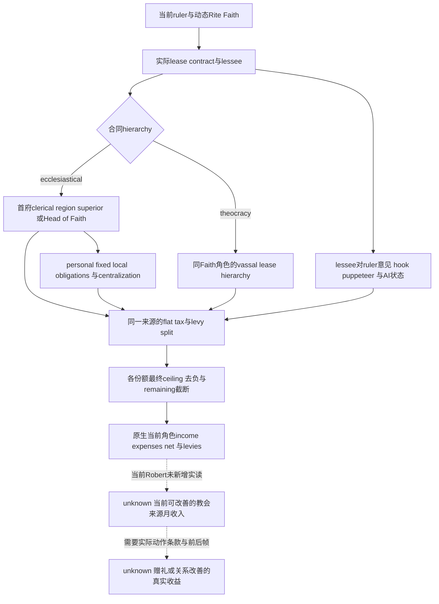

# 1.20.0.3 教会租约、意见与罗贝尔的实际经济输入

本页是 2026-10-03 的 **research / file-only** 增量，服务罗贝尔29829当前封建本世的经济决策。新版原版已把基督教教会租约指定为 `ecclesiastical_lease`，采用教区层级；世俗统治者的 authored 最高税份额是25%，实际份额还受教会情势的 personal／fixed obligations、local secular power、现任 lessee 的意见与 override 影响。不能把旧版“提高祭司意见即可获得固定比例税收”的记忆直接写入策略。本页闭合当前原生数值 getter，下一最小施工先取得玩家本人教会来源的当前／最高月收入；没有实机新收入、任命、赠礼或收益结论。

复用[经济建造树](domain-construction-ai.md)、[province 原始收入的边界](domain-construction-province-income-raw-c97.md)、[议会与发展](council-and-development.md)、[realm-priest 原生树](religion-realm-priest-council-native-ai-12003.md)、[神职任免](religion-clergy-council-native-ai-12003.md)、[宗教治理与意见](religion-governance-opinion-native-ai-12003.md)及[ReligiousRelations 价值](religious-relations-task-value-native-ai-12003.md)。现有RR任务月贡献0.45、最终总月piety0.4375、较早祭司56513→罗贝尔总意见+10仍归各自原帧，未重查，也不把旧+10冒充本页的新税收输入。

## Exact build 与来源

CK3 **1.20.0.3**，Steam build **25652598**，EXE SHA-256 `94B55397ABB687A3DCD436805A5D885E6BE90FA6C693FEB44A9E3BBEEADE02A6`。只读使用已冻结的 `artifacts/migrations/2026-10-02/installed-build/binaries/ck3.exe`；stock来自本机 `Z:/SteamLibrary/steamapps/common/Crusader Kings III/game/`。本页RVA均相对这个EXE。所有新行窗、字节窗口、反射注册及结果字段冻结在[研究包](../../artifacts/g2-maintainer-2026-10-02/resume-12003/religion-church-income-12003/REPORT-FIELDS.json)。

| 原版输入 | SHA-256 | 本页消费范围 |
| --- | --- | --- |
| `common/lease_contracts/00_theocracy_lease.txt` | `c288a020dfde842e980f1e35d4b4f34cd2ba64588e9e0810583b9ec5bf7309d5` | 1–324，两种租约及tax／levy各份额 |
| `common/lease_contracts/_lease_contracts.info` | `c2dbadd8129ec01704e7620509e07e40027b4e035841f1c5776d352cb2da210d` | 层级、默认值、scope、flat split／ceiling／truncation说明 |
| `common/scripted_triggers/00_councillor_triggers.txt` | `350a5e375d73e38cdd659fc3221fe8395ad6650b3fd244e03ee2342afc9a8f88` | 197–209，endorse override |
| `common/religion/religion_types/00_christianity.txt` | `d3f521850ab6aa7643bbb4e5c644ac5a70b8e5a8d1184a20aee7f9a509a9ae02` | 1–16，ecclesiastical government／lease与基础教义 |
| `common/religion/doctrine_types/20_doctrines.txt` | `ff663a8f6c5233628dbf6774b28412b918338fec823fe0f534c4cd03c8580504` | 1110–1170，temporal lease／lay direct ownership |
| `gui/window_council.gui` | `19a3a611974314ad5648c2821ac15a6068db8509176dcc1fab8c44188373e60d` | 1036–1044，动态lessee与独立approval显示 |
| `localization/english/gui/character_window_l_english.yml` | `f3d139c6cc7417c9d0ea8f38ecb1c0bea01097da43bc90d0615d3a3bec637518` | 174–184，current／maximum income与levies、net、breakdowns |

原文件大小、完整excerpt pins及其余holding／government输入见[STOCK-PINS](../../artifacts/g2-maintainer-2026-10-02/resume-12003/religion-church-income-12003/STOCK-PINS.json)。使用作者的实际数字和scope；`theocracy_lease`税分支旁“除以200”的注释与代码 `divide=400`矛盾，以实际400为准。

## 原版租约与经济树

`theocracy_lease`采用普通vassal hierarchy；`ecclesiastical_lease`采用 `clerical_region`。两者都从当前ruler的 `cp:councillor_court_chaplain`寻找lessee，并针对 `church_holding` 自动出租，ruler Rite须为 `doctrine_theocracy_temporal`。基督教religion details指定后者；当前faith／Rite身份本身仍不能证明罗贝尔拥有多少实际lease或当前教区收款人。Lay clergy的直接ownership不能套用lease计算。

教区层级下，lessee向其ruler首府所属clerical-region title holder上缴；没有该holder时，可能继续流向Head of Faith。普通vassal层级则沿符合条件的角色逐层流动，同Faith筛选可以跳过中间角色。两者有不同的有效ruler／barony条件，不能把“直属政治领主”自动当成宗教superior。

`_lease_contracts.info`说明tax是同一个全额来源的flat split：lease_liege、top_lease_liege_direct与ruler分别领取，lessee保留剩余；负份额按零，合计大于1时依上述顺序截断。`<share>_max`是最终ceiling兼UI“up to”来源；数值块内 `max` 是当前位置的上限操作。原生 `0x31BF920` 实际对请求份额与remaining分别去负，并将超出remaining的值压至remaining，与说明对应。不能写成“先减上级税，再对余额乘ruler百分比”。

基督教 `ecclesiastical_lease.tax_split.ruler` 的源顺序如下。

| 按源顺序执行的分支 | Authored 贡献 | 必需实际输入 |
| --- | --- | --- |
| 初值 | 0 | 当前实际lease contract |
| override成立，且ruler有personal obligations或不在该情势participant group | +0.25 | ruler→lessee strong hook或lessee puppeteer override，当前情势参数／合法缺席 |
| 上分支未走；lessee是AI且override不成立，ruler有personal obligations或无情势group | lessee→ruler opinion／400 | opinion方向、lessee AI状态、上述同帧参数 |
| 上两分支未走；ruler有fixed obligations | +0.15 | 当前fixed参数，不把personal与fixed当成独立累加 |
| 后续独立 `if`：ruler有local secular power | +0.10 | 当前local参数；该分支可以与此前分支叠加 |
| 当前总值大于0.25时运行带desc的 `max=0.25`；另有 `ruler_max=0.25` | 上限0.25 | 最终native evaluated share，不能把上限直接当成实际份额 |

`court_chaplain_endorse_override_trigger`不只有strong hook：有 `scope:ruler` 时，ruler持有lessee强hook **或** lessee的puppeteer等于ruler；无该scope则检查lessee的liege关系。不能把此trigger只命名为“持强hook”，也不能把它等同于approval final bool。

基督教上级税份额另走minimal 0.05／mild 0.10（含无情势group默认）／strong 0.20的互斥分支。无地local bishop、top superior正是收款方且其liege首府无clerical region时，当前位置上限压至0.001。强centralization还向top lease liege直接支付0.01。这些是上级份额，不能混成罗贝尔本人税收益。普通 `theocracy_lease` 的lease_liege tax0.25及ruler分支另存原源，不照搬Christian情势输入。

两种合同levy的lease_liege authored份额均0.15、ruler ceiling均0.50。普通合同以override取0.50，否则opinion／200，末尾上限0.50；Christian合同以ruler强hook **或fixed obligations** 取0.50，否则opinion／200再上限0.50。Christian levy分支没有复用tax中的puppeteer override trigger。最终军队征召可用人数仍须读取原生consumer；模板说明中的旧“只能0或100”注释不能覆盖同文件实际0.15／0.50定义，也不据此推断新引擎的分配单位。

该图是原生经济计算／scope树。当前没有找到并证明“原生AI主动选择给祭司送礼／Sway以提高此税收”的调度或最终utility caller，不能把上述公式画成已经闭合的AI自动动作策略。

## Exact native getters与receiver

编译器在早期反射注册函数逐段复制名称文字，不能只按 `lea` 字符串引用搜。冻结的[Character registration references](../../artifacts/g2-maintainer-2026-10-02/resume-12003/religion-church-income-12003/CHARACTER-REGISTRATION-REFERENCES.json)记录有界 `0x1000..0x200000` 文字复制指令；随后从对应注册体读取实际callback，再沿callback闭合原生数值consumer。

| GUI名称 | 注册体 → callback → numeric consumer | 独立含义与返回 |
| --- | --- | --- |
| `GetIncomeFromTheocraticLease` | `0x98380 → 0xD03F60 → 0x2642320` | 指定Character的当前教会租约来源月income，int64 CFixedPoint输出 |
| `GetMaxIncomeFromTheocraticLease` | `0x98570 → 0xD04000 → 0x2642320` | 同getter，第四实参 `r9b=1`，原生highest possible income路径 |
| `GetExpensesFromTheocraticLease` | `0x98680 → 0xD04050 → 0x2642710` | consumer产出expense；UI callback再取负号，不能把消费层正数与展示层负数混用 |
| `GetBalanceFromTheocraticLease` | `0x98890 → 0xD04100 → 0x2642320 / 0x2642710` | callback实际income减expense，net与gross独立 |
| `GetNumTitlesFromTheocraticLease` | `0x98270 → 0xD03F20 → 0xD02580` | uint32／int32计数，无Q缩放；先解析court／liege context，再取其leased title vector，仅计 `Title+0x130`置位行 |
| `TheocraticLesseeHasApprovalStatus` | `0x97F80 → 0xD03E30 → 0xD020C0` | 独立bool；callback取incumbent的court／liege context，再检查实际lessee匹配和contract approval-status flag |
| `TheocraticLesseeApprovesOfLiege` | `0x98070 → 0xD03E90 → 0xD02190 → 0x31C1470` | 独立finalbool，contract、lessee、ruler、nullable tooltip的原生最终判断 |
| `GetLeviesFromTheocraticLease` | `0x98C00 → 0xD041E0 → 0xD02D70` | int32实际当前levies，经原生临时vector／`0x2646D20`／`0x2C10B80`计算，不拿税raw去缩放 |
| `GetMaxLeviesFromTheocraticLease` | `0x98DF0 → 0xD04270 → 0xD02E40` | 原生可能的levy ceiling；从同vector读取自己的有效来源，不等于当前兵数 |

`0x2642320`直接ABI在GUI caller已闭合为 `int64_t* (int64_t* out, Character* receiver, bool third=false, bool maximum=false, nullable fifth_breakdown=nullptr)`。当前与maximum caller均明确清零third和fifth；不能根据名称猜第三参数或构造breakdown对象。函数将最终int64写到调用者的output并返回同地址，数值链使用 `0x186A0=100000` 的CFixedPoint乘除；输出按 **Q100000 gold／month** 发布。`0x9DAE50`把这个真实int64直接送进GUI数值对象，没有float重算。由于pdata将此函数拆成多个区域，完整新字节窗采用 `0x2642320..0x2642705` 的明确边界，不能只拿第一31-byte prolog当成完整函数证明。

receiver必须写进字段合同。Income／max／balance要以当前played **owner29829**作为receiver，得到玩家自己的教会来源账项；对56513调用同函数得到的是该lessee的账项，不能以它代替罗贝尔收入。Title count与approval则针对本帧动态实际lessee；`0xD02580`先调用 `0x28BFC70`，所以对一般封建ruler直接调用count可能转入其领主的lease context。不存在“只换receiver而含义完全相同”的通用便利封装。

`IsTheocraticLesseeOf`注册 `0x97DF0 → 0xD03D60` 的实际bool子分支检查lessee有效Character tag／full ID与指定ruler的land-state `+0x1B8`匹配。它与HasApprovalStatus、ApprovesOfLiege分别独立。`0xD020C0`不是这个身份getter：后者还有contract `+0x66C`状态flag，false可能表示该合同无approval-status，不代表读失败。

`0xD02190`以实际lessee为receiver，经court／liege context读取当前Rite→Faith→lease contract。final `0x31C1470(contract,lessee,ruler,tooltip=nullptr)`依次检查双方特殊关系 `Character+0x15C`同值非-1、合同hook-strength `+0x66D`与原生hook判断、lessee→ruler native opinion `0x28BC490`是否≥contract threshold `+0x668`，并在意见不够时考虑lessee另一个原生owner关系 `Character+0x1B8→+0x168`等于ruler。该owner关系的具体游戏名尚未闭合，保留opaque；可以直接调用最终bool而不猜身份或在Python复算。stock给min opinion1是合同显示／判断输入，不是“税收=1%”的公式，也不证明本帧approvaltrue。

Title的actual lessee getter为 `0xA9620 → 0xD8A9C0 → 0x2C42840`：自动lease行从 `Title+0x130 / +0x128`的角色及其land-state取lessee，普通lease行走 `Title+0x12C`的title holder。contract getter `0xA9780 → 0xD8AA20 → 0xD88AB0`也依据actual lease选择当前holder的Rite／Faith合同。因此全lease列表必须按actual title来源判断，不能仅以holding type为church就写入56513。`GetTheocraticRulerIncomeRules`与`GetTheocraticRulerMaxTaxSplit` literal已定位到 `0x48C8D98 / 0x48C8DB8`，其较晚注册callback尚未闭合；它们是后续详细份额／原因的具体入口，不阻塞先读已有的最终角色income。

## 一个可立即施工的最小只读叶

沿现有 `ck3_query_player_clergy_appointment_v1` 或现有玩家宗教context的 **同一 owning mailbox** 追加独立 `player_church_income`组件，复用已解析当前played owner、episode／paused revision及actual chaplain context；ROOT确定其中一个既有口，不增加第二套client、流程或动作。首叶仅增加下面两个实际数值调用，不要求先建全世界寺庙目录。

| 首叶字段 | 来源 | Readiness与游戏价值 |
| --- | --- | --- |
| `owner_character_id`、native revision、receiver qualification | 本帧既有played actor context | 明确值属于罗贝尔本人 |
| `current_monthly_income_raw / scale=100000` | `0x2642320(out,owner,false,false,nullptr)` | 能回答当前自己收到多少教会来源月income，合法零与读取失败分开 |
| `maximum_monthly_income_raw / scale=100000` | 同入口 `maximum=true` | 能判断当前来源是否存在原生“up to”空间；是当前拓扑最高可能值，不是已实现增益 |
| 组件available／literal reason | 既有reader成功／失败语义 | null保留当帧失败；首次paused实读前最高research |

同一叶后续可追加动态lessee count、approval两个独立bool、本人church net、actual contract identity／final ruler split／literal理由。这些ABI和具体getter入口已列出；不是要求把未实现字段长期放null，也不是所有后续字段都要做成首次实现的前置门禁。如果两个income数值显示非零空间，而决策仍必须区分fixed／personal或当前lease源，则下一最高依赖是沿已定位的contract／IncomeRules caller补同帧份额与原因，直到该具体关系改善决策所需输入完整。

首次只需与风险相称的一次focused native→genuine wire→现有Python decoder验证，然后ROOT在Robert唯一入口同一暂停帧读取新字段。没有理由重跑RR、CanFire、construction wartime quote、完整L0或旧ABI矩阵。实际当前income的只读primitive可以独立交付；关系动作仍需真实当前意见、cost／合法性、当前合同分支、动作前后结果与正常月份的收入观察。一次native maximum、一次ACK、authored 0.25或某个建筑税额均不授予实现收益或完整经济loop资格。

本增量新增 **provider实现0、focused tests0、live calls0、actions0、游戏日0、G2 credit0**。较早RR／clergy live资格保持原artifact归属，战争执行开关不变。一个PE检查命令因第三个RVA多写两位而退出1，发生在纯文件读取阶段；纠正参数后冻结所需字节窗，没有触及游戏，也不是能力RED或测试失败。ROOT负责后续实现、paused实际值、中央日报／周报合并与正常commit／push。
