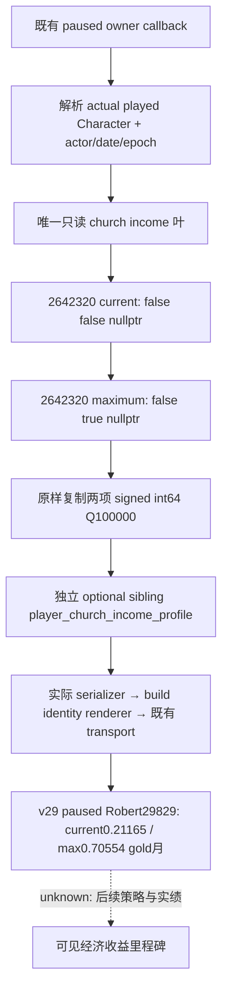

# 罗贝尔神权租借月收入：1.20.0.3 只读叶

本叶补齐当前玩家的两个最终神权租借月收入数值，供后续经济决策读取。它不发布操作、收益资格或净收益推断。原生计算树、封建伯爵与 realm-priest / lease / authored 税份额的区别见 [宗教与教会收入原生树](religion-church-income-native-ai-12003.md)；本文是该树已闭合最小叶的施工记录。

状态：2026-10-03 v29 的 ROOT 正式查询已经在罗贝尔 paused frame 取得两个最终值，本叶为 **`production-live primitive`**。当前教会来源收入为 **0.21165 gold/month**，原生最大值为 **0.70554 gold/month**。此前原生与 transport focused fixture 的合成材料仍归 `static-ready` 历史证据；实际值及帧绑定列于下文，不将旧合成值混入当前观测。当前唯一实机入口仍是 Robert origin 29829。尚无经济操作或收益循环，两个值之差不是已实现收入。

## 冻结输入与原生函数

绑定游戏 `1.20.0.3`，Steam build `25652598`，EXE SHA-256 `94B55397ABB687A3DCD436805A5D885E6BE90FA6C693FEB44A9E3BBEEADE02A6`。本叶采用公开源基线 `c01b76dbd86b37e6bd1dae4519e2027eab2bbd81`；既有 religion-context / mystical-decision 接线来自 `f30579bf6405e183192c96ea6b9bc35dddd11eec`，原文件保持不改。实际编译源及头文件、ROOT v28 链接依赖的逐文件 pin 保存在下述 `COMPILED-INPUT-PINS.json`，不以研究文档代替编译输入。

`GetIncomeFromTheocraticLease` 的数字消费者与 `GetMaxIncomeFromTheocraticLease` 的数字消费者均为 RVA `0x2642320`：

```cpp
int64_t* monthly_income(
    int64_t* output,
    void* actual_played_character,
    bool third_argument, // 原生 GUI 明确传 false，未擅自命名其语义
    bool maximum,
    void* optional_breakdown);
```

它把最终 Q100000 `gold/month` 写入 `output`，并返回同一 `output` 指针。本叶分别传 `(output, actual_player, false, false, nullptr)` 与 `(output, actual_player, false, true, nullptr)`。调用方提供既有 owner callback 已解析的当前玩家真实 `Character*`，读取并核对该对象 `+0x18` 的 full Character ID。realm-priest 的 Character 对象不得替代收入接收者。

所得数值是该角色的最终神权租借月收入；它不是 authored 税率、主教自己的收入、角色的全部月收入，亦不是扣除支出后的月结余。最大值只表示原生 maximum 分支对当前来源和规则计算出的上限。两个数值之差不表示实际增加了收入，也不证明任何赠礼、拉拢或教义操作有正净收益。



## API 与字段

新增独立 `ck3_12003_church_income_profile.hpp/.cpp`，namespace 为 `xar::ck3_12003::religion::church_income`：

- `BindPlayerChurchIncomeProfileImage12003(base, exact_sha) -> Bindings`
- `ReadPlayerChurchIncomeProfile12003(bindings, actual_character, actor, date, epoch, Terms&) -> bool`
- `SerializePlayerChurchIncomeProfile12003(const Terms&) -> std::string`

共用既有 `query-player-religion-context-v1`，sibling 名为 `player_church_income_profile`。不新增网关、命令、运行开关或 actor override。

| 字段 | 含义 |
| --- | --- |
| `schema` | `ck3_12003_player_church_income_profile_v1` |
| `read_only` | 固定 `true` |
| `available`, `unavailable_reason` | 此叶的独立读取结果；不改变旧 religion context 的结果 |
| `capture_epoch`, `date_raw`, `played_character_id` | 与调用 owner 的当前玩家帧一致 |
| `current_monthly_income_raw` | 原生 current 分支的 signed int64 最终收入 |
| `maximum_monthly_income_raw` | 原生 maximum 分支的 signed int64 最终收入 |
| `raw_scale` | 固定 `100000`；单位为 gold/month |

成功结果保留负数和合法零，两项都有值。读取失败时两项为空，保留真实失败原因：`bindings_unavailable`、`played_character_unavailable`、`current_monthly_income_unavailable`、`maximum_monthly_income_unavailable` 或 `church_income_native_copy_exception`。这些空值用于此帧读取失败；本叶没有未闭合 `IncomeRules` 字段或空占位，也不以该未闭合分解阻止读取已闭合的两个最终值。

## 验证与交接

外部工作包：`artifacts/g2-maintainer-2026-10-02/resume-12003/religion-church-income-12003/income-leaf/`。`ROOT-PROJECTION` 只含新增叶、focused test 和本文；共享 mailbox / CMake / Python transport 的修改由宗教总接线代理独占，ROOT 最后应用与发布。

原生 focused fixture 通过 MSVC Release `/O2 /W4 /WX`：`6 cases / 41 checks`，实际编译本叶 reader/serializer、原有 Context serializer 与实际 `RenderCrozierBuildIdentity`。它验证当前玩家 receiver、原生五参数形状、current→maximum 调用顺序、输出指针返回 ABI、signed/zero 原始整数，以及原生读取失败与旧 Context 互不替代。使用 ROOT 已验收 v28 链接依赖，不重新构建或测试旧功能。测试中的 command-result envelope 由夹具组装，因此此项不声称覆盖 mailbox。

证据：`NATIVE-FOCUS-RESULT.json`、`NATIVE-FOCUS-STDOUT.log`、`FOCUSED-COMPILE-RESULTS.json`、`COMPILED-INPUT-PINS.json` 与 `rendered-wire/*.json`。初次 fixture 的字符串拼接编译错误和两次缺少旧链接依赖的 harness RED 分别保存在 `attempt-01-compile-red/`、`attempt-02-link-red/`、`attempt-03-link-red/`；它们已修正，未接触 CK3，也不代表能力在 CK3 中失败。

真实解码 focused fixture 同样 GREEN：上述六组 actual serializer / renderer 输出经实际 `NativeHeadlessGameplayDriver.query_player_religion_context_private_v1` 方法、现有 `query_player_religion_context_private_v1` / `read_private_g2_native_query_v1` 与新增 sibling normalizer，完整保留值、失败原因和旧 Context。实际 driver 方法绑定到只持有 fixture packet 的测试 driver；唯一改动是关联请求 ID，Python 未重建或替换 native semantic body。共享 transport 投影 SHA 为 `b72a23c0d74a5c64e478618f25107b73679924072f3ecd278666775042527337`。证据为 `TRANSPORT-FOCUS-RESULT.json`、`decoded-wire/*.json`，它仍不声称覆盖实际 mailbox、SDK、pipe 或游戏。

## v29 罗贝尔实机观测

ROOT 的 `actual-v29-religion-three-leaves-01/result.json` 为 `GREEN`，唯一 `ck3_query_player_religion_context_v1` 调用为 `CLOSED`，正式 driver close 已返回。原始 MCP 包为同目录 `001-ck3_query_player_religion_context_v1.json`。本次专题工作只离线消费这两个新文件，没有增加查询、动作或游戏日。

| 绑定或数值 | 新实机材料 |
| --- | --- |
| source / native / environment | `d1b5b4c5583fa428d9226d4ebe4431e0c8db3579`，runtime `production-source-d1b5b4c5` |
| 游戏 / PID | CK3 `1.20.0.3`，Steam `25652598`，PID `120436`（ROOT 提供的 runtime 身份） |
| EXE SHA | `94B55397ABB687A3DCD436805A5D885E6BE90FA6C693FEB44A9E3BBEEADE02A6` |
| 当前玩家 / faith / rite | Robert `29829`，Catholic Faith `23` / Rite `152`，Religion `8` |
| 暂停帧 | raw date `53234568`；`native:4` / public revision `2` / native revision `4` |
| capture epoch | `17985`，与同包旧 religion Context 完全相同 |
| available / reason | `true` / `null` |
| current | raw `21165` / scale `100000` = **0.21165 gold/month** |
| native maximum | raw `70554` / scale `100000` = **0.70554 gold/month** |

这次真实正式查询证明了 church sibling 的完整只读 primitive。它没有证明罗贝尔获得了收入提升，也没有证明提高某祭司意见、赠礼、换任或宗教变更会把 current 推到 maximum。当前总月收入、租约支出、有效税份额及规则身份均不能由这两个最终值反推。结果前后为同一暂停 raw date；本次无新 clock、经济操作、净收益、G2 或 NW 完成信用。

窄 readout 与原始文件 pins 位于 `artifacts/g2-maintainer-2026-10-02/resume-12003/religion-church-income-12003/actual-v29-church-income-01/ACTUAL-CHURCH-INCOME.json`；同目录 `REPORT-FIELDS.json` 交给 ROOT 合并当日、当周报告。

## 下一项可施工只读输入

若下一决策要改善当前 church income，优先闭合 **`GetTheocraticRulerIncomeRules`**：exact `.3` literal 已冻结在 RVA `0x48C8D98`，相邻 `GetTheocraticRulerMaxTaxSplit` literal 为 `0x48C8DB8`。下一步仅沿该较晚注册链定位实际 callback / consumer 与 receiver ABI，取得 **当前原生有效 ruler tax share 及 IncomeRules literal**，再放入现有 church sibling。实际 receiver 和 native 参数以该 caller 为准；不要根据名字猜签名或用 authored 25% 作为当前有效份额。

该入口应连接实际 lease title / lessee / ruler 源；已有 `Title.GetTheocraticLessee` 链 `0xA9620 → 0xD8A9C0 → 0x2C42840` 可用于逐源解析 actual lessee，不能固定为旧祭司56513。如此才能区分本帧生效的 personal / fixed obligations、override、有效 lessee→ruler opinion 等输入，并判断某个改善关系动作是否影响当前份额。callback ABI 与这些本帧输入目前尚未发布，记录为下一施工依赖；它们不倒退或阻塞已完成的 current / maximum 只读 primitive。任何经济动作与可见收益确认都须另以操作前后实绩记录，不能由 maximum-current 替代。
