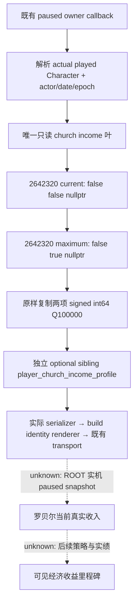

# 罗贝尔神权租借月收入：1.20.0.3 只读叶

本叶补齐当前玩家的两个最终神权租借月收入数值，供后续经济决策读取。它不发布操作、收益资格或净收益推断。原生计算树、封建伯爵与 realm-priest / lease / authored 税份额的区别见 [宗教与教会收入原生树](religion-church-income-native-ai-12003.md)；本文是该树已闭合最小叶的施工记录。

状态：原生叶、实际 serializer / build renderer 及实际查询 / transport 的 focused fixture 为 `static-ready`；共享 mailbox / CMake 总接线由总接线工作包维护，实际罗贝尔 paused snapshot 仍由 ROOT 验收。本文的合成 fixture 不能作为 `fixture-live` 或 `production-live`。当前唯一实机入口仍是 Robert origin 29829；测试中的数值均为明确的合成回调材料，不是罗贝尔的真实收入。

## 冻结输入与原生函数

绑定游戏 `1.20.0.3`，Steam build `25652598`，EXE SHA-256 `94B55397ABB687A3DCD436805A5D885E6BE90FA6C693FEB44A9E3BBEEADE02A6`。本叶采用公开源基线 `c01b76dbd86b37e6bd1dae4519e2027eab2bbd81`；既有 religion-context / mystical-decision 接线来自 `f30579bf6405e183192c96ea6b9bc35dddd11eec`，原文件保持不改。实际编译源及头文件、ROOT v28 链接依赖的逐文件 pin 保存在下述 `COMPILED-INPUT-PINS.json`，不以研究文档代替编译输入。

`GetIncomeFromTheocraticLease` 的数字消费者与 `GetMaxIncomeFromTheocraticLease` 的数字消费者均为 RVA `0x2642320`：

```cpp
int64_t* monthly_income(
    int64_t* output,
    void* actual_played_character,
    bool third_argument, // 原生 GUI 明确传 false，未擅自命名其语义
    bool maximum,
    void* optional_breakdown);
```

它把最终 Q100000 `gold/month` 写入 `output`，并返回同一 `output` 指针。本叶分别传 `(output, actual_player, false, false, nullptr)` 与 `(output, actual_player, false, true, nullptr)`。调用方提供既有 owner callback 已解析的当前玩家真实 `Character*`，读取并核对该对象 `+0x18` 的 full Character ID。realm-priest 的 Character 对象不得替代收入接收者。

所得数值是该角色的最终神权租借月收入；它不是 authored 税率、主教自己的收入、角色的全部月收入，亦不是扣除支出后的月结余。最大值只表示原生 maximum 分支对当前来源和规则计算出的上限。两个数值之差不表示实际增加了收入，也不证明任何赠礼、拉拢或教义操作有正净收益。



## API 与字段

新增独立 `ck3_12003_church_income_profile.hpp/.cpp`，namespace 为 `xar::ck3_12003::religion::church_income`：

- `BindPlayerChurchIncomeProfileImage12003(base, exact_sha) -> Bindings`
- `ReadPlayerChurchIncomeProfile12003(bindings, actual_character, actor, date, epoch, Terms&) -> bool`
- `SerializePlayerChurchIncomeProfile12003(const Terms&) -> std::string`

共用既有 `query-player-religion-context-v1`，sibling 名为 `player_church_income_profile`。不新增网关、命令、运行开关或 actor override。

| 字段 | 含义 |
| --- | --- |
| `schema` | `ck3_12003_player_church_income_profile_v1` |
| `read_only` | 固定 `true` |
| `available`, `unavailable_reason` | 此叶的独立读取结果；不改变旧 religion context 的结果 |
| `capture_epoch`, `date_raw`, `played_character_id` | 与调用 owner 的当前玩家帧一致 |
| `current_monthly_income_raw` | 原生 current 分支的 signed int64 最终收入 |
| `maximum_monthly_income_raw` | 原生 maximum 分支的 signed int64 最终收入 |
| `raw_scale` | 固定 `100000`；单位为 gold/month |

成功结果保留负数和合法零，两项都有值。读取失败时两项为空，保留真实失败原因：`bindings_unavailable`、`played_character_unavailable`、`current_monthly_income_unavailable`、`maximum_monthly_income_unavailable` 或 `church_income_native_copy_exception`。这些空值用于此帧读取失败；本叶没有未闭合 `IncomeRules` 字段或空占位，也不以该未闭合分解阻止读取已闭合的两个最终值。

## 验证与交接

外部工作包：`artifacts/g2-maintainer-2026-10-02/resume-12003/religion-church-income-12003/income-leaf/`。`ROOT-PROJECTION` 只含新增叶、focused test 和本文；共享 mailbox / CMake / Python transport 的修改由宗教总接线代理独占，ROOT 最后应用与发布。

原生 focused fixture 通过 MSVC Release `/O2 /W4 /WX`：`6 cases / 41 checks`，实际编译本叶 reader/serializer、原有 Context serializer 与实际 `RenderCrozierBuildIdentity`。它验证当前玩家 receiver、原生五参数形状、current→maximum 调用顺序、输出指针返回 ABI、signed/zero 原始整数，以及原生读取失败与旧 Context 互不替代。使用 ROOT 已验收 v28 链接依赖，不重新构建或测试旧功能。测试中的 command-result envelope 由夹具组装，因此此项不声称覆盖 mailbox。

证据：`NATIVE-FOCUS-RESULT.json`、`NATIVE-FOCUS-STDOUT.log`、`FOCUSED-COMPILE-RESULTS.json`、`COMPILED-INPUT-PINS.json` 与 `rendered-wire/*.json`。初次 fixture 的字符串拼接编译错误和两次缺少旧链接依赖的 harness RED 分别保存在 `attempt-01-compile-red/`、`attempt-02-link-red/`、`attempt-03-link-red/`；它们已修正，未接触 CK3，也不代表能力在 CK3 中失败。

真实解码 focused fixture 同样 GREEN：上述六组 actual serializer / renderer 输出经实际 `NativeHeadlessGameplayDriver.query_player_religion_context_private_v1` 方法、现有 `query_player_religion_context_private_v1` / `read_private_g2_native_query_v1` 与新增 sibling normalizer，完整保留值、失败原因和旧 Context。实际 driver 方法绑定到只持有 fixture packet 的测试 driver；唯一改动是关联请求 ID，Python 未重建或替换 native semantic body。共享 transport 投影 SHA 为 `b72a23c0d74a5c64e478618f25107b73679924072f3ecd278666775042527337`。证据为 `TRANSPORT-FOCUS-RESULT.json`、`decoded-wire/*.json`，它仍不声称覆盖实际 mailbox、SDK、pipe 或游戏。

下一步由总接线代理完成 shared mailbox / CMake 施工；ROOT 应用与发布后在罗贝尔 paused frame 读取两项实际收入。任何经济动作与可见收益确认都须另以操作前后实绩记录，不能由 maximum-current 替代。
