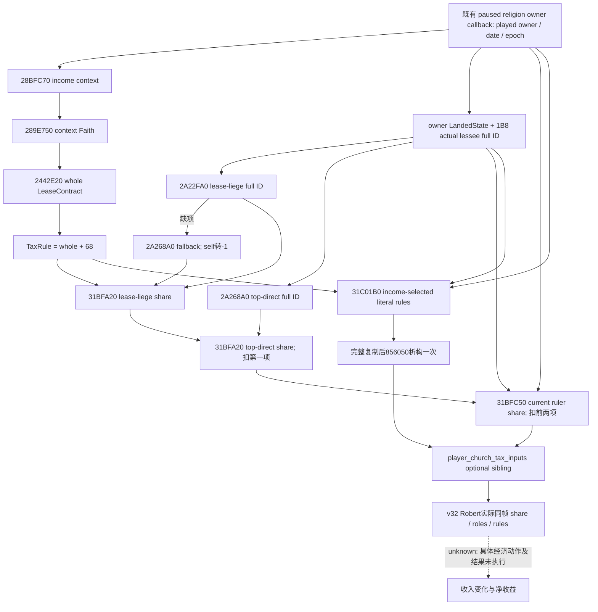

# 教会当前税份额与原生规则只读叶：CK3 1.20.0.3

本叶提供当前玩家教会收入所选 direct ruler tax rule 的真实角色、有效税份额及原生规则文本，让后续关系与宗教经济决策有可用输入。它沿既有 `query-player-religion-context-v1` 发布独立 optional sibling `player_church_tax_inputs`；数值是收入分配 **fraction**，不是 gold/month。独立实现、共享接线和罗贝尔同帧正式实读已经闭合，本叶达到 **production-live primitive**；本次没有策略动作或收入改善信用。

精确目标为 CK3 **1.20.0.3 / Steam 25652598**，EXE SHA-256 `94B55397ABB687A3DCD436805A5D885E6BE90FA6C693FEB44A9E3BBEEADE02A6`。实现以 immutable `production-source-db463118`、完整commit `db46311827eeffe24f5a093ecc9461e12c828b40` 为基线，既有religion实现沿用已冻结d1链；新shared接线由所属代理独立交付。本叶仅有新header/cpp、Python normalizer与本专题。ROOT基线冻结为 `robert-religion-hof-gold-fix-v31-source-freeze.json`，runtime DLL manifest为 `binaries/native-nonwar-12003-religion-hof-gold-fix-v31/manifest.json`，均位于本轮resume-12003目录；这些证明基线，不是新tax-input leaf的build/live证据。源码入口为 [header](../../ck3_autonomous_player/native_bridge/include/xar_bridge/ck3_12003_church_tax_inputs.hpp)、[native reader / serializer](../../ck3_autonomous_player/native_bridge/src/ck3_12003_church_tax_inputs.cpp)、[Python normalizer](../../ck3_autonomous_player/src/xar_autoplayer/bridge/player_church_tax_inputs.py)。

## 已有实际收入与本叶的边界

ROOT v29 原实机基线为 Robert 29829，date raw 53234568、epoch 17985；原 `player_church_income_profile` 读到 current `21165` / maximum `70554` Q100000，即 **0.21165 / 0.70554 gold/month**。该 primitive 的状态与 [v29 actual evidence](../../artifacts/g2-maintainer-2026-10-02/resume-12003/religion-church-income-12003/actual-v29-church-income-01/ACTUAL-CHURCH-INCOME.json) 保持独立。

本叶未从上述金额比值推算税份额或主教意见，也未产生收入提升。maximum−current不是已实现收益。current effective fraction、configured ceiling与最终每月聚合账户必须分别读取与解释；本叶不宣称已分解 0.21165 的全部来源。

## income context 与真实角色

最终收入 `0x2642320` 先用 `0x28BFC70(played_owner)` 取得原生 **income context Character**，再按该 context 的 Rite→Faith→`0x2442E20` 选择 whole LeaseContract。native reader通过既有 `0x289E750(context)` Faith getter复用同一路径，并取 `TaxRule = whole LeaseContract + 0x68`。context可能不同于 played owner，因此本叶显式发布 `income_context_character_id` 与 `income_context_faith_id`。

direct lessee与所选rule的来源分别绑定：**actual ruler仍是 played owner**；actual lessee从 **played owner本身**的 `Character+0x1C0 → LandedState+0x1B8` full ID解析。已冻结 root `0x264256F..0x2642608` 正是这样把 owner、lessee与 context-selected rule交给 native component2。不能从 income context的LandState替换这个lessee，也不能固定旧chaplain56513。

registered UI `GetTheocraticRulerIncomeRules` / `GetTheocraticRulerMaxTaxSplit` 按 receiver自身Faith选契约；本叶不会把这种UI-selected rule当成income-selected rule。它直接把已选 `TaxRule*` 给原生 `0x31C01B0` formatter。初版没有另一个UI规则字段。

hierarchy角色由 actual lessee决定。manager来自 `*(module+0x5C68C50) → +0xA0 → 内嵌+0x1F1E0`；先调用 `0x2A22FA0(manager,out,lessee_full_id)` 取 lease-liege full ID。只有返回 `-1` 时才调用 `0x2A268A0(out,lessee_full_id)` fallback，fallback等于lessee自身则第一角色仍为 `-1`。另一次 `0x2A268A0` 返回 top-direct full ID；其内部以 lessee Rite→Faith 查询 `0x2A23080` 的Faith map。完整32-bit角色引用保留，包括generation高位；合法无hierarchy的 `-1`不会被替换成owner或默认祭司。

## 三段原生计算

本叶调用原生消费者求值，保留selected rule中的script node、cached override、configured cap及native labels；不复制stock脚本条件自行计算税率。

| 顺序 | 原生输入 | 本次 remaining |
| --- | --- | --- |
| lease-liege | `0x31BFA20`，rule node `+0x108`、override `+0x8`、cap `+0x2E8`，actual lessee ID、lease-liege ID，native label `0x449F2E0` | 100000 |
| top-direct | `0x31BFA20`，rule node `+0x1F8`、override `+0x10`、cap `+0x2F0`，actual lessee ID、top-direct ID，native label `0x46DB418` | 100000−第一项 |
| ruler current | `0x31BFC50(rule,out,played_ruler,actual_lessee_full_id,false,remaining,nullptr)` | 100000−前两项 |

`0x31BFC50` 第三参数是 **ruler Character pointer**、第四是 **lessee full ID**。所有rule相对offset以 **whole+0x68子对象**为起点；不能直接传whole。native `0x31BF920` 完成负值处理与remaining clamp。reader只按原生顺序减去已返回的两项，并检查consumer返回原out；零值原样保留。configured ruler ceiling直接取 `TaxRule+0x2F8`（whole+0x360），不是已经扣除prior allocations后的最大有效份额。

rule text为 `0x31C01B0(selected_rule,fresh_out,played_ruler,actual_lessee)` 返回的owned NativeString32。结构为32bytes、8byte对齐；size在`+0x10`、capacity在`+0x18`，capacity<16取内联字节，否则取`+0`指向的heap。原生formatter建立fresh string；reader完整复制UTF-8 / markup字节后，通过 `0x856050` **析构一次**。合法空文本保留为 `""`，不由Python改写、翻译或解析成数值。



## 发布的21字段

schema为 `ck3_12003_player_church_tax_inputs_v1`；`scope` 固定为 `income-selected-direct-ruler-tax-rule`。

| 字段 | 实际语义 |
| --- | --- |
| `schema`、`read_only` | 固定schema，read_only=true |
| `available`、`unavailable_reason` | 本direct组件读到全部实际输入时available=true、reason=null；否则保留具体原因与已读字段 |
| `capture_epoch`、`date_raw`、`played_character_id` | 既有paused owner callback交来的同一帧、当前played ruler完整ID |
| `income_context_character_id`、`income_context_faith_id` | native选择income rule的context角色及Faith完整引用 |
| `actual_lessee_character_id` | owner LandedState当前direct lessee完整ID；无lessee保留-1 |
| `lease_liege_character_id`、`top_lease_liege_direct_character_id` | 两个原生hierarchy查询结果；无角色合法-1 |
| `lease_liege_share_raw`、`top_lease_liege_direct_share_raw` | 按顺序求得的prior份额 |
| `remaining_before_ruler_share_raw` | 100000−上述两份额 |
| `effective_ruler_tax_share_raw` | 所选income rule在current模式下的实际ruler有效份额 |
| `native_configured_ruler_tax_ceiling_raw` | 所选rule原生configured ceiling，不冒充effective maximum |
| `income_rules_text` | 所选rule的完整owned原生文本，已复制到bridge-owned字符串 |
| `raw_scale`、`share_unit`、`scope` | 100000、fraction、income-selected-direct-ruler-tax-rule |

Python normalizer按这21个actual keys解码并保留原始值，同时对照同一religion context的epoch/date/player。signed64 raw与signed32 full Character IDs分别处理，Faith引用保留unsigned32；不会把bool当int、从规则文案解析数据或重新求值。

## 独立缺项与后续来源分解

缺direct lessee时发布 `actual_lessee_character_id=-1`、`available=false`、`unavailable_reason="actual_direct_lessee_absent"`，同时保留已经读到的context与configured ceiling。无法解析已有lessee时原因为 `actual_direct_lessee_unavailable`。这是本direct组件的适用性/读取状态，不证明全部聚合教会收入为零，不影响既有current/max月收入primitive的独立结果。

其他实际读取失败也仅由本组件具体reason记录；首叶不增加战争开关、策略动作或新的全局readiness门禁。当前外置实现没有将局部输出提升为完整收入来源或完整经济OODA。

后续解释需要实际source rows时，已闭入口可继续使用：local出租男爵领走actual ruler LandedState `+0x1E0` Title完整ID向量与 `0x2BC5060(out,titles,mode2,nullptr)`；indirect来源走 `0x2A256F0(manager,recipient_full_id)` 原生borrowed vector（data+0 / count+C，缺项是native static empty），由 `0x2644340` 的native head identity过滤及原顺序消费。特殊head-only分支见本轮source账本。它们是后续可施工入口，不要求首叶先完成全枚举。

## 验证与交付状态

2026-10-03 首次新叶定向运行 **GREEN**：实际新 reader / serializer 与基线真实 Character resolver 按 `/O2 /W4 /WX` 严格编译，6场景、249项检查、0失败。场景分别覆盖 context Faith 与 played Faith 不同、Faith高位完整引用、实际完整lessee ID、两个十参数prior调用、current ruler pointer与扣减后remaining、UTF-8/内联/合法空owned文本的一次析构、hierarchy fallback/self转-1及实际direct lessee不存在。输入为fixture-owned角色和原生函数替身，并未接触 CK3。

实际 Python unique normalizer 一次消费上述 C++ serializer 的6份真实叶JSON，55项检查 GREEN；与固定fixture context `actor301989891/date704123/epoch73` 对照，保留1111/2222/3333份额、96667剩余额度、合法0/空文本和具体不存在状态。这些都是合成测试值，不是Robert当前份额。独立receipt为 [native focused result](../../artifacts/g2-maintainer-2026-10-02/resume-12003/religion-church-income-12003/effective-share-12003/implementation/NATIVE-FOCUS-RESULT.json) 与 [normalizer focused result](../../artifacts/g2-maintainer-2026-10-02/resume-12003/religion-church-income-12003/effective-share-12003/implementation/NORMALIZER-FOCUS-RESULT.json)。

本 unique fixture 仅覆盖 actual leaf serializer / resolver / normalizer，完整 production mailbox、build identity renderer 与 NativeDriver transport由shared接线所属代理的唯一new combined case另行覆盖；不得把本节提升为该完整链或live。上述focused记录形成时仍待ROOT paused实读；本次v32 actual增量见下节，已有v29月收入证据继续沿用原artifact。没有新游戏动作、推进日、收入改善或G2信用。

原生研究输入为本包 `CHURCH-EFFECTIVE-SHARE-NATIVE-TREE.md`、`callback/format-clarification/ROOT-DELIVERY.json`、`sources/ROOT-DELIVERY.json`及复用的旧share consumer冻结指令。研究证明constructor、角色和计算入口已闭合；实现与实机证据各自保存，不用研究receipt代替执行结果。

## v32 罗贝尔同帧真实税份额与收入

2026-10-03，ROOT 的新 `actual-v32-religion-type-tax-holy-order-01` 既有宗教查询已经 **GREEN/CLOSED**；正式 driver close 已返回。source/native `8cf176b436b6b0024fb591d4114b92448146181a`，独立environment SHA `a659ee553736c3a9429a961711411090ed6b53931a9c1a202f057b3179397486`，PID `109732`，Robert29829 / date raw 53236176 / epoch 17175。本专题仅离线消费已经关闭的新包，没有增加实机查询或动作。税21字段与月收入10字段均 available=true、reason=null，与旧religion context同actor/date/epoch。该税输入叶现为 **production-live primitive**。

| 字段 | 本帧 native 实际值 |
| --- | --- |
| played faith / rite / religion | `23` / `152` / `8` |
| income context Character / Faith | `29829` / `23` |
| actual direct lessee | `56513`；按本帧owner LandedState原生引用解析 |
| lease-liege / top-direct | `29097` / `29097`；-1为原生无该角色 |
| lease-liege prior share | raw `25000` = fraction `0.25` |
| top-direct prior share | raw `0` = fraction `0` |
| remaining before ruler | raw `75000` = fraction `0.75` |
| current effective ruler share | raw `7500` = fraction **`0.075`**；直接来自native current消费者 |
| configured ruler ceiling | raw `25000` = fraction `0.25`；不是扣完上级分配后的effective maximum |
| current / maximum monthly income | raw `21240` / `70804` = **0.2124 / 0.70804 gold/month** |
| scales / tax units | Q100000；tax share=fraction，月收入=gold/month |

所选收入规则的本帧原生最终文本如下，以JSON string literal完整保留UTF-8、markup与换行；`\u0015`是原生markup控制符的可见转义，不从文案解析或推导numeric share：

```json
"•主教\u0015high 斯特芬\u0015!对\u0015V 你\u0015!的\u0015E; \u0015TOOLTIP:GAME_CONCEPT,opinion 好感\u0015!\u0015!：\u0015positive_value +7%\u0015!"
```

该原生文本把当前来源显示为主教斯特芬对你的好感贡献 `+7%`；numeric current消费者直接返回7500/Q100000，即7.5%。显示文本与精确数值各自保留，不能把显示百分数反推为exact opinion，也不能把configured25%当成当前有效份额。

[新实际readout与原始包pins](../../artifacts/g2-maintainer-2026-10-02/resume-12003/religion-church-income-12003/actual-v32-tax-income-01/ACTUAL-V32-TAX-INCOME-READOUT.json) 保存以上same-frame值及完整text。actual direct lessee是原生租借角色；本query未另发布该角色的council job title或意见数值，不能由ID、收入比值或markup推断任职与意见。原v29 .21165/.70554的证据仍明确归属其旧source、PID/date/epoch。

本增量确认观测口可用，未执行任何赠礼、拉拢、换任、教义变更或经济动作；最大收入减当前收入不是已实现收益，也无production-live loop、推进日或G2完成信用。下一项必要只读输入可固定在本帧actual lessee56513→played ruler29829的真实native opinion及当前关系动作最终cost/合法性；已有native opinion入口 `0x28BC490` 与final approval消费者 `0x31C1470` 可复用研究，但未发布的签名/DTO仍须沿exact consumer闭合后施工。若具体动作还需要来源归因，再补local/indirect来源；不要求先完成全枚举。
