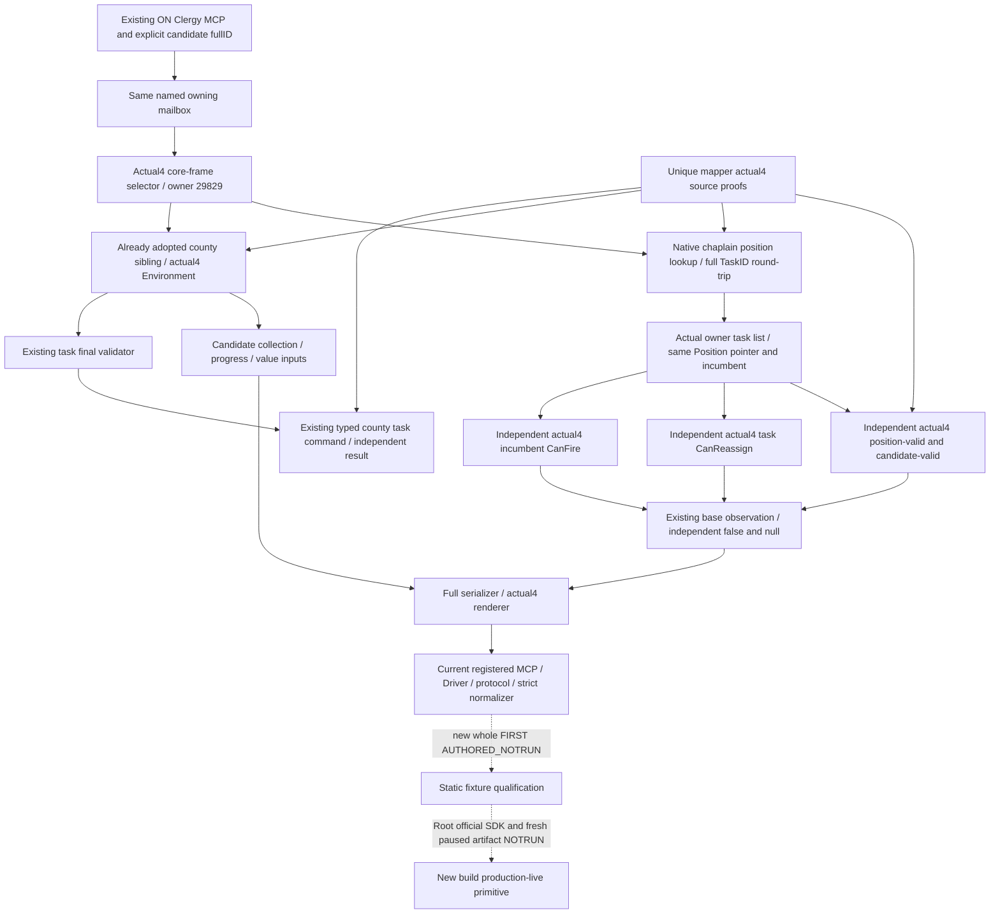

# Existing player Clergy route migration to CK3 1.20.0.4

This migrates the existing adopted `ck3_query_player_clergy_appointment_v1` route. Root confirmed the actual 117 configuration has `XAR_CK3_ENABLE_G2_PLAYER_CLERGY_APPOINTMENT_PRIVATE_QUERY_V1=ON`. The old optional county-conversion observation and its existing typed task action belong to this adopted route; the separate Faith/Rite conversion migration does not own those components. Previously unadopted candidate-terms features are outside this migration.

The installed exact identity is CK3 `1.20.0.4` / Steam `25734779` / EXE SHA-256 `98702F88A547CDE2EAF29A85F93B85F68EE4CF8148336A4F7AFAEB75319DD518`, from Root's [installed migration record](installed-build-25734779-mcp-migration-2026-10-07.md). No whole executable or new hash was read by this lane. The fresh source tree is `C:/codex-ck3-background/r4clergy`, base `e0ea249ae557749299735bc4cf53dfaa757aad50`, plus shared religion dependency original `1262d56385f3ae28cd0b4bb18528a57e971eff2c`, locally cherry-picked as `84840f47`. That local OID is a source integration identity, not a runtime qualification.

## Native input ledger before implementation

The base native input tree is retained in [the original appointment topic](ck3-1.20.0.2-religion-clergy-appointment.md), [the realm-priest tree](religion-realm-priest-council-native-ai-12003.md), and [the independent CanFire/Clergy tree](religion-clergy-council-native-ai-12003.md). Position-valid and candidate-valid are compiled native rules; their separate outputs include the original Rite/clergy conditions. CanReassign observes the actual task's change/time conditions. CanFire observes the current incumbent with the five-argument owner/incumbent/task/mode-zero/null-tooltip ABI. These values do not jointly grant a new submit permission.

The new base binder is independent of the old image binder. It shares only software result DTOs/signatures and invokes the actual4 `BindCoreImage`, `ReadCoreSnapshot` and `ResolveCoreCharacter` explicitly. Root's unique mapper closed four complete callback bodies: position-valid `31BCEB0` (188 bytes), candidate-valid `31BCF70` (188), CanReassign `31B4960` (165), and CanFire `2C477C0` (573). All complete normalized bodies, ordered relative/RIP edges and local flow agree with their retained previous-build semantics. The [small source proof](Z:/ck3_mod_rewrite_process_assets/g2-migration-20261007/clergy-appointment/native/base-first01/CLERGY-BASE-FUNCTION-MAP.json) records 2,228 physical bytes and eight exact reads across both builds; this is finite source research, with no executable-wide read or new hash.

The existing Faction proof supplies CourtOwner `28BFC50`. The existing Council proof supplies task storage `5D1DEA0`, owner extension/list/count `1C0/230/23C`, task identity/type/owner/incumbent `10/18/44/40`, type Position pointer `40`, and native position lookup `2684EE0`. The lookup accepts the actual owner and a local `std::string{"councillor_court_chaplain"}` and returns the current task. The reader round-trips its full TaskID, checks the current owner's unique task with the same Position pointer, and preserves a legal null lookup as absent. It reads no raw Position key at `+18`; that field is not covered by the reused Council proof. Common actual4 Character Rite `B4` comes from the shared Faith actor proof, and storage/full-ID/core fields come from the shared core profile. No native address is inferred merely by replacing the build SHA.

The adopted county subtree includes actual candidate collection, current progress/rate/value inputs, final task-dispatch validator and the existing typed command submission/readback. Independent actual4 county bindings use actual4 Core, base Clergy and mapped Province/title/task/command inputs. The existing software observations, complete command DTO and serializers retain their meanings. The callback inventory has 17 roles; the frozen unique mapper request excludes shared owners and asks for ten direct roots, two selected command tables and the directly consumed fields. Shared Core, Faith, Province, allocator, Faction, token, government and command providers are reused before new reads.

The [county source packet](Z:/ck3_mod_rewrite_process_assets/g2-migration-20261007/clergy-appointment/county/county-first01/CLERGY-COUNTY-FUNCTION-AND-FIELD-MAP.json) now closes those ten complete roots, selected command tables and 23 typed field groups. The final validator is the complete 310-byte declaration across all three CHAININFO fragments. Primary/secondary command vtables are `476DC78/476DC48`; the native task-type lookup is `CF1E80`, with database pointer slot `5C671D8` and native missing-type slot `5D1F900`. The existing complete lookup reads the database internally; our reader does not read GUI EF0 rows or raw Position index/tag fields. Typed current progress `+20`, frozen `+39`, scopes `+40`, TaskType key `+18` and progress kind `+54` have actual source witnesses. The title getter `A847A0` takes a native string key and then resolves a full TitleID, so the existing `h_china` argument remains correct. These closures required 6,445 physical bytes and 28 reads; retained old code JSON contributes another 1,853 imported bytes with no executable reread. Combined unique base/county physical cost is 8,673 bytes and 36 reads. Shared proof costs are not added again.

## Owning route and source candidate

The existing parser/API/permission/named executor remain. A separate optional actual4 base binding in the existing mailbox selects the independent actual4 reader. The owning transaction uses the shared `core_frame` comparison, preserving published actor/date/paused/map checks. Unavailable base-reader results retain the existing mailbox projection of the actual owning actor/date/requested candidate, while the native partial IDs and nullable predicates remain unchanged. The whole body and envelope carry the actual4 exact identity. Legacy `.2`/`.3` paths retain their existing dispatch.

The Python transport admits actual4 through the existing exact version/SHA pair and snapshot identity check. It preserves false, null and typed unavailable fields. `create_server` constructs `GameplayBridgeService`; the registered Clergy query still dispatches directly through NativeHeadlessGameplayDriver/private transport/NativeProtocolState ingest-wait and strict normalizers. The existing county submit/result tools use the existing Service methods. No Service Clergy query method or new appointment policy is introduced. The original assignment profile supports steward/chancellor/spymaster; chaplain assignment is not added by this migration. The actual4 county production serializer stamps Steam `25734779` explicitly because the central renderer only changes version/SHA/adapter identity tokens; consumers do not repair packets.

Six new base whole scenes are authored: occupied reassign-true/fire-false; occupied reassign-false/fire-true; vacant fire-null; absent position; unavailable candidate; unavailable bindings. The fixture uses the actual production actual4 adapter, core reader, existing request parser, named permit/mailbox, actual4 Clergy reader, full serializer and actual4 renderer. Memory, callbacks and frame are declared synthetic. It neither invokes the real process image handler nor defines replacement production functions. Its planned public/native revisions are 2/11 and actual seeded pump capture epoch is 1007; these remain separate values.

The sole new registered base consumer reads the six compiled whole outputs and actual native receipt without constructing or repairing native envelopes/rows. A separate six-scene whole county producer and one registered consumer qualify the adopted county route: two complete query packets for religious-relations/native dispatch false and current conversion/progress/rate; then typed final denial, one queued ACK, independent pending, and independent matched assignment after explicit synthetic fixture memory delivery. The actual named-pump epoch and sequence are recorded per file. Queuing remains separate from independent material readback, and matched assignment remains separate from county conversion completion. The base scenes omit that sibling and do not claim its qualification. Both producers and both sole consumers are `AUTHORED_NOTRUN`; no imports, tests, native run, build, SDK, pipe, game action or hash has been executed for this migration.

## Evidence and qualification boundary

The older `.3` native six-case/105-check GREEN and environment-corrected registered six-output GREEN remain [historical evidence](Z:/ck3_mod_rewrite_process_assets/g2-parallel-20261006/clergy-inputs/g104/ROOT-ACTUAL-FIRST-DELIVERY.json). Original link/import RED attempts are retained. Those results grant no `.4` qualification.

Current state is `research / source prepared`, with the required actual4 native source ABI inputs closed and all new execution `AUTHORED_NOTRUN`. Root owns joint integration, required new compile/native/registered qualification, official SDK, and the original Robert campaign paused/minimized live capture. Main adapter/bridge/root-CMake/shared registry hooks are delivered to `/root/entry_next_stage_research`; this lane does not mutate those shared files. Oct7/W41 English source pin, finite read costs, readiness and next-step fields are delivered externally at `Z:/ck3_mod_rewrite_process_assets/g2-migration-20261007/clergy-appointment/`.
