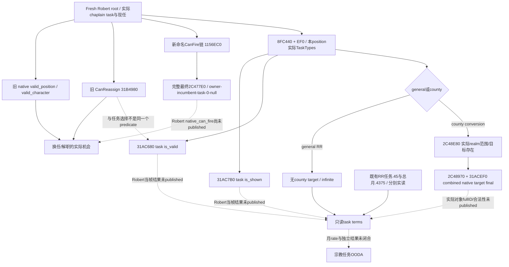
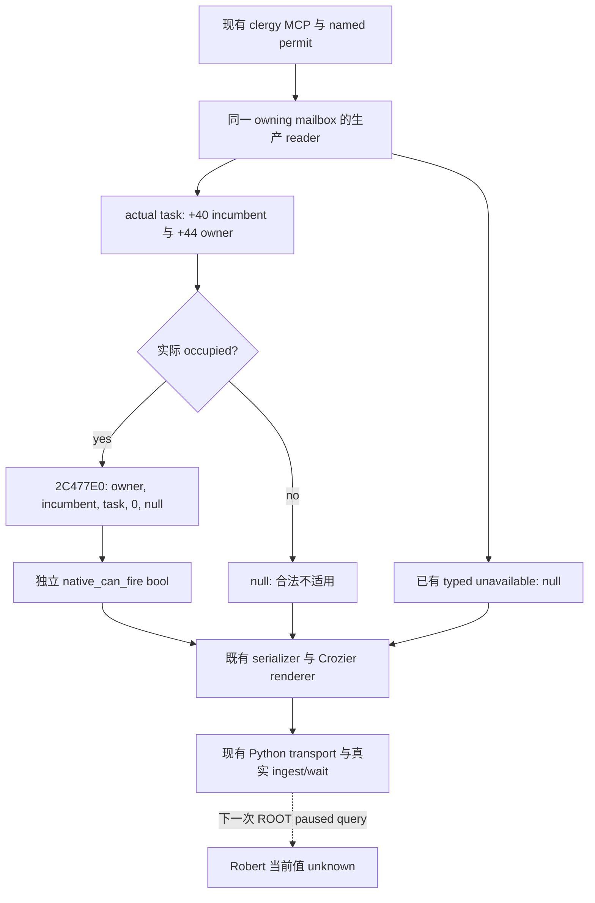

# CK3 1.20.0.3：现任祭司、解职权限与宗教任务选择

2026-10-03 的 **research / file-only** 增量。宗教已全面开放；本页复用 [realm-priest 任免与任务树](religion-realm-priest-council-native-ai-12003.md)、[ReligiousRelations 价值](religious-relations-task-value-native-ai-12003.md)和[宗教治理意见](religion-governance-opinion-native-ai-12003.md)，补齐它们尚未闭合的独立 `CanFireCouncillor` 调用合同、任务 `is_shown / is_valid` 与县域最终目标判定。没有重复 RR 查询、构建、旧 ABI verifier 或测试，没有 SDK、pipe、进程内存、窗口、任免、任务切换、付费动作或游戏日。ROOT 负责后续实现、实机和发布。

## 当前 Robert 输入与边界

游戏为 **1.20.0.3 Crozier / Steam 25652598**，EXE SHA-256 为 `94B55397ABB687A3DCD436805A5D885E6BE90FA6C693FEB44A9E3BBEEADE02A6`。离线 PE 使用已冻结的 `artifacts/migrations/2026-10-02/installed-build/binaries/ck3.exe`；本包复用 intake 身份，不重新 hash 整个 EXE。源码库存绑定 immutable `artifacts/g2-maintainer-2026-10-02/resume-12003/production-source-1bb3eee9`；该名字只是这份文件来源，不表示本包运行了该版本。

| 已有实际输入 | 原帧资格 | 本页可使用的结论 |
| --- | --- | --- |
| Robert29829，chaplain56513，RR/general/infinite/unfrozen | v25 root，raw53224008，frontend/native2/3，ROOT 上下文 PID95636 | 该帧有实际现任和任务；后续必须 fresh root 动态绑定 |
| 指定56513：valid_position=true、valid_character=true、CanReassign=false；双方 Rite152 | v21 clergy，raw53222304，frontend/native2/9 | 当时指定现任符合资格，而重派被原生拒绝；不是现在可以换任，也不是所有任务不能切换 |
| incumbent learning9、composition 返回4个 eligible | v23 composition，raw53222640，frontend/native2/3 | 当前版本已能读取学习和集合；没有4项逐候选 final gates，不能宣布可任命的替代祭司 |
| RR owner monthly-piety raw45000/Q100000=.45，总月 piety raw43750/Q100000=.4375 | v25 同一 root | 两个阶段分别保留；不重读、不手算替代原生值，不将差额归因于某个 modifier |

上述 packet/pins 全部回链已有专题。祭司→Robert 总意见+10属于另一 v22 原帧，学习9又属于 v23；它们不能组成新鲜的同帧候选总评分。`CanReassign` 是换人权限；下述任务选择链没有调用它。原生任命三谓词、完整候选 final gates、解职权限、任务可选性、任务目标合法性分别读取。

## 普通席位规则与实际价值

已冻结的 `00_council_positions.txt:554–613` 和 `00_councillor_triggers.txt:131–186` 继续是输入账本：职位有效性排除无地冒险者和游牧；普通资格包含基础 councillor 条件、配偶/vizier、clergy gender、同 **Rite**、theocratic/temporal 关系、绝罚和婚配。Ministry 的独立分支不套给普通席位。同 Faith 不能代替同 Rite。

`can_appoint_own_court_chaplain_trigger` 关联宗教任命权本人、非 fixed appointment 和 Ministry。`can_fire`、`can_reassign`、`can_change_once`、auto-fill各有不同分支和时间语义，既有 compiled final 入口已经包含规则；不在 Python 重写 doctrine 条件。候选 producer `0x2C47EC0` 和有效技能 getter `0x28B16B0` 的 learning enum4/+E8直接复用原证据。

现任 RR 的收益、未来候选学习差值、政治代价是不同输入。composition 的4个 eligible不等于4个最终可任命者；当前只读 chaplain profile未把非宗教 Council 的完整 final-gates/typed assignment 自动开放。若确有换人机会，先 fresh读 native_can_reassign 与下述 native_can_fire，再按实际替代 fullID读指定候选合法性/guest/pending/CanConfirm。没有这里的实际允许结果时，不以学习最大值触发换任。

## 新闭合：独立 CanFire 的最终 ABI

本页沿一个明确名字与既有调用点闭合，没有扫描其它宗教动作：`CanFireCouncillor` literal `0x452B210` → registration `0x15C7C0`，其中 `0x15C84B` 指定 callback `0x11613C0` → callback `0x11613D2` 调用 `0x1156EC0` → `0x1156F98` 调用原生最终 `0x2C477E0`。

`0x1156EC0` 从窗口 `+0x2A0` 的实际 ActiveTask fullID解析完整 generation；从 task `+0x40`取得 incumbent、`+0x44`取得 owner，并分别解析 CCharacter。当 incumbent=-1时返回 true，是原生“没有现任可解职”的分支，不能算一次可执行解职。occupied时的确定调用合同为：

```cpp
using CanFireCouncillorFinal = bool (*)(
    void* owner_character, void* incumbent_character, void* active_task,
    std::uint32_t mode, void* nullable_tooltip);
// Exact .3 RVA 0x2C477E0; observed named caller uses mode=0, tooltip=nullptr.
```

`0x1156F8C`清 R9D，`0x1156F8F`将第5参数置null，R8保留 task；RCX/RDX分别是owner/incumbent。该最终函数同时包含 task `0x31B4A30`与额外原生角色条件；不能把 `0x31B4A30`单独称为完整 CanFire。旧 CanConfirm 中的同callee已经有573-byte冻结证据，本包不重复重验该函数体。新命名 caller证明哪个角色/任务/模式进入它，解决原专题“standalone CanFire ABI unknown”的施工缺口；仍没有 Robert 当前 `native_can_fire` 实测值。

最小实现可以在现有 `ck3_query_player_clergy_appointment_v1(expected_revision,candidate_character_id)` 内增加独立 nullable `native_can_fire`，复用该 reader已解析的 owner、actual task及实际 incumbent，沿现有 named permit/owning pump调用此五参数入口。保持现有三谓词和 `action_eligibility_complete=false`。空席返回单独 `not_applicable`，读取失败保留 unavailable；不增加动作、MCP参数或 flag，不把CanFire与CanReassign合成为任命授权。

## 新闭合：任务显示、任务有效性、县域目标

当前原版 `gui/window_council.gui:872`与`:1100`消费 **GuiPotentialCouncilTask.CanSelect**。literal `0x452B6C8` → registration `0x15D230` → callback `0x11617E0`只读取 wrapper `+0x88`缓存。这个缓存与更换祭司的 CanReassign不同：真实更新 `0x115816D → 0x1158280`，随后 `0x1158172`写+88；wrapper stride为0x98，`+0`是TaskType，`+0x80`是CouncilWindow。

`0x1158280`首先确认实际 task现任；非general任务还以原生候选目标枚举检查存在至少一个有效目标。然后 `0x115868F`调用 `0x31AC7B0`，`0x11586A3`调用 `0x31AC680`，结合前面的现任/目标条件决定缓存。该链没有调用 `0x31B4980`。所以 v21 CanReassignfalse不能推导 conversion/task selectionfalse。

| 独立结果 | 新 `.3` RVA / 输入 | 精确语义与输入来源 |
| --- | --- | --- |
| task native is_shown | `bool 0x31AC7B0(TaskType*, raw_task_scopes*)` | task clone+0x1358递归；实际根是incumbent，保存councillor/liege，消费compiled task+0x330 |
| task native is_valid | `bool 0x31AC680(TaskType*, raw_task_scopes*, nullable_tooltip*)` | 同clone处理；消费compiled task+0x260与原生 evaluator `0x37998F0`；null tooltip只读最终bool |
| specific county native valid target | `bool 0x2C48970(TaskType*, incumbent Character*, Province*, nullable_tooltip*)` | 从incumbent原生 court-owner取得liege；county kind1用tag8、Province+0x10及+0x85C type tag；调用 `0x31ACEF0` |
| composed target predicate | `0x31ACEF0(TaskType*, raw_task_scopes*, nullable_tooltip*)` | county先原生范围 `0x31AC8E0`，再求值两个compiled条件集合+0x5B0/+0x680。保留combined finalbool，不以stock手算替代 |
| first valid target exists | `0x2C48E80(incumbent Character*, TaskType*, bool first_only, allocator_owned_vector*, bool expand_court)` | 真实caller `0x115F4B9`使用 `first_only=true, expand_court=false`；先按实际player/AI选type+0x4C/+0x50，再枚举范围、用2C48970过滤，命中即返回。first_only结果不是完整目标集合 |

raw_task_scopes是32-byte原形：+0/+4为incumbent/owner完整 CharacterID，+8为target tag、+0x10为target value、+0x18为额外flag。31AC680/31AC7B0的GUI调用构造真实角色pair并清目标；county helper负责加入真实目标。直接补provider应复用当前 task的已知原scopes/原生构造，不在Python猜scope、把county title ID当Province ID或传入空县域。

任务定义来源也有具体无窗口入口。CouncilWindow的更新 `0x1157DAF → 0x8FC440`取得当前原生data；`0x1157DF7–0x1157E5E`用 actual task→TaskType+40的position，读取position index+10及type tag+38=`0x4744624F`，在返回data+0xEF0的 **24-byte position-indexed rows** 中读取TaskType指针数组与+0xC count。之后每个type进入wrapper构造/CanSelect缓存。这只是该位置实际任务定义集合，不是按所有stock文件造出来的catalog；可在同一 paused owning pump从actual position按key选择RR/conversion，复用已支持的TaskType key+18。无需打开Council窗口。`0x8FC440`实际读取global `0x5C671D8`，不存在时有原生诊断分支；不调用窗口初始化/选择/提交。

上表源代码可施工的最低结果是 **task_shown、task_valid、实际target finalbool／first_valid_target_exists** 这些独立项。后台不构造伪CouncilWindow，也不把组件结果提前宣称完整typed action readiness；当前没有这些Robert同帧新值。下一次实现应接现有clergy MCP的独立task terms，保留旧结果，不为不同任务新增整套SDK/旗标。

## RR、改宗与“提升宗教权威”的区别

本次有限枚举 `00_court_chaplain_tasks.txt` 的顶层定义正好是RR、conversion、fabricate_claim三项；它没有独立名为“提升宗教权威”的普通祭司任务。该事实只覆盖这个普通任务文件，不是全游戏所有Ministry/政府任务。不要将玩家piety、Faith fervor、spiritual fulfillment或head authority合称一个数值。

RR是general/infinite，当前owner piety修正已实读.45；同Faith/theocracy意见适用对象与玩家累计component回链RR专题。它不是县域转换，不直接提供一个fervor增长rate。任务monthly on_action 的自然side effects可独立影响角色，不能据此前置宣称已经发生。

conversion的stock范围为player/AI realm，percentage。它的整体任务valid涉及off-Rite theocratic chaplain/temporal owner/theological puppet；县域另经 `task_conversion_valid_county_trigger`选择究竟用liege还是chaplain Rite、排除已经匹配/landless并包含保护与其它条件。完整规则由上表native最终入口求值。**当前没有新Robert转换目标或finalbool**，不得只因双方152而说“全部realm县都可改宗”，也不因为是Catholic就说“没有可转换县”。新只读口先回答实际合法对象/范围，再观察原生月progress和county Rite/结果；不能把完成进度当月rate。

制造宣称属于county，player all / AI neighbor_land。其资格、费用与完成事件在旧realm-priest树有证据，本包不开展战争研究，也不产生claim动作。若用户实际想提高fervor/宗教权威，下一专题应按具体decision/activity/interaction的最终consumer观测；本页不虚构一个祭司任务来满足该意图。



## 交付与下一叶子

新证据位于 `artifacts/g2-maintainer-2026-10-02/resume-12003/religion-clergy-12003/`，包括有限PE spans、stock行窗与pins、`CLERGY-READONLY-NEXT-ABI.json`和`REPORT-FIELDS.json`。新状态为 **research，source/provider实现0、focused tests0、live calls0、actions0、game days0、G2 credit0**；既有RR/clergy/composition的production-live primitive资格仍归原artifact。没有制造synthetic结果或重验已closed调用链。

可立即施工的最小leaf为现有clergy query独立 `native_can_fire`，五参数ABI、actual task/owner/incumbent来源均已闭合。其次在相同查询发布actual-position任务定义的shown/valid及conversion原生目标范围/存在结果；只在实际目标存在时补具体目标final与月rate。候选政治总utility、实际神职任免后的职位读回、任务切换/转换结果仍未完成；每个缺口已有上述明确caller，不能以撤销的宗教禁令或长期null停止。

## 同一 clergy MCP：current-incumbent CanFire 只读增量

本增量基于 immutable public `f30579bf6405e183192c96ea6b9bc35dddd11eec`，只修改原clergy header、生产reader/serializer和现有Python private transport三叶。仍用 `ck3_query_player_clergy_appointment_v1(expected_revision,candidate_character_id)`，owner从当前played actor取得，已有explicit candidate、selector、named permit、owning mailbox、MCP方法/参数、CLI/private flag、Crozier身份renderer和`action_eligibility_complete=false`保持。没有增加SDK入口、catalog、任命、解职、任务切换或策略。

新独立 nullable boolean **`native_can_fire`**指当前actual seat的 **incumbent**，并非请求candidate。生产reader从实际task+0x40解析incumbent完整generation，从已有task+0x44绑定owner；`CanFire` helper通过`ResolveCoreCharacter`取得实际incumbent指针，调用 `0x2C477E0(owner,incumbent,task,0U,nullptr)`。它不使用CanReassign的返回值，也不把candidate有效性和CanFire合成为可执行任命许可。

| 材料 | 新字段语义 |
| --- | --- |
| available、实际occupied、native返回true/false | 原样发布独立bool；false是可用的原生拒绝 |
| available但没有chaplain position或incumbent | 发布null且不调用CanFire；existing position_present/incumbent字段区分合法不适用 |
| binding/native读取失败 | 沿已有typed unavailable/failure，新增bool清空为null；不把读取失败写成false |
| older genuine wire无新增key | 现Python decoder兼容原base字段；不补造新bool或声称观测完成 |

Binder安装并确认独立`kCanFireRva=0x2C477E0`与五参数function pointer，现任参数不会被外部candidate替换。serializer只在原CanReassign字段后追加同名nullablebool；Python通过可选新key与nullablebool检查保留原值，继续逐字段返回原生packet和现有provenance。版本和schema字段不以synthetic fixture改写。



当前外置源码投影与production patch冻结在`religion-clergy-12003/can-fire-leaf/`。唯一新增focused验证在2026-10-03 07:01 Asia/Shanghai首次 **GREEN**，编译使用`/O2 /W4 /WX`。真实reader、现有mailbox/full serializer与Crozier renderer产生5份genuine wire，再由现有Python query transport及真实NativeProtocolState ingest/wait消费5次；native focused共32项checks。引擎指针与内存是明确的fixture stub，属于synthetic file-only材料，最高 **static-ready**，没有真实DLL安装、SDK/pipe或Robert实机查询。

两个occupied场景使用不同的candidate和incumbent，验证`CanReassign=true / CanFire=false`以及`CanReassign=false / CanFire=true`，并检查owner、actual incumbent、task、mode0、tooltipnull全部实际传参。vacant、absent和missing-binding分别保留null与原有available/unavailable边界。Python还验证可选新增key缺失的旧材料兼容与bool类型约束。两处旧fixture Bind仅追加callback兼容；旧23/57项main与旧7份wire矩阵均没有运行。第一次attempt已GREEN，因此没有被覆盖的RED或重复attempt。

回执：[`fixture/attempt-01/RESULT.json`](../../artifacts/g2-maintainer-2026-10-02/resume-12003/religion-clergy-12003/can-fire-leaf/fixture/attempt-01/RESULT.json)，11478 bytes，SHA-256 `882984d5f9824b2f7566ec5ea18ee9213aa378219d6e3c693931488d4fa53c07`。所有source、真实wire、compile/run日志和exe pins均在该回执及[`can-fire-leaf/ROOT-DELIVERY.json`](../../artifacts/g2-maintainer-2026-10-02/resume-12003/religion-clergy-12003/can-fire-leaf/ROOT-DELIVERY.json)中；路径相对本仓库根。三个生产leaf与两处旧Bind兼容保持分别冻结，focused source独立且不增加CMake目标。此增量新增live/actions/game-days/G2 credit均为0。

后续ROOT采用最终projection，经正常strict native构建和同一Robert paused query取得当前`native_can_fire`。该增量仅闭合独立只读输入；即使true也没有完整任命action readiness、解职结果或新的religion OODA资格。
