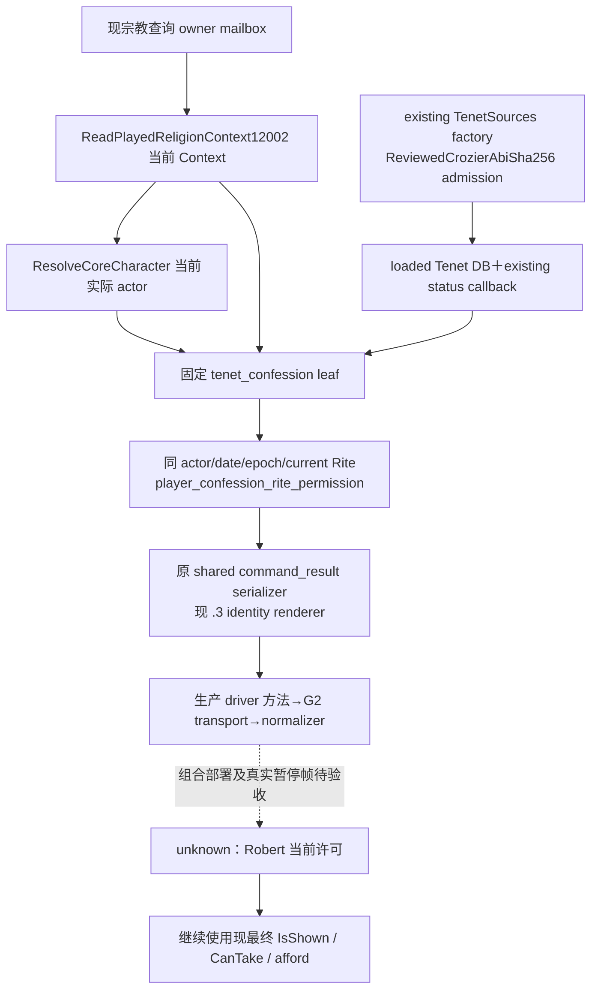

# CK3 1.20.0.3：固定忏悔许可接入当前宗教 Context

2026-10-03。承接[教义与忏悔原生树](religion-doctrine-gameplay-native-ai-12003.md)及维护者交接的 `confession-permission` 四文件封存包，本轮仅补现成 `ck3_query_player_religion_context_v1` 的共享接线。基线 commit `8cf176b436b6b0024fb591d4114b92448146181a`，CK3 1.20.0.3／Steam25652598，EXE SHA-256 `94B55397ABB687A3DCD436805A5D885E6BE90FA6C693FEB44A9E3BBEEADE02A6`。

当前新增口的最高状态为 **static-ready**：生产 mailbox 组合 fixture 与生产 driver 方法／query transport／normalizer 已通过，组合 DLL 及罗贝尔真实 paused observation 尚待主代理完成。现成 v32 的类型、最终忏悔决议条款及历史 actual 继续按各自原证据保留；本轮没有运行 CK3、pipe、SDK、窗口、Git 或 gameplay action，没有压力、精神满足度、保存日、G2 或宗教完整循环信用。

共享 mailbox 新 DTO 同当前 Context 消费 actual actor；Context unavailable 时发布独立读取失败并保留该 Context 的日期、角色、capture epoch 和 Rite，现 Context 的整体状态与其余七个 sibling 不由许可口改写。definition/status bindings 使用原 `BindCurrentDraftTenetSources12002` factory，经现 `.3` reviewed descriptor admission；仅消费 loaded Tenet DB 与 GetTenetStatus 输入，不调用任何 draft reader、不打开或构造 draft 窗口。

固定定义解析及状态语义复用既有封存实现。`available=true/current_rite_status=0/has_at_least_permitted=false` 是完整观测；状态1、2也返回false，3、4返回true。缺定义、key-copy／native读取故障和非法状态是 `available=false`，原生状态和许可谓词保持null并有独立 reason。现 TenetRows 未列出固定 key 不能代替false；解释字段不覆盖当前最终决议合法性。

CMake 宗教 Context production source list及两份既有 standalone mailbox fixtures追加固定 leaf、`religion_doctrine12002_tenet_rows.cpp`、`religion_reform12002_tenet_sources.cpp`、`religion_reform12002_window.cpp`。后三项是生产 key-copy、factory及factory依赖，不代表执行draft查询。新增 `xar_ck3_12003_confession_permission_mailbox_test` 注册唯一组合case，Python transport只追加可选 sibling与其normalizer。

新增验证只覆盖共享接线：1个 native case、2帧（合法零false／缺definition unavailable）、17 checks，真实 queued owner mailbox submit/drain/wait/reclaim、当前 Context reader、新 leaf及完整 serializer／`.3` renderer均实际执行；fixture memory与native callbacks为synthetic。Python单case使用 `NativeHeadlessGameplayDriver.query_player_religion_context_private_v1` 方法与现 query transport消费上述完整原生 command_result，仅I/O和snapshot由fixture提供，业务 body未由Python重建。七个旧sibling与Context原样保留、metadata同帧、current Rite与main Rite不同的合同均通过。

首次native编译和运行均exit0；Python因外置投影漏冻结 `tools/build_release.py` 的import依赖出现 **harness RED**，已保留 `attempt01-RED`。补该依赖后仅重跑Python成功，已成功native构建与运行没有重复。既有8语义scenario GREEN、旧类型／税份额／Tenet矩阵均直接复用，无重跑。

当前组合证据位于 `Z:/ck3_mod_rewrite_process_assets/g2-resume-20261003/confession/FOCUSED-RESULT.json`、`focused/native-false.json`、`focused/native-unavailable.json` 与 `attempt01-RED/`；封存leaf语义证据仍为 `artifacts/g2-maintainer-2026-10-02/resume-12003/religion-doctrine-gameplay-12003/confession-permission-leaf/FOCUSED-RESULT.json`。可应用补丁与逐文件hash见同外置目录的 `ROOT-DELIVERY.json`。主代理合入时与其他包逐hunk合并共享 mailbox、CMake和transport；之后进行一次严格组合构建与Robert新paused读回，再决定具体玩法入口。
