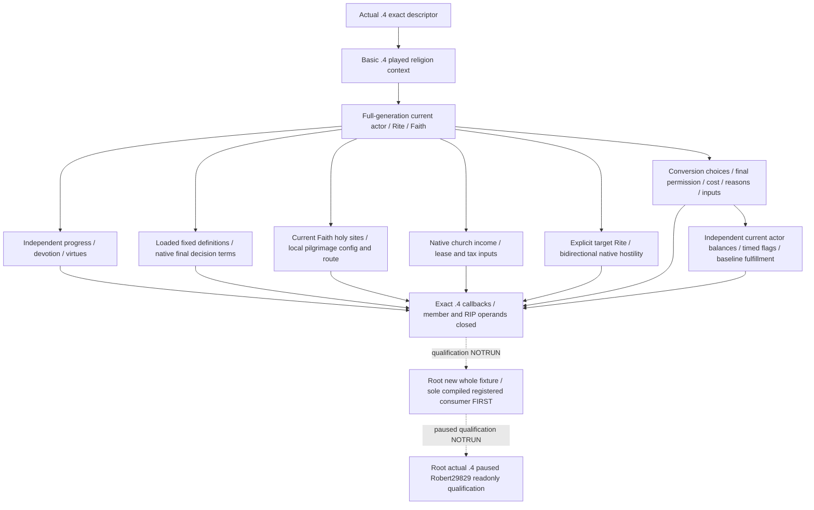

# Religion context addons, hostility and conversion: actual 1.20.0.4 migration

This package migrates the existing ON readonly inputs to **CK3 1.20.0.4 / Steam25734779**, executable SHA-256 `98702F88A547CDE2EAF29A85F93B85F68EE4CF8148336A4F7AFAEB75319DD518`. The source base is `66cfb479801f0fc9f9fd518c7705c807e640cc4b`; historical .3 paused receipts retain their original qualification and give no .4 live credit.

The source tree and operand inventory are frozen before implementation in `religion-context-hostility-conversion-12004-operands.json`. Existing basic .4 context supplies played Character, Rite, Faith, Religion, full-generation references, fervor and fulfillment. Parent owns the same-frame composition and fresh native output metadata. This lane supplies independent addon bindings, two-way Rite/Faith native hostility and the existing conversion terms/choices/reasons/inputs factories, including independent current conversion outcome. Native false, legal zero, absent rows and read failures retain their existing independent meanings.

| Existing provider | Inputs and native authority |
| --- | --- |
| Spiritual progress and type | Loaded type database, type-for-current Character, native level and within-level progress, loaded min/max. |
| Mystical communion, confession, vow of poverty | Loaded fixed decision definition, actual root scope, native shown/final CanTake, ten-resource native cost and independent affordability/reasons. |
| Pilgrimage activity type | Loaded fixed activity type, native CanPlan and raw native tooltip. |
| Pilgrimage headless candidates and default configuration | Current Faith holy sites, actual Province/Title joins, native candidate predicates/phase offers/caps, owned local default configuration and native activity quote. |
| Pilgrimage candidate routes | Owned local route input, native start Province, route and arrival evaluation; no planner or submitted travel. |
| Confession Rite permission | Actual loaded confession definition and current Rite native tenet state; does not require an open draft. |
| Church income and tax | Native current/maximum income, lease receiver chain, selected native prior/ruler shares and rules. |
| Devotion and virtues/sins | Native level/cap/progress/threshold vector, current trait IDs and effective Rite classifications; record opinion and modifier scale remain distinct. |
| Hostility | Explicit full target Rite, independent native Rite and Faith answers in both directions; no reconstructed doctrine table. |
| Conversion choices/terms/reasons/inputs | Actual loaded Faith/Rite membership, native Faith rule, final command validator with/without piety, native piety quote, current state-Rite/knowledge/flags and target base fulfillment. Membership or balance alone is not conversion permission. |

The original finite inventory contains74 supplied native roots after excluding shared basic .4 and unused draft-only factories;36 retained old unions total18211B. Source closure now includes actual entrances, ordered control/RIP targets and unchanged consumed member operands. Seven fragmented functions are joined through their returns: waypoint initializer196B, Province append351B, final decision CanTake864B, named-scope save313B, evaluator preparation246B/295B and ExistingAtom272B. Direct callee bodies outside the adopted supplied roots are not claimed as independently migrated.

The loaded DecisionDB is proved by the retained reference resolver's actual7B load `313B473 -> 313B453 -> 5D1DEF0`, followed in the old held source by the same hash and typed lookup. Typed lookup retains fallback `5D1F7E8`. ActivityType's final constructor LEA proves `48BFE50 -> 48BFE60`, and the independently shared caller proves TypeDB rows+50/count+5C. Province world rows+140/count+14C reuse Army's actual4 source-use; Title resolver, realm top-liege/state-Rite, core frame and actor resource/stress layouts reuse their owners' exact receipts listed in the operand ledger.

The readonly conversion value is size0x30 with actor+20, full target+24 and pay-piety+28, and actual4 constructor-proved primary/secondary vptrs `4770350/47703E8`. Its validator is `29A34A0`, final piety callback `29A3DC0`. The shared preview/reasons software accepts an optional value-factory callback; this binder always supplies the actual4 factory. The original old-build fallback stays available to the old binder. No value is submitted or executed.

Two concrete native differences remain explicit: ProvinceFilter's indexed18-entry table changes to `2C29EC8`, with72B perbuild proving equal local branch offsets; native arrival swaps its two loaded predefined-entry targets at offsets1152/1166. We call the actual4 evaluator and do not claim old absolute operands are byte-equal. Church tax label RIP targets are actual `449F2F0/46DB428`.

Context composition retains all12 prior ON binding families independently (progress also produces type). Confession permission consumes only the loaded Tenet DB/status getter; a missing draft window does not suppress it. Outcome observes present actor balances, native flag keys/rows/expiry/update counter and fulfillment baseline; it does not infer that a command caused those values. Empty collections, native false and legal zero remain meaningful available observations.

This lane's finite physical source cost is **40451B / 156 calls** ({'new': 30529, 'old': 9922}); shared owners' captures are excluded. New header/pdata/metadata reads, whole EXE scans/hashes and duplicate physical bytes are0. Retained partial decode attempts and the further actual35B Atom tail remain recorded; cache-only repair receives no additional source-read credit.

Build, tests, production imports, FIRST, game/SDK/process/pipe/UI/Steam/profile/save and live operations are **NOTRUN** in this lane. Root owns qualification and parent owns the joint English commit and Oct7/2026-W41 reports.
