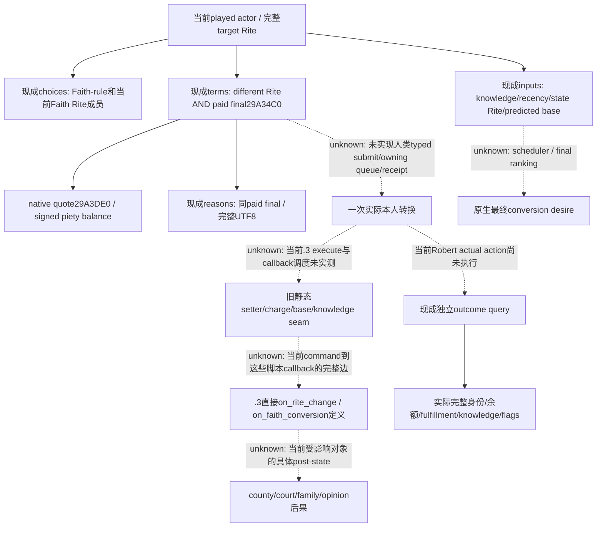
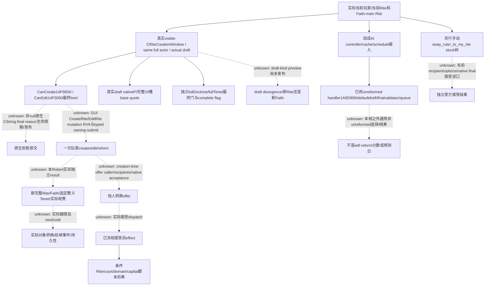

# CK3 1.20.0.3：改宗与宗教改革的原生最终输入树

2026-10-03（Asia/Shanghai），**research / offline-only**。项目所有者已全面开放宗教；本页支持原 Robert ordinary campaign 后续宗教 OODA。它复用已有 query、exact-build 调用链与真实 primitive，当前没有改变 Robert 的 Rite/Faith，也没有提交改革、改宗或新的游戏动作。

## 冻结与已发布输入

游戏为 **1.20.0.3 Crozier / Steam25652598**，EXE SHA-256 `94B55397ABB687A3DCD436805A5D885E6BE90FA6C693FEB44A9E3BBEEADE02A6`。当前 source `6443a5160c1369b5e64b2d22e3a27f87902ec256`，只读 [production-source-6443a516](Z:/ck3_mod_rewrite/artifacts/g2-maintainer-2026-10-02/resume-12003/production-source-6443a516/)。[原冻结回执](Z:/ck3_mod_rewrite/artifacts/g2-maintainer-2026-10-02/resume-12003/religion-full-authority-and-robert-rite-source-freeze.json) SHA `2dcb75cce3349abd0e04296509d715dace0533249bf1464e7cc49e561b8a46b0` 说明准备时 native_rebuilt=false/live_executed=false；这份计划不表示新的实机观测。v20既有DLL仍绑定 `4ee2e7558dbc32c69cfa1caaeaf232a287a5ee34`，其17个宗教/Rite private compile options 全ON，直接复用原manifest，不重建、不复跑旧ABI/fixture。

先读取 [README](README.md)、[身份与现行输入](religion-native-ai-faith-identity-12003.md)、[Rite growth执行树](religion-native-ai-rite-growth-12003.md)、[独立效果材料](religion-native-ai-effect-material-12003.md)和[只读库存规划](religion-native-ai-readonly-plan-12003.md)。当前source的 MCP server仍有21个相同宗教只读函数；其完整文件 SHA `ff6b61b401b317dc8a6d24b992153ca4c9e76bfedbcc4c229773162220f44155` 与 [已有库存](Z:/ck3_mod_rewrite/artifacts/g2-maintainer-2026-10-02/resume-12003/religion-native-ai-12003/INVENTORY.json)相同。它们直接调用 NativeDriver，不能把21口登记说成已有宗教 turn-bundle、策略或typed动作。

`Character+B4` 是 full **RiteID**；当前 Faith、Religion和Faith main Rite分开读取。conversion target参数是完整 `target_rite_id`，不是 FaithID、数组序号或tag。Doctrine definition用stable key；draft rows/selection/popup属于当前原生model，不能把现行Tenet列表当草案slot。

既有[宗教supplement静态比较](Z:/ck3_mod_rewrite/artifacts/migrations/2026-10-02/abi-comparison/religion-supplement/summary.json) SHA `a335cb03ce7fed8913570e8bf663b1f764c827c66c2c11bbbcb6daa25efc7c0c` 在 exact新SHA上比较16专题并PASS，包括conversion reasons/Rite及reform模型、choices、费用、eligibility、AI/schedule/willingness/window。其边界是所列实际区间/调用边；未列conversion核心组件不能借这16专题倒算已静态覆盖全部函数，更不能借编译或旧`.2`实机记新的`.3`完整动作。

## 改宗的现成查询入口

所有查询先用本session fresh public `expected_revision`；native revision与owner capture epoch独立保留。下表只列本目标直接相关的既有接口，额外输入由具体目标实际需要决定。

| MCP | 参数（除expected_revision） | 当前用途 |
| --- | --- | --- |
| `ck3_query_player_religion_context_v1` | 无 | 当前Rite/Faith/Religion/main Rite、keys、fulfillment/fervor raw |
| `ck3_query_player_religion_conversion_choices_v1` | 无 | 原生转换候选与当前Faith的Rite成员来源 |
| `ck3_query_player_religion_conversion_terms_v1` | `target_rite_id` | 选定目标的原生最终转换门与费用quote |
| `ck3_query_player_religion_conversion_inputs_v1` | `target_rite_id` | 目标知识与predicted fulfillment等现成原生输入 |
| `ck3_query_player_religion_conversion_reasons_v1` | `target_rite_id` | 转换原因组件，独立于最终许可字段 |
| `ck3_query_player_religion_conversion_outcome_v1` | `target_rite_id` | 当前转换状态事实；不自行归因资源变化 |
| `ck3_query_player_religion_hostility_v1` | `target_rite_id` | 两方向最终敌对级别；不当转换接受概率 |

## 改革的现成查询入口

| MCP | 参数（除expected_revision） | 当前用途 |
| --- | --- | --- |
| `ck3_query_player_religion_reform_context_v1` | 无 | 当前宗教/Rite及真实已有window/draft的组件状态，不打开界面 |
| `ck3_query_player_religion_draft_groups_v1` | 无 | 原生当前draft group来源与相应最终门 |
| `ck3_query_player_religion_draft_doctrine_choices_v1` | 无 | 当前draft Doctrine来源与最终选择门 |
| `ck3_query_player_religion_draft_tenet_choices_v1` | 无 | 当前draft Tenet来源与最终选择门 |
| `ck3_query_player_religion_draft_resource_costs_v1` | 无 | 当前draft原生基础资源quote |
| `ck3_query_player_religion_ai_reform_inputs_v1` | 无 | 已有AI controller/schedule与门输入，不等于玩家总许可 |

## 当前实机资格与未闭合边界

`.3` Murchad的context/doctrines/tenets/reform-context/AI-input五项只读实际primitive，以及Robert旧context合法零值，回链[既有总览](religion_doctrine12002_overview.md#2026-10-02：1.20.0.3-murchad-当前宗教五查询实测)。actor31853/date53328600的window曾present但hidden，draft未观测、cost/final-gate为合法unavailable；该分支不证明改革非法、quote=0或无候选。5003个holder全部遍历且controller0，只证明该帧 observed_no_ai；180是prepare调用次数，不是游戏天数或改革预测日。不能把Murchad/旧Rogue帧当本Robert最新目标。

Root独占新paused采集、游戏/SDK/state/window和Git；新的文档研究本身不新增live/游戏日/G2 credit。Robert既有CA1完全闭合结果直接保留，无重查或重发。

## 已确认的最终门与接受语义边界

本人转换到目标Rite的付费最终许可入口为当前provider绑定的 `0x29A34C0`，费用入口 `0x29A3DE0`；本人是转换主体，没有recipient接受投票。目标hostility、知识和预测fulfillment不是“对方接受概率”。Demand Conversion或邀请封臣追随新Rite的互动，是另一条有recipient的接受度树，不能把本人final bool或native AI reform排队当其最终接受结果。

改革现成 [eligibility reader](Z:/ck3_mod_rewrite/artifacts/g2-maintainer-2026-10-02/resume-12003/production-source-6443a516/ck3_autonomous_player/native_bridge/src/religion_reform12002_eligibility.cpp) 调用 `CanCreateRite 0x14F56D0` / `CanEditRite 0x14F5050`，receiver是真实已有 `CRiteCreationWindow`；actor full ID由window `+CC`与同帧played actor核对。两项是**不同的最终判定**，不取其中一个替代另一个，不由piety/tier/unreformed组件自行合取重建许可。

该reader当前传 `reason=nullptr`，仅发布 `draft_actor_id/can_create_rite/can_edit_rite`及读取失败原因；它没有发布原生拒绝文本。`unavailable_reason`是读不到window/binding/actor的原因，不是“为什么native CanCreate=false”。最小未来观测扩展是在这两个已知caller接原生CString reason sink、保留bool与完整原文，并扩同一serializer/normalizer/MCP；本包不改源、不把缺文本当已发生动作故障。

[Reform context normalizer](Z:/ck3_mod_rewrite/artifacts/g2-maintainer-2026-10-02/resume-12003/production-source-6443a516/ck3_autonomous_player/src/xar_autoplayer/bridge/player_religion_reform_context_private_transport.py) 当前强制聚合 `final_choice_legality_readiness=false`，popup rows的 `final_can_pick=null`。这描述旧聚合popup的范围；独立 full Doctrine/Tenet查询已经提供自己的完整最终门与completeness，**应直接消费独立口**。不能用旧popup固定false/null得出全部draft choices未实现，也不能把aggregate flag手填true冒充扩展。

改革报价也分层：context中的当前piety成本不是完整多资源报价；专用 `draft_resource_costs`读当前draft原生**基础**资源vector。原生实际收费/net delta仍须独立before/after；已知base向量不能冒充actual debit。正常时间变化单独记入同日期/同actor材料，不把它们重新归因收费。

## 改革动作入口与AI lane

原生GUI authored动作是 `RiteCreationWindow.CreateRite` 与 `RiteCreationWindow.EditRite`。目前已闭合的是对应Can*门及临时command校验；这两个GUI mutation callback的RVA尚未绑定到我方typed动作。native create command validator `0x29A2F60` / clone `0x29A7030` / secondary Execute `0x29A2DE0`，edit validator `0x29A2640` / secondary Execute `0x29A25B0` 是已有exact comparison中的具体下一入口；**validator不是提交函数**。

旧原生AI unreformed改革handler `0x1A9D890` 经开关、controller原始mask、Faith-main-Rite的unreformed状态、真实default-draft和final command validator后，复制owning command并通过 `0x37EBC40` / priority7排队。完整handler没有独立随机roll或trait评分；这个结论只覆盖该lane，不能外推一般已改革信仰的Rite创建、其他AI选择或recipient接受度。当前controller/schedule口发布的是现有状态，不是改革意愿分数、游戏天数或下一改革日期。

当前21口没有本人conversion submit，六个reform口也全部readonly、仅接受expected_revision，没有headless proposed-draft builder、typed select/create/edit或receipt。下一步按实际玩法目标复用现成query先拿Robert真实目标/真实draft，再沿上述native caller接最小动作与独立结果；不会为旧字段名重建另一套宗教gateway。

## 改宗 DTO、费用与独立结果的具体合同

完整当前源码与少量冻结文件pins见 [conversion notes](Z:/ck3_mod_rewrite/artifacts/g2-maintainer-2026-10-02/resume-12003/m6-law/religion-12003-20261003/conversion/CONVERSION-12003-NOTES.md)（SHA `b7dd5b80ef1607fbd35c09f8476ff8c7e1387dcb4d5fa82485b33f185af9d6da`）和 [conversion proof](Z:/ck3_mod_rewrite/artifacts/g2-maintainer-2026-10-02/resume-12003/m6-law/religion-12003-20261003/conversion/PROOF.json)（SHA `b188b6451c85c6d65e7318757caa5a4f3d408dadf9972886d7287a6549218496`）。以下是provider当前实际合同，不表示本Robert已经实测这些新目标值。

| 层 | 原生来源与已发布值 | 必须保留的区别 |
| --- | --- | --- |
| Faith候选 | registry `0x5D1E300`的native顺序；Faith-rule `0x1D635E0`；`faith_id/key/main_rite_id/native_faith_rule_passes`及当前Faith的Rite成员 | Faith-rule排除same Faith并求Faith脚本规则，但不含目标Rite规则或付费command的piety门；候选出现不等于can_convert |
| 当前转换输入 | knowledge `0x2BDBDE0`；recent-conversion flag；top liege `0x28BFDA0`→primary title `0x289DA30`→state Rite `0x2315030`；`conversion_gates`与`predicted_base_fulfillment` | actor/target/realm-state Rite与Faith、knowledge raw、同Faith/Religion、recent conversion独立；不由这些组件合取替代final |
| 预测base fulfillment | `0x2BFC270`与numeric wrapper `0x2AEC800`；current/target base raw和signed expected base change | 不是当前实际fulfillment、实际conversion gain或最终AI desire；minimum-year define也不是scheduler结果 |
| Terms | 0x30-byte `CConvertFaithAndRiteCommand`：actor+20、targetRite+24、pay-piety+28；paid validator `0x29A34C0`、Rite-rule `0x1D63700`；聚合 `can_convert = different_from_current_rite && validator_with_payment` | 这是只读本地preview，不排队；保持同actor/date/target/Faith；unpaid判定不能替代paid |
| Quote | `0x29A3DE0`返回int32 whole piety points；发布`piety_points/piety_cost_raw/actor_piety_raw/can_afford_piety/charge_piety/raw_scale` | raw=points×100000；真实负piety保留合法余额。cost组件`final_conversion_legality_observed=false`，能负担不等于final许可；unpaid quote0不代表普通转换免费 |
| Reasons | 同paid validator传nonnull原生32-byte MSVC string；复制当前语言完整UTF-8，原生析构`0x856050` | 现成独立口发布`raw_native_text`、UI blocker projection、`native_paid_validator_passes`；terms内text_available=false不代表缺publisher。reason_codes_available=false，不能造stable codes；passing validator也可有非空文字，不由文字推拒绝 |
| 独立Outcome | 实际current Rite→Faith→Religion/main Rite；signed piety/gold/prestige；resolved target、knowledge、actual/current及baseline fulfillment；conversion flag/memory/modifier的presence/expiry/update counters | `target_reached_is_identity_only=true/conversion_causality_inferred=false/is_conversion_gain=false`。旧状态已经等于目标也会true，不能证明新动作、付费或收益；counter不是calendar timestamp |

本次精确迁移比较仅能复用 conversion reasons/Rite两个命名模块；已读core28/nonwar63汇总没有命名conversion模块。上表其它native源是**当前生产绑定与已有`.2`静态语义**，尚不借这三汇总声明其`.3`整个execute/cost/AI链已静态闭合。现成query可由Root对当前exact连接的真实目标采集；成功paused材料和任何新增exact定位分别记账，不把命令ACK或编译当native结果。

历史native execute seam是 secondary dispatch `0x29A3370`→wrapper `0x29A8040`→paid charge；Rite execute `0x29A4F90`→setter `0x28B01A0`，写Character+B4、跨Faith更新+B8、base/fulfillment/knowledge后触发Rite-change。这里尚无本Robert`.3` typed executor、owning queue/receipt和完整callback调度验证；它们是下一施工入口，不是可直接执行的MCP action。

### 新版直接转换callback与材料归属

当前原版 `common/on_action/religion_on_actions.txt` SHA `ef9367ddf5f89c912b895743f8b72441e88af3a5b03a5c1a9eddea0e5681ee2d` 与M2现有`.3` whole-file pin相同。本次只补两条直接定义，不递归研究全部helper/event：

- [on_faith_conversion原文](Z:/ck3_mod_rewrite/artifacts/g2-maintainer-2026-10-02/resume-12003/m6-law/religion-12003-20261003/conversion/on_faith_conversion-12003.raw.txt)，原版856–996行，SHA `cb328ae774a662985d21de8f3db368e924b8521cec8f133a68e7b8bffcbcc2c0`：root为转换角色；old Faith/Rite和instigating founder是不同scope。direct effect记录旧Rite30天、转换和personal-Tenet cleanup、conditional state-Rite关系/记忆等；Acts-of-Apostles的legitimacy/fulfillment奖励在**founder** scope，不能计为root收益。
- [on_rite_change原文](Z:/ck3_mod_rewrite/artifacts/g2-maintainer-2026-10-02/resume-12003/m6-law/religion-12003-20261003/conversion/on_rite_change-12003.raw.txt)，1002–1274行，SHA `627c578ea9060e175c45b5d10cca03228f21a4af94c4cf03e164f1855f0504b6`：Faith或Rite改变，不含出生/创建时赋值；direct effect包括 `changed_rite_flag`、conversion memory、cleanup、关系与popularity helpers等。原文中的既有战争callback名字只作为原文保存，未读取军事后继或扩战争研究。

M2 `.0010` 的37个直接依赖明确没有穷尽engine setter和enabled on-action；本页补direct callbacks并不证明所有转换cascade已实现。之后选定某个策略真依赖county/court/opinion或founder奖励时，应补该具体owner的实际before/after，而不是拿预测base、事件immediate或别人scope当玩家material。

## 改革的实际 schema、model与资源输入

完整字段、STEP/DOMAIN_KEY/PERMISSION、关键source pins及复用11份reform exact comparisons见 [reform notes](Z:/ck3_mod_rewrite/artifacts/g2-maintainer-2026-10-02/resume-12003/m6-law/religion-12003-20261003/reform/REFORM-12003-MERGE-NOTES.md) 和 [机器可读source facts](Z:/ck3_mod_rewrite/artifacts/g2-maintainer-2026-10-02/resume-12003/m6-law/religion-12003-20261003/reform/REFORM-12003-SOURCE-FACTS.json)。现`.3`渲染只改 `ck3_12002_` 前缀；嵌套 **`religion_reform12002_rite_model_v1`** 保留字面值，不能创造不存在的12003别名。

| 已有工具族 | 实际`.3`schema / 关键输入 |
| --- | --- |
| Reform context | `ck3_12003_player_religion_reform_query_v1`；current_context、current_rite_model、main_rite_unreformed、current_creation_window、current_draft_costs、current_draft_eligibility、current_popup_choices、current_doctrine_selection及各自readiness |
| Draft groups | `ck3_12003_current_draft_group_model_v1`；selected_slots/group sources、当前物化category/cache/Tenet门；不是全group完备性 |
| Full Doctrine choices | `ck3_12003_current_draft_full_doctrine_choices_v1`；slot/group/selected doctrine、全部实际sources、`doctrine_gates_complete/final_selectable`及原生shown/can-pick/knowledge/prophet等独立输入 |
| Full Tenet choices | `ck3_12003_current_draft_tenet_sources_v1`；实际slots、完整loaded sources、共享source/final predicate、`tenet_gates_complete/final_selectable`；空selected slot是独立合法absence |
| Draft resources | `ck3_12003_player_religion_draft_resource_costs_query_v1`；`base_resource_cost_quote`含native ten slots及完整piety draft_quote |
| AI reform inputs | `ck3_12003_player_religion_ai_reform_inputs_v1`；实际holder/controllers/globals/cache/rare countdown及观测完整性，不发布意愿分数 |

顶层 `scope=played_character_current_model_and_already_open_draft`。整体available只表示至少一个组件可读，不能推草案存在；真实window链 `0x5C6A520→owner+10→idler+88→handler+278→CRiteCreationWindow`，inline draft在window+8E8，actor+CC/sourceRite+C8。已实例化但hidden是合法branch；没有visible、same-full-actor的实际draft时，草案cost/eligibility保持null及明确failure，不改成zero/false。

`current_draft_eligibility`精确值是 `draft_actor_id/can_create_rite/can_edit_rite`；`current_draft_final_eligibility_ready=true`只表示原生两个bool被观测，**不表示其值为true**。create最终链 `14F56D0→29A1F10→29A2F60→2BDCA90→29D1820或29C9760`，另有name check `14F8930`；edit最终链 `14F5050→29A2640→29C8CF0`及相同name check。main Rite的 `is_unreformed`是状态，不是CanReform。

当前Rite divergence/`faith_heresy_threshold_raw`不是draft的divergence。具体未发布的proposal-preview入口为 `draft divergence 0x14F14B0`、`DivergenceResultsInFaithCreation 0x14FC910`与动态threshold `0x5C68C68`；current heresy threshold `0x2440920`用另一define `0x5C68D88`。只有选择新Rite还是新Faith的实际决策需要该预览时，扩同一model query；不把stock数值当实时threshold。

`CalcPietyCost 0x14F57C0`、`CalcPietyMissing 0x14F58E0`返回signed Q100000；missing是price−current piety，不截0。editing-owned-current-Rite门 `0x14F4400`不等于new-Faith/reform mode。create以 `0x2C64200`计选定Tenets/changed doctrines，edit以 `0x2C64730`只计new Tenets/changed doctrines，再经原生modifier/script evaluator报价；我方不重建费用公式。

| CCost slot | offset | 已发布名字 | actual draft base fee |
| --- | --- | --- | --- |
| 0 | +00 | gold | 0 |
| 1 | +08 | prestige | 0 |
| 2 | +10 | piety | 实际P，来自0x14F57C0 |
| 3–9 | +18,+20,+28,+30,+38,+40,+48 | null；保留原生index | 各0 |

十个槽都是signed int64/Q100000，native完整CCost为0x50。provider依据已冻结command的zero-init/piety-slot合同，加**这次真实P**发布 `[0,0,P,0,0,0,0,0,0,0]`，没有声称直接读过临时command的整个栈vector。`draft_kind`仅区分 `edit_owned_current_rite/create_rite_or_faith`；`actual_debit_observed=false/post_action_net_resource_change_observed=false`。slot3–9名字unknown不影响当前已知base值，但不能擅自标成influence/merit等币种。

## 他人接受、创建后结果与原生AI的独立树

本人与其他角色的三条语义分开：玩家CanCreate/Edit、原生unreformed AI handler、他人接受conversion offer/手动互动。AI query的 `gate_inputs_observation_complete=true`、完整holder遍历/controller0或handler_cache_gates_pass不是will reform。rare countdown的单位为 `prepare_invocations`，政府bit6的业务名称和未发布master-AI门均保持具体unknown，不用它们阻断现成player finalbool。

创建Execute已静态定位的下半链可供后续施工：create secondary `0x29A2DE0`分Faith/reform `29A7950→29D1350`或新Rite `29A7D20→29A3210→29C8390`；edit secondary `29A25B0→29A2BF0`。报价后的真实piety写入、生成的新full identities、Doctrine/Tenet、后继事件/转换对象仍须实际独立观测。native mutation callback/owning-submit及本次实际dispatch未完成，不用已找到Execute地址冒充可调用action。

当前`.3`以下direct stock已冻结，原文/pins在reform source facts；它们证明条件后果，不证明现Robert已经发生或native final接受分数已发布：

- `on_rite_created`直接founding-wave只对**已经采用creator新Rite**的人展开court/domain，并写grace period/1年founding window。creation-time code-sent offer的recipient/evaluator仍unknown，不能把未接受的封臣算已转换。
- `pam_sway_to_rite_on_accept_effect`原版11645–11750行，[原文](Z:/ck3_mod_rewrite/artifacts/g2-maintainer-2026-10-02/resume-12003/m6-law/religion-12003-20261003/reform/pam_sway_to_rite_on_accept_effect-12003-source-excerpt.txt)，SHA `ef58d35629c62e1b1b476bc9483d1675ae593ae1d3b40326d8764cfc41491504`：先转换recipient；landed/founding-window/connected条件才带court/domain，另有capital路径。该effect是接受后果，自己不判断愿不愿接受。
- `sway_ruler_to_my_rite_interaction`原版3617–4230行，[原文](Z:/ck3_mod_rewrite/artifacts/g2-maintainer-2026-10-02/resume-12003/m6-law/religion-12003-20261003/reform/sway_ruler_to_my_rite_interaction-12003-source-excerpt.txt)，SHA `a17be1e87a6872363ecafb2c402d3a0c4b4b5147fb7704a127a92796ad67bb67`：另行发起same-Faith/different-Rite统治者互动；auto_accept有strong-hook/拒绝flag条件，ai_accept base−15再消费default、flag−1500、endowment/disputation/favor/prelate/diocese/关系等；ai_will_do base25是发起者输入，**不是接受分数**。本六query未发布对应recipient/options/native final acceptance；该手动interaction也不自动等于creation-time offer。

## 下一项按实际目标接续与交付账本

1. **先消费现成观测。** Root在当前Robert fresh paused frame调用已有context及实际目标conversion choices/terms/inputs/reasons/outcome；改革只有确有目标时准备真实draft并消费已发布full choices/cost/final bool。已有`.3`primitive直接复用，历史帧不填当前值，hidden draft不是停止宗教观察的理由。
2. **必要缺字段先扩同一query。** 改革false门需要解释则沿已知两getter补native final reasons；需要新Rite/新Faith比较则补实际draft divergence/threshold preview。受方追随真影响策略时，沿creation-time offer真实caller或已定位手动interaction接recipient/options/native final acceptance。不是额外全宗教gate，未用字段不阻塞独立功能。
3. **动作是独立未实现包。** 本人conversion沿现command preview接人类owner-thread提交/independent receipt；改革沿真实GUI mutation→owning-submit闭合，再接既有draft选择与final terms。实际收费、身份、必要脚本材料、next/checkpoint/cold齐全后才授各自production-live loop；本页不修改策略或执行这些动作。

遵循 [research-tooling-workflow](research-tooling-workflow.md)，外置 [RESEARCH-PLAN.json](Z:/ck3_mod_rewrite/artifacts/g2-maintainer-2026-10-02/resume-12003/m6-law/religion-12003-20261003/RESEARCH-PLAN.json) SHA `a60d69b08b80d38767e41293aee58d7554a093212b307d448be8fa023b107f1f`，由现成 `native_research_plan.py render`一次生成[图与证据表](Z:/ck3_mod_rewrite/artifacts/g2-maintainer-2026-10-02/resume-12003/m6-law/religion-12003-20261003/RESEARCH-GRAPH.md)。结果只为四文件/声明结构一致性，semantic_correctness_verified=false/live_execution_performed=false；offline-only没有新采样window，不冒称已准入实机，也不重新评级旧ABI。

2026-10-03 / 2026-W40报告增量：完成当前6443改宗/改革final gate、费用、接受域、结果树及具体schema/source/未实现动作入口研究，新页 **research**；已发布只读能力与历史`.3`production-live primitive保留原资格。新游戏日/live/G2/M6/religion action credit均为0。无生产代码、EXE核验、构建、旧suite、SDK/pipe/game/state/window或Git操作；文档与外置证据由本owner独占，10-03日报/周报/ledger及commit/push由Root合并。
