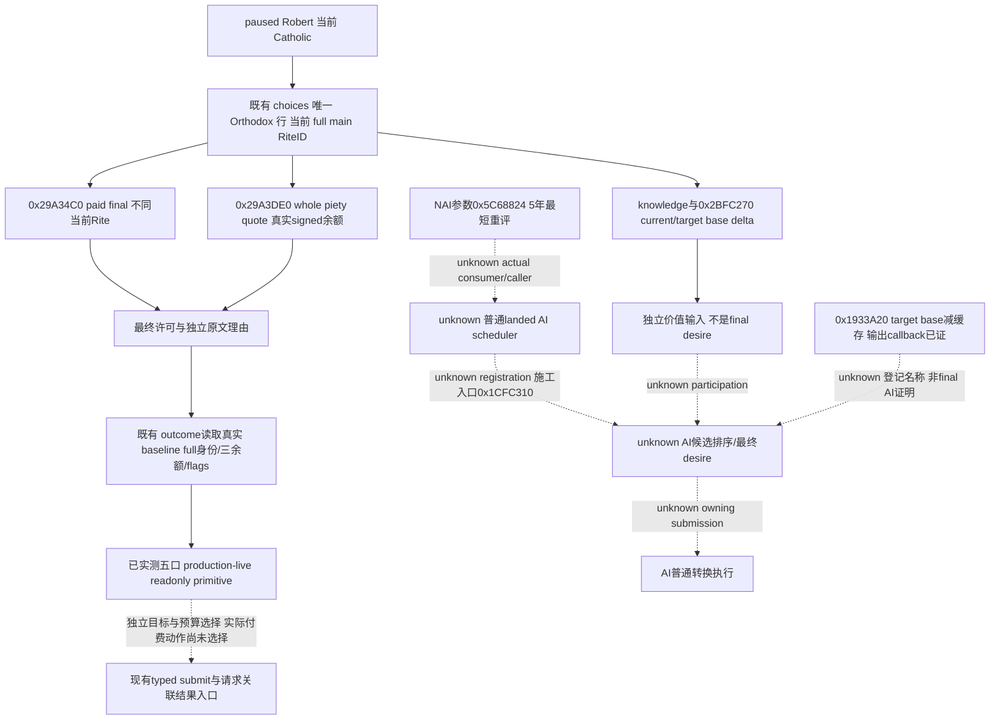

# CK3 1.20.0.3：Robert 普通本人改宗的最终输入与原生 AI 边界

2026-10-03，**Robert 当前目标的五个只读口已达到 production-live primitive；原生 AI scheduler/desire 仍为 research**。宗教已全面开放。本包固定一条普通本人转换预览：当前 Catholic Robert29829 → **Orthodox 的当前原生 main Rite**。新实测得到 native paid final=false：报价777piety，实际余额365.7625；原生理由明确指向虔诚不足。它复用已发布的 conversion 查询，保持 Catholic，也不新增 G2 完成项。Orthodox 是本次输入研究目标，尚未被选为自动策略或付费动作；没有改宗动作或conversion loop。

## exact build、来源与目标

游戏为 **1.20.0.3 Crozier / Steam25652598**，EXE SHA-256 `94B55397ABB687A3DCD436805A5D885E6BE90FA6C693FEB44A9E3BBEEADE02A6`。源码只读冻结于 [production-source-1bb3eee9](Z:/ck3_mod_rewrite/artifacts/g2-maintainer-2026-10-02/resume-12003/production-source-1bb3eee9/)；本包只写此新专题和 [外置证据目录](Z:/ck3_mod_rewrite/artifacts/g2-maintainer-2026-10-02/resume-12003/religion-conversion-12003/)。游戏、SDK、pipe、窗口、共享 bridge/driver/MCP、Git 和中央报告均由 ROOT 统一负责。

已读 [README](README.md)、[integration](ck3-1.20.0.2-religion-integration.md)、[现有转换与改革树](religion-conversion-and-reformation-native-ai-12003.md)、[本人 typed action 的独立施工账本](religion-self-conversion-action-native-ai-12003.md)及 [.2 AI 输入树](ck3-1.20.0.2-religion-conversion-ai.md)。这些专题和已有 fixture、严格构建、真实宗教 context primitive 直接复用，未重跑旧矩阵。

当前原版 `common/religion/faith_types/00_faith_types.txt:535–542,656–665` 把 Catholic、Orthodox 分别指向 `roman_rite`、`byzantine_rite`，两者 Religion 都是 `christianity_religion`。`history/faiths/00_christianity.txt:77–98,189–200` 在 1054.7.16 创建这两条主 Rite；因此1066 Robert主线的静态目标有明确来源。历史定义不会固定运行时 full identity：新 `choices` 返回的 `faith_key=orthodox` 行及其 **`main_rite_id`** 才是实际请求目标。不得把 `orthodox` 的 FaithID、静态序号或旧 full RiteID 发给 native terms。

全部精确行文与 SHA 在 [SOURCE-AND-CORE-PROOF-12003.json](Z:/ck3_mod_rewrite/artifacts/g2-maintainer-2026-10-02/resume-12003/religion-conversion-12003/SOURCE-AND-CORE-PROOF-12003.json)。这是首批 `1bb3eee9` 离线截点。后续ROOT已在source/native/environment `f30579bf6405e183192c96ea6b9bc35dddd11eec` 上完成实际目标预览；其完整原始记录与独立结果见下节，历史静态pin和失败回执均保留。

当前 `common/scripted_rules/00_rules.txt:38–89` 给普通 Faith 转换adult、非当前Faith head/antipope、目标main Rite enabled/convertible与两个block变量门；原文的GHW参与布尔只保留为最终native判定输入，本包不展开战争。Catholic→Orthodox 使用同Religion知识分支，`pam_values.txt:169` 的阈值为 **0.5**，比较是 `>`，恰好0.5不通过；other-Religion阈值是0.6。若目标Faith等于 `top_liege.primary_title.state_rite.faith`，规则先跳过知识与recent-conversion两门。State Rite身份必须真实读回，不从领主或省份宗教猜测；完整 paid final仍是最终入口。

## 一条可直接执行的只读查询链

现有接口均从 session 当前玩家取得 actor。`expected_revision` 使用每次请求前的新 public revision；native revision、capture epoch、当前日期与 full IDs 分别保存。只读 helper 自身从 finite semantic frame 绑定 revision，不复制整段历史。

| 顺序 | 已发布 MCP / selector | 精确消费 |
| --- | --- | --- |
| 1 | `ck3_query_player_religion_conversion_choices_v1` / `query-player-religion-conversion-choices-v1` | `faith_choices.choices` 中唯一 `faith_key=orthodox` 行：`faith_id/main_rite_id/native_faith_rule_passes`；同时保存 current Faith/Rite成员。候选与 Faith-rule 不是付费最终许可 |
| 2 | `ck3_query_player_religion_conversion_terms_v1` / `query-player-religion-conversion-terms-v1` | 动态 full `target_rite_id`；`can_convert`、`final_gate.validator_with_payment` 与 `different_from_current_rite`；独立 `cost.piety_points/piety_cost_raw/actor_piety_raw/can_afford_piety` |
| 3 | `ck3_query_player_religion_conversion_reasons_v1` / `query-player-religion-conversion-reasons-v1` | 同一目标的 `native_paid_validator_passes/raw_native_text/ui_blocker_text`。当前语言原文保留；合法空文本不同于读取失败，`reason_codes_available=false` 不伪造机器原因码 |
| 4 | `ck3_query_player_religion_conversion_inputs_v1` / `query-player-religion-conversion-inputs-v1` | 目标 knowledge、recent-conversion、same Faith/Religion、realm-state 身份，以及 current/target **base** fulfillment、signed base delta；这些是独立输入，不能合取替代 native paid final |
| 5 | `ck3_query_player_religion_conversion_outcome_v1` / `query-player-religion-conversion-outcome-v1` | **动作前 baseline state**：真实当前 Rite/Faith/Religion、piety/gold/prestige 三余额、knowledge/fulfillment/baseline 与三个转换 flags。此轮无动作，`target_reached` 只是身份匹配，不能给转换 outcome credit |

ROOT 可以直接使用外置 [ROOT-READONLY-CHOICES-CALLS.json](Z:/ck3_mod_rewrite/artifacts/g2-maintainer-2026-10-02/resume-12003/religion-conversion-12003/ROOT-READONLY-CHOICES-CALLS.json) 跑第一步，随后用 [select_orthodox_target.py](Z:/ck3_mod_rewrite/artifacts/g2-maintainer-2026-10-02/resume-12003/religion-conversion-12003/select_orthodox_target.py) **纯文件**读取这份已关闭的 actual record，生成四个目标只读 calls 和原候选的 selection receipt。脚本不连接 SDK，不改变 source 或存档，也不选择动作；Faith-rule=false 的候选仍进入最终理由预览。新 calls 交给既有 `root_registered_readonly_wire_capture.py`，传当前 actor29829 / 当前 episode / 当前 paused 日期。两段采集之间不推进日期即可比较当帧材料，不要求重启或新配置框架。

所需现有 opt-ins 是 `--private-player-religion-conversion-{choices,terms,reasons,inputs,outcome}-query`。花括号表示五个已经存在的完整 flag，不能作为一个 argv 字符串。`terms` 同 permit 还注册了 typed submit/result，但本 calls 清单只包含五个 `ck3_query_*`。此包没有修改 permit、flag 默认值或 action admission，也不以新门禁阻断当前非宗教普通玩法。

## 原生 paid final、费用与结果来源

普通转换本地 command 为 **0x30-byte `CConvertFaithAndRiteCommand`**：primary VT `0x4770340`、secondary VT `0x47703D8`；actor `+0x20`、full Rite `+0x24`、`pay_piety=1` 在 `+0x28`。现 preview 只调用 validator/quote，不 enqueue/Execute。

| 原生入口 | 已闭合语义与现 provider |
| --- | --- |
| `0x1D635E0` Faith-rule | Native world Faith registry candidate reader；排除 same Faith 并求 scripted `faith_conversion`。当前题的 Orthodox 是不同 Faith、同 Religion，但知识、head身份、可转换等仍取真实条件，不从静态 Catholic 推断通过 |
| `0x1D63700` Rite-rule；`0x29A34C0` paid command validator | `ReadRitePreview12002` 与 `ReadPlayedReligionConversionTerms12002`；`can_convert = different_from_current_rite && validator_with_payment`。余额、知识、same-Religion不能覆盖这个原生结果；unpaid bool不能当 paid 许可 |
| `0x29A3DE0` final piety cost | `int32_t(const Command*, tooltip_or_null)` 返回 **whole piety points**；`piety_cost_raw=points×100000`。当前费用由完整 native evaluator 决定，stock最小250、同Religion折扣或精神满足度修正都不是本次最终报价。`charge_piety=true`，signed余额照实保留；`can_afford_piety` 与 native paid final分别发布 |
| `0x29A34C0` + 原生32-byte MSVC string / `0x856050` 析构 | 独立 reasons reader 抽取当前语言完整原文。terms内 `native_blocker_text_available=false` 是其自身未带文本；不能说现成 reasons口也缺文本 |
| `0x2BDBDE0` knowledge；`0x2BFC270` base fulfillment | 输入 reader 直接读 native 数值；base getter ABI 为 `int64_t*(out,Character*,Rite*)`。`expected_base_change_raw=target_base-current_base`，不是最终 AI desire、当前真实 fulfillment 或动作收益 |
| 现有 `conversion_outcome12002_*` readers | 独立实际状态，`target_reached_is_identity_only=true/conversion_causality_inferred=false/is_conversion_gain=false`。未发生动作时只能叫 baseline；资源槽之外的数据不会由预测补成实际收益 |

`.3` 的 Rite/reasons 比较复用 [religion-supplement summary](Z:/ck3_mod_rewrite/artifacts/migrations/2026-10-02/abi-comparison/religion-supplement/summary.json)。该16模块旧比较没有覆盖完整 Faith-rule、quote与base getter函数；本包只补这 **3个必要完整 body**，在冻结新 EXE 上读取并与旧已审 manifest逐字节比对，全部GREEN，不重跑旧 verifier、fixture或全域ABI检查。三个body分别是 `[1D635E0,1D636F6)`、`[29A3DE0,29A4247)`、`[2BFC270,2BFC457)`；原文/指令在 [新三函数 disassembly](Z:/ck3_mod_rewrite/artifacts/g2-maintainer-2026-10-02/resume-12003/religion-conversion-12003/faith-rule-final-cost-base-input-12003.disassembly.txt)。这是实际新 SHA 静态证据，不能提升为Robert paused/live。

付费动作的真正 owning submit、channel0x0E、clone、Execute、signed piety callback及Character+0xB4 setter 已由[本人动作专题](religion-self-conversion-action-native-ai-12003.md)冻结。此包不重复提取。该输入研究不将当前source的submit登记、queue ACK或旧合成Pythoncase计作真实改宗；动作若未来被ROOT选中，仍须其请求关联before/once submit/independent result和正常后继材料。

## 2026-10-03 06:46：Robert 新PID普通改宗目标实际预览

ROOT 在 **PID64876 / actor29829 / raw53226552** 同一暂停日期完成两阶段采集。实际 source runtime 为 [production-source-f30579bf](Z:/ck3_mod_rewrite/artifacts/g2-maintainer-2026-10-02/resume-12003/production-source-f30579bf/)，ROOT绑定的 source/native/environment 完整HEAD为 `f30579bf6405e183192c96ea6b9bc35dddd11eec`；正式environment SHA为 `b8a8f48f37324884afa8d7055cd764f0c45c5af9ae82b34e18c62894f1b916be`。episode仍为 `native-29829-2bc2d599f7f9`，ordinary_campaign_succession / xar_off / pact absent；实际初末帧均paused、无active event或pending interaction、没有日期推进。game/EXE身份与上文exact `.3`相同。

第一段 [actual choices](Z:/ck3_mod_rewrite/artifacts/g2-maintainer-2026-10-02/resume-12003/actual-v27-religion-sway-conversion-cold-01/007-ck3_query_player_religion_conversion_choices_v1.json) 为 **available=true / status=observed**，native revision3、capture epoch9680。真实行是 `faith_id=24 / faith_key=orthodox / main_rite_id=153 / native_faith_rule_passes=true`。当前Faith23的Rite集合为 `[152,224]`，membership不是最终许可。ROOT使用上文纯文件selector取得153，未硬编码旧目标。第二段 [四个目标查询 result](Z:/ck3_mod_rewrite/artifacts/g2-maintainer-2026-10-02/resume-12003/actual-v27-orthodox-conversion-preview-01/result.json) 06:46:43–06:46:59（Asia/Shanghai）正式关闭，**4 calls CLOSED / harness GREEN / official driver.close returned**；全部available=true、failure=null，native revision4 / public revision2。两个native revision分别保留，不假称五次请求是同一capture epoch。

| 实际口 | 当帧完整关键信息 | 此次资格 |
| --- | --- | --- |
| choices | Orthodox Faith24 → main Rite153；native Faith-rule=true；当前Catholic Faith23成员Rites152、224 | Robert实际候选/身份只读primitive；不是允许改宗 |
| paid terms，epoch20970 | current Rite152 → target153，**different=true / same Faith=false**；unpaid validator=true，**paid validator=false / can_convert=false** | 有效最终许可只读primitive；false是真实游戏条件，不是provider/harness RED，也不是同Rite早退 |
| native quote，随terms同epoch | **777points / raw77700000 / charge_piety=true**；actor余额**raw36576250=365.7625**，can_afford=false | 真实当帧原生报价与余额；没有支付。两数相减的缺口411.2375只是直接算术，不冒充native CalcPietyMissing查询 |
| reasons，epoch21292 | available=true，native paid validator=false；原生当前语言完整文字表示“没有777虔诚”，raw文本与UI文本含原生控制token并已保留；reason_codes_available=false | 实际原生拒绝文本primitive；terms自身text_available=false不否定独立reasons口的真实文本 |
| inputs，epoch21578 | knowledge **raw96000/100000=0.96**，recent=false；actor/target Religion均8；realm State Rite/Faith合法不存在，目标match=false；base current=0 / target=0 / expected change=0，均available | 独立目标输入primitive；0是已观测合法零值。知识高于同Religion0.5门且Faith-rule/unpaid通过，付费拒绝与实际不足余额一致；不能把base0叫当前真实fulfillment或native final desire |
| independent baseline outcome，epoch21906 | target_reached=false；实际仍**Rite152 / Faith23 / catholic / Religion8**，Faith main Rite152；piety365.7625、gold1057.28817、prestige2656.8025；真实fulfillment **5**、baseline0、target knowledge0.96；三个conversion flags都registered且absent | 独立当帧状态primitive；absence的timed/expiry字段null是合法没有flag，不是丢失数据。未改宗，不归因收益，不算动作material |

原生 `raw_native_text` 的完整带格式内容、全部source文件SHA和实际component字段只离线提取一次，保存到 [ACTUAL-FIELDS.json](Z:/ck3_mod_rewrite/artifacts/g2-maintainer-2026-10-02/resume-12003/religion-conversion-12003/actual-v27-robert-orthodox-preview-01/ACTUAL-FIELDS.json)，SHA `45d201f4f2f505ca350252fd6631d44432bf4c738d109408b8be7cba57a5ca11`。摘要里的“没有777虔诚”是对原生markup文本的可读释义，不覆写原文或生成机器原因码。

本次五个现MCP对这条真实Robert目标的readiness均为 **production-live primitive**，并闭合其组合作为实际只读改宗预览的价值：现在可以区分“候选规则通过”和“普通付费动作当前不可执行”，还能取得具体原生拒绝、最终费用与真实baseline。**paid actions=0 / conversion_submitted=false / conversion material=0 / game days added=0 / G2 credit added=0**。没有收集owning action result或验证改宗后的next-turn/cold，当前Catholic不是转换成功证据。ROOT随后继续原普通主线；这五口不需要重复实测或为凑动作信用改信仰。

## 原生 AI：已定位输入与未闭合分支（继续保持research）

原版 `NAI.MIN_YEARS_BETWEEN_RITE_CHANGE=5` 表示 landed AI 重评Rite的最短年数；原参数绑定 `0x5C68824`、注册 `0x1A62780`。玩家 UI recency flag是另一条 stock effect，不能据此设“每五年必转换一次”的策略。

为把旧AI账本的模糊caller缩小到真实施工点，本包在新EXE上逐一验证已知 **7个 direct E8 base-getter callsites**，得到 **6个不同 runtime函数**；不是全EXE新的caller census，也不证明没有其他间接或inner-helper AI路径。原文在 [AI-CALLERS-12003.json](Z:/ck3_mod_rewrite/artifacts/g2-maintainer-2026-10-02/resume-12003/religion-conversion-12003/AI-CALLERS-12003.json)。`0x2AEC800` 是已证 script expected-base-delta evaluator，`0x1933ADE` 属于同一函数的一个chained unwind区间；不能把中间区间错认成完整AI function。

该父函数 **`0x1933A20`** 的5个完整unwind regions `[1933A20,1933BA0)` 已另行合并，见 [DELTA-COMPARATOR-UNWIND-12003.json](Z:/ck3_mod_rewrite/artifacts/g2-maintainer-2026-10-02/resume-12003/religion-conversion-12003/DELTA-COMPARATOR-UNWIND-12003.json)。它解析当前played Character与目标full Rite，调用target base getter，再减 Character extension **`+0x300`** 的缓存；extension缺失时调用 `0x2BFB4C0`。末尾把差值送 `0xEDF830`、`0xF10830` 的输出路径，并清理字符串。本包没有闭合此callback的登记名称/业务身份，因此只记录实际数据流，不把它叫native AI desirability或scheduler，也不擅改现有base-minus-base DTO。

候选相关另一个已知函数 **`0x1CFC310`** 具有实际世界Rite/同Faith候选集合、Rite `+0x4E9` 状态过滤和base getter调用；`+0x4E9` 不能当完整 paid conversion rule。它还把base结果取负后存入排序pair，某个flag分支要求该值优于既有比较值；flag的业务名称、登记者与AI顶层使用仍unknown。后续原生AI研究的具体入口是：从该函数与 **`0x5C68824`实际消费者** 绑定 registration/完整caller，到landed AI evaluator，再冻结候选排序与owning command submission。不能把已有 reform handler `0x1A9D890` 直接改名为普通转换 scheduler。当前本人只读预览具有独立价值，这些AI质量差距不阻塞读取 native paid final/quote，也不被宣布已完成。

## 交付、测试与剩余项

首批离线包新增一次三函数静态比较、一次7个已知callsite验证及一次实际父函数5区间unwind闭合；该截点没有游戏/SDK调用或fixture重跑。其原始文件pins与交付字段保留在 [首批 REPORT-FIELDS.json](Z:/ck3_mod_rewrite/artifacts/g2-maintainer-2026-10-02/resume-12003/religion-conversion-12003/REPORT-FIELDS.json)，当时的offline状态和旧topic pin按当时版本理解。后续ROOT五个实际只读查询另有独立v27回执，不改写原静态截点，也不混入付费动作或游戏日。两次可核验增量均交给ROOT汇入当日日报和周报。

后续实际交付已见 [v27目标预览 REPORT-FIELDS.json](Z:/ck3_mod_rewrite/artifacts/g2-maintainer-2026-10-02/resume-12003/religion-conversion-12003/actual-v27-robert-orthodox-preview-01/REPORT-FIELDS.json)。ROOT完成上述唯一两阶段只读链，本worker只从已关闭artifact离线提取一次并更新本文，没有再次SDK/query/fixture、native逆向或游戏操作；源码与原静态proof不变。本目标输入已闭合，继续保持Catholic与普通主线。将来明确的玩法用途若需要付费转换，再使用当时的fresh目标/quote和既有typed提交/独立result；原生AI scheduler/desire及任意改宗action/loop、通用宗教complete都仍不具备当前资格。
