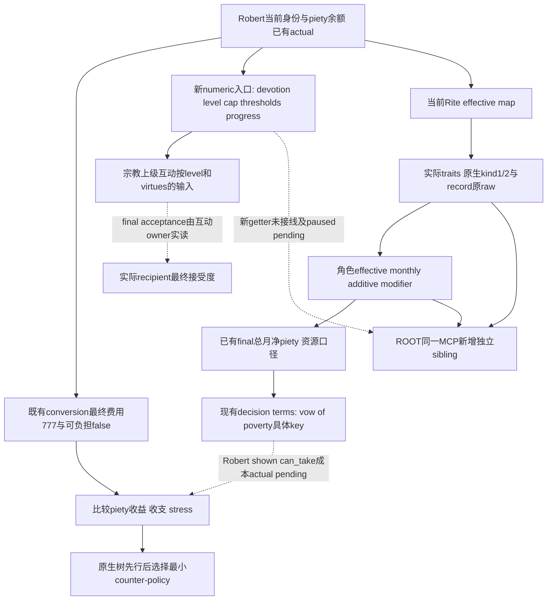

# 1.20.0.3：奉献等级、德性与罪性的原生输入

本包闭合当前构建的奉献等级／阈值与有效德性判定树，给下一项只读 getter 提供可直接施工的入口。状态是 **research**：17 段新 exact-build 原生代码及 10 份 stock 输入已冻结；没有修改生产 reader、编译 fixture、调用 MCP、推进游戏或取得新的 Robert paused 材料。既有月度虔诚和改宗 final 的实机资格仍回链各自专题，不能转授本页的新字段。

构建为 CK3 `1.20.0.3 Crozier`／Steam `25652598`，EXE SHA-256 `94B55397ABB687A3DCD436805A5D885E6BE90FA6C693FEB44A9E3BBEEADE02A6`。宗教已经全面开放；本页遵守 Robert29829 唯一入口与 ROOT 实机单一 owner，不新增战争动作。复用[月度虔诚](monthly-piety-native-ai-12003.md)、[宗教关系任务值](religious-relations-task-value-native-ai-12003.md)、[治理与宗教意见](religion-governance-opinion-native-ai-12003.md)、[精神满足度](religion-spiritual-growth-and-maintenance-native-ai-12003.md)和[普通本人改宗](religion-conversion-native-ai-12003.md)。朝圣、信仰领袖互动及教会收入由各自工作包继续，不在这里重建其策略。

原始代码／调用点／typed 合同见 [PROOF.json](Z:/ck3_mod_rewrite/artifacts/g2-maintainer-2026-10-02/resume-12003/religion-devotion-virtues-12003/PROOF.json)（15,588 bytes，SHA `4528b5235a97665c13f84bf84deebfff0ea2bace2fb8c4e5dc978fbedef5d3d7`）。[STOCK-FACTS.json](Z:/ck3_mod_rewrite/artifacts/g2-maintainer-2026-10-02/resume-12003/religion-devotion-virtues-12003/STOCK-FACTS.json)保留逐文件哈希及原行号摘录；[research_devotion.py](Z:/ck3_mod_rewrite/artifacts/g2-maintainer-2026-10-02/resume-12003/religion-devotion-virtues-12003/research_devotion.py)只读取磁盘 EXE，原 literal、注册、数据与反汇编分别保存，未附加进程。

## 先分开三个量

| 量 | 原生意义与当前证据 | 策略用途 |
| --- | --- | --- |
| 可花费虔诚 | 既有 campaign／conversion outcome 的玩家资源余额；v27 raw53226552 的改宗 preview 是365.7625 | 与同帧 final777虔诚费用比较；不能用奉献等级代付 |
| 奉献等级及其进度 | 本页新闭合：独立累计进度、threshold 和 cap 决定 level；尚未查询 Robert | 对原生等级门槛、接受度、按等级修正和下一等级距离提供输入 |
| 精神满足度 | 已有 current5、level3／7及58.333%的独立组件 | 属于 Rite fulfillment；不能命名为奉献等级或可花费虔诚 |

当前 preview 的同帧资源缺口是 `777 − 365.7625 = 411.2375`，仅为该已保存 preview 的算术派生。历史实读总月净虔诚0.4375来自另一个 paused 查询，不与该 preview 拼成同帧数据，不据此承诺达到777的日期。策略应比较真实可执行的增益途径，并在付款前复用既有 native final／费用／余额；等级提高本身不证明可花费余额达到777。

## 原生奉献等级与阈值

`.3` `Character.GetPietyLevel` literal `0x459EEA8` 在 `0x55BD69`注册至 GUI wrapper `0x28CF7C0`。wrapper 调用真正的数字入口 **`int32_t GetPietyLevel(Character*) @ 0x28BE0D0`**，随后把结果装箱；不要把 GUI wrapper 当成数字 getter。

数字入口读取 `Character+0x1B0` 的扩展，再读 `+0x118` 的累计进度及 `+0x120` 的限制值。它逐项比较当前 runtime threshold，保持原生 equality／signed 分支，再返回实际 level。threshold vector 的指针／计数位于 `0x54582D8 / 0x54582E4`。这里的 `+0x118` 与既有资源余额字段不同，不能用余额自己重建等级；也不能从等级反算当前余额。

stock `common/defines/00_defines.txt:154–175` 当前定义 `LEVELS_PIETY = {1000 1500 2500 4500 8500 13000 17000 22500}`、默认 cap5、`PIETY_ZERO_LEVEL=1` 和下降保留进度参数0.5。`00_basic_values.txt:665–673` 把常用等级标记绑定1／2／3／4／5，另有6／7／8。**这是 authored 输入，不是 Robert 实际等级或当前 cap。** stock 存在 `character_max_piety_level_add=1/2/3` 的 Mandala 修正，不能硬编码最高等级5；本页不据此给 Catholic Robert 添加该修正。

进度的 literal `GetPietyProgressTowardNextLevel @ 0x4806A38` 经注册 `0x5B1949` → GUI wrapper `0x2BB1670` → **`int64_t*(int64_t* out, Character*) @ 0x2BB08B0`**。core 构造原生 `PlayerValueItem` scope：Character pointer在+0、tag0在+8，调用 `0x26978C0` 取得Q100000 ratio，再按原生定点运算乘100。该 core 的输出单位是 **percent，scale100000**；例如100%为10000000，不是月增长。

`0x26979F0(scope, int64_t* numerator_out, int64_t* denominator_out)` 是可直接复用的阈值进度入口。它调用 `0x2696750` 取得实际 vector（data+0、count+0xC、8-byte raw stride），调用 `0x2696520` 取得当前 level、调用 **`0x2696670` 取得当前有效 cap**，然后读取该level实际 lower／upper，计算累计进度相对lower的numerator和区间span。native terminal／cap分支保留其自身零numerator与denominator100000语义；我方不能强行改为100%或固定“已完成”。

有效 cap 路径保持 Character scope，取 `Character→0x28C2E10` 的 modifier data，读取+0xD98，再调用 `0x28CCC60(Character*, limit, modifier0x258, default_cap)`。最终函数从当前 modifier view读取 Q100000 cap增量，采用原生取整、非负处理及limit。`GetMaxPietyLevel` 注册后的 `0x30A8DF0` **receiver是modifier data对象**，直接读取该对象+0xD98；不得把Character pointer传给它。实现优先调用已闭的scope cap入口，不自行拼这个对象。

## 德性／罪性采用当前 Rite 的有效判定

stock `_religion_types.info:25–33` 说明 Religion 可定义德性／罪性及权重；opinion看“评价者”的信仰，拥有者获得对应 owner modifier；`_tenet_types.info:119` 说明 tenet 的同trait定义优先于 Religion。当前 `NRite.MAX_VIRTUES_SINS=7` 针对 core／approved tenets 按权重保留，不能只把Christianity或某个tenet的静态trait表作为当前effective表。

两项 native trigger 的实际 count 分支已经闭合：

| 输入 | 原生入口 | 实际作用域与语义 |
| --- | --- | --- |
| `num_virtuous_traits` | 注册0x5A7981 → factory0x2B6AA60 → effective count0x2B6B960 | 使用脚本显式Rite参数；未传参数时取被计数角色当前Rite |
| `num_sinful_traits` | 注册0x5A7A21 → factory0x2B6AAB0 → effective count0x2B6B790 | 同样使用参数或该角色当前Rite |
| 一个trait的有效分类 | **`int32_t(Trait*, void* effective_map, void** record_out) @ 0x2BD84A0`** | map为实际Rite+0x950；0=neutral／absent、1=virtue、2=sin |

两个 count 都迭代角色实际 `+0xF8` trait ID数组／`+0x104` count，用现有 trait DB `0x89E5B0` 与 `0xC85E80` 解析当前 Trait，然后调用同一classifier并对kind1或2各加1。**count是数量，不是权重之和。** 最小只读实现可复用该原生trait解析／classifier循环，无需构造占1D0 bytes的完整脚本trigger或fake script scope。

classifier是真正当前effective map查询，并可在R8非null时给出匹配record；neutral缺席返回0且record=null。`0x2597583`的真实opinion consumer读取record+0x18作为其原生权重输入，保持对应virtue／sin分支。`0xBE3E5B/0xBE3F03`的tooltip consumer独立读取record+0x20作为owner modifier显示输入。两槽分别发布原raw和来源；不能把opinion权重挪作月增长，也不能把trait count当weighted contribution。实际月度资源仍由已有final汇总getter确认。

`00_religion_modifiers.txt:1–20` authored `virtue_owner_modifier.monthly_piety=+1 / zealot_opinion=+10`，`sin_owner_modifier.monthly_piety=−1 / zealot_opinion=−10`。它们是definition基值，不是Robert实际数量、有效权重或总月净值。当前实际有效角色修正可以复用 **`Character→0x28C3AE0` → view+0x68 → `0x2303700(modifier_component, int64_t* out, uint16_t modifierID0x61)`** 的signed Q100000读取；这项ordinal及getter复用[宗教关系任务值](religious-relations-task-value-native-ai-12003.md)已经保存的exact证明。本包不重新验证该旧ABI。

这里只读角色aggregate的 `monthly_piety` additive modifier，不能把它命名为“德性净贡献”：它也可能包含其它角色修正。已有 campaign 的 **final总月净虔诚**仍是实际收益口径。若策略需要解释某个trait的收益，读取当前Rite effective record及该trait材料，再以实际最终月率的独立before／after确认，不从总月0.4375倒算德性或罪性。

## 接受度与补足资源的实际施工顺序

`00_religion_scripted_modifiers.txt` 的原生脚本明确消费这些core输入：`religion_scaled_virtuous_traits_modifier`／`religion_scaled_sinful_traits_modifier`使用caller给定CHARACTER的数量；两处宗教上级接受度分支对actor的每项德性加10，并在actor `piety_level>1` 时加 `20×level`，还独立读取宗教上级→actor总opinion。caller的recipient／secondary_recipient不同，完整 final由对应互动owner读取；本页不会把这些项相加后冒充最终接受度。

一个有具体stock价值、可以用既有decision final leaf检查的非战争候选是 **`take_vow_of_poverty_decision`**：当前Rite必须有 `vows_of_poverty_active`，角色是ruler且未持有对应modifier才shown；effect添加modifier，并给greedy／cynical／ambitious角色不同stress／fulfillment影响。modifier authored值为**monthly_piety+2、monthly_income_mult−0.2**及两项+5opinion。原生AI的potential先要求收入超过支出的1.4倍；check interval各county及以上120、barony0，`ai_will_do` base0后用ai_zeal5和ai_greed−5。策略可以采用这条原生收益／财政取舍作为输入，不要求照抄AI权重。

该decision当前是否对Robert显示／可执行**尚未实读**。它应进入现有原生decision terms reader的一个具体key，不需要为所有religion建立通用框架，也不能为启用它就先改宗。`renounce_vow_of_poverty_decision` effect实际扣 `medium_piety_loss` 并移除modifier；这是effect内的资源变化，不能因CCost quote可能为零就称撤销免费。收支和stress成本确认后才由ROOT选择有益动作。

最低施工包是现有 `ck3_query_player_religion_context_v1(expected_revision)` 的独立 sibling `player_piety_devotion_profile`，复用本次actual played actor、date和epoch，原Context的available保持独立：

1. 发布effective level、effective cap、当前累计进度、原生percent／numerator／denominator及当前level threshold；调用上面已闭数字入口，保留原生terminal分支，零值与读取失败区分。
2. 发布当前Rite identity、effective virtue／sin数量及真实trait rows；每row保留trait ID、kind、原生record两槽原raw。只处理Robert当前Rite，不使用Faith main Rite替代，不额外收集全角色目录。
3. 发布已有ordinal0x61的角色effective additive monthly modifier；同时复用campaign现有final总月净资源率，两个字段分开。付费转换最终成本与余额继续走现有query。
4. 一条production owner→numeric/classifier→serializer→Python真实wire fixture，随后ROOT在同一Robert paused帧一次现有MCP query；新字段在实际available后才升为production-live primitive。没有新gate、新注册MCP、新的通用modifier框架或额外全仓审计。

原生决策链落盘后，ROOT可先用这个包对“维持现状／当前自然事件／当前可用虔诚增益decision／朝圣报价”作最小、可验证的选择。当前被明确解锁的价值是看见等级门槛与有效monthly修正，进一步量化现有虔诚增长路线；它不保证777费用是有益支出，也不授予自动改宗或完整宗教OODA资格。

## 交付与进度记账

本包于2026-10-03实际补录；所引v27 preview和历史monthly资料保持原帧日期，不写为最新3563天末帧。17个native spans是本次新静态研究，一次读取冻结EXE哈希后落盘；旧月率／任务modifier ABI直接复用。原reflection `GetMaxPietyLevel`的receiver问题已经在本页修正为modifier data对象，不能复制早期探索名词当Character getter。

没有新prod源码、fixture结果、live artifact、付费decision、trait修改或G2 credit。未完成项为上面一个有确定RVA／参数／scope的只读接线包和随后Robert paused观测；它们不再被宗教暂缓规则阻挡。日报／周报由ROOT的中央报告owner合并本页字段，Git提交／推送由ROOT执行；本分包不编辑共享索引与报告。
