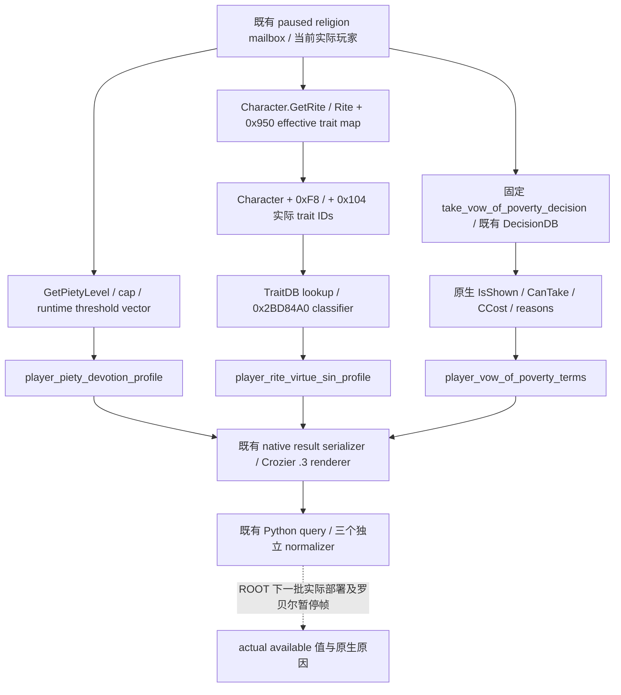

# 奉献等级、当前 Rite 德性与贫穷誓愿：最小原生观测实现

**2026-10-03 11:29 接续采用：** 用户恢复工作后，原封存12代码路径已采用到 `Z:/g33` 集成源码，CMake、同actor religion mailbox和三个Python sibling接线完整。复用原两case/55checks与两genuine wire GREEN，无新源码语义、无重复验证。组合DLL和Robert4639新暂停帧尚待ROOT完成，状态仍为static-ready。此前“未参与v32”事实保持；新源码采用不等于部署或live。见[接续账本](../handover/2026-10-03-g2-v33-resume.md)。

真实原生输入树已先冻结于 [宗教奉献与德性研究](religion-devotion-virtues-native-ai-12003.md)。本轮将三个实际决策依赖落到只读 reader，通过同一既有 `query_player_religion_context_private_v1(expected_revision=...)` 查询返回；没有宗教自动动作。验证状态是 **static-ready / synthetic fixture**，没有罗贝尔暂停帧证据，不能写成 `production-live primitive`。

构建绑定：CK3 **1.20.0.3 Crozier**，Steam **25652598**，EXE SHA-256 **94B55397ABB687A3DCD436805A5D885E6BE90FA6C693FEB44A9E3BBEEADE02A6**。实现基于 immutable `production-source-8cf176b4` 的外部投影；它没有参与 v32 的运行。

## 三个只读叶子的字段与用途

| 独立结果 | 原生字段/查询 | 实际决策价值 | 语义边界 |
|---|---|---|---|
| `player_piety_devotion_profile` | 当前 Character `+0x1B0` values 的 `+0x118` 累计奉献值；`0x28BE0D0` 等级；piety-tag-zero scope 的 `0x2696670` 有效 cap、`0x2696750` runtime vector、`0x26979F0` numerator/denominator；`0x2BB08B0` percent | 明确当前等级、动态上限、下一等级阈值与原生进度，避免用可消费虔诚余额代替奉献等级 | `raw_scale=100000`；percent 不是月变化；不可把 cap 等于当前等级强制算成终端；原生 terminal 条件 `level > cap` 或 `level >= count` 返回的 0% 保留 |
| `player_rite_virtue_sin_profile` | 实际 trait IDs `Character+0xF8/+0x104`；DB `0x89E5B0`；lookup `0xC85E80`；当前 Rite `0x28D2F90`；classifier `0x2BD84A0(Trait*, Rite+0x950, record_out)` | 取得当前 Rite 对罗贝尔实际 trait 的最终有效德性/罪性分类，包括 religion/tenet 覆盖；形成宗教候选的真实输入 | kind `0/1/2` 分别是 neutral/virtue/sin；计数不加权；每条 record `+0x18` opinion input 与 `+0x20` owner modifier scale input 分开保留，不计算最终好感或月虔诚；这两个输入字段不声明尚未闭合的单位 |
| `player_vow_of_poverty_terms` | 固定 `take_vow_of_poverty_decision`，复用 `.3` decision hash/lookup、root scope、`IsShown`、`CanTake`、`CCost` evaluate/affordable 和原生 final reason text | 直接回答当前玩家现在能否采取誓愿、是否显示、是否付得起、实际费用和拒绝原因，不再停留在参数 unknown | 只有 `CanTake` 与实际原生原因；没有执行誓愿；原生脚本 effect 中的其他副作用不属于 CCost；没有新增通用决议框架 |

每个结果都带同一次 callback 的 `capture_epoch/date_raw/played_character_id`。三个叶子的 availability 独立于旧 Faith Context 及其他宗教 sibling；奉献与 trait reader 仅复用 Context 的帧身份，不能被无关 Faith 读取失败抑制。当前 Rite classification 读取全代引用 `Rite+0x8`，并与实际 Character 当前 Rite 引用核对。trait count 为 0 时返回合法 `0/0/[]`。

## 接线与一次聚焦验证

新增生产文件：`ck3_12003_player_devotion_profile.hpp/.cpp`、`ck3_12003_player_rite_virtue_sin_profile.hpp/.cpp`、`ck3_12003_vow_of_poverty_terms.hpp/.cpp`；既有 mailbox 增加 typed bindings、同帧读取和独立序列化。Python 增加 `player_devotion_virtues.py` 与原有 transport 的三个 sibling normalizer。既有 MCP、权限 flag、当前玩家 selector 和协议不变。

2026-10-03 的唯一聚焦 C++ fixture，以离线 MSVC `/W4 /WX /permissive- /utf-8` 编译真正生产 reader、mailbox、序列化器和 `.3` renderer，**GREEN，2 个语义 case、55 个 checks**。native getters 由 fixture-owned typed callbacks 提供，数值为合成值，不能当作罗贝尔当前状态。case 覆盖普通动态阈值区间，以及当前等级高于动态 cap 时的原生 terminal 0%、null thresholds 与合法 zero trait count。两个 case 同时验证誓愿原生拒绝理由的 UTF-8、控制字符和 owned temporary 生命周期。

native 输出随后通过现有 Python `query_player_religion_context_private_v1` 和新增 normalizers，**GREEN，2 条真实 fixture-native wire**；三个 sibling 与 native 原始 result 逐值相等。Python 假 driver 只将固定 fixture request ID 换成查询生成的关联 ID，result 没有重写。没有重复旧 ABI、matrix、L0 或 native full build，没有 SDK client、pipe、游戏/窗口操作、生产 DLL 替换或 Git 操作。

证据路径统一相对仓库根：`artifacts/g2-maintainer-2026-10-02/resume-12003/religion-devotion-virtues-12003/implementation/`。`focused-native-build-01/RESULT.json` 为 C++ receipt，`GENUINE-WIRE-RESULT.json` 为 Python receipt；源码、base pins、ROOT-only diff 和逐文件哈希集中于 `ROOT-DELIVERY.json`。

## 尚未取得的实际结果与下一步

ROOT 在后续批次应用投影后，仅对罗贝尔作 paused actual 查询并冻结三 sibling。当前 readiness 是 reader 静态可用与合成 fixture 完成；发布代码与得到实际值后才能升级为 production-live primitive。是否实际适用誓愿由 ROOT 查询的 `is_shown/can_take/reasons` 决定；若原生 `CanTake=false`，理由仍是完整观测结果，不能以 authored 参数覆盖它。

原版 `vow_of_poverty_modifier` 的 **月虔诚 +2、收入 −20%** 是 stock authored 定义，既不是罗贝尔当前收益，也不是本轮收益测量。撤销誓愿的 `medium_piety_loss` 属于 script effect，不能拿 CCost 为零声称撤销免费。现有 `0x2696F40` 月虔诚总值口继续由已有 campaign 查询提供，不新增重复 total getter。当前 Rite 的德性判定不能当作教宗对玩家的最终接受度；该需求应使用另一 owner 的原生 interaction final modifier。

收尾采用说明：本页新增代码如有，仅封存为外置补丁，尚未应用到生产 v32；实际读取以本文标注的 artifact/date 为准。接续入口：[度假交接](../handover/2026-10-03-g2-religion-v32-maintainer-vacation-handoff.md)。
