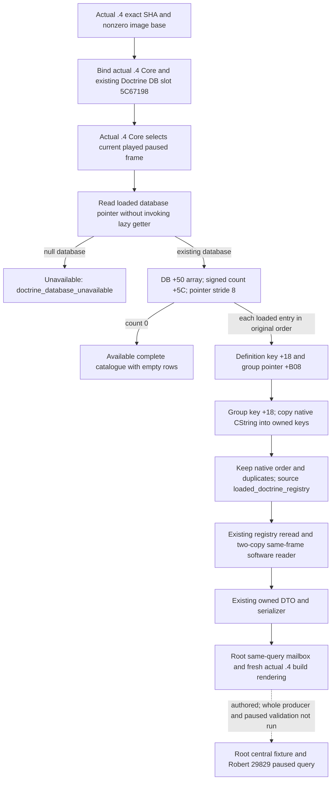

# Loaded doctrine catalogue migration to CK3 1.20.0.4

This observer copies the complete currently loaded doctrine catalogue for the
played character's paused frame. It retains loaded order, duplicates and mod
keys. `catalogue_complete` describes the loaded database, rather than a faith's
selected doctrines or a reform popup's legal choices.

This source tree and input ledger were written before the new binder. Status is
`AUTHORED_NOTRUN`: no build, fixture, MCP query or paused game was run in this
lane. Root owns the whole producer, exact build rendering and central validation.

The frozen build is Steam 25734779, CK3 **1.20.0.4**, executable SHA-256
`98702F88A547CDE2EAF29A85F93B85F68EE4CF8148336A4F7AFAEB75319DD518`.
The working baseline is `66cfb479801f0fc9f9fd518c7705c807e640cc4b`.
The [operand ledger](religion-doctrine-catalogue-12004-operands.json) pins the
actual .4 instructions and cached .3/.4 source pairs. No new executable bytes
were read for this migration.

| Input | Actual .4 source | Production role |
| --- | --- | --- |
| Loaded database slot | Complete `8FC740` getter, 87 B: RIP reads at `8FC744` and `8FC78B` both target `5C67198` | Binder reads the existing slot; it does not call the getter's initializer branch |
| Array / signed count / stride | `31E1141`, 41 B: `31E1146` loads DB+50; `31E114A` sign extends DWORD DB+5C; `31E114E` computes array+count*8 | All loaded pointer entries, including custom keys and duplicates |
| Definition group | `31E1163` compares QWORD definition+B08; independent `24FA28A`, 7 B, loads that same member | Actual group pointer, not an inferred category name |
| Definition key | `24FA521`, 4 B: `lea r15,[r13+18]` | Stable key CString |
| Group key | `31E0FB2`, 61 B: group+18; length member at `31E0FE3`; capacity member at `31E0FEA` | Stable group key CString |
| CString storage | Shared actual .4 inherited GDbo key constructor and inline/heap accessor; the shared receipt pins size+10, capacity+18, inline capacity15 and heap pointer+0 | Existing owned string copier; common string storage proof is distinct from the doctrine-specific object offsets |
| Current player / date / pause | Actual .4 `BindCoreImage` / `ReadCoreSnapshot` | Current frame; existing core source closure is reused |

The first five rows reuse
`Z:/ck3_mod_rewrite_process_assets/g2-migration-20261007/faith-tenet/implementation-caa4/doctrine-map/SOURCE-READY.json`,
its `layout/FAMILY-MAP.json` and the exact named DETAIL rows. Each used slice
completely decodes and preserves concrete member operands. Their candidate
locations were qualified by instruction, target and layout evidence; an ordinal
or uniform address delta alone is insufficient. These small slices prove the
listed fields, not complete postload or initializer behavior.

The shared basic migration's cost is 9,250 old-plus-new source bytes in 123 reads;
its doctrine family accounts for 1,922 bytes in 22 reads. The catalogue reuses
that material and the shared CString receipt without taking new source credit.
Own new executable bytes/read calls, metadata bytes, duplicate capture bytes and
hash operations are all zero. Cached JSON reads are source inventory, not new
executable captures.

The additive API is in `xar::ck3_12004::religion::doctrine_catalogue`:
`BindDoctrineCatalogueImage12004(base, sha)` and
`ReadPlayedDoctrineCatalogue12004(bindings, epoch, out)`. The binding and DTO
types alias the adopted software types. The binder supplies actual .4 Core and
the proved DB slot directly. It never passes a .4 SHA to an old image binder.
The .4 frame selector precedes the existing software catalogue reader and
owned serializer; native function addresses come only from the .4 Core binding.

The existing private step is `query-player-religion-doctrine-catalogue-v1` and
domain is `player_religion_doctrine_catalogue_v1`. The exclusive Python transport
change admits exact .4 build metadata through its existing build verifier;
schema shape, complete-empty semantics and row copying stay the same.

Root must connect the wrapper to the existing catalogue mailbox and render each
fresh producer result with actual .4 metadata. The new whole producer should
cover loaded custom keys with native order and duplicates, a known empty loaded
database, and an unavailable null database. These are whole-production-reader
scenes, not execution of EXE branches. A Root-owned current Robert 29829 paused
query remains necessary for live credit. No old catalogue result gives this new
build live qualification. Date of source work: 2026-10-07 Asia/Shanghai, ISO W41.
