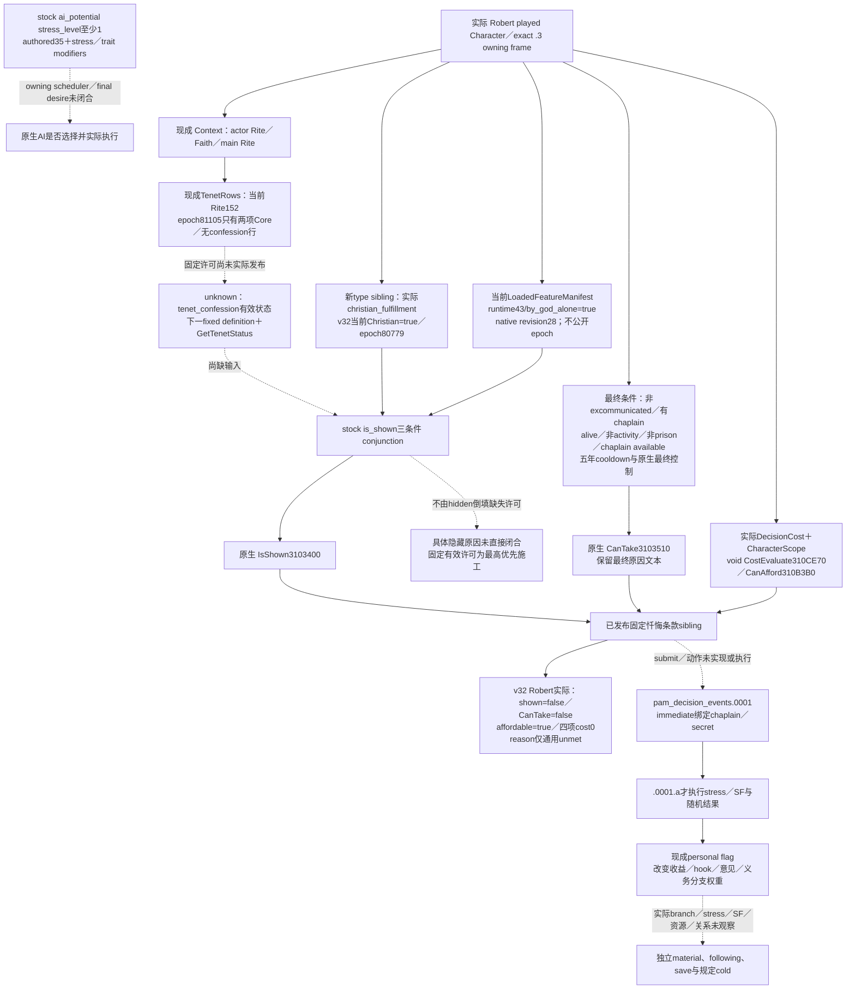

# CK3 1.20.0.3：罗贝尔的教义／信条玩法输入与忏悔入口

2026-10-03，阶段截止累计3834游戏日。固定决议 **`pam_decision_confession`** 的独立最终条款已在 v29 达到 **production-live primitive**，新增实际修行类型在 v32 同一宗教 Context 查询实读。ROOT 随后一次调用三个现成只读方法：当前罗贝尔的类型为 `christian_fulfillment`，当前运行期 `by_god_alone` 功能位为true；忏悔仍 `is_shown=false / can_take=false / affordable=true`、四项费用为零、仅通用“你未满足所有要求”。现成 TenetRows 实际输出两项Core，没有固定 `tenet_confession` 的有效许可状态，不能把缺行解释成false。因此具体隐藏原因尚未直接闭合，下一施工是补这个固定原生状态。未执行忏悔，也没有实测减压或宗教收益。

宗教领域按项目所有者最新授权全面开放。罗贝尔唯一测试入口和独立战争暂停继续有效。ROOT 独占源码集成与实机；本 worker 只完成后台研究、外置独占 leaf／fixture 及本轮 actual 离线提取，没有启动、附加或操作 CK3，没有 SDK／pipe／窗口／Git 操作，没有付费、任命、改宗、改革或军事动作。

## 版本与可复用实际基线

游戏为 **1.20.0.3 Crozier／Steam build 25652598**，冻结 EXE SHA-256
`94B55397ABB687A3DCD436805A5D885E6BE90FA6C693FEB44A9E3BBEEADE02A6`。新增 PE 研究读取 `artifacts/migrations/2026-10-02/installed-build/binaries/ck3.exe`，复用既有版本冻结，不重跑全 ABI 验证。首轮研究输入为不可变 `production-source-f30579bf`，完整 commit `f30579bf6405e183192c96ea6b9bc35dddd11eec`；14 个当前 stock 文件、20 个行窗、5 个实际源文件及新 PE 材料的哈希在 [SOURCE-PROOF](Z:/ck3_mod_rewrite/artifacts/g2-maintainer-2026-10-02/resume-12003/religion-doctrine-gameplay-12003/SOURCE-PROOF.json)。当前 v32 actual 绑定另列如下，不把历史研究源码当当前运行源码。

先读 [原生索引](README.md)、[身份／现行教义](religion-native-ai-faith-identity-12003.md)、[Doctrine 总览](religion_doctrine12002_overview.md)、[Core／personal Tenet](religion_doctrine12002_tenet_rows.md)、[personal flags](religion_doctrine12002_personal_parameters.md)、[原生婚姻](ck3-1.20.0.2-marriage.md)、[治理意见](religion-governance-opinion-native-ai-12003.md)与[神秘共融最终条款](religion-mystical-communion-native-final-terms-12003.md)。已有婚姻／家族 G2 证据、原生 provider、fixtures 和迁移结果直接复用，没有新增婚姻验收。

ROOT 的既有 [v27 Context 原包](Z:/ck3_mod_rewrite/artifacts/g2-maintainer-2026-10-02/resume-12003/actual-v27-religion-sway-conversion-cold-01/006-ck3_query_player_religion_context_v1.json)实际记录 actor **29829**、paused raw **53226552**、epoch **9380**，Rite **152**、Faith **23／catholic**、Religion **8**、main Rite **152**、精神满足度 **5**。这是该历史帧的实际身份和资源；它没有当前忏悔条款、Tenet 状态或 personal bonus，不把它外推成下一帧的动作资格。Murchad 和旧 Rogue 的 confession Core／参数也不能搬到本罗贝尔局。

## v29：罗贝尔忏悔入口的实机只读结果

ROOT 于 **2026-10-03 08:28:20–08:28:23（Asia/Shanghai）**执行一次既有 `ck3_query_player_religion_context_v1`，official result **GREEN／CLOSED**，driver close 已返回；初末帧均 paused、actor29829、date_raw53234568、native revision4。实际输出见 [v29 MCP 原包](Z:/ck3_mod_rewrite/artifacts/g2-maintainer-2026-10-02/resume-12003/actual-v29-religion-three-leaves-01/001-ck3_query_player_religion_context_v1.json)与 [official result](Z:/ck3_mod_rewrite/artifacts/g2-maintainer-2026-10-02/resume-12003/actual-v29-religion-three-leaves-01/result.json)。本 worker 只离线提取该已完成验收，没有重复调用或新增实机测试。

| 实际绑定／条款 | v29 paused 帧 |
| --- | --- |
| exact game／EXE | 1.20.0.3／Steam25652598；EXE SHA 与本页冻结值相同 |
| production source／native | `d1b5b4c5583fa428d9226d4ebe4431e0c8db3579`；v29 manifest 同 head；bridge DLL SHA `d3a851b9062a7b49e229ddd1cd92fd9b4781e14299b15788633bde1e5dffd31a` |
| prepared environment／PID | env `de0dd8c86b8d2edc11bf4475edfab62e8485076ebc8a8a60f93106b80ddd2345`；PID120436（ROOT live owner 提供，worker 未查询进程） |
| player／日期／捕获 | Robert29829；raw53234568；epoch17985；paused／map_ready=true |
| 身份／资源 | Rite152、Faith23／catholic、Religion8、main Rite152；SF raw500000＝5；仅该帧 |
| `player_confession_decision_terms` | schema `ck3_12003_confession_decision_terms_v1`；固定 `pam_decision_confession`；read_only=true、available=true、unavailable_reason=null |
| 独立原生谓词 | `is_shown=false`；`can_take=false`；`affordable=true` |
| evaluated 费用 | gold=0、treasury=0、prestige=0、piety=0；raw_scale100000。这次是真实报价，与 authored 无 cost block 的定义不同 |
| native final 理由 | reasons_available=true；原样字段为 `\u0016warning_icon!\u0015X 你未满足所有要求\u0015!`；无具体失败条件 |

源、native manifest、prepared env、原包与提取哈希在 [CONFESSION-ACTUAL](Z:/ck3_mod_rewrite/artifacts/g2-maintainer-2026-10-02/resume-12003/religion-doctrine-gameplay-12003/confession-actual-v29/CONFESSION-ACTUAL.json)和 [SOURCE-NATIVE-ENV](Z:/ck3_mod_rewrite/artifacts/g2-maintainer-2026-10-02/resume-12003/religion-doctrine-gameplay-12003/confession-actual-v29/SOURCE-NATIVE-ENV.json)。旧 research 的 f305 输入与 c01 独占 leaf 测试基线保留作历史；本次 production-live 绑定使用 d1b5／v29，不混称当前源码。

这次解锁了实际价值：自动玩家能够确认当前没有可执行忏悔入口，且支付能力不是该帧返回的失败项，从而避免盲目尝试。它没有证明隐藏是由 DLC、fulfillment 类型还是 Rite许可造成，也没有证明 cooldown／chaplain／角色状态中的哪一项失败。当前只有只读 primitive；typed submit、`.0001.a` 及 stress／SF 后置尚未实现或验收，不能称 production-live loop、完整宗教能力或 G2 完成。

## v32：当前修行类型、运行期功能与许可缺口

ROOT 首次 v32 [宗教 Context 原包](Z:/ck3_mod_rewrite/artifacts/g2-maintainer-2026-10-02/resume-12003/actual-v32-religion-type-tax-holy-order-01/001-ck3_query_player_religion_context_v1.json)在 raw53236176／epoch17175 实读新 `player_spiritual_fulfillment_type`：`available=true`、实际key为 `christian_fulfillment`、`has_christian_fulfillment_type=true`，与该包既有忏悔条款共享 actor／date／epoch。该原包只有宗教 Context 与圣骑士团两条查询，没有 TenetRows。此结果及哈希已冻结于 [首轮 v32 提取](Z:/ck3_mod_rewrite/artifacts/g2-maintainer-2026-10-02/resume-12003/religion-doctrine-gameplay-12003/confession-actual-v32/CONFESSION-ACTUAL.json)，没有借用不同PID／source／日期的 v30 功能位补成同帧结论。

正常 following7 与 Sway following2 完成后，ROOT 在 paused **raw53236344** 执行 [现成三查询配置](Z:/ck3_mod_rewrite/artifacts/g2-maintainer-2026-10-02/resume-12003/religion-doctrine-gameplay-12003/confession-actual-v32/ROOT-CONFESSION-VISIBILITY-THREE-CALLS.json)：宗教 Context、TenetRows、LoadedFeatureManifest各一次。[Official result](Z:/ck3_mod_rewrite/artifacts/g2-maintainer-2026-10-02/resume-12003/actual-v32-confession-permission-runtime-01/result.json)为 **GREEN／CLOSED／EXIT0**，初末 paused、actor与日期相同，native revision28；worker只提取完成的原包。

| 当前输入／绑定 | v32 当前 paused 实际结果 |
| --- | --- |
| source／native／prepared env选定revision | 三者为 `8cf176b436b6b0024fb591d4114b92448146181a`；v32 DLL SHA `c709e1991d221abac1a066528968c437346a65ed8e401b04195323273c98a52a` |
| environment／PID | env `a659ee553736c3a9429a961711411090ed6b53931a9c1a202f057b3179397486`；PID109732（ROOT提供） |
| actor／日期／revision | Robert29829／raw53236344；public revision2、native revision28 |
| 宗教 Context 与新type sibling | epoch **80779**；type available=true、key `christian_fulfillment`、Christian谓词true；忏悔条款与type在这个查询内同epoch |
| 忏悔 native final terms | available=true；shown=false、CanTake=false、affordable=true；gold／treasury／prestige／piety均0、scale100000；理由仍原样通用 `\u0016warning_icon!\u0015X 你未满足所有要求\u0015!` |
| 现成 TenetRows | epoch **81105**；available=true；current Rite152、main Rite152；实际Core及有效rows为 `tenet_armed_pilgrimages=4`、`tenet_communion=4`，personal为空；固定 `tenet_confession` **无行**，其许可状态尚未观测 |
| 现成运行期feature | `native_index43 / cstring16745 / by_god_alone / enabled=true`；effective flags available、same_frame_ready/actionable_ready=true；当前public输出没有capture_epoch，按该query的native revision28／date与原包独立绑定 |

三个查询共享实际 paused actor／日期／native revision；宗教 Context与TenetRows的capture_epoch不同，LoadedFeatureManifest不公开epoch，不将它们写成一次capture。当前feature true来自新查询，v30／PID57484／raw53234568只保留历史证据。Store entitlement独立unavailable不改变这个实际运行期功能位；descriptor／script key数量也不代替它。

完整选定证据及源/native/env绑定见 [当前三输入 proof](Z:/ck3_mod_rewrite/artifacts/g2-maintainer-2026-10-02/resume-12003/religion-doctrine-gameplay-12003/confession-actual-v32/current-visibility-three-inputs/CONFESSION-VISIBILITY-ACTUAL.json)、[SOURCE-NATIVE-ENV](Z:/ck3_mod_rewrite/artifacts/g2-maintainer-2026-10-02/resume-12003/religion-doctrine-gameplay-12003/confession-actual-v32/current-visibility-three-inputs/SOURCE-NATIVE-ENV.json)及 [实际 TenetRows 原包](Z:/ck3_mod_rewrite/artifacts/g2-maintainer-2026-10-02/resume-12003/actual-v32-confession-permission-runtime-01/002-ck3_query_player_religion_tenets_v1.json)。两项显示输入已经直接读到true；剩余许可缺口是真实观测范围不足，查询整体available不能代替所需字段已完成，也不能由最终hidden倒填许可false。该局身份和1066 authored permitted列表同样不能补这个状态。

生产reader源码进一步确定该缺口的原因：现 `effective_tenet_states` 只合并 current Rite Core、main Rite Core、main Rite+788状态条目及personal集合，没有全Tenet定义库枚举或current Rite非Core的独立完整集合。因此当前两项Core／personal空不能回答任意非Core固定Tenet的有效许可。native稳定key仍是完整 `tenet_confession`，没有去前缀。五个source pin与逐字producer窗口见 [固定definition复用研究](Z:/ck3_mod_rewrite/artifacts/g2-maintainer-2026-10-02/resume-12003/religion-doctrine-gameplay-12003/confession-visibility/native-inputs-research/fixed-tenet-resolution/FIXED-TENET-RESOLUTION-NOTE.md)。现 `ReadCurrentDraftTenetSources12002` 没有draft时早退，不能为了这个玩家查询制造或打开draft；只复用其定义库／key读取输入。

新增type leaf直接复用现成 progress Bindings 的 **DBslot5D1F6D0→TypeForCharacter3181BF0**；exact trigger确实沿actual played Character消费此来源。稳定key布局由 `SSpiritualFulfillmentType` 完整构造 `[0x3180830,0x318096B)`证明：Type+18为MSVC string、size+28、capacity+30，capacity≤15使用inline，否则使用heap pointer。依据及字节SHA见 [native-inputs-research](Z:/ck3_mod_rewrite/artifacts/g2-maintainer-2026-10-02/resume-12003/religion-doctrine-gameplay-12003/confession-visibility/native-inputs-research/ROOT-DELIVERY.json)，没有把localized GetName、Faith身份或SF数值当类型key。

独占新type header／cpp与Python normalizer定义9字段可选 `player_spiritual_fulfillment_type`，不增加binder、RVA、flag、MCP方法或框架；同原宗教 Context／actual actor读取。新focused native reader／serializer／现成renderer与production Python normalizer首轮GREEN（1 case／两场景；compile6.83s、run0），随后 shared owner的唯一新增组合fixture／真实NativeDriver decoder首轮GREEN，ROOT strict／CI及本次actual也已GREEN。静态投影见 [type leaf交付](Z:/ck3_mod_rewrite/artifacts/g2-maintainer-2026-10-02/resume-12003/religion-doctrine-gameplay-12003/confession-visibility/ROOT-DELIVERY.json)，shared组合见 [owner receipt](Z:/ck3_mod_rewrite/artifacts/g2-maintainer-2026-10-02/resume-12003/m6-law/religion-same-context-type-tax-v32/OWNER-RECEIPT.json)。这里只增加新type的 **production-live primitive** 信用；没有重新验收closed getter／旧fixtures／婚姻矩阵，没有忏悔submit、减压或完整loop信用。

## 已有观测应如何用于玩法

现成 Doctrine query 已分别保留 actor Rite 与 Faith main Rite 的有效 rows／完整布尔参数；Tenet query 有 Core、main-Rite 状态及玩家 personal 条目；personal 参数是独立的实际拥有集合。`Character+B4` 是 full RiteID，Faith 最终由 Rite 解析。三种来源不能合并，也不能把 Tenet 是否 Core 代替其原生有效许可状态。

| 玩法 | 当前原版具体输入／consumer | 现有读取与保留边界 |
| --- | --- | --- |
| 配偶与离婚 | `20_doctrines.txt:1–20` 的 monogamy 特殊值为 spouse count 1；`88–104` 的 divorce approval 是参数。`00_marriage_interactions.txt:3779–3818` 的离婚显示分别读 actor Rite、Faith 的 spiritual head／实际 head、house head及文化 | 用现成 Doctrine／numeric 输入解释已读合法性；婚姻仍用既有原生 final legality／acceptance／费用与独立关系后置，不按一个 token 自行批准婚姻或离婚 |
| 性别继承法与 Council | `20_doctrines.txt:763–805` 发布 `male_dominated_law`、`male_dominated_council` 等不同参数；`00_succession_laws.txt:2024–2079` 的 male-preference `can_keep` 保留政府、liege 同步、Rite 与文化分支，`can_have`／`can_pass` 是独立条件 | Doctrine 参数是输入；不能写成“Catholic 自动允许某法”。实际当前法与最终资格复用既有 law／government queries；不把 realm Crown Authority 的完成证据扩成所有继承法已完成 |
| 政治成本 | confession Tenet 的 authored `character_modifier` 为 `tyranny_gain_mult=-0.1`、`dread_decay_mult=0.15`；personal modifier 另有 scheme secrecy 两项 | 核心 Tenet／个人拥有集合有现成口；这些定义不是当前 Robert 的已生效总倍率或已实现政治收益，不把 Core 和 personal 两来源的 modifier 混用 |
| 教会经济 | `20_doctrines.txt:1110–1168` 的 temporal lease 参数与 lay ownership／allowed holding types 分开；Christian defaults 又把 ecclesiastical government 与 lease contract 分开定义 | 机制身份不是当前税／征召兵收入。复用[治理意见](religion-governance-opinion-native-ai-12003.md)与对应教会收入 owner 的最终 consumer，不在本页重建 endorsement 或旧版收入公式 |
| 减压／宗教维护 | `pam_decision_confession` 消费当前 Christian fulfillment 类型、至少 permitted 的 confession 状态、DLC、神职现任／可用性、角色状态与五年冷却；实际结果在事件选项 | v32 当前类型与运行期功能位实读true，final terms仍显示／资格false、affordtrue、cost0；有效confession许可缺行，应补固定原生状态，不能以Core列表／Context身份／旧SF代替 |

Catholic 的 authored seed 更说明为什么需要读有效状态：`00_faith_types.txt:535–542` 与 `history/faiths/00_christianity.txt:77–138` 指向 `roman_rite`；1054 的 DLC Core setup 列 apostolic succession、communion、peace of God，1066 的 **permitted** 列表另含 confession。`00_rite_types.txt:1–33` 还有 DLC／fallback 选择。它们是当前安装 stock 的初始化定义；可能受到加载、DLC、历史演化、礼仪变更影响，不能断言当前 Robert 的 Core 或 permission 一定等于其中一份列表。

## 忏悔原生决策树

固定 key 是 **`pam_decision_confession`**，不是 `confess_sins_decision`。`tenet_confession_confess_sins_decision` 是 advertised parameter；`00_pam_tenets.txt:1077–1078` 明注 **Advertisement-only; decision gate is wider (permitted+)**。个人 `tenet_confession_decision_bonus` 则用于实际结果；三者不能互换。

原版完整决议位于 `common/decisions/dlc_decisions/pam/pam_decisions.txt:26–124`：显示检查 `has_spiritual_fulfillment_type=christian_fulfillment`、Rite `has_at_least_tenet_status(confession,permitted)`、PAM DLC；`has_pam_dlc_trigger` 具体为 `has_dlc_feature=by_god_alone`。有效性要求没有 excommunication、有 court chaplain；failure-only 条件还要求 alive、非 activity、非囚禁、chaplain available。冷却为 **5 年**。本定义未 authored `cost` block；这不是当前 evaluated 四项费用全部零的实机证据。

stock `ai_potential` 为 stress level ≥1，`ai_will_do` 基础35，stress level≥2和≥3分别加30，humble／zealous分别加20，cynical减40。它们是独立累加的 authored weight，不是成功概率或最终 AI desire。tier check 为 barony0、county120、duchy／kingdom／empire／hegemony60；`_decisions.info:152–175` 明确单位为 **月份**，0表示不检查。当前 native scheduler、实际 next-check 和 owning AI submit caller 未由本页闭合，也不将原生的月度检查节奏强加到自动玩家既有 turn policy。

## 新版 EXE 的 permitted 判定闭合

新证据在 [exact trigger](Z:/ck3_mod_rewrite/artifacts/g2-maintainer-2026-10-02/resume-12003/religion-doctrine-gameplay-12003/TENET-STATUS-TRIGGER-EXACT-12003.json)和[注册闭合](Z:/ck3_mod_rewrite/artifacts/g2-maintainer-2026-10-02/resume-12003/religion-doctrine-gameplay-12003/TENET-STATUS-AT-LEAST-CLOSURE.json)，对应 disassembly 原样保留。完整函数边界来自 PE exception directory 的实际 unwind entries，没有把几条指令窗口称为整个函数。

| exact .3 原生链 | 新定位 |
| --- | --- |
| `has_at_least_tenet_status` literal／注册 | literal `0x4783F38`；registrar完整 `[0x57E760,0x57E7F8)`，literal reference `0x57E771` |
| 字典 entry→真实 factory | entry vtable `0x4785FE8`，slot1 `0x2AEBF80`；factory完整 `[0x2AEBF80,0x2AEBFD0)` |
| 实际 trigger 类型／求值 | RTTI `CHasTenetStatusTrigger<false>`；vtable `0x47859A8` slot25，Evaluate完整 `[0x2AEC4E0,0x2AEC5C5)` |
| 原生状态来源 | Evaluate `0x2AEC554` 调现成 `uint8_t GetTenetStatus(Rite*,TenetDefinition*)`，`0x24F88A0`；该 getter 的 Core／main-Rite fallback 复用既有 Tenet 专题 |
| `permitted` 分支 | threshold 在 trigger `+0xF0`；threshold3走 `0x2AEC5B4`，`cmp threshold,status; setbe`。非法值5提前拒绝，故 permitted 接受实际 **3 Permitted／4 Core** |

另一个 `CHasTenetStatusTrigger<true>` 的 Evaluate `[0x2AEC770,0x2AEC7FD)` 使用 equality，不能把它混称至少状态。`known`／`prohibited` 等分支在原生中有特殊处理，本页不把全部状态概括成统一数值排序算法；只采用本决议真实的 permitted 分支。

首次离线 extraction 将 registrar 的说明文字地址 `0x4783D80` 当作 entry vtable，产生脚本 assertion；完整 registrar 随后证明真正赋给 entry 首字段的是 `0x4785FE8`。该 **research harness RED**保存在 `FIRST-REGISTRATION-ASSUMPTION-RED.json`；修正只涉及外置研究 helper，没有 CK3 capability RED、生产源码修复、运行时防御或额外门禁。

## 已交付最小只读 getter 的实现入口

复用 [v27 共融条款](religion-mystical-communion-native-final-terms-12003.md)已关闭的 ABI／native owner 与实际 current Context：现有 `ck3_query_player_religion_context_v1(expected_revision)` 已发布独立可选 `player_confession_decision_terms`，固定 key `pam_decision_confession`。它不要求 UI 打开，不增加 actor override、feature flag、通用决议枚举或新框架，旧 Context／共融 sibling 的 availability 独立保留。

| 复用接口／布局 | exact input |
| --- | --- |
| 已加载决议 lookup | DB slot `5D1DEF0`／fallback `5D1F7E8`；hash `3F7E240`、lookup `CAA8D0`；definition `+18` 为真实 key CString，核对固定 key |
| 当前角色 scope | `889F60`构造、`87E0E0`析构；大小 `0x168`，kind4，full actor ref位于+8；仅实际 played actor |
| 最终显示／资格 | `3103400(definition,Character*)`；`3103510(definition,Character*,scope,null,reasonSink)` |
| 最终费用／支付能力 | cost getter `14706D0`；**`void 310CE70(cost,scope,int64_t[10])`**，不检查RAX=out；afford `310B3B0` |
| final拒绝文本 | 沿现成32-byte native reason sink复制完整UTF-8／控制码，原生析构 `856050`；不是 DecisionTooltip 或 affordability reason |

已发布的15字段 DTO 保留 `available/unavailable_reason`、原 `capture_epoch/date_raw/played_character_id`、固定 `decision_id`、三项 `is_shown/can_take/affordable`、四资源 `costs_raw`、scale100000、`reasons_available/can_take_reasons`。合法false／实际零／原生空文本保留；读取失败才是nullable／unavailable。费用slot与现有生产 reader相同：gold0、prestige1、piety2、treasury6，保留signed raw。v29 实际 MCP 返回保留三项谓词、四项真实零值及 native 最终文本；没有新增 MCP 方法。

独占源码为 `ck3_12003_confession_decision_terms.hpp/.cpp`，类型／binder复用 v27 现有条款，独立固定key读取；shared owner负责现有 `ck3_12002_religion_mailbox.hpp/.cpp` 的 sibling composition、CMake与 `player_religion_context_private_transport.py` 可选 normalization。独占 native fixture 首轮 **GREEN：1 case／2 scenarios／41 checks，compile 7.20s、run0**；真实 leaf reader／serializer／现成 renderer 输出交给 projected production normalizer，首轮 **GREEN：1 case／2 scenarios**。两者是 synthetic callbacks／frame，边界与哈希见 [静态交付包](Z:/ck3_mod_rewrite/artifacts/g2-maintainer-2026-10-02/resume-12003/religion-doctrine-gameplay-12003/confession-leaf/ROOT-DELIVERY-v2.json)，不把 leaf fixture 称为完整 mailbox。ROOT随后发布 d1b5／v29 并完成上述 official MCP 实读；本轮复用已有结果，没有重跑 ABI、旧fixture、宗教suite或婚姻矩阵。

## 结果的实际价值与遗留

决议effect只触发 `pam_decision_events.0001`，event immediate绑定当前chaplain与一个未知于他的secret；减压／SF及随机后果发生在 **`.0001.a`选项**。不能用决议ACK或event出现证明收益。

原 `.0001.a` 在SF<0时authored加5SF，并用−15 stress-impact基础；否则基础−30。zealous／humble分别再传−30；这些是 `stress_and_fulfillment_impact` 的脚本输入，当前角色净变化仍需native evaluated effect／前后material，不把它们相加当当前保证收益。已有Robert旧帧SF=5不能保证后续走同一分支。

同一选项还可能以50%的独立random揭露自己secret给chaplain，再进入带条件和weight modifiers的random list：虔诚、chaplain获得hook、chaplain意见−25、发现廷臣secret、intrigue XP及pilgrimage／High Almoner／不同Faith配偶或子女转换／五年不战争等义务。personal confession bonus改变其中多项权重，hook／意见／部分义务的factor可为0。原始权重40／5／10等**不是固定百分比**，因为条件会移除分支、modifier会改权重；本页没有计算当前期望值或推荐动作。该列表作为忏悔结果合同保留，不开展军事或其他owner的策略研究。

当前 v32 阻点仍为实际 `is_shown=false / can_take=false`。类型与原生PAM功能位已在当前paused帧直接读到true；最高优先缺口缩为 **实际 Rite152 对固定 `tenet_confession` 的有效状态**。已有TenetRows整体可用，却只实际发布两项Core且personal为空，不能以缺行／不属于Core代替不许可。下一最小施工复用现成 TenetSources 的 **DBslot5D1DEB8 → DB+EF0 definition pointer array（data+0／capacity+8／count+0C，stride8）**，逐项使用现 `CopyTenetDefinitionKey12002` byte-equal解析固定definition，再对当前actual Rite调用现 `TenetRowsBindings::tenet_state`／已closed `GetTenetStatus24F88A0`；可沿现有宗教Context可选sibling或既有Tenet query固定补行发布。保留native状态0／1／2／3／4，permitted严格使用closed分支的3／4；definition未解析或getter读取失败是unavailable，合法0不是读取失败。现mailbox的 `.3` reviewed descriptor admission及binding可直接复用，无需新泛化框架／flag、DLC getter、ABI重审或旧fixture重跑。

固定许可状态补齐并实读后，先与既有最终IsShown／CanTake核对，再选择具体可玩提升。当前三查询只排除了两项已读true的显示输入；它没有直接提供许可结果或进一步分解CanTake的通用理由，不以generic unmet猜chaplain／cooldown，也不为制造可见性盲目改宗／换礼仪／购买DLC。如未来实际显示且最终资格为true，再实现一次typed decision submit、`.0001.a` 及独立stress／SF／资源／关系或penalty结果；following、save与规定cold按真实artifact另记。现成事件管道可复用，未分类event不得凭“只有一个选项”盲点。native AI scheduler／final desire仍未知，但不阻碍窄玩家观测入口继续交付。

日报／周报汇总：历史研究与独占忏悔条款在v29已达只读primitive；新增type leaf在v32／8cf176b4 Robert actual达到 **production-live primitive**，当前三个existing只读queries使Christian=true、runtime43=true有各自新帧证据，具体Rite许可仍缺。阶段3834只收口这些真实增量，下一fixed状态施工独立推进。本轮worker只做配置与actual离线提取／专题更新，**0新测试／SDK或MCP调用／动作／游戏日／G2 credit**；ROOT实际调用的次数与artifact单独记账，不能把worker的0记成ROOT未查询。paid submit、stress／SF净收益和完整loop未验收。ROOT负责共享日报／周报、blocker ledger、commit与push；独占 [REPORT-FIELDS](Z:/ck3_mod_rewrite/artifacts/g2-maintainer-2026-10-02/resume-12003/religion-doctrine-gameplay-12003/confession-actual-v32/current-visibility-three-inputs/REPORT-FIELDS.json)与交付包提供可核验字段。本页不修改README或中央报告。
