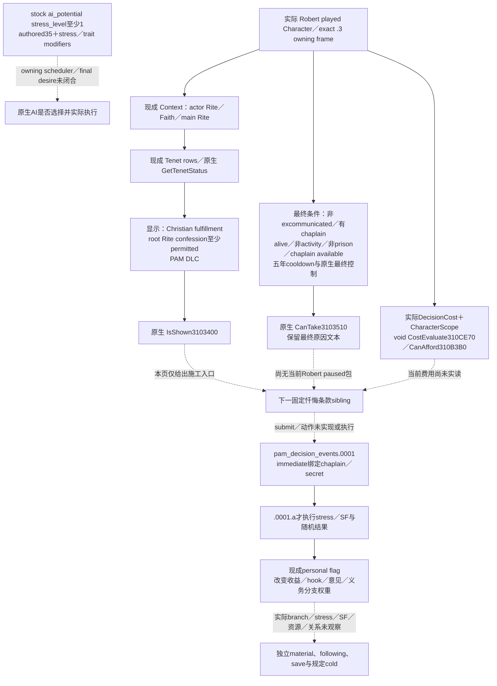

# CK3 1.20.0.3：罗贝尔的教义／信条玩法输入与忏悔入口

2026-10-03。本页完成一次后台原生研究，当前为 **research**；新增的 `has_at_least_tenet_status` 注册／求值子链已由 exact EXE 静态闭合。最小下一项是读取固定决议 **`pam_decision_confession`** 的原生显示、最终资格、费用、支付能力及最终拒绝文本。它有明确的减压和宗教结果用途，并能沿现有宗教 Context MCP 追加独立 sibling；当前尚未实现或实读这个 sibling。

宗教领域按项目所有者最新授权全面开放。罗贝尔唯一测试入口和独立战争暂停继续有效。本页没有启动、附加或操作 CK3，没有 SDK／pipe／窗口／Git 操作，没有付费、任命、改宗、改革或军事动作。ROOT 独占源码集成与实机；本 worker 只写本专题和外置研究材料。

## 版本与可复用实际基线

游戏为 **1.20.0.3 Crozier／Steam build 25652598**，冻结 EXE SHA-256
`94B55397ABB687A3DCD436805A5D885E6BE90FA6C693FEB44A9E3BBEEADE02A6`。新增 PE 研究读取 `artifacts/migrations/2026-10-02/installed-build/binaries/ck3.exe`，复用既有版本冻结，不重跑全 ABI 验证。源码输入为不可变 `production-source-f30579bf`，完整 commit `f30579bf6405e183192c96ea6b9bc35dddd11eec`；14 个当前 stock 文件、20 个行窗、5 个实际源文件及新 PE 材料的哈希在 [SOURCE-PROOF](Z:/ck3_mod_rewrite/artifacts/g2-maintainer-2026-10-02/resume-12003/religion-doctrine-gameplay-12003/SOURCE-PROOF.json)。

先读 [原生索引](README.md)、[身份／现行教义](religion-native-ai-faith-identity-12003.md)、[Doctrine 总览](religion_doctrine12002_overview.md)、[Core／personal Tenet](religion_doctrine12002_tenet_rows.md)、[personal flags](religion_doctrine12002_personal_parameters.md)、[原生婚姻](ck3-1.20.0.2-marriage.md)、[治理意见](religion-governance-opinion-native-ai-12003.md)与[神秘共融最终条款](religion-mystical-communion-native-final-terms-12003.md)。已有婚姻／家族 G2 证据、原生 provider、fixtures 和迁移结果直接复用，没有新增婚姻验收。

ROOT 的既有 [v27 Context 原包](Z:/ck3_mod_rewrite/artifacts/g2-maintainer-2026-10-02/resume-12003/actual-v27-religion-sway-conversion-cold-01/006-ck3_query_player_religion_context_v1.json)实际记录 actor **29829**、paused raw **53226552**、epoch **9380**，Rite **152**、Faith **23／catholic**、Religion **8**、main Rite **152**、精神满足度 **5**。这是该历史帧的实际身份和资源；它没有当前忏悔条款、Tenet 状态或 personal bonus，不把它外推成下一帧的动作资格。Murchad 和旧 Rogue 的 confession Core／参数也不能搬到本罗贝尔局。

## 已有观测应如何用于玩法

现成 Doctrine query 已分别保留 actor Rite 与 Faith main Rite 的有效 rows／完整布尔参数；Tenet query 有 Core、main-Rite 状态及玩家 personal 条目；personal 参数是独立的实际拥有集合。`Character+B4` 是 full RiteID，Faith 最终由 Rite 解析。三种来源不能合并，也不能把 Tenet 是否 Core 代替其原生有效许可状态。

| 玩法 | 当前原版具体输入／consumer | 现有读取与保留边界 |
| --- | --- | --- |
| 配偶与离婚 | `20_doctrines.txt:1–20` 的 monogamy 特殊值为 spouse count 1；`88–104` 的 divorce approval 是参数。`00_marriage_interactions.txt:3779–3818` 的离婚显示分别读 actor Rite、Faith 的 spiritual head／实际 head、house head及文化 | 用现成 Doctrine／numeric 输入解释已读合法性；婚姻仍用既有原生 final legality／acceptance／费用与独立关系后置，不按一个 token 自行批准婚姻或离婚 |
| 性别继承法与 Council | `20_doctrines.txt:763–805` 发布 `male_dominated_law`、`male_dominated_council` 等不同参数；`00_succession_laws.txt:2024–2079` 的 male-preference `can_keep` 保留政府、liege 同步、Rite 与文化分支，`can_have`／`can_pass` 是独立条件 | Doctrine 参数是输入；不能写成“Catholic 自动允许某法”。实际当前法与最终资格复用既有 law／government queries；不把 realm Crown Authority 的完成证据扩成所有继承法已完成 |
| 政治成本 | confession Tenet 的 authored `character_modifier` 为 `tyranny_gain_mult=-0.1`、`dread_decay_mult=0.15`；personal modifier 另有 scheme secrecy 两项 | 核心 Tenet／个人拥有集合有现成口；这些定义不是当前 Robert 的已生效总倍率或已实现政治收益，不把 Core 和 personal 两来源的 modifier 混用 |
| 教会经济 | `20_doctrines.txt:1110–1168` 的 temporal lease 参数与 lay ownership／allowed holding types 分开；Christian defaults 又把 ecclesiastical government 与 lease contract 分开定义 | 机制身份不是当前税／征召兵收入。复用[治理意见](religion-governance-opinion-native-ai-12003.md)与对应教会收入 owner 的最终 consumer，不在本页重建 endorsement 或旧版收入公式 |
| 减压／宗教维护 | `pam_decision_confession` 消费当前 Christian fulfillment 类型、至少 permitted 的 confession 状态、DLC、神职现任／可用性、角色状态与五年冷却；实际结果在事件选项 | 这是本页优先的缺失 **固定决议 final terms**。现成 Context 只读成功或旧 SF=5 都不能代替这项最终条款 |

Catholic 的 authored seed 更说明为什么需要读有效状态：`00_faith_types.txt:535–542` 与 `history/faiths/00_christianity.txt:77–138` 指向 `roman_rite`；1054 的 DLC Core setup 列 apostolic succession、communion、peace of God，1066 的 **permitted** 列表另含 confession。`00_rite_types.txt:1–33` 还有 DLC／fallback 选择。它们是当前安装 stock 的初始化定义；可能受到加载、DLC、历史演化、礼仪变更影响，不能断言当前 Robert 的 Core 或 permission 一定等于其中一份列表。

## 忏悔原生决策树

固定 key 是 **`pam_decision_confession`**，不是 `confess_sins_decision`。`tenet_confession_confess_sins_decision` 是 advertised parameter；`00_pam_tenets.txt:1077–1078` 明注 **Advertisement-only; decision gate is wider (permitted+)**。个人 `tenet_confession_decision_bonus` 则用于实际结果；三者不能互换。

原版完整决议位于 `common/decisions/dlc_decisions/pam/pam_decisions.txt:26–124`：显示检查 `has_spiritual_fulfillment_type=christian_fulfillment`、Rite `has_at_least_tenet_status(confession,permitted)`、PAM DLC；`has_pam_dlc_trigger` 具体为 `has_dlc_feature=by_god_alone`。有效性要求没有 excommunication、有 court chaplain；failure-only 条件还要求 alive、非 activity、非囚禁、chaplain available。冷却为 **5 年**。本定义未 authored `cost` block；这不是当前 evaluated 四项费用全部零的实机证据。

stock `ai_potential` 为 stress level ≥1，`ai_will_do` 基础35，stress level≥2和≥3分别加30，humble／zealous分别加20，cynical减40。它们是独立累加的 authored weight，不是成功概率或最终 AI desire。tier check 为 barony0、county120、duchy／kingdom／empire／hegemony60；`_decisions.info:152–175` 明确单位为 **月份**，0表示不检查。当前 native scheduler、实际 next-check 和 owning AI submit caller 未由本页闭合，也不将原生的月度检查节奏强加到自动玩家既有 turn policy。

## 新版 EXE 的 permitted 判定闭合

新证据在 [exact trigger](Z:/ck3_mod_rewrite/artifacts/g2-maintainer-2026-10-02/resume-12003/religion-doctrine-gameplay-12003/TENET-STATUS-TRIGGER-EXACT-12003.json)和[注册闭合](Z:/ck3_mod_rewrite/artifacts/g2-maintainer-2026-10-02/resume-12003/religion-doctrine-gameplay-12003/TENET-STATUS-AT-LEAST-CLOSURE.json)，对应 disassembly 原样保留。完整函数边界来自 PE exception directory 的实际 unwind entries，没有把几条指令窗口称为整个函数。

| exact .3 原生链 | 新定位 |
| --- | --- |
| `has_at_least_tenet_status` literal／注册 | literal `0x4783F38`；registrar完整 `[0x57E760,0x57E7F8)`，literal reference `0x57E771` |
| 字典 entry→真实 factory | entry vtable `0x4785FE8`，slot1 `0x2AEBF80`；factory完整 `[0x2AEBF80,0x2AEBFD0)` |
| 实际 trigger 类型／求值 | RTTI `CHasTenetStatusTrigger<false>`；vtable `0x47859A8` slot25，Evaluate完整 `[0x2AEC4E0,0x2AEC5C5)` |
| 原生状态来源 | Evaluate `0x2AEC554` 调现成 `uint8_t GetTenetStatus(Rite*,TenetDefinition*)`，`0x24F88A0`；该 getter 的 Core／main-Rite fallback 复用既有 Tenet 专题 |
| `permitted` 分支 | threshold 在 trigger `+0xF0`；threshold3走 `0x2AEC5B4`，`cmp threshold,status; setbe`。非法值5提前拒绝，故 permitted 接受实际 **3 Permitted／4 Core** |

另一个 `CHasTenetStatusTrigger<true>` 的 Evaluate `[0x2AEC770,0x2AEC7FD)` 使用 equality，不能把它混称至少状态。`known`／`prohibited` 等分支在原生中有特殊处理，本页不把全部状态概括成统一数值排序算法；只采用本决议真实的 permitted 分支。

首次离线 extraction 将 registrar 的说明文字地址 `0x4783D80` 当作 entry vtable，产生脚本 assertion；完整 registrar 随后证明真正赋给 entry 首字段的是 `0x4785FE8`。该 **research harness RED**保存在 `FIRST-REGISTRATION-ASSUMPTION-RED.json`；修正只涉及外置研究 helper，没有 CK3 capability RED、生产源码修复、运行时防御或额外门禁。

## 下一项最小只读 getter 的实现入口

复用 [v27 共融条款](religion-mystical-communion-native-final-terms-12003.md)已关闭的 ABI／native owner 与实际 current Context：在现有 `ck3_query_player_religion_context_v1(expected_revision)` 返回里追加独立可选 `player_confession_decision_terms`，固定 key `pam_decision_confession`。它不要求 UI 打开，不增加 actor override、feature flag、通用决议枚举或新框架，旧 Context／共融 sibling 的 availability 独立保留。

| 复用接口／布局 | exact input |
| --- | --- |
| 已加载决议 lookup | DB slot `5D1DEF0`／fallback `5D1F7E8`；hash `3F7E240`、lookup `CAA8D0`；definition `+18` 为真实 key CString，核对固定 key |
| 当前角色 scope | `889F60`构造、`87E0E0`析构；大小 `0x168`，kind4，full actor ref位于+8；仅实际 played actor |
| 最终显示／资格 | `3103400(definition,Character*)`；`3103510(definition,Character*,scope,null,reasonSink)` |
| 最终费用／支付能力 | cost getter `14706D0`；**`void 310CE70(cost,scope,int64_t[10])`**，不检查RAX=out；afford `310B3B0` |
| final拒绝文本 | 沿现成32-byte native reason sink复制完整UTF-8／控制码，原生析构 `856050`；不是 DecisionTooltip 或 affordability reason |

候选 DTO 保留 `available/unavailable_reason`、原 `capture_epoch/date_raw/played_character_id`、固定 `decision_id`、三项 `is_shown/can_take/affordable`、四资源 `costs_raw`、scale100000、`reasons_available/can_take_reasons`。合法false／实际零／原生空文本保留；读取失败才是nullable／unavailable。费用slot与现有生产 reader相同：gold0、prestige1、piety2、treasury6，保留signed raw。这个合同目前是施工设计，**尚未成为发布字段或新 MCP 能力**。

最小源码路径是新固定决议 header／cpp，加现有 `ck3_12002_religion_mailbox.hpp/.cpp` 的 sibling composition，以及 `player_religion_context_private_transport.py` 的可选 sibling normalization；CMake只登记新leaf。实现后做一条真实owner→reader→mailbox→wire→Python的focused验证，再由ROOT在Robert fresh paused frame实读。无需再跑旧共融／Holyloan ABI、fixture、整个宗教suite或历史婚姻矩阵。先读final terms就能决定当前是否存在可用减压入口；它仍不赋予submit或结果资格。

## 结果的实际价值与遗留

决议effect只触发 `pam_decision_events.0001`，event immediate绑定当前chaplain与一个未知于他的secret；减压／SF及随机后果发生在 **`.0001.a`选项**。不能用决议ACK或event出现证明收益。

原 `.0001.a` 在SF<0时authored加5SF，并用−15 stress-impact基础；否则基础−30。zealous／humble分别再传−30；这些是 `stress_and_fulfillment_impact` 的脚本输入，当前角色净变化仍需native evaluated effect／前后material，不把它们相加当当前保证收益。已有Robert旧帧SF=5不能保证后续走同一分支。

同一选项还可能以50%的独立random揭露自己secret给chaplain，再进入带条件和weight modifiers的random list：虔诚、chaplain获得hook、chaplain意见−25、发现廷臣secret、intrigue XP及pilgrimage／High Almoner／不同Faith配偶或子女转换／五年不战争等义务。personal confession bonus改变其中多项权重，hook／意见／部分义务的factor可为0。原始权重40／5／10等**不是固定百分比**，因为条件会移除分支、modifier会改权重；本页没有计算当前期望值或推荐动作。该列表作为忏悔结果合同保留，不开展军事或其他owner的策略研究。

因此当前遗留按顺序为：ROOT需要新帧原生shown／CanTake／费用／afford／理由；有效confession许可与personal bonus先消费现成查询；如有真实合法机会再实现一次typed decision submit、该实际event选项及独立stress／SF／资源／关系或penalty结果；following、save与规定cold资格按真实artifacts另记。旧namespace的现成事件管道能复用，但未分类event不得凭“只有一个选项”盲点。native AI scheduler／final desire仍未知，有具体registrar和decision输入可继续施工；它不阻止先交付玩家需要的窄final getter。

日报／周报汇总：完成20个stock行窗／14文件及4个新完整native函数的研究、独立Mermaid、忏悔advertisement／permission／personal作用分界与现有MCP sibling的最小施工入口。新增状态为research（原生子链static-confirmed），**0新build、0新test、0新MCP、0动作、0游戏日、0G2 credit**；现成身份、婚姻与宗教primitive复用其原始实际范围。ROOT负责合并共享报告、commit与push，本页不修改README或中央报告。
