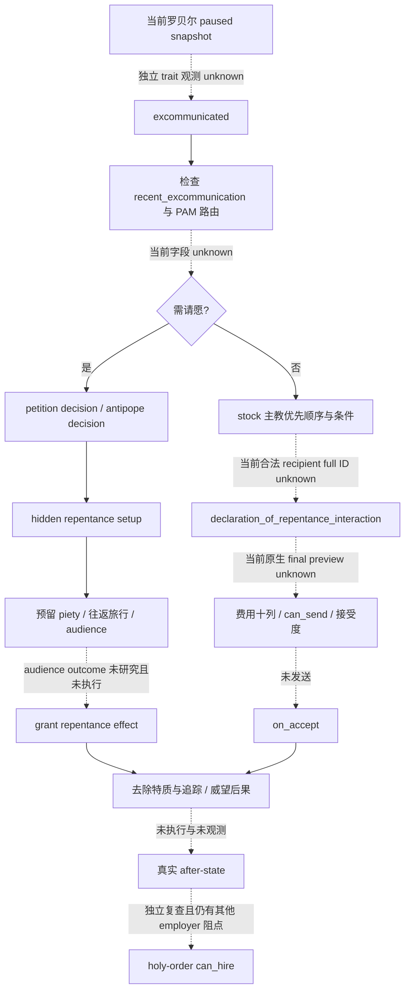

# CK3 1.20.0.3：Robert 解除绝罚的原生树与只读施工交接

2026-10-03，readiness **research**。v32 Robert29829 的军事 holy-order 原生 final reason 含“被绝罚的统治者无法雇佣”及“已经被雇佣”，因此冻结这条具体悔罪路径有实际用途；本包没有独立 trait 实测、悔罪请求或解除结果。

exact build为 Steam1.20.0.3/25652598，EXE SHA `94B55397ABB687A3DCD436805A5D885E6BE90FA6C693FEB44A9E3BBEEADE02A6`。实际必要性只消费 [v32 compact REPORT](Z:/ck3_mod_rewrite/artifacts/g2-maintainer-2026-10-02/resume-12003/religion-holy-order-systems-12003/actual-v32/REPORT-FIELDS.json)，没有读取旧 raw 或重复游戏。该帧 PID109732、actor29829、date53236176、native4/public2、epoch17503，冻结runtime `production-source-8cf176b4`，environment SHA `a659ee553736c3a9429a961711411090ed6b53931a9c1a202f057b3179397486`。

holy-order4 报价106虔诚且 can_afford=true、can_hire=false；employer39004的既有雇佣是另一个独立阻点。拒绝 reason 是真实 primitive，不能冒充独立 `excommunicated` trait 读回、悔罪许可或解除后能够雇佣。研究必要性字段在 [NECESSITY-BASIS.json](Z:/ck3_mod_rewrite/artifacts/g2-maintainer-2026-10-02/resume-12003/religion-excommunication-12003/NECESSITY-BASIS.json)。

本包只冻结已有 work：两个实工作子包分别负责41个相关 stock spans和当前 native/query seam。用户度假收尾后不开始新实现或验收；ROOT保存关闭当前v32，不部署v33。完整外置包在 `artifacts/g2-maintainer-2026-10-02/resume-12003/religion-excommunication-12003/`。

## 正确请求与立即可施工的观测入口

罗贝尔申请解除的普通 interaction key 是 **`declaration_of_repentance_interaction`**。`lift_excommunication_interaction` 是教皇或主教作为 actor 主动解除 recipient 的入口，不能将罗贝尔放到该 actor 位置作为请求替代。

下一项只读施工：复用现有 current-trait 读取器增加 `excommunicated` 单 key，然后以当前原生 actor 解析宗教权威或合法主教，输出普通请求/请愿路由及原生 final `is_shown`、`can_send`、失败原因、十资源费用与接受度。现有 HoF Gold leaf 的固定 key/费用和 generic preview 的旧构建 allowlist 不包含这一能力；具体 getter seam 见下方只读接线说明。本 stock 子包不写 SDK/source。

普通请求 `is_shown` 要求 actor 已被绝罚、其 faith 有中央圣事、recipient 不是自己，且 recipient 是宗教权威或符合 `broader_clergy_show_hof_or_superior_interactions_trigger` 的 clergy。实际 final `can_send` 尚为 unknown，不能由这些文字条件代替。

## 玩家 PAM 路由

`petition_head_of_faith_repentance_requires_petition_trigger` 的代码条件为：Christianity religion、main Rite 的 `spiritual_head_of_faith` 参数、现存 `religious_head_or_challenger`，并且以下任一成立：`pope_excom`、首都教区 holder 等于宗教权威、holder 等于 actor、或最高头衔至少 kingdom。前三项会跳过条件式 rank 检查；不能简化成源码注释中的“国王或被教皇亲自绝罚”。

普通请求在玩家 + PAM + qualifying faith 时还要求 `need_hof_for_clergy_interaction_trigger=no`，即 tier 小于 kingdom；禁止请愿必需状态；recipient 是宗教权威而 actor 不是 archbishop-or-higher 时也隐藏。archbishop-or-higher 的 stock 判定为：`any_held_title.has_clerical_region=yes` 或 actor 本身为 `religious_head_or_challenger`。

需请愿时，明确入口是 `petition_head_of_faith_decision`；跟随宗教权威 challenger 时使用 `petition_antipope_decision`。悔罪 option 打开 hidden `petition_head_of_faith_repentance_setup_interaction`，recipient 为当前 `religious_head_or_challenger`。setup 的 `auto_accept=yes` **只准备请愿与旅行**，赦免结果由后续 audience 决定。

本次仅记录原生旅行入口：`petition_head_of_faith_prepare_petition_effect` → `petition_head_of_faith_begin_travel_effect`，目标为 recipient 的 `capital_province`，往返旅行，抵达事件 `petition_head_of_faith.9000`。若已在目的地则直接激活 pending 并触发该事件。不扩展旅行实现或完整 audience 树。

## 主教选择与 native 未知边界

原生 `excommunicated_recovery_find_cleric_effect` 保留首个符合条件的候选，顺序是：realm chaplain 的 `superior`；`capital_county.clerical_region_title.holder`；theocracy actor 自己的 `superior`；最后遍历 vassal 及 primary-title de-jure clerical regions。

共同候选过滤包括不是 actor、actor 不需请愿/不在 recent-excommunication/不与该主教交战，候选至少 duchy、是 clergy 或 ecclesiastical government、同 faith；actor 非 archbishop-or-higher 时不能选其 faith 的 religious head。第一候选还有 chaplain tier < duchy、superior tier >= duchy/is_clergy/notself 的前提。这是 stock 选择规则；当前罗贝尔的真实 full ID、角色关系、PAM route、最终 interaction 可发送性仍未知。

## 发送费用、接受后果与预扣阶段

十资源顺序固定为 `gold, prestige, piety, renown, influence, herd, treasury, treasury_or_gold, merit, barter_goods`，native 数值 scale `100000`。普通 repentance 和 hidden setup 都没有显式 `cost` block；`STOCK-TERMS.json` 的对应十列为 null，含义是 **stock 未显式声明**，不是原生零费用报价。

| 阶段 | stock 资源变化 | 需要独立观测的结果 |
| --- | --- | --- |
| 普通请求发送 | 无显式 cost block | native 十列 quote、final can_send |
| 普通请求接受，无 hook、无 Purgatory 降威望参数 | prestige -750，`add_prestige_level=-1` | prestige / prestige_level before-after |
| 普通请求接受，无 hook、有该参数 | prestige -350，无显式 level 调整 | 当前 Rite 参数与真实 prestige delta |
| 普通请求接受，选 hook | 消耗 hook，跳过上述威望损失 | hook before-after |
| 请愿 setup 接受，无 hook | effect 立即预扣 piety 250 并写 reserved variable | piety 与 pending/reserved scope |
| 请愿 setup，选 usable hook | 写 use-hook flag，跳过预扣 | hook、petition scope；不表示已赦免 |
| 请愿最终 grant | 对应 -750/level-1、-350、hook 免威望分支 | trait 与资源真实 after-state |

普通和请愿 grant 都去除 `excommunicated`；清除 `excommunication_reason`、`requested_my_excommunication`、`excommunication_issuer` 三个变量；增加 `excommunication_recently_lifted` 10 年。普通悔罪还为 recipient 增加 prestige 350 与对 actor 的 repentant opinion 10；请愿该 opinion 只适用于 AI recipient。cynical 分支调用 `stress_and_fulfillment_impact` 的 minor gain（基础 20），真实 stress/fulfillment 增量必须读取。

选 `offer_pilgrimage` 会给 actor 添加 10 年 promised-pilgrimage modifier。非教皇替 actor 解除教皇绝罚的额外 penalty 消费 recipient 的 piety 500、piety level 2，并造成宗教领袖对 recipient 的 -80 betrayal opinion。Christian-church situation 与 clan unity 还有条件分支；它们保留在 frozen stock 中。

`clear_excommunication_tracking_effect` **只清上述三个变量**，没有显式移除 `pope_excom` variable 或 `recent_excommunication` modifier；需要时分别观测，不能承诺其被清除。请愿 cleanup 有独立 type/recipient/target/reserved-piety variables 与 petition flags 清理入口，本次没有追 audience caller。

`religious_interaction.1024` 的悔罪 effect 位于 `show_as_tooltip`；letter 的 positive option 仅有 name。这封信不是第二次扣资源或去除特质的执行入口。

## 接受度与 AI 输入账本

stock `ai_accept` base 25，包含 selected hook +20、pilgrimage 公式、other-cheek +20、recipient opinion、语言 +5、virtues/sins、paragon/consecrated-blood、liege 关系、unpledged GHW opinion -25，以及 pope-excom 的非宗教权威 recipient -200。PAM macro 另消费 theological puppet、Rite 差异、recipient 对 actor Rite 的 fulfillment、core/permitted tenet 被 recipient 禁止等输入。celestial hierarchy 与 house-unity macros 仍按原生计算；本次没有手工凑和或把源表当作当前 native total/chance。

AI target 是 head-of-faith、realm-priest-superior、superior、councillors。frequency tier 表为 barony 0、county/duchy 72、kingdom/empire/hegemony 36；`ai_will_do` base 100，特定无 pope-excom、无需 HoF 且 recipient 是宗教权威的条件减 90。该调度表不是罗贝尔的发送许可或执行证据。请愿 decision 的 AI potential=false。

## 冻结与报告

`STOCK-TERMS.json`：`50999 bytes`，SHA-256 `1bfeb7a76de93ca9252bb363e0ba189d0d1ec2aac34c79a1785e9f0ed99ca7fa`。共 41 个相关 stock spans，每项附原始文件 hash、准确行号、raw span hash 与 byte count。核心条目如下；完整清单在 JSON。

| key | source span | raw span SHA-256 |
| --- | --- | --- |
| `declaration_of_repentance_interaction` | `common/character_interactions/00_religious_interactions.txt:2808–3161` | `887ec65a0bc5de10fa28011a59977d93287b535eb4d509c6917b0bba0fae7d91` |
| `petition_head_of_faith_repentance_setup_interaction` | `common/character_interactions/11_petition_head_of_faith_interactions.txt:4–55` | `47f0cc0d07002a49d447425c438244096cece5ad75200da16ff92bd58f4611fe` |
| `petition_head_of_faith_repentance_requires_petition_trigger` | `common/scripted_triggers/11_petition_head_of_faith_triggers.txt:62–76` | `efce89daf56419e214999b713b5e28b69192bc30de4a1743b387eb96ebd30330` |
| `pam_is_archbishop_or_higher_trigger` | `common/scripted_triggers/pam_scripted_triggers.txt:1239–1244` | `6ae84886987f56808ef6f42adafa483acee097d7ce42a4569a1a1720f1737519` |
| `excommunicated_recovery_find_cleric_effect` | `common/scripted_effects/00_religious_interaction_effects.txt:2263–2338` | `b51c04c5fee368e6db1e51bd0d3dd9dac0ba48ae813198bced79abcb4f7079f4` |
| `declaration_of_repentance_interaction_effect` | `common/scripted_effects/00_interaction_effects.txt:3957–4023` | `9933095aa812b15d09c5493f8de4c2771e08cc9f37753ad5316234e86049642e` |
| `clear_excommunication_tracking_effect` | `common/scripted_effects/00_religious_interaction_effects.txt:195–199` | `7dedc6fca604a9f25fc6915691de8911eb8c2481f98eb0ec1c21cb260e10526e` |
| `petition_head_of_faith_grant_repentance_effect` | `common/scripted_effects/11_petition_head_of_faith_effects.txt:550–597` | `c9e5896c4b8e58ab9754f825e88f6a29abfb63221da0b2eaf4164b4427586c0e` |
| `excommunicated` | `common/traits/00_traits.txt:8955–9001` | `d60e04d76a072b542c554aad0d8a182109a6ff1109c1ee1cb3f7ded1d3e9fadc` |
| `religious_interaction.1024` | `events/religion_events/religious_interaction_events.txt:1164–1188` | `8a8f16be42608cfcb9a3e70373016f477c54dd377e0d72f1250024806c91d90d` |

验证只做一次：exact EXE SHA 匹配；命名 top-level blocks 唯一且括号完整；source bytes/span hashes 冻结。本研究 readiness 保持 research，未新增生产实机能力。

最小 outcome 字段是当前 trait、Faith/Rite、真实 actor/recipient full ID 与角色、native final preview、威望和 level、piety、selected hook、三追踪变量、10 年 modifier/expiry、必要时的 pope_excom 变量/recent modifier、stress/fulfillment 和 petition scope。解除后重新读取 holy-order employer/can_hire，不能给解除绝罚提前记雇佣或 G2 loop 信用。

## 已有查询与单特质观测接线

当前冻结源码是 `production-source-8cf176b4`。已发布的 `ck3_query_campaign_root_context_v1(expected_revision)` 返回 `primary_title.{title_id,tier_raw,tier_key}`、`capital_province_id` 和 council；`ck3_query_player_rite_governance_v1` 返回 actor Rite、main Rite、Faith 的不同 head 身份；`ck3_query_player_religion_context_v1` 提供当前 Faith/Rite 与资源 baseline。它们都可复用，但没有提供完整教会辖区、上级教士或悔罪条款。只复用现成 campaign-root MCP，不把该底层旧 namespace 模块的 RVA 标签拿来新建 `.3` getter。

当前 `actor_traits` 是32项生活方式/教育相关稳定 key 子集，不含 `excommunicated`。最小施工不扩这个合同：复用 `include/xar_bridge/ck3_12002_phase_character.hpp:79–83` 的 `FindUniqueTraitDefinition(database,"excommunicated")` 与 `ReadTraitPresence(bindings,played,single_definition_span,bool)`。现有 `.3` reuse manifest 已覆盖 trait DB getter **`0x89E5B0`** 与 native HasTrait **`0x28BB1F0`**；DB `+0x50` rows、`+0x5C` count、definition `+0x18` 稳定字符串 key 提供精确单 key 解析。建议在宗教 context 增独立 sampled `player_excommunication.{available,reason,value}`：成功 false 表示未带特质，读取失败才是 null，并携带 full actor/date/epoch。此字段目前只是施工提案，未实现、未实测。

`pope_excom` 是 stock `has_variable` 输入，不能按普通 trait 或数值 bool 猜测。现 loan context `:56–79` 已展示 `ResolvePhaseVariableIdentifier`、`PhaseVariableTarget{4,{},actorID}` 与 variable-context presence 扫描；可复用来发布变量存在性，identifier 解析失败不能当作 false。当前没有 published `pope_excom`、recent-excommunication 状态或完整候选层级字段。首个合法 clergy 的具体源输入仍沿上文优先顺序补读，不执行 `excommunicated_recovery_find_cleric_effect` 来假装只读。

## 普通请求最终条款的精确复用入口

Gold MCP 的参数只有 `expected_revision`，native key 固定为 `hof_ask_for_gold_interaction`；它不接受 `interaction_key`，不能直接作为悔罪查询。旧 `character_interaction_preview_v1` 属于1.19.0.6模块且只准入六个非宗教 key，也不能通过改 allowlist/SHA 冒充本版悔罪能力。其原生构造、角色、shown、CanSend、十资源及接受度 machinery 是可复用的实现入口。当前没有 typed repentance MCP 或真实 repentance terms。

| 所需数据 | exact 已有原生实现入口 | 此包资格 |
| --- | --- | --- |
| 定义与角色 | stable-key definition lookup；`0x3076C90(storage338,definition,actorFullID,requestedClericFullID,nullptr,true)`，第六参数启用 `0x3148DE0` redirect；refresh `3078A60`、finalize `3078C90` | 复用已证 `.3` two-role proof；必须保存所有实际角色，不能用旧教皇 full ID 覆盖 |
| 普通选项 | 原生 declared option flags 全 unset、`30788E0/3078880` readback selected count0 | 未选 hook、未承诺 pilgrimage 的明示预览；当前未执行 |
| Shown / final CanSend | 独立 `30796B0(context)` / `307C040(context,nullptr)` | 原生 shown proof 与既有代码复用；未获得悔罪实际值 |
| Declared 十资源 | **`310CEE0(definition+40,context+8,int64_t[10])`**，返回 void，输出80B/scale100000 | 完整报价入口；不把无 stock cost block 变成已观测十个零 |
| 接受度 | auto-accept trigger/scalar、`307C460` recipient raw、`307C360` intermediary raw、`307BC80` outer status | 分别读取；score、human/AI语义与最终发送许可分开，不手工凑 score 或当作概率 |
| 后果 | 上文 stock effect / 独立实际状态 | prestige/hook/trait/变量/modifier 变化需未来 before/after，不是十列 declared quote 或 ACK |

只能把 **`declaration_of_repentance_interaction`** 和 fresh 原生 actor、stock-qualified fresh clergy candidate 绑定到这个窄 reader。Faith head 身份不是普通请求的合法 recipient 证明。完整 source spans/SHA、已有 TWO-ROLE/SHOWN/trait ABI proof pins 见 [EXISTING-QUERY-REUSE.json](Z:/ck3_mod_rewrite/artifacts/g2-maintainer-2026-10-02/resume-12003/religion-excommunication-12003/existing-native-query/EXISTING-QUERY-REUSE.json)。此包没有源 projection、native build、fixture 或实机查询。

## 请愿条款仅作为返岗后的替换施工入口

若当前 PAM route 要求请愿，可复用已有 decision binding 获取正确 key 的原生最终条款：lookup `CAA8D0`、shown `3103400`、CanTake `3103510`、decision-cost `14706D0`、十资源 evaluator `310CE70`、affordability `310B3B0`。已有 `mystical_communion_decision_terms.cpp:81–98` 和 confession `:77–121` 是具体代码 seam；新 key 是 `petition_head_of_faith_decision` 或 challenger 对应 `petition_antipope_decision`。

当前 communion/confession 工具固定其各自 decision key，没有 override；虽然 native buffer 为十列，现 DTO只公布 gold/treasury/prestige/piety四列。因此没有“已存在可直接调用的 petition MCP / 已发布完整十资源”的资格。返岗后真要做这条窄 leaf 才保留十列；此包只保存 construction note，没有开展实现、fixture 或部署。旅行 setup auto-accept 也不能代替 audience 赦免或真实 trait after-state。

## 最小 counter-policy 与度假收尾

原生树和证据已经冻结。返岗后的最小功能顺序是先独立读 `excommunicated`，再用 fresh head/rank/变量/辖区决定普通或请愿路径；取得对应原生最终许可、全费用与接受度后才讨论动作。普通 hook-free 接受的 stock 威望损失可能达750且等级减1，是实际决策必须考虑的代价；不因 Holy-order 拒绝文本直接选择请求或花费资源。未来若解除，独立核验 trait/资源/追踪变量/modifier，再复读 holy-order employer 和 final hire 条款。已被 employer39004 雇佣的阻点保持独立。

用户度假收尾后停止新任务。两个实工作子包已释放并停止，ROOT管理当前 v32 的正常保存与关闭；本包不部署 v33，不开始 petition implementation、候选框架、新测试或 live。现有只读调用模板只是交接资料，[READONLY-CALLS-TEMPLATE.json](Z:/ck3_mod_rewrite/artifacts/g2-maintainer-2026-10-02/resume-12003/religion-excommunication-12003/existing-native-query/READONLY-CALLS-TEMPLATE.json) 未执行，revision 占位必须在未来新暂停帧重新绑定。

本次新资格仅 **research**：没有独立绝罚 trait sample、current route/recipient/repentance/petition native terms、发送或解除结果；不存在 production-live repentance primitive/loop 或 complete。新增 SDK/pipe/game/window/source modifications/build/tests/paid/material/days/G2/Git 全为0，既有 holy-order final terms primitive 的真实资格保持。ROOT收到完整 day/week 字段、newdoc doc-only patch 和 pins 后统一发布，worker 不写中央报告或 canonical source。

收尾采用说明：本页新增代码如有，仅封存为外置补丁，尚未应用到生产 v32；实际读取以本文标注的 artifact/date 为准。接续入口：[度假交接](../handover/2026-10-03-g2-religion-v32-maintainer-vacation-handoff.md)。
