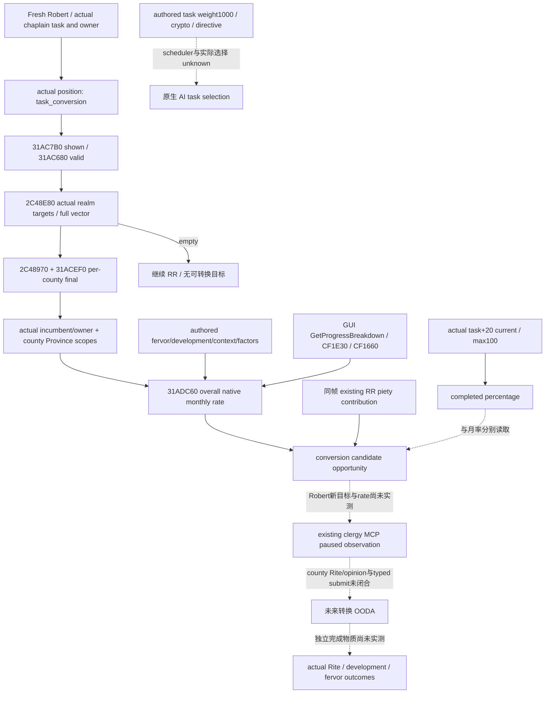
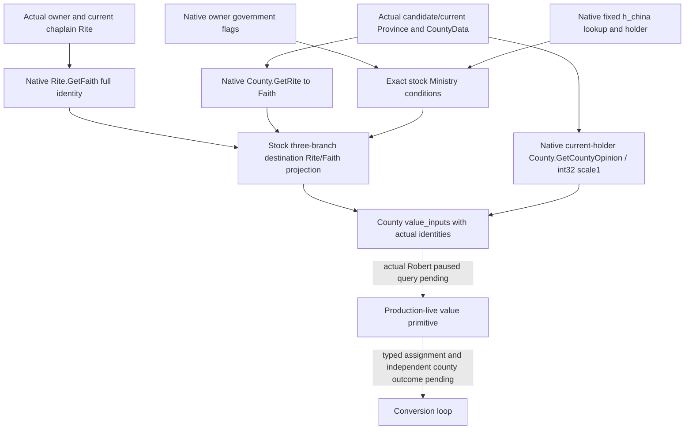
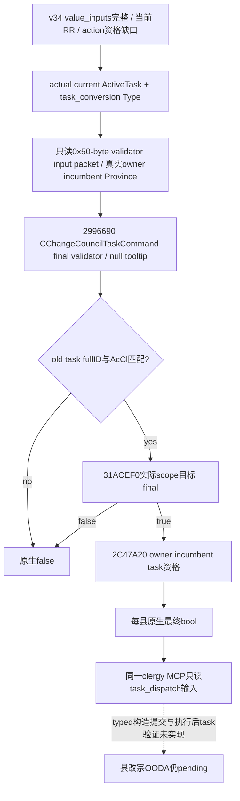
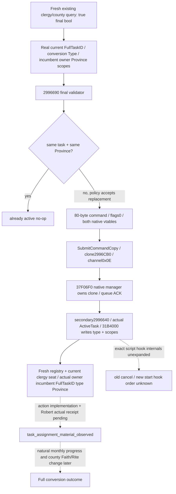
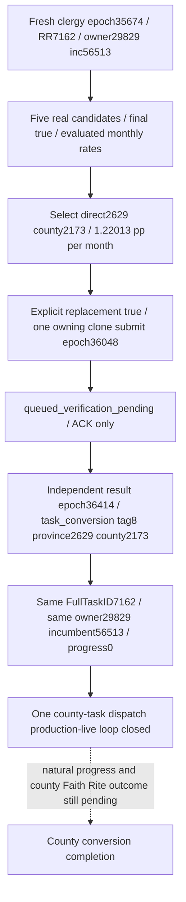

# CK3 1.20.0.3：热忱、县改宗与祭司任务机会成本

**2026-10-03 16:23 R15 当前能力：** Robert 29829 的一次县任务“观察 → 选择 → typed 提交 → 独立 task/owner/incumbent/target 读回”已实机 GREEN，限定为 **production-live loop（县任务派遣）**。目标 Province2629 / FullTitle2173；FullTaskID7162 保持不变而实际类型已变为 `task_conversion`。县转换完成仍为 false，游戏日和 G2 credit 增量均为 0；下文带时间的 research/static-ready 记录保留为各阶段事实，最新实机证据见页末 R15 节。

**2026-10-03 11:32 接续采用：** component→glue的13代码路径已采用到集成源码，复用现 `ck3_query_player_clergy_appointment_v1` 返回独立 `county_conversion`。原component7case/28断言/7JSON、fullwire7断言与注册MCP21断言GREEN直接复用，无新语义/重复验证；原RED保留。目标Faith/Rite与实际县价值未补造，组合DLL/Robert暂停帧仍待完成，状态static-ready。见[接续账本](../handover/2026-10-03-g2-v33-resume.md)。

2026-10-03 **research / file-only**。宗教领域已全面开放，本页聚焦罗贝尔领地中 `task_conversion` 的真实目标、最终月进度率和宗教民意价值。复用[祭司与任务合法性](religion-clergy-council-native-ai-12003.md)、[ReligiousRelations 价值](religious-relations-task-value-native-ai-12003.md)及[宗教治理／意见](religion-governance-opinion-native-ai-12003.md)，不重做 Task 身份解析、CanFire、既有 RR 实机、旧 ABI verifier 或夹具。

游戏固定为 **1.20.0.3 Crozier / Steam25652598**，EXE SHA-256 `94B55397ABB687A3DCD436805A5D885E6BE90FA6C693FEB44A9E3BBEEADE02A6`。本次只读已冻结的 `artifacts/migrations/2026-10-02/installed-build/binaries/ck3.exe` 和本机 Steam `game/`。EXE 身份复用已有 intake；新窄函数字节单独冻结，不重复 hash 全 EXE。没有 SDK、pipe、内存读取、游戏／窗口输入、任务切换、任免、付费行为或游戏日。

## 罗贝尔的已知起点与缺口

原 v25 实机 Robert29829 的 chaplain56513 为 `task_religious_relations`，general/infinite/unfrozen；当帧 raw53224008、PID95636。其原生 owner modifier 为 **0.45 piety/月**，角色最终总月 piety 为 **0.4375**，两个聚合阶段分别实读。学习9来自原 v23 帧，双方 Rite152 来自原 v21 指定现任帧，不能拼成新鲜同帧评分。后续原 v27宗教只读帧 raw53226552、PID64876仍读到 Robert **Catholic Faith23 / Rite152 / Religion8**；本页没有重新取样这些已知值。

现有 context 已有当前玩家 Faith fervor 的原生 getter，现有 campaign-root 已有 chaplain实际任务绑定及 percentage progress。这仍没有回答：罗贝尔当前有哪些原生合法转换县、哪个县属于亲持领地、县当前 Rite/Faith、最终月率、实际宗教民意或转换收益。**不能凭“罗贝尔是Catholic”推断所有县都是Catholic，也不能把这轮研究称为已找到真实转换目标。**

当前 RR 的可见敬虔收益提供机会成本。停止 RR 改做县转换可能改变这项贡献；0.45是原帧当前值，不是未来固定扣除值或换任务后的实测损失。下一只读查询先回答实际合法对象与最终月率，再以同帧 RR贡献和实际县域价值决定是否换任务。

## 原版 AI 的两层选择

原版真实键为 **`task_conversion`**，不是 `convert_county_task`。`00_court_chaplain_tasks.txt:235–242` 将它定义为 court chaplain、county/percentage，玩家和 AI 均使用 realm县域。其 task-wide valid（`:251–267`）与 target final validity不同；同一任务没有独立 authored `is_shown`块，但仍应调用原生 shown最终入口，不将缺块手写为本帧true。

`ai_will_do`（`:716–738`）按书写顺序为基础1000、crypto-religionist领主乘0、有效convert-faith vassal directive随后加10000。不能压平为“crypto永远不转换”。它没有 `ai_target_score`；原版 `_council_tasks.info:7` 声明未定义时目标随机，显式得分正数时按正分加权随机。这里闭合的是 **authored输入／格式合同**，没有新验证当前 EXE scheduler与全部竞争任务的真实采样、调用顺序或最终选择。该运行时分支仍是unknown，不把“最快县”冒称原生AI。

县 predicate `00_councillor_triggers.txt:1019–1315` 在共同合法性之外还包含 `is_ai=yes` 内部的zeal/rationality、hostility、holy-site、directive、特定Sunni/Maliki与Jizya分支。它们是原生AI研究输入；Robert是玩家，不能将这些AI-only人格门额外施加给玩家策略。

| 共同县域输入 | 原版行窗 | 对只读查询的意义 |
| --- | --- | --- |
| 非landless，实际目标Rite与当前不同 | councillor triggers1020–1043 | 目标身份和Rite路径必须真实绑定；Faith相同不排除Rite-only转换 |
| hold-court宗教承诺／封臣与中间领主保护／county promise | 1045–1087 | 由最终native predicate求值；不在Python复制三套保护规则 |
| AI grace/unreformed/accepted/Astray等 | 1088–1291 | 保留为原生AI树，不能成为我方玩家额外门 |
| struggle转换禁用与已有当前目标例外 | 1292–1314 | 原生最终结果包含当前任务状态，不能只按county静态标签判断 |

选择目的Rite的共同代码为：有Ministry访问，或县当前Faith等于领主Faith，或祭司Faith等于领主Faith时使用 **领主Rite**；否则使用 **祭司Rite**。Task-wide另有off-Rite theocratic chaplain与temporal-theocracy领主需要theological puppet的分支。是否可切换任务、是否可更换祭司和县是否合法是独立结果；原帧CanReassign=false不能推出所有转换任务不可选。

## 热忱怎样进入进度与县域稳定

`_council_tasks.info:62–63` 明确：percentage任务的进度表达式每天按**月率÷30**推进，界面显示月率，即使日历月份不是30天。当前已完成百分比与月进度率必须分开；不从“推进多少游戏日”反推最终月率。

`00_court_chaplain_tasks.txt:415–475` 的进度从0开始，加基础0.5、学习/10、条件热忱差、context与发展惩罚，再乘全部context factors，最后下限0.1。`99_court_chaplain_values.txt` 的additive/factor两大段包含perks、legacy、关系、个人／有效tenets、文化、holy sites、laws/government、spiritual fulfillment、domicile、区域／struggle、State Rite和Church situation等输入。学习与热忱是参与者，**不是足以复算当前最终值的全部输入**。

| 热忱相关分支 | 原版位置 | 按实际代码可得的结论 |
| --- | --- | --- |
| additive fervor | task426–452；values1482、1663–1667 | 以祭司Faith与县Faith之差乘基础进度百分比和0.5。Religious Icon对该贡献设minimum0；不是比较领主Faith与县Faith的通用捷径 |
| county development helper | values1552–1582 | helper另含base/learning/perk与未乘0.5的热忱差，再乘`max(-development/100,-0.9)`；不能把完整进度简化为`(base+bonus)*(1-development/100)` |
| same-Faith Rite factor | values1257–1273、1488–1549 | 县Faith等于领主或祭司Faith时使用Rite热忱乘数；实际传播者按hegemony+merit／县Faith=领主Faith选择领主，否则祭司 |
| 传播主Rite | values1488–1549 | 乘数`1+(F-50)/100`；高热忱提高这个分支的authored倍率 |
| 传播非主Rite | 同上 | 乘数`1-(F-50)/100`，有`pam_rite_grace_period`时下限1；高热忱不能概括为所有Rite转换都更快 |

同Faith的additive注释不能覆盖实际off-Faith祭司路径；目的Rite矩阵、rate中祭司Faith与县Faith、完成effect中领主Faith与旧Faith分别求值。下一provider直接读取原生最终rate，避免克隆数百行修正并误合并概念。

大众宗教稳定还涉及**当前县民意**。[宗教治理／意见](religion-governance-opinion-native-ai-12003.md)已经冻结 `00_defines.txt:848–861` 的county religious hostility意见 `[0,-15,-30,-45]` 按fervor/100缩放。它不是角色总意见公式，也不能由当前Catholic热忱单独重建县总popular opinion。实际county当前宗教身份、方向与final opinion是具体价值观测入口；这轮没有新读任何县的民意。

`NFaith` defines（`:794–822`）提供base50/max100/yearly growth0.5、counties-per-Rite100、low-fervor threshold40、divergent-Rite与heresy保护常数。它们是authored输入；引擎最终净增长、时间积分、钳制及真实县／Rite数量consumer未在本包逆向，不把0.5称为Catholic当前年净增长，也不把它换算成当前月实测值。

## 完成与副作用：按effect条件记账

完成effect先保存old Faith/Rite（task536–538），按上述矩阵写Rite（622–633）。随后实际guard（635–650）检查的是 **`liege Faith != old Faith`**，没有比较实际new Faith与old Faith：成立时降低development，给领主Faith `trivial_fervor_gain`，给old Faith `small_fervor_gain`。基本值定义分别为 **+0.15 / +0.3**。因此不能用“Rite-only不影响发展／热忱”的描述注释代替这段条件；off-Faith祭司场景应按实际分支与独立结果解释。

发展损失 helper为`-(floor(development/10)+1)`（`00_council_values.txt:111–122`）。转换还维护migration列表/旧Rite、记录已转Faith、普通chaplain返回默认任务、条件式struggle piety、Acts-of-Apostles legitimacy与spiritual fulfillment及Mendicant个人tenet奖励。minority stance封臣的转换反感定义为**−20、10年、decaying、stacking**。这些都是authored后果，没有发生在本次只读研究中。

monthly_on_action `task_convert_side_effects`具冷却与随机事件。原版format注明开始／换祭司后前30天不触发，之后延迟1–30日。失败／好事件按当前技能和modifier条件再过滤，不能从1000“无事件”与五项100权重直接宣布五个无条件实机概率。

尤其要区分同名概念：county **`court_chaplain_religious_fervor_modifier`只提供levy_size +0.25**，不修改Faith fervor。`religious_construction`修正寺庙建设费用与速度，并非立即增加development。抵抗、副作用tax/levies、popular opinion及minority反感都是可观察成本，不以事件名或结束通知代替物质结果。

## 新闭合：无窗口的最终月率 ABI

本包只对新rate缺口冻结窄PE证据。原版 `gui/shared/value_breakdown.gui:558–611` 使用 **ActiveCouncilTask.GetProgressBreakdown**，并在percentage任务显示rate。名称20字节在literal `0x44E3360`；注册 `0x94C73–0x94C8A`复制完整名字，`0x94CEE`将callback `0xCF1E30`交给`0xCF4580`。callback于`0xCF1E42`调用`0xCF1660`。

真实current-task helper `0xCF1660`从task+18取TaskType、+40取原task scopes、+39取frozen；`0xCF1735`调用 **`0x31ADC60`**。该GUI helper会准备TLS breakdown list；新provider **直接调用numeric core**，传null breakdown，避免调用窗口、构造伪窗口或触发TLS展示list。确定合同为：

```cpp
using EvaluatedTaskMonthlyRate = std::int64_t* (*)(
    void* task_type, std::int64_t* out,
    const void* raw_task_scopes, void* nullable_breakdown,
    bool frozen);
// Exact .3 RVA 0x31ADC60; returned pointer is the supplied out.
```

`0x31ADC60–0x31AE106`是完整1190-byte `.pdata` entry，SHA-256 **`0be954d982e3159f7d0f281984048afa69b42901aa2f2a8c3be1916727a5d5fc`**。core以`TaskType+1358`递归clone；incumbent=-1时原生输出零；county分支委托既有scope builder `0x31AE770`。它以type+A88判断是否有full_progress，若有求值+9C8，否则+8D8；原生expression evaluator保持全部修正。numeric结果复制到out并返回同一out。

`frozen`只在非null breakdown路径控制当前task contribution展示差额；**numeric返回不会因frozen自动变成0**。provider应保留独立frozen字段，策略不把“预测rate正数”当作冻结任务正在推进。不能将这个read-only数值求值称为任务提交最终合法性。

与overall rate不同，**`0x31AD9D0(TaskType*,out*,scopes*,nullable_breakdown)`**只计算+8D8的own `progress`。其完整 `0x31AD9D0–31ADC52`、642-byte SHA-256 `9435a44a2daedbaf69014d8ef01984aba8ef06d39f156d34ebe270bcf66836bf`。conversion未定义authored full_progress，但provider仍采用overall core，不依赖缺块手写相等关系。

完成progress从另一条链来：percentage读actual task+20、max raw10000000；`ActiveCouncilTask.GetProgressFloat` reflection `0x31B67E0`调用`0x31B5680`读current，`GetProgressPie` reflection `0x31B6860`调用`0x31B5770`计算current/max。**GetProgressPie不是月率**；本包保留其字节用于防止误接，并没有将它新增为月率getter。value-task current/max继续复用旧 `31AB520/31AB840`，不重复其验收。

原版named script value `council_task_monthly_progress`也真实存在；本包冻结它的literal `0x47DA2C8`与registration `0x59D970`，没有闭合整条script-value evaluator的final调用链，不把factory vtable或字符串存在称为已发布getter。上面的named GUI→numeric core已经提供一条可施工的明确ABI，不等待另一条factory链完成。

## 一个最小可施工查询叶

在**现有 clergy MCP**内增加独立readonly `task_conversion_candidates`，不另造SDK、窗口、动作或旗标。沿现有actual played actor→chaplain实际task/owner/incumbent绑定，按actual position取得TaskType key `task_conversion`，复用已证明的`shown31AC7B0 / valid31AC680`。目标producer与allocator直接复用已在当前版Steward provider实际实现的路径；不用完整stock目录制造候选。

| 输入／输出 | 已闭合原生入口与字段 | 首个leaf的具体用途 |
| --- | --- | --- |
| task shown/valid | 31AC7B0 /31AC680；actual incumbent/owner scopes | 区分当前任务可用与不适用，独立于换人CanReassign/CanFire |
| 实际realm目标 | 2C48E80(incumbent,TaskType,false,allocator vector,false) | `first_only=false`获取完整原生目标集合；false expand_court沿旧clergy caller，只覆盖这项county任务，不称所有县完整catalog |
| 每县final validity | 2C48970→31ACEF0 | actual Province，保留最终bool；ProvinceID不能替换为TitleID |
| 每县身份与亲持 | Province+10/+85C；Province+848→county+18 fullTitle→Title+128 holder | 复用当前Steward identity路径；真实holder=Robert才标directly_held |
| 最终月率 | 31ADC60(type,out,32-byte scopes,nullptr,false) | proposed县scope沿原生格式：actual incumbent/owner，tag8、真实ProvinceID，trailingflag0；不是构造新ActiveTask或切换任务 |
| 当前任务完成度／冻结 | 现有campaign-root百分比+20及frozen+39 | 与candidate预测月率分列；未开始转换的候选没有current percentage，不填0伪装已开始 |
| 当前 RR贡献 | 现有RR owner modifier口 | 用同帧值衡量继续RR的可见收益；不重新把总piety当任务贡献 |

32-byte raw scopes与producer、allocator、generation／province identity全沿[现有Steward `.3` reader](../../ck3_autonomous_player/native_bridge/src/ck3_12003_steward_develop_county.cpp)及旧clergy树，不新增协议。`first_only=true`只能回答是否存在目标；若选择只先实现这一项，就只能解锁“没有目标则继续RR”的独立决策，不能冒称完成目标排序。

首个**可见自动决策**是：新Robert paused帧若shown/valid不成立或完整原生集合为空，则保留RR，给出原生输入原因；若有真实亲持合法目标，则用最终月率建立县候选机会和完成成本，不再长期写unknown。本页只落研究输入，不提前实现或授权任意切换。具体转换动作前仍需读取该真实候选的县Rite/Faith与目的Rite、当前民意／价值以及任务typed提交入口；这些属于功能施工，不能以本leaf ACK或正rate宣称action readiness。

县Rite/Faith、实际选择的destination Rite、county religious-opinion component、Catholic最终净fervor growth和conversion typed submit尚未在此页闭合。最窄续接为：从该leaf实际返回的Province/County对象，沿对应命名getter闭合Rite→Faith及当前county final opinion；typed提交复用现有CouncilTask command路径，再在同一Robert实机读回实际任务/目标及独立县结果。它们有明确真实对象入口，不能拿长期null或已撤销宗教禁令停止施工。



## 可核验交付与资格

新native artifacts位于 `artifacts/g2-maintainer-2026-10-02/resume-12003/religion-fervor-county-12003/`；stock lane位于 `religion-fervor-spread-12003/county-stock/`，12份原版文件分别记录bytes、SHA-256、line count和窄行窗。`STOCK-EVIDENCE.json`为240343 bytes，SHA-256 `49bd53b3ff4a648413adbf4c7a196c6e1c96fca2bd46773480100f6387fadb5f`；stock总结13930 bytes，SHA-256 `6c31ea0e50d59227b7362389f5cc7b868e405b33772a0ba588fb69833afe98d8`。新getter的完整函数及注册slice、GUI输入窗均由file-backed提取器保存，最终pins见本包 `ROOT-DELIVERY.json` 和 `COUNTY-CONVERSION-NATIVE-ABI.json`。

本次新增 **research**，provider/source实现0、focused tests0、live calls0、actions0、game days0、G2 credit0。离线读取退出码0是研究工具成功，不是native fixture或游戏GREEN。原有context/clergy/RR的production-live primitive资格归各自冻结原帧，不提升整套宗教AI或县转换loop。报告字段发送ROOT，由中央单一owner合并日报／周报和Git发布；本页不编辑共享索引或中央报告。

## 2026-10-03：v34 候选县价值输入施工

用户恢复工作后，v33 原组件与共享接线已由中央采用；本增量只在独占县投影施工，不延迟该批。现有查询的 `county_conversion.value_inputs` 增加 owner／当前 chaplain Faith、每个候选和当前真实目标的县 Faith、目的 Rite／Faith、实际县民意，以及是否改变 Faith／Rite。原候选、最终月率、当前进度、frozen和原查询状态保持独立；value getter失败有自己的 unavailable/failure，不伪造零民意或目的宗教。v33 没有这个可选 subtree，Python仍接受旧完整 shape。

Faith读取复用已闭合的 `Character.GetRite 28D2F90` → `Rite.GetFaith 24FC560`；先互证完整 RiteID，再以 Rite+4B8 原始 FaithID 与 getter返回对象+8互证 generation。目标县沿已证明 `County.GetRite 24D6350` 取得真实 Rite对象，使用同一 Faith链。本包的61-byte完整无unwind leaf分别冻结于外置 `PE-SPANS-0xA847A0-0x24FC560_0x3D-0x28D2F90_0x3D.json`，其 Faith与Character Rite SHA分别为 `379361b0de2cf6947b56a6b8171082c7155ca948555b0e4706674fc1fa68587f`、`a070e31f68f01cc5795c8c49b50414a1168f35aacac1fbd8c1c4219017b99c2b`；不是默认192-byte窗口。

目的Rite来源是已冻结的 `00_court_chaplain_tasks.txt:622–633`／`00_councillor_triggers.txt:1022–1043` 三分支 authored合同：有Ministry访问、县Faith等于ownerFaith或当前chaplainFaith等于ownerFaith时传播ownerRite，否则传播当前chaplainRite。它是基于新鲜native输入的脚本投影，**不是新发现的任务提交或原生最终目的getter**。Ministry严格按当前1.20.0.3 `10_tgp_triggers.txt` 的三个条件：持有 `h_china`、政府flag `government_is_celestial`、政府flag `government_uses_ministry_budget`。读取当前政府getter `28C2E10`、flags完整vector+50/+5C以及identifier-name `3F4F900`，均复用现有campaign/government ABI；两flag不齐时直接为false，不需要标题查询。flags齐时使用既有标题key resolver `A847A0`，传32-byte stack MSVC小字符串 `h_china`，再沿FullTitleID registry互证实际title和+128 holder；不依赖primary title猜持有关系，也不扫描全目录。新窄PE冻结中government完整237-byte SHA为 `c2c90483b681a9b6b86f979b691a9446151544d7729b28b60f05c3894d6f2895`；title resolver完整155-byte SHA为 `73aaebbb970d86c42e2f68b06d989ef2711cca6ac006f4f3279142b25512da11`。

实际民意直接复用[当前县意见](county-faction-material-12003.md)已发布 `.3` `County.GetCountyOpinion 24D4CB0`：`int32(CountyData*)`，scale **1**，recipient是县当前持有者。当前CountyData由真实Province+848取得，ProvinceID／FullCountyTitleID／holder先互证。负值和零都是合法结果；封臣县的该值不能冒称对Robert的直接民意。它是当前aggregate popular opinion，不能分离为宗教component、不能用前后尚未发生的转换构造提升幅度，也不能说已获得改宗收益。

具名 `GetConversionRite` 虽然确实存在（literal4510DD8，registration EDEBE/EDF36，callback F628F0），原版GUI用在 **ClericalRegionConversionProgressIcon**。该getter读取icon+6C的clerical-region identity，再取region+58 Rite；它不是现有county task的接收者。本包不制造该GUI对象、不将其当作县目的Rite，也不调用这个不适用入口。



旧7案例／28断言／7JSON以及原fullwire/MCP GREEN仍按原源码边界复用，不重跑。该增量只新增价值字段的focused reader/serializer→Python验证，实际回执和结果待本包收口追加；冻结EXE身份复用现有intake。`open_kaishek` 对此 C++ native对象、函数callback与PE调用ABI没有覆盖语义，本次预验标记 `not-applicable`，不以其parser通过替代native fixture。没有typed动作、策略、SDK、pipe、游戏／窗口操作或新保存日；真实Robert目的Rite/Faith与民意仍需中央新暂停帧。

新增focused实际 `/O2 /W4 /WX` 编译与执行为 **5 case / 15 C++运行断言 / 5生产JSON**，每份JSON经过更新后的生产Python normalizer保持字段；读取一个旧v33冻结wire验证可选subtree兼容性，未重跑原reader/MCP矩阵。新五场景覆盖：off-Faith县与owner-Faith县的不同目的、同Faith chaplain与当前真实冻结任务目标、具备Ministry三条件、仅flags成立但h_china属于他人、Faith getter失败独立unavailable。attempt-01新fixture将optional<uint32>与int比较而触发 `/WX C4389`，保留 **harness RED**；仅fixture改成unsigned literal，attempt-02 GREEN，生产源码未因失败修正。实际receipt为 `Z:/ck3_mod_rewrite_process_assets/g2-resume-20261003/county-conversion/v34-values-attempt-02/RESULT.json`，SHA-256 `26b07812dce49170c915ecd0127a63b33976222fe54394012d8658771440628c`。

当前最高资格 **static-ready**；SDK/native callbacks均为明确fixture stub，production reader／serializer／Python normalizer是真实执行源码。旧clergy mailbox与已注册MCP路由保持原接线，不新增生产translation unit或产品flag；新增focused CMake target `xar_ck3_12003_county_conversion_values_test` 在既有clergy query flag之下。`open_kaishek` 引用commit `1643d03d3a8d2ae1547e352d724e2b1a721c98ba`，not-applicable边界如上。中央接续仍需组合构建和Robert真实同帧观测；当前县总民意、目的宗教输入不等于宗教民意component、反事实民意delta或真实转换收益。

## 2026-10-03T12:22 新 PID paused 实读

本专题对应的新只读叶与真实缺口见[统一实读记录](g2-v33-paused-religion-and-event-observations-12003.md)，回链actor/date/native/public revisions和原capture。仅记录primitive，不增加动作、日数或完整OODA；历史fixture与封存状态保留原时点。

## 2026-10-03T14:00 接续源码采用

v34已有县改宗价值输入，但最终派遣资格未读取。本包用exact .3原生CChangeCouncilTaskCommand校验器0x2996690，区分任命CanReassign、县目标有效性与最终任务派遣；80字节packet携带实际旧FullTaskID和原生任务类型、owner/role/目标省份。现有clergy MCP的county_conversion新增task_dispatch，每县分别发布can_dispatch、already_active与replacement；inputs_complete只表示原生资格已求值。原生树和ABI先于实现落盘，新增4场景14断言及4份生产serializer到normalizer JSON首次GREEN；不重复旧矩阵。typed派遣动作尚未实现。

实际记录：`2026-10-03T14:00:49+08:00`。源码已采用；严格组合DLL和Robert暂停实读仍待完成，不能记为live或增加日数/动作/收益/G2信用。ROOT负责正常commit/push。

交付回执：[county-dispatch-final-input-adoption](Z:/ck3_mod_rewrite_process_assets/g2-resume-20261003/county-conversion/TASK-DISPATCH-ROOT-DELIVERY.json)。

## 2026-10-03：县任务派遣 final eligibility 原生树（实现前 research）

v34 actual Robert paused 帧已发布完整 `value_inputs`，actor29829/date53236608/PID119724，5个候选的目标Faith23/目的Rite152与当前holder县总民意真实可读，`decision_inputs_complete=true`。实际当前 chaplain56513仍执行RR；县DTO固定`action_eligibility_complete=false`，因为尚未读取任务派遣的最终命令校验器。这是当前具体输入缺口，不能用既有appointment CanReassign=false或单独target_valid代替。

先按 exact .3 EXE SHA `94B55397ABB687A3DCD436805A5D885E6BE90FA6C693FEB44A9E3BBEEADE02A6` 闭合原生树，再施工只读输入。原版 GUI `window_council.gui:872–873` 的 `GuiPotentialCouncilTask.CanSelect` 是 wrapper+88缓存（reflection11617E0）；更新函数1158280组合incumbent/first-target/shown/valid，并不检查更换角色CanReassign。`GetPlayer.IsCouncilTaskValid`命名路径仅到2C48970目标校验，仍不等于完整命令最终资格。

真正派遣路径为 `StartCouncilTaskIn` reflection CEFFD0 → CEFBF0。CEFBF0先获得当前实际ActiveTask，构造 **CChangeCouncilTaskCommand / type0x2E4B / 0x50 bytes**，或对已有非infinite任务使用原版替换确认。RTTI TypeDescriptor5A13F80（literal5A13F90）、primary COL4E21C88（offset0）及secondary COL4E21CB0（offset24）均指同一typed命令；primary vtable476DC68+30为最终validator2996690，clone2996CB0按0x50分配并复制同一字段，typeleaf2996D40返回0x2E4B。

```cpp
using ChangeCouncilTaskFinalValidator = bool (*)(
    const void* command_validation_packet, void* nullable_tooltip);
// exact .3 RVA 0x2996690, tooltip=nullptr;
// +0x20 actual old ActiveTask fullID; +0x28 new actual TaskType*;
// +0x30 32-byte scopes: +0 incumbent fullID, +4 owner fullID,
// +8 target tag8, +0x10 actual ProvinceID (native int64), +0x18 flag0.
```

final function2996690–29967C6为**310 bytes**，SHA-256 `25c7109cf4f6a45c8c8629092bbe2b47c06550bb2972fb7c540bdf574d8dd3d5`；`.pdata`分成6690–6716、6716–67B4、67B4–67C6，后两段UNW_FLAG_CHAININFO链接第一段，因此不能只冻结首134字节。函数首先从原生ActiveTask registry完整匹配+20 fullID/tag`AcCl`；然后调用31ACEF0(newtype,scopes,null)；最后按scopes完整解析incumbent/owner，并在29967AF tailcall **2C47A20(owner,incumbent,newtype,tooltip)**。该1180-byte完整函数SHA `91f80726627872688c647079e5f2b3b4260abb6f2fc94a812b676fe72529345b`，检查same-character、28BFC70的实际court owner、2917560已有council position、29175C0匹配newtype position、31AC530任务角色资格。原生false是读取成功的拒绝，不能变成unavailable。



最小provider只调用上述validator，不调用clone、command ctor、submit、替换confirmation、脚本effect、GUI窗口或虚拟方法。校验器未读取packet前0x20 bytes或vptr，仅读取已列字段；使用栈上验证输入，无需构造原生命令或伪ActiveTask。只读路径会按现有paused owning reader取真实currenttask/type/scopes；per-candidate发布`native_final_can_dispatch`、`already_active_at_target`和`replacement_required`。输入完整与原生许可结果独立：全部结果求值成功可令县`action_eligibility_complete=true`，即使某结果为false；它只表示原生资格输入完整，不能冒充typed动作已实现或已提交。外层clergy appointment资格仍为独立false。当前RR改为conversion需要替换实际旧task，其机会成本按已闭合RR专题记账。

本节为file-only research；没有新实机调用、旧county/value矩阵重跑或动作信用。具体ABI冻结与调用足迹见[县任务派遣exact .3 ABI](../../ck3_autonomous_player/native_bridge/research/county_conversion_dispatch12003_abi.json)；下一施工为同MCP输入+一次新生产reader/serializer/normalizer聚焦夹具，随后由ROOT做组合native build及actual paused查询。


### 派遣资格只读输入施工与一次focused fixture

生产实现沿现有`ck3_query_player_clergy_appointment_v1`的`county_conversion`子树增加可选`task_dispatch`；没有新增MCP、product flag、SDK参数或生产translation unit。exact .3 binder启用2996690 final validator；旧离线fixture默认不启用扩展，因此旧case无需重跑。每个候选调用一次原生final validator，发布真实bool、已在同一县执行相同任务与替换现有任务前置。`task_dispatch.status=available`表示完整候选的最终资格均读取成功，`eligibility_inputs_complete=true`与县顶层`action_eligibility_complete=true`同步；真实nativefalse仍是可用拒绝。getter缺失/读取失败仅使该扩展unavailable、不清空已闭合的县候选和月率。任务wide shown/valid为false时，已知无可派遣候选而非资格unknown。Python保留有/无value_inputs与task_dispatch的旧形状兼容，完整映射原生真假。

独占`v35-dispatch-attempt-01/RESULT.json`首次 **GREEN**：MSVC `/O2 /W4 /WX`，**4新case / 14 C++运行断言 / 4实际production reader→serializer→Python normalizer JSON**。case覆盖目标有效但命令拒绝、native true且当前已在同县（no-op/无需替换）、新getter缺失时base查询可用、task-wide hidden已知阻点。旧7case county矩阵、5case value矩阵和任何v33/v34 actual帧均未重跑。没有整DLL构建、SDK/pipe、窗口、游戏、Git mutation、动作、游戏日或G2 credit；新扩展 **static-ready**，实际Robert最终dispatch bool仍等待ROOT组合native与paused查询。typed command构造/submit/执行后task-target验证尚未实现，不把本次输入完整称为完整改宗OODA。

## 2026-10-03：县改宗 typed 命令构造、玩家队列与独立结果

本节为 exact CK3 **1.20.0.3 / Steam25652598** 离线原生研究；EXE SHA `94B55397ABB687A3DCD436805A5D885E6BE90FA6C693FEB44A9E3BBEEADE02A6`。复用已闭合的县候选、TaskType 和 `CChangeCouncilTaskCommand` final validator `2996690`；不重跑县/价值/资格矩阵，也未连接 CK3、SDK、pipe 或窗口。读取实现基线为 `Z:/g35` commit `19b508ae4fa8e3ab09f4e8631fcf0340d69939c2`。必要性是：只读最终资格已施工，但尚无把可派遣候选交给原生玩家命令队列并读回实际任务的动作。完整 ABI、字节证据、研究方案、图和交付回执位于 `Z:/ck3_mod_rewrite_process_assets/g2-resume-20261003/county-task-command-native/`。

### 原生生产与提交链

`StartCouncilTaskIn` 的反射 callback `CEFFD0` 到达 `CEFBF0`。此处实际参数含新 TaskType、目标 Province 与当前 ActiveTask。相同 type 与相同目标先返回 no-op；其他请求依据**旧** TaskType 的 `+54 progress_kind` 分支：0 直接构造命令，非 0 建立原版中止/替换确认对象。这个确认是任务进度机会成本的 UI 流程；typed action 可以用明确的 `replace_existing_task=true` 表示接受替换，随后使用同一命令格式与 final validator，无需建立窗口。当前 v34 已观测的 `task_religious_relations` 为 infinite/progress_kind 0，进入直接分支；未来帧须重新读取，不固化这个旧事实。

`CEFBF0` 的 `CEFCD7–CEFD1D` 确证完整命令值：

| Offset | 类型 / 实际生产值 |
|---|---|
| `00` | primary vtable `module+476DC68` |
| `08` | flags byte 0 |
| `0C/10/14` | 三个原生命令 metadata uint32 均 0 |
| `18` | secondary vtable `module+476DC38` |
| `20` | 旧 ActiveTask **完整 generation ID**，不是 TaskType index |
| `28` | 从原生定义数据库取得的 `task_conversion` TaskType* |
| `30/34` | incumbent / owner 完整 CharacterID |
| `38` | target tag uint16 8（Province） |
| `40` | sign-extended ProvinceID int64 |
| `48` | scopes trailing flag byte 0，其余保留区零初始化 |

对象为 80 bytes、8-byte 对齐。该命令不拥有字符串、vector、GUI pointer 或额外堆对象；新 TaskType 为当前 exact-build 的定义对象。`CEFA80` 对 county 类型以 `31ACEF0(type,scopes,nullptr)` 检查实际 Province scopes；现有县 final validator 已再次覆盖目标与角色最终资格，因此 action 可以直接构造同一 scopes，调用 `2996690` 后只提交一次，不能用 CanReassign 的真假取代最终派遣 bool。

真实 UI caller 用 channel **`0x0E`** 调用 `9E16B0`。后者先经 primary vtable `+40` 调用 clone `2996CB0`，由游戏 allocator 分配 80 bytes 并复制 flags/metadata/TaskID/type/scopes；再把 clone ownership 移交给嵌入式 manager **`module+5CC1240`** 的 **`37F06F0`**。manager 在 channel bit 3 为 1 时为 clone 置原生 flags `0x20`，更新自身 metadata 后排队。其 true/false 仅表示队列接收/拒绝。已有 `ck3_12002_commands.cpp::SubmitCommandCopy` 完整复现 clone、ownership move、queue 与剩余 native deleting destructor；.3 adapter 已按已审阅 .2/.3 对应复用该绑定。新县动作应复用它与 channel `0x0E`，无需调用 `CEFBF0`、GUI callback、脚本 effect 或内部 apply 函数。

### 实际执行与任务身份

secondary vtable `+08` 为 `2996640`，RCX 是命令对象 `+18`。该函数完整解析旧 FullTaskID，从 secondary `+10` 取新 type、从 `+18` 取 scopes，tailcall **`31B4000(actual ActiveTask*,scopes,newType*)`**。`31B4000` 首先确认 county target 能解析成真正 Province，然后调用旧任务清理 `31B5180`；在同一 task 对象上写 type `+18` 和 scopes `+40..5F`，归零进度 `+20`、状态 byte `+38` 和 `+60` 字段。county 分支把实际 task ID 交给 county 挂载函数 `24D6040`，随后走 incumbent 处理与 `31B5000`。

该外层执行路径没有重新分配 ActiveTask 或写它的 `+10 FullTaskID`；成功结果**不能要求 task ID 一定变化**。结果必须从 registry 重新解析执行后的实际 FullTaskID，再读 task owner `+44`、incumbent `+40`、type `+18` 的真实 key、scope tag `+48` 与实际 ProvinceID `+50`；允许 ID 与提交前相同。内部旧取消 hook / 新开始 hook 的精确脚本调用时序未在本包展开，继续画 unknown；它不阻止以真实 task-target 读取完成一次派遣结果验证。不得直接调用 `31B4000` 绕过原生命令队列。

现有 `ResolveCurrentClergySeat12002` 已从当前玩家 landed task-ID vector 完整解析 `councillor_court_chaplain` 的 registry task，检查 owner、incumbent 和完整 ID；`ck3_12003_county_conversion.cpp::ReadCurrent/PublishCurrent` 已发布 actual FullTaskID、任务 key、incumbent、current target Province/County、进度。可以抽取/复用该 owning-thread observer 供 action 的 before 和独立 result，避免新建第二份角色枚举或伪 task。结果形状应明确保留 owner FullID，或者把现有 clergy 上层实际 owner context 与 county 子树一同返回。

### 最小 typed action 契约与施工入口

建议 native step `submit-player-county-conversion-task-private-v1` 与独立结果 step `query-player-county-conversion-task-result-private-v1`，对应一个提交 MCP 和一个只读结果 MCP。请求仅含 `action_id`、fresh `expected_revision`、`target_county_title_id`、当前实际 `expected_active_task_id`、当前实际 `expected_incumbent_character_id` 和 `replace_existing_task`；actor 从当前真实 played character 获取，task 固定 `task_conversion`，不能由请求提供任意 TaskType pointer、任务 key、owner 或脚本。target Province 从当前真实候选读取，不能由 county title ID 猜算。

原有 mailbox 对 revision、paused owning application-main frame 和 played actor 的绑定直接复用；final bool false 是可用拒绝。旧 task/type/incumbent/target 与 request 绑定不同则返回当前真实失配，same task/same Province 为 no-op；非 no-op 且 policy 未接受替换则返回 replacement_required。通过后构造一次上表命令，调用 `SubmitCommandCopy` 一次。ACK 只发布 `queued_verification_pending` / `queue_rejected` / `not_submitted` / `already_active_noop`，记录 before native epoch、FullTaskID、owner、incumbent、task key、target、progress 和 native final bool。

结果查询使用**新的已完成 owning mailbox 事务**，与原提交 request/action ID 关联，从上述真实 observer 读取 after，比较同一玩家 owner、实际 incumbent、`task_conversion`、tag8 与目标 Province/County，并保留执行后的实际 FullTaskID、进度及日期。匹配可标 `task_assignment_material_observed`；仅 ACK 或未处理队列时仍 pending。派遣成功不等于该县已经改宗，也不要求日期推进或 percentage 立即增加；县 Faith/Rite 的长期改变须随后由现有 county readback 与自然运行单独验证。

具体落点：新增轻量 `.3 county_conversion_action` 文件使用已存在县 Environment/Seat/TaskType 接线；新增 owning mailbox 按 `ck3_12003_religion_conversion_action_mailbox.cpp` 的 submit/result 模式；在当前 bridge 私有 router 注册这两个 step，Python transport/normalizer/MCP 按同一 envelope 接线；CMake 把实际新 TU 纳入现有 clergy/religion feature 组。旧 `steward_develop_county_action_v1` 的 DTO/收据可以参考，但其 1.19 专用 binder 与历史未认证状态不得直接沿用。当前已有 paid-religion action 文件只是可复用的源模式，不能据此宣称县动作已注册或可执行。



状态为 **research**：本包 construction/submit/apply ABI 静态闭合，生产动作未实现、未编译、未注册，actual0、动作0、游戏日0、G2 credit0。计划与图经 `native_research_plan.py check/render` 检查文件结构与所声明证据，不把该检查当作语义或实机验收。后续只需新增动作 producer→mailbox→Python 的一次 focused fixture与新的组合 DLL，并由 ROOT 对同一 Robert 29829 原 episode 做一次真实 dispatch/readback；既有县候选、价值和 final predicate GREEN 直接复用。

## 2026-10-03T14:51 接续源码采用

v35五县最终native许可皆true、旧ActiveTaskFullID7162/owner29829/incumbent56513，剩余缺口是实际操作。本包按已落盘exact .3 80字节CChangeCouncilTaskCommand→native clone→owned SubmitCommandCopy channel14提交，重用当前clergy/type observer，独立读取真实task type/scopes/owner/incumbent/province/county；执行原对象允许FullTaskID相同。有限progress替换显式携带replace_existing_task，派遣不代表县已经改宗。10TU core严格/O2+8cases12checks、registeredMCP到实际driver/normalizer16checks、生产flags6TU、router14/32聚焦GREEN；两处真实mailbox绑定遗漏在实机前修复。既有clergypermit/flags重用，下一组合DLL一次实际派遣及结果验证。

实际记录：`2026-10-03T14:51:35+08:00`。源码已采用；严格组合DLL和Robert暂停实读仍待完成，不能记为live或增加日数/动作/收益/G2信用。ROOT负责正常commit/push。

交付回执：[county-conversion-native-task-action-adoption](Z:\ck3_mod_rewrite_process_assets\g2-resume-20261003\county-task-command-provider\ROOT-DELIVERY.json)。

## 2026-10-03：v35 实际最终派遣资格与五县价值

ROOT 在真实 paused v35 中读取 `ck3_query_player_clergy_appointment_v1`，014 查询 **GREEN**。该回执绑定 Robert **29829**、原 episode `native-29829-2bc2d599f7f9`、date raw **53236608**、snapshot `native:2`、public/native revision **2/2**、capture epoch **36128**、PID **13408**。live DLL 源码冻结于 `19b508ae4fa8e3ab09f4e8631fcf0340d69939c2`；exact build 仍为 **1.20.0.3 / Steam25652598**，EXE SHA-256 `94B55397ABB687A3DCD436805A5D885E6BE90FA6C693FEB44A9E3BBEEADE02A6`。这是保存下来的当帧结果，不能把后续 date **53236632** 或累计 **3846/36524** 的进度倒填到该帧。

实际 owner29829、incumbent56513、ActiveTask **FullID7162**，当前为 `task_religious_relations` / type0 / infinite、未冻结、无县目标。`decision_inputs_complete=true`、`task_dispatch.eligibility_inputs_complete=true`、县 `action_eligibility_complete=true`；五个候选的最终 native command predicate 均为 **true**。外层 clergy appointment `action_eligibility_complete=false` 是另一项任命资格，不能据此拒绝这些任务派遣。

| Province / FullTitleID | 亲持 / holder | 当前 Faith / Rite | 目的 Faith / Rite | 县当前总民意 | 预测 pp/月 | final can_dispatch | 已在该县执行 / 需要替换 |
|---|---|---|---|---|---|---|---|
| 2635 / 2102 | true / 29829 | 157 / 13 | 23 / 152 | -56 | 1.09917 | true | false / true |
| 2638 / 2111 | true / 29829 | 157 / 13 | 23 / 152 | -75 | 1.17175 | true | false / true |
| 2640 / 2115 | true / 29829 | 157 / 13 | 23 / 152 | -65 | 1.17175 | true | false / true |
| 2627 / 2165 | false / 32716 | 24 / 153 | 23 / 152 | -68 | 1.20804 | true | false / true |
| 2629 / 2173 | true / 29829 | 24 / 153 | 23 / 152 | -44 | 1.22013 | true | false / true |

五项均是许可的非 no-op 目标，且均须替换当前 RR。亲持目标中 **2629 / 2173** 的原生预测月率最高，为 **1.22013 百分点/月**；这是候选价值观测，未记录已选择或派遣，也不是原生 AI 的实际选择。民意是当前县域聚合值，不是宗教组件、改宗后的反事实 delta 或实际收益。预测月率与现有 RR 的机会成本分别记账，不能把旧 RR 帧的 0.45 piety/月当成本帧重新实读值。

当前实际 FullTaskID、owner、incumbent、Province 的 packet binding 已闭合；**FullTaskID7162 不能换成 TaskTypeID**。本查询没有提交 typed 命令、切换任务或读回新目标。该结果把最终资格观测提升为 **production-live primitive**；typed provider 的静态实现另行记账，完整派遣 OODA 仍需新的实际提交和独立 task/type/owner/incumbent/target 读回。成功派遣也不等于县 Faith/Rite 已转换。

014 查询所属批次因独立 `ck3_query_battle_terminal_transition_v1` 返回 “typed query result is inconsistent” 而保留 RED；这不改变本县查询 GREEN。该真实战斗字段故障及其修复归战斗专题，不在这里重复验收。此次文件整合复用既有实际 consumer，新增 SDK / pipe / 窗口 / 动作 / 游戏日 / G2 credit 均为 **0**。

实际证据：[014 查询](Z:/ck3_mod_rewrite_process_assets/g2-resume-20261003/runtime-preparation/v35/actual-new-leaves-v35-01/014-ck3_query_player_clergy_appointment_v1.json)，SHA-256 `11575973d6372e9a823d49093aed6b376508758940687dde5180f0668ce5c718`；[013 fresh snapshot](Z:/ck3_mod_rewrite_process_assets/g2-resume-20261003/runtime-preparation/v35/actual-new-leaves-v35-01/013-ck3_take_snapshot.json)，SHA-256 `602d23ea797389085fd753186150e5055307a26c8515324c0091bb5f2c1e1704`；[实际 consumer](Z:/ck3_mod_rewrite_process_assets/g2-resume-20261003/county-conversion/actual-new-leaves-v35-01/COUNTY-DISPATCH-ACTUAL-CONSUMER.json)，SHA-256 `f04d878746bb4184370dbfb1290b3cc1de03ffe20c9673306f6fe84fdba2fa57`。

## 2026-10-03 16:23：R15 一次真实县任务派遣闭环

ROOT 的 [实际 packet](Z:/ck3_mod_rewrite_process_assets/g2-resume-20261003/county-task-command-provider/actual-r15-dispatch-01/result.json) 于 **2026-10-03T16:23:37.614355+08:00** 记录 **GREEN**：一次 fresh clergy 查询、一次 typed 提交、一次独立结果查询，随后 normal save。复用已通过的原生 ABI、focused fixture 与组合 DLL；本节只消费冻结的 8 份 MCP packet，不新增 SDK、pipe、窗口操作、测试矩阵或游戏日。当前资格为 **production-live loop，仅限这一次县任务派遣**：观察、确定候选、操作和独立验证均已闭合。原 harness 的组件标签 `production-live primitive` 原样保留在回执中；它与此处限定的动作闭环粒度分别记账，均不表示完整县改宗或整局自动玩家完成。

实际 snapshot diagnostics 的 hello/heartbeat/pong 均绑定 **PID 66772**，不是旧延期配方中保留的 PID90596 注记。ROOT 的 R15 normal 冷恢复保持同一 `Z:/g37` source **6b0** / v36 DLL，最小化 true、foreground false；本包 `window_operations=0`。Robert **29829** / 原 episode `native-29829-2bc2d599f7f9` / date raw **53236728** / ordinary campaign / `xar_off`；exact build **1.20.0.3 Crozier / Steam25652598**、EXE SHA-256 `94B55397ABB687A3DCD436805A5D885E6BE90FA6C693FEB44A9E3BBEEADE02A6`。当帧中央累计日数 3850 是已有基线，本动作 **game_days_added=0 / G2 credit=0**。

### 同帧原生候选、真实月率与选择

`ck3_query_player_clergy_appointment_v1(expected_revision=2, candidate_character_id=56513)` 在 owning capture epoch **35674** 返回 available；public/native revision **2/7**、snapshot `native:7`，date53236728。实际 owner29829 / incumbent56513 / FullTaskID7162 为 `task_religious_relations`，progress_kind0、未冻结、无县目标；当前 conversion 月率与百分比都是合法 null，不能填零伪装已经运行转换。县 shown/valid、候选集合完整、value decision inputs 与 final-dispatch inputs complete 均为 true。外层任命 `native_can_reassign=false / native_can_fire=false / action_eligibility_complete=false` 仍为独立结果；县任务 `action_eligibility_complete=true` 与五项最终 native_can_dispatch=true 已实际读取。

| Province / FullTitleID | 亲持 / holder | 当前 Faith / Rite | 目的 Faith / Rite | 当前县总民意 | 原生预测月率 raw / scale = pp/月 | final can_dispatch |
|---|---|---|---|---|---|---|
| 2635 / 2102 | true / 29829 | 157 / 13 | 23 / 152 | -56 | 109917 / 100000 = 1.09917 | true |
| 2638 / 2111 | true / 29829 | 157 / 13 | 23 / 152 | -75 | 117175 / 100000 = 1.17175 | true |
| 2640 / 2115 | true / 29829 | 157 / 13 | 23 / 152 | -65 | 117175 / 100000 = 1.17175 | true |
| 2627 / 2165 | false / 32716 | 24 / 153 | 23 / 152 | -68 | 120804 / 100000 = 1.20804 | true |
| 2629 / 2173 | true / 29829 | 24 / 153 | 23 / 152 | -44 | 122013 / 100000 = 1.22013 | true |

五项都为非 no-op 并需替换当前 RR。选取 **2629 / 2173**，因为它实际为 Robert 亲持、当前 native 最终许可为 true，且是当帧亲持候选中最高月率；当前 Faith24 / Rite153，目的 Faith23 / Rite152，当前总民意 **−44**，Faith/Rite change 均 true。此规则是树落盘后的最小玩家策略；原生 authored AI 目标选择仍没有在此包证明为“最快县”。

`native_monthly_rate_raw=122013 / native_monthly_rate_scale=100000` 是原生 numeric evaluator 对该 proposed scope 的真实结果，即 **1.22013 百分点/月**。它不是从经过的游戏日反推，也不是派遣后 current-task 月率的独立观测：本次 compact after TaskState 没有发布 current monthly rate。没有推算保证 ETA、转换后民意收益或真实热忱/发展变化。接受 RR 机会成本通过 `replace_existing_task=true` 显式记录；本帧没有新读取 RR piety 贡献或换任务后的损失，旧 0.45 piety/月仍只属于原帧。

### 一次原生 owning clone 提交与独立任务结果

实际 MCP 请求如下；FullTaskID 与实际 incumbent 来自本帧，省与县身份分别使用各自原生 ID。

```json
{
  "expected_revision": 2,
  "expected_active_task_id": 7162,
  "expected_incumbent_character_id": 56513,
  "province_id": 2629,
  "replace_existing_task": true,
  "action_id": "robert-county2173-v36-retry02"
}
```

提交 request **`county-task-ae9547df94204ecca7a3d0d3bccfea59`**，action **`robert-county2173-v36-retry02`**。native submission capture epoch **36048** / native revision7 / date53236728 的 final can_dispatch=true；`native_submit_copy_called=true`、channel **14 (0x0E)**，沿既有 `SubmitCommandCopy` owning clone/queue 路径仅调用一次。此时 status **`queued_verification_pending`**，material_result=false，不能用 ACK 宣称任务已改变。

随后 `ck3_query_county_conversion_task_result` 用同一 request/action ID 在新的 owning capture epoch **36414** 读取真实 registry/current clergy task；它晚于提交 epoch，日期仍53236728。结果 **`task_assignment_material_observed`**、assignment_matches=true、verification_pending=false：

| 独立实际字段 | 提交前 | 执行后 |
|---|---|---|
| owner / incumbent FullID | 29829 / 56513 | 29829 / 56513 |
| ActiveTask FullID | 7162 | **7162** |
| actual TaskType key | `task_religious_relations` | **`task_conversion`** |
| target scope tag | 0 | **8 (Province)** |
| actual Province / county FullTitleID | null / null | **2629 / 2173** |
| progress_kind / percentage progress raw | 0 / null | **1 / 0** |
| capture epoch | 36048 | **36414** |

`actual_task_id_unchanged=true` 与原生 `31B4000` 修改同一 ActiveTask 的已闭合路径一致；ID 不变没有被误判为失败。after 是独立 owning query 的真实 type/scopes/owner/incumbent 读回，不是回显提交参数或 final validator 的 ACK。`county_conversion_completed=false`，进度仍 0；本回执只证明任务已开始指向该县，没有证明县 Faith/Rite 已变化、月进度已增长或完成副作用已发生。



### Normal save 与保留的失败边界

`ck3_save_checkpoint` 返回 accepted=true，normal checkpoint **saved / overwrite_confirmed=true / native-autosave-command-v1**，date53236728、save sequence3、history_index **4721**。文件 `[xar_checkpoint.ck3](<Z:/ck3_mod_rewrite_process_assets/g2-robert-mainline-12003-v36-r15-20261003/state/profile/save games/xar_checkpoint.ck3>)` 为 **90873919 bytes**，SHA-256 **`6563b807534b4c65c2a8bdeb79421cb9a8b230a23cae180927cab0ace6af51ca`**；episode/actor仍匹配原普通战役，environment SHA `ebe75c3a088b64704dad39a1d11ae0bf184d47fc2bf3f5848f122b4c622eb846`。保存前 007 snapshot 的 command-history export 为 omitted / total_count4720 / included0，不能把它冒称完整 history export。immutable episode seed 保留原件，不给本包新增 bootstrap、rewind 或 G2 信用。

早先 PID90596 的实际 failure512=`executor_exception`、main-thread mailbox not-ready、private seq13 停止增长，以及 ROOT commander attempt005 unavailable/busy 的失败和 normal save 继续保留。县配方当时为 [prepared-deferred-root-runtime-recovery](Z:/ck3_mod_rewrite_process_assets/g2-resume-20261003/county-task-command-provider/V36-RETRY02-ACTION-DELIVERY.json)，县 SDK attempt0；该历史记录没有改写成成功。R15 经 ROOT 的 normal 冷恢复后才执行本次 fresh-read/once-submit/result；共同故障的具体恢复归运行时专题。本次没有盲重试或自动重复提交。

后续在主线自然运行后，复用现有 clergy/county 观测读取真实 current monthly rate、百分比/frozen 和 county Faith/Rite/民意；按真实结果校准目标价值与 RR 机会成本，观察阻断、随机副作用与完成效果。本包已有成功证据不重跑；长期县转换结果仍 pending。

实际来源与哈希：

| 冻结文件 | SHA-256 |
|---|---|
| [001 fresh snapshot](Z:/ck3_mod_rewrite_process_assets/g2-resume-20261003/county-task-command-provider/actual-r15-dispatch-01/001-ck3_take_snapshot.json) | `71968b263c34dbbbe9dad872791bde9d845a92858fc78fdeb8da3cec7aa2395f` |
| [002 fresh clergy](Z:/ck3_mod_rewrite_process_assets/g2-resume-20261003/county-task-command-provider/actual-r15-dispatch-01/002-ck3_query_player_clergy_appointment_v1.json) | `8485c7f28056e73532c13dea5a046ebeaab338344222ac76d06c54ab7df2fea0` |
| [004 one submit](Z:/ck3_mod_rewrite_process_assets/g2-resume-20261003/county-task-command-provider/actual-r15-dispatch-01/004-ck3_submit_county_conversion_task.json) | `81c8bd9831827cc3e6620b26dcdeec02481562943b442996d9bee7fe8c3ada79` |
| [006 independent result](Z:/ck3_mod_rewrite_process_assets/g2-resume-20261003/county-task-command-provider/actual-r15-dispatch-01/006-ck3_query_county_conversion_task_result.json) | `aefc492ff9a304116d473df02650b009b8a6bc6cca6181377e7b88793f9f8dd5` |
| [008 normal save](Z:/ck3_mod_rewrite_process_assets/g2-resume-20261003/county-task-command-provider/actual-r15-dispatch-01/008-ck3_save_checkpoint.json) | `dc6b56a0934bb4fd175d0988c31b223248482474687ba2c9bc9d2ede5455987d` |
| [Root GREEN receipt](Z:/ck3_mod_rewrite_process_assets/g2-resume-20261003/county-task-command-provider/actual-r15-dispatch-01/result.json) | `fa4f53390d687d5c7a46fa18c369142bf59b10b64e4eb842f069c561f4c260c0` |
| [全 packet 文件消费账本](Z:/ck3_mod_rewrite_process_assets/g2-resume-20261003/county-task-command-provider/actual-r15-evidence/COUNTY-TASK-R15-ACTUAL-CONSUMER.json) | `f9a0a407fcd378af6dd3fdbd7027339b9bf5f6ae65bf7414c0c4afa7bf5f3943` |

本节报告字段由 ROOT 合并日报/周报；县功能源码采用 commit/push `8fb41d1`，本次文档合入/commit/push 仍由 ROOT 负责。此前 focused GREEN 和失败 artifact 原样复用，没有新增测试数量或额外游戏动作信用。
