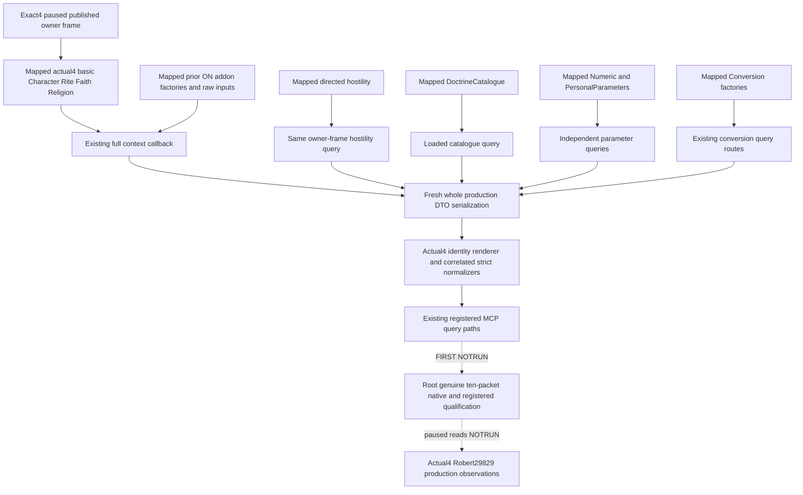

# Full adopted religion query families — CK3 1.20.0.4

This package restores existing enabled religion observations after the Steam25734779 update. It does not add a gameplay policy or a new action. The frozen image is CK3 1.20.0.4 Crozier, SHA-256 `98702F88A547CDE2EAF29A85F93B85F68EE4CF8148336A4F7AFAEB75319DD518`.

The source baseline is Root `e0ea249ae557749299735bc4cf53dfaa757aad50`, with the independently mapped basic religion dependency `1262d56385f3ae28cd0b4bb18528a57e971eff2c`. The latter closes current Character/Rite/Faith/Religion, Tenet and Doctrine inputs. It does not migrate all addon factories or the public full-context query guard.

The cached official build argv enables religion context, hostility, doctrine catalogue, numeric special parameters, personal parameters and conversion. Full context's existing owning-thread callback publishes fulfillment progress/type, mystical communion, pilgrimage type/activity/candidate routes, confession terms/permission, church income/tax, devotion, Rite virtue/sin and vow-of-poverty terms. Their native bindings remain independent: one legal unavailable component does not erase another observed component. An absent draft window must not substitute for migrating a previously enabled family.

The exact native image pointers must come from new actual4 binders and mapped operands. Caller-owned software DTO/readers may be reused after source closure; passing the actual4 SHA to an old image binder is not this migration. The stable basic API is `xar::ck3_12004::religion::BindReligionContextImage12004` and its `ReadPlayedReligionContext12004` wrapper. The context-addon aggregate, directed Hostility and Conversion leaf, DoctrineCatalogue leaf, and Numeric/Personal parameter leaf are separate owned source packages. The original reform costs/eligibility, draft choices/creation terms, resources, AI inputs, governance and members belong to the Faith restoration owner.

There was a concrete metadata incompatibility in the production path: `Render12004BuildIdentity` renders both old12002 and old12003 schema prefixes as12004 in fresh DTO output, while the full context addon normalizers required literal12003 schema labels. The full transport also limited its outer build tuple to12002/12003. The new schema helper now correlates each nested schema with the already normalized current Context's exact4 identity; the existing outer exact-build admissions accept4. The independent Conversion Fervor sibling also retains its actual4 source and nested normalization. Field sets, native signed resources, reasons, nulls, generation bits and optional observations remain unchanged. Faith Numeric Final uses its actual getter provenance `2440900`, separately from the current Rite cache.

Clergy is not an OFF baseline. Cached `ACTUAL-BUILD-ARGV-CACHE.json` lines132–134 and `ACTUAL-COMPILE-FLAGS.json` line56 prove the appointment query flag is ON. Its actual4 migration is coordinated with the existing clergy owner; it is not silently added to this package. Its source/live boundary remains that owner's responsibility.

The three source packages are [context/Hostility/Conversion](religion-context-hostility-conversion-12004.md), [DoctrineCatalogue](religion-doctrine-catalogue-12004-migration.md), and [Numeric/Personal parameters](religion-numeric-personal-parameters-12004-migration.md). Source plans, actual source receipts and retained partial attempts are external under `C:/codex-ck3-background/packets/religion-addons-12004-migration-20261007/`. The finite source cost is **42173 physical bytes / 172 reads**: context/Hostility/Conversion40451B/156, Numeric/Personal1722B/16, catalogue0. This is31390 actual4 bytes and10783 old3 bytes. Basic religion, Activity type, Province and resource owner receipts are reused rather than recaptured. New metadata/pdata/header reads, duplicate bytes and whole-EXE/hash operations are0.

The candidate adds three explicit actual4 runtime TUs and connects all ten existing owning-thread query mailboxes. The genuine whole-production native fixture is `xar_ck3_12004_religion_adopted_addons_whole_test`: one document, ten original whole packets, all thirteen context siblings, independent Faith Final and Conversion Fervor. The solely compiled-dependent registered compound consumes those packets through the existing MCP handlers, actual driver transport and production normalizers. Existing handlers call driver private queries directly; this qualification does not invent a Service query hop. Pilgrimage routes stay a list, including native order and original rows.

The world, callbacks, hello, published frame and owner mailbox admission in the new fixture are synthetic. It executes no EXE branches, submits no conversion value and transplants no archived field. The actual4 conversion scratch constructor supplies its proved primary/secondary vptrs; old-build readers retain their existing default factory. Native policy, actions and overall OODA readiness are unchanged.

Status on **2026-10-07 / W41** is **source-closed implementation candidate, AUTHORED_NOTRUN**. Parent source review and staged diff checking qualify the authored change only. Formal native build/CTest, FIRST registered consumption and actual paused original Robert29829 same-MCP reads remain Root work; there is no new static/live/loop credit. The exact candidate commit and sole build/consumer argv are in external `ROOT-DELIVERY.json` and `ROOT-INTEGRATION-AND-FIRST-RECIPE.md`.
