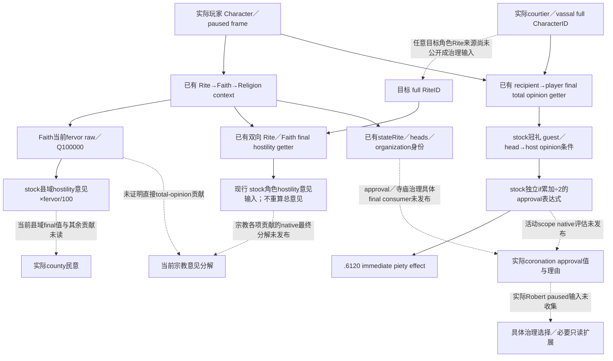

# CK3 1.20.0.3：宗教关系意见与神职治理输入

本页为 **research / file-only** 输入账本。宗教领域已由项目所有者全面开放；这里只研究廷臣／封臣的定向意见、clergy approval 与治理决策实际使用的宗教输入，不制定通用 counter-policy。realm-priest 候选、任免和任务树由独立 Council owner 维护；已经闭合的 Chancellor 替换和冷恢复不在本包重审。`WAR_CASH/PREWAR` 保持 OFF，本包不转入军事执行。

## 冻结与已发布材料

游戏为 CK3 `1.20.0.3 Crozier`，Steam build `25652598`，EXE SHA-256
`94B55397ABB687A3DCD436805A5D885E6BE90FA6C693FEB44A9E3BBEEADE02A6`。
源码盘点使用 immutable `production-source-4ee2e755`，完整 commit
`4ee2e7558dbc32c69cfa1caaeaf232a287a5ee34`。本页直接复用版本冻结与已有迁移证据，不重跑 EXE hash、ABI verifier、构建或测试，不读进程／状态。

已先读 [native README](README.md) 与四个当前专题：
[身份](religion-native-ai-faith-identity-12003.md)、
[rite growth](religion-native-ai-rite-growth-12003.md)、
[效果材料](religion-native-ai-effect-material-12003.md)、
[只读入口](religion-native-ai-readonly-plan-12003.md)。
已有 `.3` context／effective doctrine／tenet 的 production-live primitive 保持原实际 artifact 范围；它们不代表当前 Robert 的封臣宗教意见、clergy approval 或宗教治理 OODA 已经实读。

## 当前原生 getter 与发布边界

| 决策输入 | 原生最终入口／现有生产 reader | 已发布与未发布的区别 |
| --- | --- | --- |
| 对玩家的实际总意见 | `ReadCharacterOpinion12002` → `0x28BC490`，`int32(Character* owner, Character* toward)`，scale1；owner 为 recipient，toward 为玩家 | Sway／gift／Feast 有其实际目标绑定的结果口。总意见可以独立读取；不证明某个宗教 modifier 存在，不等于 clergy approval |
| 玩家当前宗教身份 | `Character.GetRite 0x28D2F90` → `Rite.GetFaith 0x24FC560` → `Faith.GetReligion 0x2443D40`；`Character.GetFaith 0x289E750`互证 | `ck3_query_player_religion_context_v1(expected_revision)`已有。Character+B4 是 RiteID；不把 Faith main Rite 与玩家 Rite 合并。该口不接受任意廷臣／封臣 CharacterID |
| 当前 Faith fervor | `0x243EA90`，`int64_t*(Faith*, out*)`，Q100000，当前 reader 保留 signed raw／合法 null | context 发布当前资源；不是未来 gain，也不是“热忱越高→廷臣意见越高”的已证明公式 |
| 目标 Rite／Faith 的最终方向性关系 | Rite `0x2591CE0(source_component, source_rite, target_rite)`；Faith `0x243E950(source_faith, target_faith, false)`；返回 byte0..3 | `ck3_query_player_religion_hostility_v1(expected_revision,target_rite_id)`已存在：双方 Rite／Faith／Religion／main Rite 与四个正反方向最终等级，另有 same_faith／same_religion。输入是 full RiteID，不是 CharacterID；需先有目标角色的实际 Rite 来源 |
| 宗教国家／组织身份 | `ck3_query_player_rite_governance_v1(expected_revision)`，分组件 `state_rite`／`heads`／`organization` | 原生身份、计数与 available 原因可复用；不是 clergy endorsement、批准率或税／levy收益值 |
| 神职候选合法性 | `ck3_query_player_clergy_appointment_v1(expected_revision,candidate_character_id)`已在 frozen MCP注册；`native_valid_position`／`native_valid_character`／`native_can_reassign` | 同时发布候选／现任和 Rite identity；没有 approval、意见或治理收益。不能因四专题库存略去此口就称它“未公开” |

`ReadCharacterOpinion12002` 在现有源中解析完整 recipient／player references，并调用同一最终 getter 两次，保存 signed int32 原值。已有 `.3` nonwar comparison 的105-byte span `0x28BC490..0x28BC4F9`与旧版逐字节相同，SHA-256
`6594307325c64cb7366ccdbbda7f70af28aef56f2a11fc407b6c24d7be681db0`。
原 opinion trigger 的 `0x2B78E01`也直接调用此 getter；此项是复用已保存比较，不是本包新跑的验证。完整 total opinion 包含其它贡献，本页不从总值倒算宗教贡献。

现有 hostility reader 对 source／target交换后分别调用 Rite 与 Faith final getter，保留两组方向；Faith调用的 offset 固定false，任何返回值>3报原生 unavailable。它不按“同 Religion”自行合成最终敌对等级。旧 `.2` 的详细 relation→doctrine／tenet override→divergence→same-head树见 [hostility 原生专题](religion_doctrine12002_hostility.md)；本页不借编译成功泛称其每个下游 `.3`分支都经过新实测，当前 getter／reader来源和后续 paused结果分别记录。

### 当日已有 priest 身份／任务 primitive

ROOT的V21官方冷恢复在新PID96348保留原Robert goal及六个ledgers。现成
`m2-events/ewan0801-v21-relation-pre-and-council-cold-01/003-ck3_query_campaign_root_context_v1.json`
在 paused actor29829、native4／public revision2、raw53222304独立观测
`councillor_court_chaplain` holder56513、`task_religious_relations`、general、null target、frozen false及infinite progress。
这是已有 root查询的身份／任务 read primitive，不是本包新增query或神职任命；该packet没有approval、意见、税／levy或任务收益。当前priestspecific Rite和effective宗教贡献也不由岗位／task key推出。realm-priest owner负责其候选／任免／任务专题，本页只复用这一个实际入口。

## 现行 stock 的必要分界

当前宗教定义目录是 `common/religion/doctrine_types`。`00_defines.txt:848–861`分别定义角色 hostility opinion `[0,-10,-20,-30]`与县域 `[0,-15,-30,-45]`，后者明确按 `fervor/100` 缩放。这是已找到的 fervor→县域宗教民意 consumer；不能把县域公式用于廷臣或封臣的角色总意见。具体当前县域最终值、该帧采用的 fervor 来源和其它县域贡献尚未实读。最终应以实际关系方向的 getter与总意见为准，不能仅从 Faith／Religion identity 或 stock表重建总意见。

两个独立 stock 子包已冻结，共29个去重文件 pins；原始 comments、info与consumer摘录见
[来源 pins](Z:/ck3_mod_rewrite/artifacts/g2-maintainer-2026-10-02/resume-12003/religion-governance-opinion/stock-modifiers/STOCK-SOURCE-PINS.json)、
[Faith／Rite 关系](Z:/ck3_mod_rewrite/artifacts/g2-maintainer-2026-10-02/resume-12003/religion-governance-opinion/stock-modifiers/faith-relations/FAITH-RELATIONS.md)与
[clergy governance](Z:/ck3_mod_rewrite/artifacts/g2-maintainer-2026-10-02/resume-12003/religion-governance-opinion/stock-modifiers/clergy-approval/CLERGY-APPROVAL-STOCK.md)。这些是当前安装的原版定义，尚不证明某个 mod 加载后采用相同定义或 Robert 当前有效 modifier。

### Faith／Rite 关系和封臣 stance

`tenet_communal_identity` 的现行 `others-regard-you` 角色贡献包含
`same_faith_different_rite_opinion=-20`，县域项另为-10。因此同一Faith不能
据此断言“没有宗教意见代价”；玩家Rite与Faith main Rite也不能在输入层合并。
fundamentalist／righteous／pluralistic 的 authored hostility multiplier 分别为2／1／0.5；Christian syncretism 的 source／target override 和双方 opinion keys 又各有方向。`zealous` 的 `opinion_of_different_faith=-35`不能凭字段名与 incoming `different_faith_opinion`互换；其当前 native directional consumer 尚未闭合。本页不把这些贡献相加充当实际总意见。

`_vassal_stances.info`说明 stance选择在 `RARE_TASK_TICK`时比较有效候选；
这是stock机制声明，本页未闭合当前`.3` scheduler／最终native选择caller。
现行zealot分支读取同Faith或 **vassal Faith→liege Faith** 的hostility0；
minority分支的宗教条件读取differentFaith、该方向hostility>1及对liege Rite的
`rite_syncretic`否定，同时保留它的culture OR分支。不能只从玩家→封臣方向
推出封臣stance，也不能删除culture条件后把宗教分支当整个minority判定。

此处stock关系表、communal identity参数和stance条件只是原生输入。当前
Robert具体廷臣／封臣的Rite、有效tenet、stance、总意见及native stance最终
选择没有在本包实读；其应用所需最小identity／direction／最终getter见上表。

### 神职意见、批准与治理分开读取

当前 directlinks 未建立普通 realm-priest endorsement 的旧阈值或税收公式。已找到的现行输入如下；具体行窗、完整条件和原文件 SHA 保留在
[STOCK-CLERGY-APPROVAL.json](Z:/ck3_mod_rewrite/artifacts/g2-maintainer-2026-10-02/resume-12003/religion-governance-opinion/stock-modifiers/clergy-approval/STOCK-CLERGY-APPROVAL.json)。

| 现行 stock 输入 | 原始 consumer 与方向 | 不能推导的当前结果 |
| --- | --- | --- |
| `PIOUS_CLERGY` | `00_defines.txt:450–476`的注释明确为 secular opinion owner→theocratic clergy target，按 target piety level 取 `[-5,0,3,5,10,15,20,25,35]`；反向有独立表 | 不等于 clergy→liege 的实际意见或批准值 |
| Temple lease／ownership | `20_doctrines.txt:1110–1168`：temporal doctrine 的 `theocracy_temple_lease` 与 lay clergy 的 `theocracy_temple_ownership`／`lay_clergy`分开 | 没有当前 lessee、最终税收或 levy 数额 |
| Theocratic grant AI | `02_theocratic_government_types.txt`两类政府以 authored base0→满足条件加10；县、无 cooldown、AI zeal≥35、temporal Rite、realm≥5 counties及 theocratic county share<10%等条件；玩家入口另用<25%且无5县条件 | authored AI 权重不是最终授地选择；不借此实施 grant 策略 |
| Sway 神职目标 | `sway_scheme.txt:442–459`对 theocratic lessee 目标使用 owner piety level>1 时的 `5*level`，level<0减50；target Faith religious head另减30 | 成功机会输入，不是意见、批准或完整 AI willingness |
| `vows_of_poverty_modifier` | `00_religion_modifiers.txt:35–42`含 monthly piety+2、clergy opinion+5、zealot opinion+5、income mult−20%；decision有独立有效 Rite／ruler条件和取消效果 | 未实读有效 modifier 或经济／意见收益；不把此决议自动推荐给当前 Robert |
| Ear-of-Clergy marker | `hof_ask_for_gold_interaction`有 acceptance base−40、recipient→actor opinion权重0.5；共享 modifier读 marker后加25 | +25是接受度分数，不是 clergy opinion+25或概率；不是最终接受结果 |
| Fulfillment 的神职派系 flag | 同Faith、theocratic且 title>barony 的封臣，目标具有 effective `sp_clerical_vassals_faction_more`时，independence create／join共同 stock modifier加25 | 原始 fulfillment raw或 authored level阈值−95不直接证明当前 effective flag、成员或最终 faction score |

Fulfillment 的最小后续 getter 已在现有专题冻结：`Evaluate 0x2B29320`→`GetFulfillmentLevel 0x3181D60`→level definition `+0x1C0` parameter flags。该 consumer 真正需要的是 effective flag，不能长期只发布 raw再推断它。当前包复用此入口，没有新 ABI／query或 faction执行。

### 加冕 clergy approval 的具体评分与效果

`common/script_values/10_ach_values.txt:762–908`定义 `coronation_clergy_approval_value`：base0，多个独立 `if`累加后除以2。例如 special guest→host opinion≥90或 religious head→host≥40加1；最高 piety／圣者身份条件加2，另一组 virtue／piety条件可再加2，第三组可再加1。反向低意见、低 piety、Rite判定的罪／恶名和 excommunication也可以累计扣分。完整 OR 条件见已冻结 source excerpt；本页不把独立 `if`改成互斥分支，不推断除法舍入。

`coronation_events_6.txt:7815–7830`将该值展示为 low<-1、high≥1、其余 middle；`10_ach_effects.txt:1206–1322`再以 descending else-if 使用此值：≥3／2／1／0／−1分别给 piety +500／250／100／50／25，≥−2／−3／−4分别扣50／250／250，else扣500。正收益才受 anointment option multiplier1.5影响。直接 caller是 `coronation_events.6120`的 **immediate**，`coronation_events_6.txt:8019`在 options以前执行 piety effect；不能把这一效果描述成随后点击某个选项才产生的奖励。

这是可定位的 stock 最终评分表达式与实际事件 consumer。现有 context／governance／clergy appointment MCP均未发布这个 activity-scoped最终值；本包也没有当前加冕活动、native evaluated approval或piety前后帧。若真实活动需要这个决策，下一入口是该 script value及`.6120` caller，绑定 host／activity／special guest／religious head实际scope再查 native named-value evaluator。不能直接沿 interaction-only evaluator假定 activity ABI，也不据此恢复普通 realm-priest endorsement公式。

## 原生输入树与尚未闭合分支

## 最小后续观察入口

1. 对已经由 Sway／gift／Feast结果绑定的实际角色，复用其现成定向总意见字段，不为宗教创建第二个总意见计算器。需要未绑定的真实廷臣／封臣时，沿同一 `ReadCharacterOpinion12002` 接入目标full CharacterID；总意见和宗教分解分别命名。
2. 目标的 Rite identity先复用现成 clergy candidate／conversion／其它已发布目标来源，只有当前真实角色仍缺它时才扩同一bridge的 Character.GetRite→Faith／Religion identity。再使用现成显式 targetRite hostility口。不得从旧 `faith_id`标签或玩家身份猜目标身份。
3. 加冕的具体 stock key／caller已经定位，真实活动出现时沿正确 activity scope读取最终值／合法性／理由与 piety前后帧；普通神职 endorsement仍需其自身最终 consumer。realm-priest候选／任务链继续由其owner独占。没有真实加冕依赖时不造 absent-activity query或 counter-policy。
4. fervor已有当前资源getter，县域缩放 consumer已明确；真实县域决策所需的是当前 final county值及相关方向。Fulfillment→clerical faction则应读 effective level／flag。没有证据时不把这些资源列成全部角色意见或 clergy决策的总gate。

本页新增状态为 research，既有primitive只是复用。当前没有新query、策略、动作、游戏日或G2 credit；ROOT独占实际paused验证、状态、发布及commit/push，共享2026-10-03日报／周报由ledger合并本页字段。
