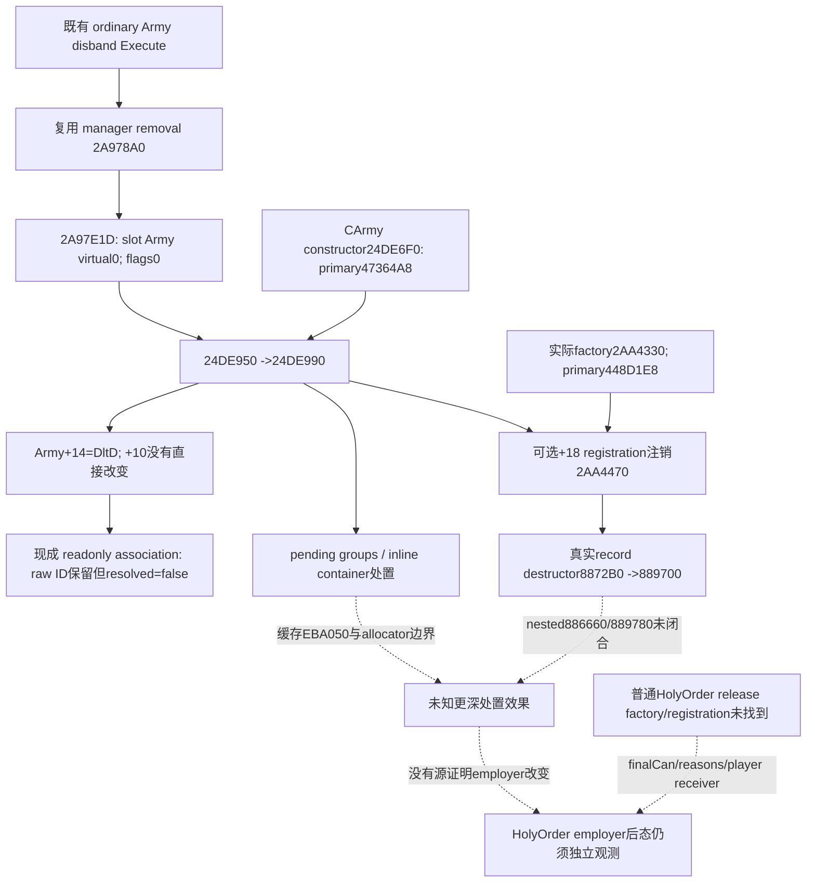

# CK3 1.20.0.3：圣团后态关联的实际 Army 析构入口

2026-10-06，**source-confirmed / research**。exact `.3 / Steam25652598`，冻结 EXE SHA-256 `94B55397ABB687A3DCD436805A5D885E6BE90FA6C693FEB44A9E3BBEEADE02A6`。本增量全程离线，不启动、连接或查询 CK3，不操作窗口、Steam、profile、save 或真实 pipe；没有释放圣团或增加实机动作信用。

现成[玩家圣团 Army 关联](religion-holy-order-player-release-source-and-army-association-12003.md)已由 Root 合入并发布：中央 source `3fb869c751d9050caffa790716a332ca71238c1a` 的 full DLL 和三个新 target 首次 GREEN，三个新 CTest 首次 3/3 GREEN；本域一份 genuine wire 含四个 sample，一次 registered MCP 消费 **83 checks / GREEN / exit0**。关联输入为 static-ready。此后的源研究不重跑这些路径，也不把它们当作实机雇主或公开 CUnit 移除。

## 真实 virtual receiver，不再停在匿名 Army 析构

前一包缓存的 `2A978A0..2A97EC1` Army manager removal 在 `2A97E1D` 调用 resolved **slot Army** 的 `vtable[0]`，`EDX=0`。被传入的 Army 与 slot Army 只经过 ID 相等比较，不能据此证明两个物理指针相同。本增量复用该完整旧 body，不再次读取 EXE。

当前 `.3` ABI reuse 所引用的 `ck3_1_20_0_2_army.json` 明确给出 `CArmy_primary 47364A8[0] → 24DE950`。沿这一真实 receiver，先读有界 `.pdata`，再读实际 body，得到：

| 源入口 | 直接闭合的行为 |
| --- | --- |
| `24DE6F0..24DE942`，594B | CArmy constructor 写 primary `47364A8`；初始化 `+10=UINT32_MAX`、`+14=0x41726D79`。`+18` 是独立的可选 registration index；启用字节为真时经 `GameState(5C68C50)+A0+18 → 2AA4330` 取得，不能把它叫 CArmy full ID。 |
| `24DE950..24DE984`，52B | scalar deleting destructor 总是调用 `24DE990`；只有 flags bit0 为真才按 `0x208` 释放 Army 内存。实际 removal 的 flags0 分支跳过此释放。 |
| `24DE990..24DEA4A`，186B | 处置 `+198` string、`+68` inline container、`+50` pending vector、`+38` Regiment-ID vector；可选注销 `+18` registration。`24DEA38` 直接把 **Army+14 改为 `0x446C7464`（DltD）**，没有直接改写 Army+10。 |
| `B03250..B03323`，211B | inline container 的 string/vector 处置；保留其 allocator virtual 边界，不把 container offsets 当 HolyOrder fields。 |
| `24E9E70..24E9ECB`，91B，三个 unwind fragments | 逐 pending 8B slot 调用 `24E9940`，结束时 count 归零。实际 `24E9940..24E99C2` 的完整130B复用 attrition 已冻结缓存；它释放 group，**不把外层 slot 写成 null**。 |
| `2AA4330..2AA446A`，314B | registration factory 分配固定 `0x50` record，两个分支都安装 primary `448D1E8`；复用 manager `+68/count+74` free-index vector，或追加到 `+50` record vector。 |
| `2AA4470..2AA45FD`，397B，五个 unwind fragments | 注销上述 index，移除全局 record pointer，置 manager `+50[index]` 为 null；调用 record 的 virtual slot0，释放 record，随后将 index 交还 free-index vector。不能写成“从 free-index vector 移除”。 |
| `448D1E8[0] → 8872B0..8872E4 → 889700..889776` | 实际 registration-record destructor。flags0 跳过自身 `0x50` delete；后者处置 record `+10/+30` object vectors，继续调用 `886660/889780`。record 的语义类名未闭合，不凭布局命名。 |

因此，当前 `troop_association` 的 full-generation、Army tag 检查有真实生命周期依据：一个引用的 raw Army full ID 仍可保留，而该对象已经具有 destroyed tag，必须保持 `native_carmy_resolved=false`，不能联接到另一代 public Army。这里解释的是独立 association resolution；Army 析构、注册项移除和 HolyOrder employer 清空仍是不同源效果。

## 保留有界 UI 无命中与真正下一入口

Root 指定从现有 `.3` player Army UI anchor `D0FA19` 做一次 metadata/family locator。17个 `.pdata` 记录中只选择四个新 body，共 **2,699B 新code、6,963B 实际 I/O**：`D0FAE0` 构造 temporary CMergeUnitsCommand（primary `476AB20`、secondary `476ABB8`）产生 public Unit merge reasons；`D0F7E0` 是 any-Unit predicate，`D105A0` 是 string wrapper，`D105E0` 是 Unit/Province/AI 状态分类。没有找到实际 HolyOrder release producer；**MilitaryView class identity仍 unknown**。这只是四个已选 body 的局部结论，不是所有17个函数、更不是全引擎普通命令的否定。

旧 `CMilitaryView` RTTI/getter helpers 绑定 `1.19.0.6 / SHA2D00FF...DB86`，仅作历史参考，没有把它们当 `.3` locators，也没有执行全 `.text` probe。当前 ordinary HolyOrder release 仍缺真实 registration/literal 或 factory，以及 constructor/clone、finalCan/reasons 和 player receiver。下一步以实际 `.3 MilitaryView.PlayerDisbandAll` registration/callback 或 release-specific factory 为 producer；不能调用内部 `2A889C0` 伪装普通命令，也不能用 generic disband 代称已证明的 HolyOrder release。

更深 record/pending-vector cleanup 的未知边界保留于图中；无需为证明全局不存在释放而扩大析构研究。本增量没有改 provider、normalizer、策略或 action，没有新增 native target，也不重跑旧测试。外置 source plan、完整 raw/disassembly、逐次 metadata/code成本和报告字段在 `Z:/ck3_mod_rewrite_process_assets/g2-background-round5-20261006/holy-order-player-release/army-teardown-receiver/`；UI 局部无命中独立保存在同包 `manual-receiver-cache/`。
