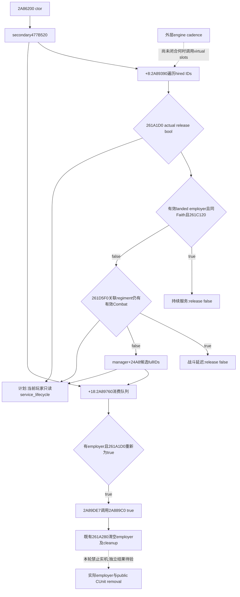

# CK3 1.20.0.3：圣骑士团的自动释放条件与当前服务生命周期输入

2026-10-05 后台增量，**research / automatic native source closed; readonly implementation awaiting central validation**。已找到实际管理器候选生产、条件复核与释放调用，闭合多战争持续服务及战斗延迟条件。本包不创建普通玩家 release/dismiss 动作，也不调用内部 release 函数。此前[释放写入与召回](religion-holy-order-release-lifecycle-12003.md)、[当前战争资格](religion-holy-order-war-eligibility-12003.md)及[普通 hire](religion-holy-order-hire-command-construction-12003.md)分别保留各自证据。

版本 `1.20.0.3 Crozier / Steam25652598`；复用冻结 EXE SHA-256 `94B55397ABB687A3DCD436805A5D885E6BE90FA6C693FEB44A9E3BBEEADE02A6`。仅窄读已定位 manager 家族、真实 constructor/vtable/callback、`.pdata` 与直接分支；没有全 EXE 扫描、重新 hash 或 closed body 回读。没有 CK3 启动、连接、实时 query、SDK/pipe/UI/Steam/process/profile/save/cache 操作。外置新证据：`Z:/ck3_mod_rewrite_process_assets/g2-background-round4-20261005/holy-order-lifecycle/`，包含保留的无命中 attempt、source成本、plan与 Mermaid。计划检查只验证文件及作者声明，不证明解释或游戏结果。

## 实际管理器 producer 与 consumer

| 原生入口 | 源已闭合的职责 |
| --- | --- |
| `2A86200..2A8678F` | CHolyOrderManager constructor，primary vtable `477B598`，secondary `477B520` 在 manager `+8`；HolyOrder registry 在 manager `+28`，全局槽 `5D1DF10` 指向这个嵌入 registry。 |
| secondary `477B520 +8 → 2A89390..2A8975E` | 用 secondary this，遍历 `+E0`（manager `+E8`）已雇佣 order fullIDs，调用 `261A1D0(order)`，true 时将 order fullID 追加到 secondary `+24A0/count+24AC`，即 manager **`+24A8/count+24B4`**。 |
| secondary `477B520 +18 → 2A89760..2A89EBB` | 逐项解析上述候选 fullID；`order+80 != UINT32_MAX` 且重新调用 `261A1D0` 仍为 true 时，在 **`2A89DE7`** 调用 `2A889C0(manager, order, true)`；最后清空候选 count。 |

候选队列不是已释放结果：消费时会再次查 employer 和原生条件。虚表及完整 producer/consumer 证明了真实 engine path；外层 engine 何时调用这两个 virtual slots 尚未闭合，不能承诺“下一 tick”或特定日期释放。365 bucket、月更新及 modifier refresh 不替代外层 cadence 证据。

## 原生当前 release bool 与多战争条件

`261A1D0..261A280` 的完整 bool 为：**不再满足“有效且有 landstate 的实际 employer、与 order 同 Faith、`261C120(order, employer, nullptr)` 当前战争资格”三项共同条件，并且组织的 regiment 集合没有仍在有效 Combat 中的成员，才返回 true**。

具体控制流先按 `order+80` 的完整 Character ID 解析 employer，检查 Character tag/fullID 和 `+1C0` landstate；再复用 `261BF10(order, employer, nullptr)` 同 Faith 与 `261C120`。二者全为 true 就直接返回 false。否则调用 `261D5F0(order+88)`，只在该 combat leaf 返回 false 时返回 true。这里没有 final CanHire 的“已雇佣”、费用、HIRE_LIMIT 或绝罚门，不能用 `can_hire=false` 代替 release 条件。

`261C120` 的[既有完整源](religion-holy-order-war-eligibility-12003.md)遍历实际 employer 的全部当前 WarIDs，选对侧真实成员，判断 order Faith 与敌人 Faith 的双向 loaded hostility。**一场战争结束后，只要另有任一 qualifying war，仍能保持服务**；仅剩不满足该宗教门的战争不会自动保住服务。`ENEMY_MIN_HOSTILITY_LEVEL <=0` 的原生 early-true 保留，因此不能把“没有 war”硬编码为 release。相同 Faith 无须相同 Rite。

`261D5F0..261D738` 是三个相邻 unwind 片段的完整只读叶：遍历 order `+88` full Regi IDs，逐项解析有效 `ArRg`，取 Regi `+140` 的有效 `Army`，再取 Army `+128` 的有效 `Comb`。至少一个有效 Combat 就返回 true，延迟因战争／Faith／employer 条件失效产生的释放。这里没有判定围城、移动、raised 数量或公开 CUnitID；不能把它自创成“在任何军事活动中”。

## 最小查询实现与边界

现成 `ck3_query_player_holy_order_context_v1` 的军事行新增独立 `service_lifecycle`，只对实际 `row.employer_id == played_character_id` 有适用意义：读取原生 `261A1D0` release bool、`261D5F0(order+88)` combat bool，以及当前 manager 候选队列 membership。输入独立于 final hire、成本与当前战争理由，不按 CanHire 成功与否隐藏。其他 employer 或未雇佣行明确 `applies_to_player=false`，不造玩家服务状态。缺少 binding/读取失败明确 unavailable，不把它写成合法 false。

队列 getter 从现成 `5D1DF10` registry 指针减去源已闭合的 `0x28` 得到 manager，读取 `+24A8/count+24B4`，只复制 fullIDs，不调用 producer/consumer/release。历史 wire 可无此新字段。下一次有授权的实机应独立核验 employer 与公开 CUnit 消失，尤其“另有 qualifying war”和“最后 qualifying war 结束但仍在 Combat”两种情形；本轮 fixture 或 ACK 不提供 live、日数、收益或 loop 信用。

新增 `xar_ck3_12003_holy_order_service_lifecycle_test` / CTest `ck3_12003_holy_order_service_lifecycle` 使用 source-bound manager/registry 偏移的 fake memory，覆盖持续服务、war qualification 丢失但 Combat 延迟、原生 release-ready、候选已排队但复核为 false、非玩家 employer、未雇佣、nonmilitary、独立 resource terms unavailable、新 binding 缺失、队列不可读。fixture 通过 production provider/command_result serializer 输出四个 sample；`test_holy_order_service_lifecycle_registered_mcp_v1.py` 将消费该真实 fixture，经已注册 MCP 和实际 Python normalizer 验证字段。中央 Root 统一编译新 target 后只运行这一新 consumer 一次，当前未运行或重复旧 test。

## Root adoption and independent MCP qualification (2026-10-06T00:21:35+08:00)

# Holy-order lifecycle round4 Root appendix

Reported 2026-10-05T23:50:27.952801+08:00 (Asia/Shanghai), natural day 2026-10-05, 2026-W41.

Why: Future player needs to distinguish same-Faith multiwar service retention, native automatic release eligibility, Combat delay, and a queued candidate that still requires recheck. Final CanHire=false and hire ACK cannot answer persistence.

Result: Actual constructor->vtable->candidate producer/consumer and261A1D0/261D5F0 conditions source-closed; existing readonly holy-order MCP exposes independent current-player service_lifecycle native booleans and fullID queue membership.

Source: constructor2A86200 binds secondary477B520. +8 producer2A89390 scans hired IDs, native261A1D0 true queues manager+24A8/count+24B4. +18 consumer2A89760 resolves queued IDs and rechecks employer/condition, real2A89DE7 calls2A889C0(manager,order,true). Predicate retains service while valid landed actual employer is same Faith and ANY qualifying current war remains; after losing that shared condition, valid associated Regi->Army->Combat delays release. The261C120 loaded threshold<=0 native early-true is preserved. No payment/hiremode or genericArmyDisband substitution.

Implementation: aba4cdb6bbf58bc99385c5b2777534de39d26023,7files. Existing registered readonly context gains service_lifecycle {available,unavailable_reason,applies_to_player,release_eligible,associated_regiment_in_combat,release_check_queued} independently of CanHire/resource terms. Inapplicable non-player employment never produces player service claims. Exact native predicates and source-bound manager queue only; no release or producer/consumer execution.

Validation: one source plan check GREEN11evidence/7static edges/1unknown/1our implementation edge, record/file integrity only. One whitespace check GREEN before commit. New strict target xar_ck3_12003_holy_order_service_lifecycle_test and CTest ck3_12003_holy_order_service_lifecycle await Root;4native sample scenarios. New registered MCP consumer awaits the genuine fixture. No old tests rerun. Native source I/O 27891B; new code 12899B and tables 280B. No full EXE scan/hash/closed body reread.

Readiness: research: automatic native source closed; readonly implemented, awaiting centralized validation; no live capability gain yet. Outer engine cadence, actual current native acceptance, post-war/combat employer and publicCUnit removal are pending. Ordinary player release command remains research. No new live artifact, game/day/paidaction/loopcredit.

RED/attempts: preserved bounded8function nohit result; it was only a narrownegative. Table helper indentation error before EXE read fixed once. First43B predicate pdata fragment was explicitly partial; disjointcontinuations sourceclosed it. ATTEMPTS.json and SOURCE-COST.json preserve these costs.

Artifacts: Z:\ck3_mod_rewrite_process_assets\g2-background-round4-20261005\holy-order-lifecycle; research-plan.json, RESEARCH-PLAN-CHECK.json, NATIVE-TREE.md, native spans/table pins, SOURCE-COST.json, ATTEMPTS.json, IMPLEMENTATION-RECEIPT.json, REPORT-FIELDS.json. Root owns shared canonical/index/day/week/month report adoption. No push.

Next: central build/one new CTest then one registeredMCP consumer. Future authorized live acceptance distinguishes remainingqualifyingwar, lastqualifyingwarended-butCombat, release-ready candidate recheck and independentemployer/publicCUnit removal. Do not promise nexttick without outerengine schedule closure.

## Oct6 centralized validation receipt

Actual 2026-10-06T00:14:46.236097+08:00, integrated source 89cb683dbed31bad3bc0c008ea525faf1db08db0. Root native-round4-core-02 fullDLL+4newtargets GREEN9.400365s;4newCTests firstGREEN0.51s, own0.09s. One genuine native wirefile contains4samples (not4files); one new registeredMCPconsumer GREEN4samples/103checks/exit0,2outputfiles. WireSHA 3c269cafb93fe3b6b60b014bd9c92d9e2f54fd053ca167e3e216061aad0ce4ab; RESULT SHA b173f3d66cb88294f90ee05dc4c4ea783410f4e6ed58c0786373a83f9440a345. Readiness static-ready independent current-player automatic service lifecycle input. No old test/wire rerun, source mutation, compile, game query/action or live credit. Continue ordinary playerrelease action source-first offline.
