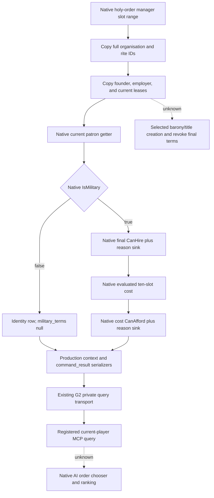

# Holy-order current-player query implementation — CK3 1.20.0.3

This addendum belongs with `docs/ck3-native-ai/religion-holy-order-systems-native-ai-12003.md`. ROOT adopted the 17-file query implementation into production v32 and immutable `production-source-8cf176b4`; strict build and CI were GREEN before the paused Robert acceptance below. The native source tree was researched before this implementation. Existing creation/patronage and hire ABI evidence are reused, without another ABI audit.

## Build and current scope

- CK3 `1.20.0.3`, Steam build `25652598`, executable SHA-256 `94B55397ABB687A3DCD436805A5D885E6BE90FA6C693FEB44A9E3BBEEADE02A6`.
- Implementation preimage: `production-source-db463118`; accepted production source: `production-source-8cf176b4`, v32.
- Current live acceptance target remains Robert, played character `29829`. The public query accepts only `expected_revision`; callers cannot select a different character.
- Reuses `allow_private_player_religion_context_query` and native `XAR_CK3_ENABLE_G2_PLAYER_RELIGION_CONTEXT_PRIVATE_QUERY_V1`. No new feature flag, no action, no war switch change.
- Tool: `ck3_query_player_holy_order_context_v1`. Native step: `query-player-holy-order-context-v1`. Domain: `player_holy_order_context_v1`. Schema: `ck3_12003_player_holy_order_context_v1`.

## Concrete observation

The application-main mailbox resolves the currently published played character and calls the new production reader. The reader scans the native holy-order manager's slot range, skips null and fallback slots, and copies the real organisations. It does not need either the Military or Faith window to be open.

Every organisation reports its full generation-bearing ID, rite ID, military/nonmilitary type, founder, current dynamic patron, employer, and all current leased-title references. Founder is historical identity; patron comes from the engine's current lease/holder computation. Legal missing character references become `null`; legal zero references remain zero.

For military organisations, the reader calls the native final `CanHire`, evaluated cost, and cost-based `CanAfford` getters for the actual played character. Both predicates are reported separately, with both engine reason strings and the complete ten signed Q100000 resource slots. Python preserves the native result; it does not reconstruct costs, choose a strategy, or interpret reason text as executable rules. A nonmilitary organisation has `military_terms: null`; an unreadable military sample has explicit unavailable fields rather than false or zero substitutes.

Collection availability and military-term availability are separate. A successfully read empty manager is an available empty collection. A missing manager is unavailable. These distinctions avoid claiming a hire quote where only an organisation identity was observed.

## Validation and readiness

The external package contains one focused production-reader/serializer fixture and one full registered transport fixture, with their exact artifacts and hashes in `IMPLEMENTATION-DELIVERY.json`. The registered fixture must consume bytes from the actual native command-result serializer; a Python wrapper is not evidence of that route.

The native reader fixture covers manager holes, legal empty and unavailable collections, full references, a dynamic patron distinct from the founder, leases, two military and one nonmilitary organisation, ten signed resource costs, independent hire/affordability answers, and literal native reasons. The initial fixture failure expected `\\n` where production correctly emitted valid JSON `\\u000a`; the historical RED remains preserved, and only the fixture expectation changed. This was a fixture failure, not evidence that the capability failed in CK3.

The external fixtures established `static-ready`; ROOT then adopted and built the source, cold-started the minimized production process, and completed one registered paused Robert query. The collection and the present military organisation's final hire/cost/affordability observations now qualify as a `production-live primitive`. This lane only read ROOT's CLOSED disk artifacts. It did not connect to CK3, the SDK or a pipe, or perform screen/window operations. No hire action, gameplay loop, creation/revocation capability, or complete holy-order strategy is claimed.

## Paused Robert production observation — v32

ROOT closed `actual-v32-religion-type-tax-holy-order-01/result.json` GREEN, exit 0, before this lane read it. The actual holy-order call is `002-ck3_query_player_holy_order_context_v1.json` (7049 bytes, SHA-256 `1041c5cea507bc900d8c7cc10f36f4be724c23a75395856b31ca6bee1ddbcdbd`). The call took 2.421 seconds. Both initial and final ROOT snapshots remained paused at raw date `53236176`, Robert `29829`, native revision `4` / public revision `2`. ROOT identified the new cold PID as `109732` and the prepared environment SHA-256 as `a659ee553736c3a9429a961711411090ed6b53931a9c1a202f057b3179397486`. Native capture epoch was `17503`.

The collection is **available**, with five organisations: one military and four nonmilitary. This is a world-manager collection, not a claim that Robert founded or can hire every row.

| Order full ID | Military | Rite raw reference | Founder | Current patron | Employer | Current leased-title IDs |
| --- | --- | --- | --- | --- | --- | --- |
| 0 | false | 4294967295 | null | 35923 | null | 5477, 11878 |
| 1 | false | 4294967295 | null | 29097 | null | 2317, 423, 699 |
| 2 | false | 4294967295 | null | 31899 | null | 134 |
| 3 | false | 4294967295 | null | 35649 | null | 14541 |
| 4 | true | 15 | 31100 | 31100 | 39004 | 7558 |

The four nonmilitary rows have `military_terms: null`. They are not evidence of military hire availability. Their raw rite value is `UINT32_MAX`; it is preserved as the actual native value and is not assigned an invented faith identity.

The single military row, order `4`, has `military_terms.available=true`, native `can_hire=false`, and independent native `can_afford=true`. Its complete signed raw resource vector is `[0,0,10600000,0,0,0,0,0,0,0]`, scale `100000`: an evaluated piety cost of **106**. Both native reason sinks were sampled. The hire reason states “被绝罚的统治者无法雇佣骑士团” and “他们已经被雇佣”; the affordability reason is a legitimate empty string. The original control markers, tooltip tokens and newline remain unchanged in the artifact. Robert's initial and final piety remained `37145000` raw; this readonly query did not pay the quoted cost or hire the order.

Copied identities and every military final-term field are pinned in `artifacts/g2-maintainer-2026-10-02/resume-12003/religion-holy-order-systems-12003/actual-v32/HOLY-ORDER-OBSERVATION.json`. The raw artifact remains the evidence; the copied summary does not replace it. A future available empty manager would still be a valid zero-organisation observation, distinct from unavailable; this accepted frame actually contained five rows.

## Next concrete work

The current native query already resolves the real hire blocker separately from affordability. The next selected-title reader can reuse the existing held-title collection and final decision getters while explicitly constructing the controller's barony/title context. Parent policy work can consume the observed final terms after consulting the native tree. No hire should be inferred from affordability alone.

The separate creation/revocation task must construct the actual native selected-title context: `scope:barony` for military order creation/revocation and `scope:title` for the monastic county selector. A root-only decision quote does not settle these selected-title branches. The existing stock tree and final decision leaf provide its next implementation entry; this current collection query does not claim those branches complete. Native chooser ranking remains explicitly unknown and does not prevent the final hire leaf from being observed.

The parallel v32 disk research narrowed that next entry: `GetCurrentTitle` resolves a named kind5 Title token via `18D29E0`; `HasValidTitles` calls the actual widget's vtable+`40` candidate producer via `18D2A90`, supplying the real actor and selected-parameter object. The concrete virtual target and parameter constructor/name setter/export remain unknown. Existing `construction_held.cpp` gives a reusable personal-domain title source, but its barony-only output is not the complete decision candidate set; a monastic county query must retain tier2 separately. The exact spans and source pins are recorded in the systems topic and external `create-selected-context/RESEARCH.md`. No selection UI is needed for this research, and no creation/revocation query or action is yet claimed.

Daily and weekly reporting fields and this document's post-update pins are provided externally for ROOT to merge into the shared reports. Production query acceptance is closed; commit/push and shared-report publication remain ROOT-owned. This child does not mutate Git or shared source/report files.

## 2026-10-03 v43: fresh current-war hire qualifications

The existing holy-order query remains a **production-live primitive**, with a fresh completed paused Robert sample. Root SDK26432 returned GREEN and closed normally with exit0; the existing owner consumed the body and paired snapshot once. Both bind actor29829 / raw53240904 / native141 / public2, capture epoch339029. The available collection contains five organisations, four nonmilitary and one military; all military final terms are available and every current military CanHire is false. There is no legal-and-affordable hire candidate in this captured frame. This is observed game qualification; religion and warfare authorization remain fully open.

Military order4 / rite15 has founder31100, current patron35131, employer39004 and leases7558/4146. Native CanHire=false and independent CanAfford=true. The complete raw resource vector is `[0,0,10600000,0,0,0,0,0,0,0]` at scale100000, a106-piety quote. The actual native hire-reason summary says that excommunicated rulers cannot hire holy orders and that this order has already been hired; its original literal and control markup remain in the pinned receipt. The affordability reason is an available legitimate empty string. Current order strength is available at938 soldiers, an ordinary count without Q scale. These are native current terms and order troops, not a hire, payment or Robert reinforcement. The prior v37 primitive's1008 soldiers, patron31100 and single lease7558 remain historical in the [current-soldier observation topic](religion-holy-order-current-soldiers-native-observation-12003.md); this later938 sample is not attributed to a battle loss.

The actual DLL/source is frozen v43 `Z:/g45` / `8e2cfbee4981af7f80398ec09129c1cf0f3dbe54`, Root R0021 / PID14124 / ordinary episode `native-29829-2bc2d599f7f9`, on exact CK3 1.20.0.3 / Steam25652598 / EXE SHA `94B55397ABB687A3DCD436805A5D885E6BE90FA6C693FEB44A9E3BBEEADE02A6`. Latest normal pair **h5490 / raw53240904 /91525906B / SHA `45a738d9082a9bab322c786a1c9c2c784f9468a13a4e664fe1a3a435bc15eeab`** preserves4024 saved days / recovery871 / October3+776. This read-only capture adds0 days, hires, payments or player soldiers and establishes no complete military loop; Root subsequently reports R21 normally stopped. Future source/build work does not alter this frozen sample. Continue the actual campaign; a changed game state can warrant fresh hire terms without repeatedly polling this unchanged frame or guessing unobserved conditions.

Reuse the [fresh actual report](Z:/ck3_mod_rewrite_process_assets/g2-resume-20261003/war-holy-order/ACTUAL-V43-REPORT-FIELDS.json) and [once-consumed receipt](Z:/ck3_mod_rewrite_process_assets/g2-resume-20261003/war-holy-order/mcp-recipe/actual-v43/ROOT-DELIVERY.json), SHA `458ef817c6b6087840b9cbcd94b7ebbaea960e44e959f4645a2bb571328b180f`. Actual query004 SHA `905ffb0d6fe65148c184899b9a3e0dfc3c06e8be3524d1e91df37e17fdb00778`; independent snapshot003 SHA `8bff20ff4e89d2cfd50128486190fc2a420a25b91236958e9e33ba59457142c3`; full consumption SHA `b4de122a0bc548a5b2728c5149fc9c1f27cf60b91d196914811ec022e5c9039b`. This append reuses those closed fields without another raw packet read, query, test, window action or Git operation. Earlier v32/v37 observations and their source/fixture history remain unchanged.
