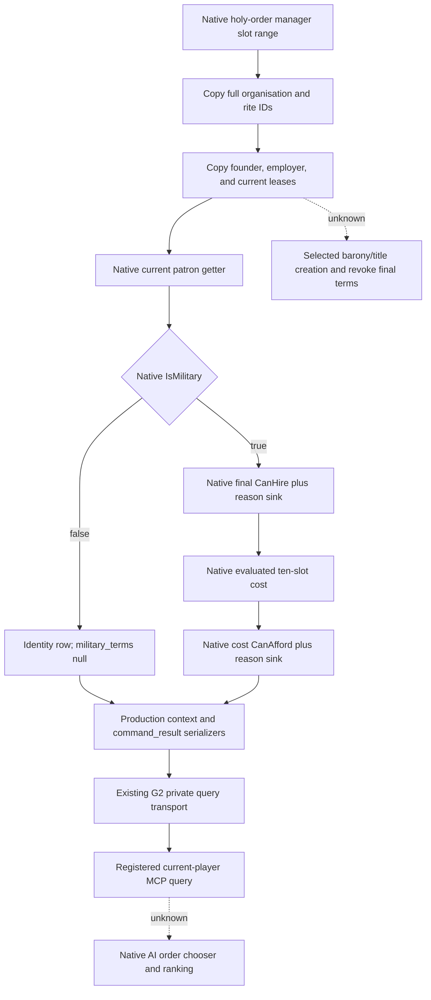

# Holy-order current-player query implementation — CK3 1.20.0.3

This addendum belongs with `docs/ck3-native-ai/religion-holy-order-systems-native-ai-12003.md`. The canonical research document is frozen for ROOT publication; this file remains external until ROOT copies it. The native source tree was researched before this implementation. Existing creation/patronage and hire ABI evidence are reused, without another ABI audit.

## Build and current scope

- CK3 `1.20.0.3`, Steam build `25652598`, executable SHA-256 `94B55397ABB687A3DCD436805A5D885E6BE90FA6C693FEB44A9E3BBEEADE02A6`.
- Immutable source preimage: `production-source-db463118`.
- Current live acceptance target remains Robert, played character `29829`. The public query accepts only `expected_revision`; callers cannot select a different character.
- Reuses `allow_private_player_religion_context_query` and native `XAR_CK3_ENABLE_G2_PLAYER_RELIGION_CONTEXT_PRIVATE_QUERY_V1`. No new feature flag, no action, no war switch change.
- Tool: `ck3_query_player_holy_order_context_v1`. Native step: `query-player-holy-order-context-v1`. Domain: `player_holy_order_context_v1`. Schema: `ck3_12003_player_holy_order_context_v1`.

## Concrete observation

The application-main mailbox resolves the currently published played character and calls the new production reader. The reader scans the native holy-order manager's slot range, skips null and fallback slots, and copies the real organisations. It does not need either the Military or Faith window to be open.

Every organisation reports its full generation-bearing ID, rite ID, military/nonmilitary type, founder, current dynamic patron, employer, and all current leased-title references. Founder is historical identity; patron comes from the engine's current lease/holder computation. Legal missing character references become `null`; legal zero references remain zero.

For military organisations, the reader calls the native final `CanHire`, evaluated cost, and cost-based `CanAfford` getters for the actual played character. Both predicates are reported separately, with both engine reason strings and the complete ten signed Q100000 resource slots. Python preserves the native result; it does not reconstruct costs, choose a strategy, or interpret reason text as executable rules. A nonmilitary organisation has `military_terms: null`; an unreadable military sample has explicit unavailable fields rather than false or zero substitutes.

Collection availability and military-term availability are separate. A successfully read empty manager is an available empty collection. A missing manager is unavailable. These distinctions avoid claiming a hire quote where only an organisation identity was observed.

## Validation and readiness

The external package contains one focused production-reader/serializer fixture and one full registered transport fixture, with their exact artifacts and hashes in `IMPLEMENTATION-DELIVERY.json`. The registered fixture must consume bytes from the actual native command-result serializer; a Python wrapper is not evidence of that route.

The native reader fixture covers manager holes, legal empty and unavailable collections, full references, a dynamic patron distinct from the founder, leases, two military and one nonmilitary organisation, ten signed resource costs, independent hire/affordability answers, and literal native reasons. The initial fixture failure expected `\\n` where production correctly emitted valid JSON `\\u000a`; the historical RED remains preserved, and only the fixture expectation changed. This was a fixture failure, not evidence that the capability failed in CK3.

External focused fixture success supports `static-ready`. ROOT still owns source merge, the production DLL build, and one paused Robert observation through the published route. No CK3 process, game state, SDK session, pipe, screen, or window was used by this lane. This is not `fixture-live`, a production-live primitive, a gameplay loop, or completion of holy-order strategy.

## Next concrete work

ROOT can merge the source patch, build with the existing religion opt-in, and make one paused current-player query for Robert. Verify that the returned collection is available and that every present military organisation has sampled hire/cost/affordability terms, preserving a legitimate zero-order state if that is the actual world state. Keep the paused artifact and report the real readiness outcome. Query failure or a military field left unreadable becomes the next direct getter repair task, rather than a substitute strategy.

The separate creation/revocation task must construct the actual native selected-title context: `scope:barony` for military order creation/revocation and `scope:title` for the monastic county selector. A root-only decision quote does not settle these selected-title branches. The existing stock tree and final decision leaf provide its next implementation entry; this current collection query does not claim those branches complete. Native chooser ranking remains explicitly unknown and does not prevent the final hire leaf from being observed.

Daily and weekly reporting fields are provided externally for ROOT to merge into the shared reports. Commit/push and production acceptance are pending ROOT; this child does not mutate Git or shared files.
