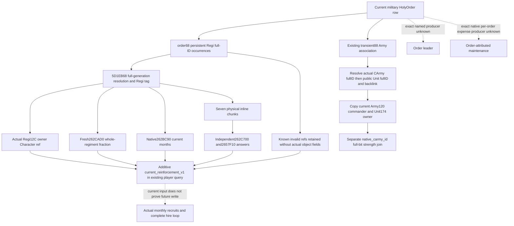

# Holy-order current persistent reinforcement and roles — CK3 1.20.0.3

2026-10-06 / ISO 2026-W41. **Research; independent implementation authored, shared integration and FIRST qualification pending.** Exact build is CK3 1.20.0.3 Crozier / Steam25652598, reused EXE SHA-256 `94B55397ABB687A3DCD436805A5D885E6BE90FA6C693FEB44A9E3BBEEADE02A6`. This background package performs no game, SDK, process, UI, pipe, build, test or deployment operation. Source is frozen at `69a2fe5c560e399ef5a0e98e60a45b0cabbc4b1b`.

The [stock holy-order tree](religion-holy-order-systems-native-ai-12003.md) distinguishes one-time hire cost from service and the leader's own spending reserves. The AI gold500/treasury1500 reserve is a leader input, not an employer upkeep quote. The [current aggregate soldier getter](religion-holy-order-current-soldiers-native-observation-12003.md) and [transient troop association](religion-holy-order-player-release-source-and-army-association-12003.md) are already qualified. This new input answers a different present question: which persistent regiments belong to a military order, who owns each regiment, and what current native reinforcement inputs exist before or during hire?

## Source-first inventory and input ledger

The cached `NATIVE-LEAF.md`/`NATIVE-LEAF-RECIPE.json` in `Z:/ck3_mod_rewrite_process_assets/g2-resume-20261003/holy-order-title/hire-military-observation/native-leaf/` closes order `+68/+74`: a stride4 vector of full persistent Regiment references used by native `261AD10`. Its complete getter pin is 263B / SHA `bf925deb2f4e9be725e4649c356ef701dbb0967279f006a8bcf67aab0f18e1cf`. That getter's aggregate is reused, not reconstructed. Persistent storage, seven chunks and current native refill ABIs are closed in [replenishment source](army-regiment-replenishment-raised-reserve-12003.md), while [owned composition](army-regiment-composition-12003.md) independently establishes `Regi+12C` owner and each physical chunk field. No new EXE bytes are required for this addition.

| Current input | Exact source | Decision value and boundary |
|---|---|---|
| Order persistent roster | order data+68/count+74, stride4, complete full references | Includes repeated occurrences, zero and stale generations. Different collection from transient ArRg+88. |
| Persistent identity | storage5D1EB68, entry stride16/+8, range+2C, object+10 fullID/+14 `Regi` | Full generation match precedes reading actual regiment fields. Native invalid-reference resolution is observed absence, distinct from unread memory/binding. |
| Regiment owner | actual Regi+12C full Character reference | Owner is not founder, patron, employer, army commander or order leader. |
| Fresh whole-regiment fraction | `262CAD0(Regi*, int64_out*) -> out`, signed Q100000 | Current fraction; not net whole-order recruits/month. |
| Current native months | `262BC90(Regi*) -> int32` | Native full-strength-time path; fraction0 can yield months0, which does not mean already full. |
| Physical chunks | seven at+18, stride24h; max+0/current+4/persistentID+8/ordinal+C/ArRgID+10/pending+14/state+18 | Preserves physical current0, source backlinks and state. Does not substitute state3 effective maximum for current. |
| Independent permissions | `262C700(Regi*, Chunk*)` and `2657F10(Chunk*)` | Preserve both booleans. The former can return true before calling the latter; do not AND them. |
| Actual Army roles | already qualified +88→ArRg+140→CArmy; actual CArmy+120 commander/+124 public Unit; Unit+174 owner/+178 CArmy backlink | Reuse existing association occurrences. Resolve full generations in Army5D1DE48 and Unit5D1E380. Strength `native_carmy_id` supplies a separate full-bit join. Commander remains distinct from order leader. |

## Minimum readonly projection

`military_terms.current_reinforcement_v1` is independent of final CanHire, CanAfford, player-employer applicability and transient association. It is read for each current military candidate, including a currently foreign employer. It carries `source_count`, ordered `rows`, full persistent ID, `resolved`, owner, fresh fraction, native months and seven chunks. Each chunk carries its own availability, physical fields and the two native booleans. Actual self-ID/ordinal backlinks are checked before passing that chunk to the native getters. Legal empty collection and canonical-invalid references are available observations; missing binding or failed copy has an explicit unavailable reason. Invalid references have no actual-object fields, not invented zeros.

The independent helper/DTO and serializer are mounted by the shared context owner. After its existing troop-association read, an independent role helper consumes those already copied association occurrences; it does not enumerate order+88 again. It independently copies raw CArmy+120 commander/+124 public Unit, then full-generation resolves that Unit and copies raw+178 backlink/+174 owner. All copied full32bit operands, including native FFFFFFFF, remain distinct from unread null. The existing Army materialization rule requires its Unit+178 backlink to match that actual CArmy; mismatch preserves both raw operands and the copied owner with a specific reason. Historical wires may omit this extension. The pure current consumer reports observed persistent occurrences and chunk deficits without summing duplicate source occurrences into a false order total, and retains public CUnit and internal CArmy identities separately.

One new native fixture will run the production helper inside the complete holy-order provider and outer command-result serializer. Its compiled JSON is the sole input to one new registered MCP→normalizer→pure-consumer case; no native rows are replaced in Python. Native getters and game memory are explicitly synthetic fixture inputs. Compile, native fixture, compiled consumer and live are **NOTRUN** until Root's central FIRST. There is no new static-ready or live credit.

Remaining named seams: the actual `HolyOrder.GetLeader` reflected producer or stock `leader` scope resolver, and the actual per-order maintenance/expense producer reached by the leader/employer maintenance caller. No locator RVA is presently confirmed; these are recorded missing inputs, not schema fields permanently null. If either input blocks a concrete decision, freeze a finite literal/registration/caller capture plan before any EXE read. Current aggregate max/levy coverage remains the distinct `GetTotalSoldiers -> 261AE20` source seam; this package does not infer it by summing persistent chunks.

External delivery and exact hook recipe: `C:/codex-ck3-background/packets/holy-order-next-decision-20261006/maintenance/`. Reports are merged centrally by Root; no push is performed by this child.

## Same-query integration candidate, 2026-10-07 00:05 Shanghai

The parent reused the clean hire-cost candidate `625b2cf12b1be87090ab348c32004dae7c438948`
and imported the immutable reinforcement candidate
`122625de797e53ce2ee361ec2bdf4cb3187bb97c` after recording the source plan at
00:03. The substantive reinforcement source candidate was authored on October 6;
its explicit ABI ledger was sealed at October 7 00:00:01. These dates are kept
separate from subsequent compilation and FIRST qualification.

`ReadPlayerHolyOrderContext12003` now copies the persistent roster into
`military_terms.current_reinforcement_v1`, then obtains Army roles from the already
copied `troop_association` occurrences. It does not enumerate order+88 again.
The same `SerializePlayerHolyOrderContext12003` output preserves both this family
and independent `hire_cost_context`. The existing private transport normalizer
validates the new family only when present; the existing MCP query, final hire
permission, quote, affordability and other family readiness remain independent.

The actual runtime contains `ck3_12003_holy_order_current_reinforcement.cpp`.
Existing targets which directly compile the context reader receive that new
producer dependency without executing their old tests. The new target
`xar_ck3_12003_holy_order_current_reinforcement_test` links the actual runtime.
Its sole CTest `ck3_12003_holy_order_current_reinforcement` supplies the output
path so that its first execution also emits
`ck3_12003_holy_order_current_reinforcement_wire.json`. This remains **NOTRUN**.
The sole new registered MCP consumer uses those unchanged complete native wires;
its native world/callbacks and MCP envelope are synthetic. Current copied inputs
do not establish actual replenishment, an order leader, an order-attributed upkeep
bill, aggregate maximum, original AI choice, hiring, a released employer, or a
complete military loop.
