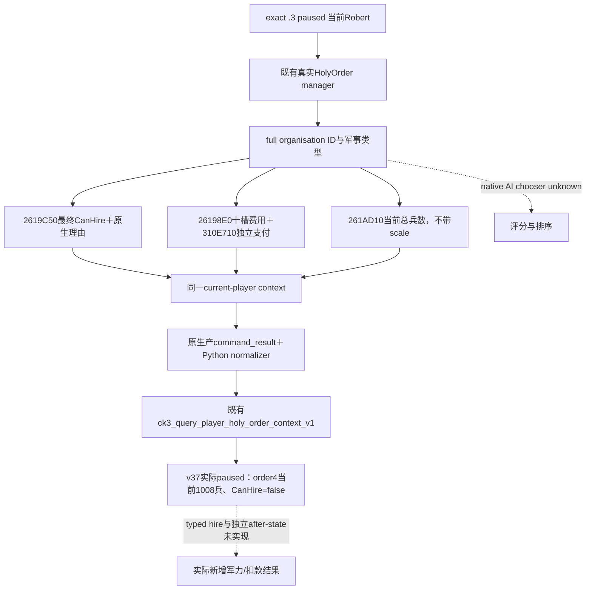

# CK3 1.20.0.3：圣骑士团雇佣条款与当前兵数

当前增量状态：**production-live primitive**。原生当前兵数getter已按exact `.3`命名注册、独立caller与完整控制流闭合，并接入既有当前玩家holy-order查询。v37实际paused frame实读唯一军事order4当前1008兵，CanHire=false、CanAfford=true、真实106虔诚报价；当前无可雇佣holy-order增援。一次必要的生产reader→完整command_result serializer→生产Python normalizer GREEN复用，当前观察不计Robert新增兵数或完整军事loop。

当前施工由真实军事需求触发：ROOT任务创建时已实读Robert29829/raw53236680、3848保存天、己方2334兵，防御战争16777231、129、50331736；三日已完成，第四日当时正在ROOT执行，本lane不预记。所有宗教、战争与战斗授权已全面开放，费用是已授权的游戏资源；没有等待战争许可或旧宗教禁令。worker及两个子lane只读磁盘并写独占projection，没有SDK、CK3、pipe、窗口或Git操作。

## 现有接口可直接读取雇佣资格和真实费用

现工具 `ck3_query_player_holy_order_context_v1(expected_revision=<当前snapshot.revision>)` 沿既有 `--private-player-religion-context-query`、permission `allow_private_player_religion_context_query` 与native flag `XAR_CK3_ENABLE_G2_PLAYER_RELIGION_CONTEXT_PRIVATE_QUERY_V1`。无需选中地产、打开军队/信仰窗口、新flag、router或CMake接线。已有paused snapshot可直接复用，不增加重复查询。

本口在同一个当前玩家application-main capture里读取真实HolyOrder manager，逐军事组织调用最终 `CanHire`、十槽cost与独立 `CanAfford`。组织full ID、Rite、founder、动态patron、employer、完整leases和原生双理由分别输出；非军事组织 `military_terms=null`。manager可用空集与unavailable分开，费用可支付不代表最终雇佣合法。原生依据复用 [组织与雇佣树](religion-holy-order-systems-native-ai-12003.md) 和 [实现/实机专题](religion-holy-order-context-native-query-12003.md)。

原始发布源缺少军团兵数，不能从 `ck3_query_army_strengths` 拼出未雇佣军团的规模：该口需要已发布的public CUnitID，HolyOrderID、patron或employer CharacterID都不是该输入。为量化实际合法组织的增援价值，本次只补当前总兵数，不扩maximum soldiers、组成、商店、雇佣动作或完整策略评分。

## exact-build 原生当前兵数

冻结版本：CK3 `1.20.0.3 Crozier`，Steam build25652598，EXE SHA-256 `94B55397ABB687A3DCD436805A5D885E6BE90FA6C693FEB44A9E3BBEEADE02A6`。施工preimage是 `Z:/g36` HEAD `e38eb9bd7757275746d0ffed1c630fc1540d087e`；直接源码与18份相关输入pins由MCP inventory保存。

| 证据 | 当前exact `.3`合同 |
| --- | --- |
| 命名注册 | `HolyOrder.GetCurrentSoldiers` literal RVA `44E15F8`；注册完整span `516CA0..516E1B` |
| callback | `261CDA0..261CDD8` → native `261AD10` |
| 原生签名 | `std::int32_t (*)(void* holy_order)`，EAX返回，不带actor/out/mode/window |
| 完整getter | 连续控制流 `261AD10..261AE17`，263 bytes，包含全部5个unwind fragment |
| getter SHA-256 | `bf925deb2f4e9be725e4649c356ef701dbb0967279f006a8bcf67aab0f18e1cf` |
| 独立caller互证 | `HiredTroopItem.GetCurrentSoldiers` → `CCF160` → `CCBD40` kind0 → `CCC070`解析组织 → `CCBE9C`尾跳同getter |

该getter读取order+68/+74完整regiment引用，解析当前regiment兵数和原生调整；独立 `261C720(order)` → `28CBDD0` 的当前levy结果也参与累加。函数返回当前军团总兵数，**不是maximum，也不带Q100000 scale**。非军事原生返回0；本query保留既有非军事 `military_terms=null`，只对已确认军事的组织调用一次。

完整native fragments、callback/helper/caller pins与证据边界见 [NATIVE-LEAF-RECIPE.json](Z:/ck3_mod_rewrite_process_assets/g2-resume-20261003/holy-order-title/hire-military-observation/native-leaf/NATIVE-LEAF-RECIPE.json)。此次没有猜测裸字段求和，也没有重建原生费用公式；原生getter对当前组织自行返回实际累计结果。原生AI chooser评分/频率仍未闭合，不妨碍当前最终资格、价格和兵数的直接观测。



## 三文件最小增量与新输出

仅修改既有context头、reader/inner serializer、Python normalizer。Bindings追加 `current_soldiers`，exact image binding为base+`261AD10`；对每个已验证军事组织复制一个原生int32。原outer serializer、mailbox、MCP、flags、dispatcher及CMake保持既有接线。新增字段为：

```json
{
  "military_terms": {
    "troop_strength": {
      "available": true,
      "unavailable_reason": null,
      "current_soldiers": 1234
    }
  }
}
```

以上1234仅示意合成fixture，**不是Robert或当前组织的实际兵数**。合法0保持available=true/current_soldiers=0；读取未完成则单独available=false、current_soldiers=null与具体reason。原 `military_terms.available` 仍只表达既有hire/price/affordability输入，不以新兵数改变原能力状态。Python对旧冻结wire允许缺少此extension；对新wire保留独立availability与无scale兵数。

一次必要的focused case采用两个军事与一个非军事fake manager对象：1234与0分别走新生产getter binding/reader→完整command_result serializer→生产normalizer；同时保留can_hire=false/can_afford=true的独立意义，非军事仍null，旧wire可省略extension。严格MSVC `/std:c++20 /EHsc /W4 /WX /utf-8 /MT` 编译/链接、native运行与normalizer全部GREEN，4.089秒。只有原生getter函数体和输入内存是offline夹具，不接游戏，不将此数值/73虔诚合成费用记为Robert live。已有32 checks/3 scenarios、registered route及v32实际query GREEN按原pins复用，旧矩阵没有重跑。

证据：[focused RESULT.json](Z:/ck3_mod_rewrite_process_assets/g2-resume-20261003/holy-order-title/hire-military-observation/focused/attempt-01/RESULT.json)、[MCP inventory](Z:/ck3_mod_rewrite_process_assets/g2-resume-20261003/holy-order-title/hire-military-observation/mcp-inventory/INVENTORY.json)。以上focused交付时新增兵数为static-ready，现有hire/费用primitive复用v32历史证据；下方v37同帧实际结果将新增兵数晋级production-live primitive，历史费用不能替代这次原生报价。

## 当前军事判断边界

ROOT可现在调用现成hire查询判断真实许可与费用：若同帧完整军事行均can_hire=false，当前不存在可雇佣组织，兵数不能把false资格变成合法增援，也不作为该结论的前置门禁。若存在can_hire=true且can_afford=true的组织，采用本增量后的同帧current_soldiers可以量化组织当前规模；它仍不是已经加入Robert军队的数量。typed hire及扣款、employer/新增军队等独立after-state属于下一动作结果层。

历史v32 order4的106虔诚、can_hire=false/can_afford=true及绝罚/已被雇佣理由只属于raw53236176；v34 selected-title的500 gold＋1000 piety是建团费用，九个CanTake/CanAfford=false也不是当前军事雇佣资格。本页不把两份历史帧或合成fixture填成当前live报价，也不推断全旅程或完整宗教/军事实机loop。

当前API配方：[EXISTING-API-RECIPE.json](Z:/ck3_mod_rewrite_process_assets/g2-resume-20261003/holy-order-title/hire-military-observation/EXISTING-API-RECIPE.json)。总交付：[ROOT-DELIVERY.json](Z:/ck3_mod_rewrite_process_assets/g2-resume-20261003/holy-order-title/hire-military-observation/ROOT-DELIVERY.json)。ROOT负责采用、合并日周报、Git与实际游戏查询；本包不重新请求战争/宗教/游戏资源授权。


## v36 新DLL实际attempt：032返回RED，未晋级兵数live

ROOT以source/native前缀 `6b0` 的v36新DLL完成strict与cold GREEN后，执行 `actual-new-leaves-v36-01`。worker纯文件消费032 `ck3_query_player_holy_order_context_v1(expected_revision=2)` 与配对031 snapshot。本次SDK packet明确 `isError=true`、status=RED，文字为 `private native observation returned RED: query-player-holy-order-context-v1`；没有 `ck3_12003_player_holy_order_context_v1` 原生body，也没有捕获具体native command error。

因此本attempt没有当前组织集合、兵数、CanHire、CanAfford或十槽报价；不能填零、不能推导所有hire=false，也不能从strict/cold或此前focused GREEN晋级新兵数production-live。新增兵数仍为static-ready，既有v32 hire/费用production-live primitive保留为历史证据；这次真实capability RED单独保留。

运行时lane已用七个实际snapshot闭合共同故障：028 battle terminal首次RED后，failure512对应 `executor_exception`，ready=false，seq持续13不增长，而主线程泵继续。executor SEH设置bit9；后续Submit因failure flags非零返回 `infrastructure_failed`，Reclaim只恢复idle而不清flags。因此030悔罪、032 holy与034/036/038盟友的reader均没有执行，032不能判作holy getter ABI故障。此前occupation、commander、army-strength成功，末尾正常checkpoint继续完成。共同归因见 [DIAG-SUMMARY.json](Z:/ck3_mod_rewrite_process_assets/g2-resume-20261003/runtime-preparation/v36-retry-02/diag-summary/DIAG-SUMMARY.json) 与 [PINS.json](Z:/ck3_mod_rewrite_process_assets/g2-resume-20261003/runtime-preparation/v36-retry-02/diag-summary/PINS.json)。battle owner负责真实SEH的最小exceptioncode/RVA观测；本lane不自动rearm、不改holy源码、不重复测试或query。

当前total saved days为ROOT提供的3850；worker新增日/雇佣/支付/玩家兵力收益/G2增量均0。没有实读合法组织，未触发typed hire执行口施工；宗教、战争及游戏资源支出授权已经开放，不存在permission等待。ROOT正常stop后以同v36/R15避开terminal恢复价值动作；共同故障恢复后的正常同帧原口读取：全部完整军事行can_hire=false即可判当前无可用增援；只有真实合法且可支付候选出现时才继续必要typed hire与独立after-state。

保留actual失败与日报周报字段：[actual-v36/ROOT-DELIVERY.json](Z:/ck3_mod_rewrite_process_assets/g2-resume-20261003/holy-order-title/hire-military-observation/actual-v36/ROOT-DELIVERY.json)。本包只新增专题append和外置报告，不修改共享源码、不运行SDK/游戏/pipe/窗口/Git。


## v37 实际paused：当前1008兵，最终雇佣资格false

ROOT的唯一SDK batch `runtime-preparation/v37/actual-new-leaves-v37-01` 最终GREEN，并正常save history4743。016 `ck3_query_player_holy_order_context_v1(expected_revision=2)` 返回complete/isError=false。Robert29829/raw53236800、capture_epoch11469、query native3，当前组织集合available=true，共5行：0/1/2/3均非军事，保留military_terms=null；order4是唯一军事组织，完整新兵数getter结果available=true/current_soldiers=1008。新增字段由static-ready晋级production-live primitive，解除实际增援规模的观察缺口。

| 同帧军事order4输入 | 真实读取 |
| --- | --- |
| 身份 | HolyOrderID4、Rite15、founder/patron31100、employer39004、leased title7558 |
| 最终雇佣资格 | CanHire=false，原生理由同时包括绝罚统治者无法雇佣与他们已经被雇佣 |
| 原生十槽报价 | `[0,0,10600000,0,0,0,0,0,0,0]`，scale100000，即106虔诚 |
| 独立可支付 | CanAfford=true，原生reason available=true/空字符串 |
| 原生当前军团兵数 | troop_strength.available=true、current_soldiers=1008，不带scale |

全部军事行最终CanHire=false，因此**当前无可雇佣holy-order增援**。1008是该组织当前兵数，不是Robert获得了1008兵；可支付106虔诚不能覆盖最终资格。理由是多个当前条件，不能声称消除绝罚就一定可雇佣，因为同帧还明确already hired。没有当前合法候选，按实际价值不启动typed hire executor/pipe/MCP施工；宗教、战争及游戏资源支出授权完全开放，不涉及permission等待。

冻结source/native `f42522f7f176ad67b000d66341a17a02a3f82ae7`，DLL SHA-256 `e6c114d82d31900d0a07bf6c43eb89a26f3fd55e2ffb3a3c9a1b5385af7c4585`，exact EXE SHA-256 `94B55397ABB687A3DCD436805A5D885E6BE90FA6C693FEB44A9E3BBEEADE02A6`；PID62452，窗口minimized=true/foreground=false，environment `379428efeeec70b789017c889f41667c86453d91259ef5628398c11f6fec4d7f`。总保存天数由ROOT提供为3853，worker新增日/雇佣/支付/玩家兵数收益/G2增量均0。实际完整body、原始SDK、snapshot/冻结/窗口/正常checkpoint pins与日报周报字段见 [actual-v37/ROOT-DELIVERY.json](Z:/ck3_mod_rewrite_process_assets/g2-resume-20261003/holy-order-title/hire-military-observation/actual-v37/ROOT-DELIVERY.json)。报价与兵数均来自这份实际frame，不是早期v32报价、v34建团费用或1234/73合成夹具。

前一v36/R14 attempt保留SDK RED与共同terminal executor_exception512/seq13不增长的归因；当时032 holy reader没有执行，不能据其判断getter失效。新v37冷恢复后的当前口完整实读，未重复旧测试，也不补其它理论修复。ROOT继续当前其它合法战争价值动作；未来自然状态变化出现CanHire=true且CanAfford=true候选时，才沿已闭合雇佣树接必要typed动作与独立扣款/employer/新增军队after-state。
