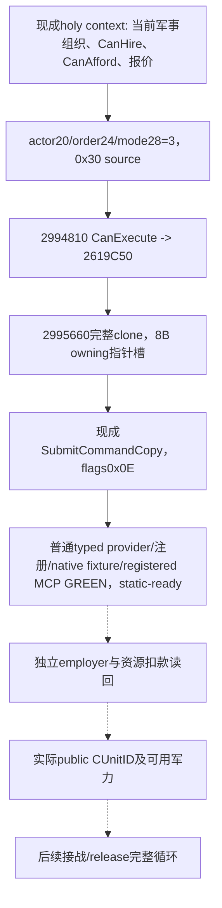

# 普通军事圣骑士团 hire 命令构造：exact 1.20.0.3

2026-10-05后台研究及实现增量。绑定 CK3 1.20.0.3 / Steam25652598，冻结EXE SHA-256 `94b55397abb687a3dcd436805a5d885e6be90fa6c693feb44a9e3bbeeade02a6`；原交接源码库存 `Z:/g78` / `d22e9a1cd3fb1062f6c66282f044daafa016718a`。普通 typed hire 已接入 native provider、owning-thread executor、adapter capability、dispatcher、NativeDriver/service/MCP；共享构建与新增native/registered MCP fixture已GREEN，普通动作链现为static-ready，未执行实机 hire。

现有 `ck3_query_player_holy_order_context_v1(expected_revision)` 已发布实际军事组织full ID、Faith/Rite、patron/employer、final CanHire/reasons、十槽Q100000报价、独立CanAfford/reasons与current_soldiers；不需新增报价查询。资格先复用 [原生战争资格](religion-holy-order-war-eligibility-12003.md)，最终native leaf仍是权威，不能按CB名称排除候选。主系统入口为 [holy-order原生树](religion-holy-order-systems-native-ai-12003.md)。

## 已闭合的构造与提交链

缓存 `HiredTroopItem.Hire` 的641B调用体 `CCC670..CCC8F1` 中，kind0实际提交分支 `CCC767..CCC803` inline构造：primary vtable `476D9C8`、secondary `476D998`、actor Character full ID `+20`、order full ID `+24`、固定mode `+28=3`，metadata `+8 byte=0`、`+C qword=0`、`+14 dword=0`。primary `+30` 的 `2994810` 只是CanExecute，最终调用 `2619C50(order,actor,reasons)`，不是执行器。

primary `+40` 是clone `2995660`。冻结副本唯一功能体 `2995660..29956E2` 共130B已闭合，span SHA-256 `5323c0832f64eb5584bcbfab2d846895cd83a9d406e417b9492f5e5e547980b6`；headers、pdata与leaf累计窄读906B，无整EXE扫描或重新hash。clone调用allocator `4223BB4` 分配 **0x30字节**，复制source `+8 byte`、`+C/+10/+14/+20/+24/+28 dword` 并写固定双vtable。hidden return storage和queue owned参数都是 **8字节 owning void*槽**；没有第二qword/controlblock/shared_ptr，也不需另补default factory。padding `+9..B/+2C..2F` 未被读取，不能赋予业务含义。

实际caller以flags **0x0E**、embedded manager `5CC1240` 调用receiver `37F06F0`。现有 `SubmitCommandCopy` 已覆盖该无窗口clone/submit入口。完整UI callback尾部有camera动作，provider应复用明确的inline构造和通用submit，不能直接调用整段UI callback。普通动作只需实际player及所选组织fullrefs，没有证据要求额外war_id或开放其它mode。

## 接手施工与真实结果

外置 `Z:/ck3_mod_rewrite_process_assets/g2-resume-20261005/background-user-session-round02/holy-order-hire/ROOT-DELIVERY.json` 提供source pins、原生树和wire库存；`HANDOFF-SUMMARY.md`提供具体施工顺序，`holy_order_hire_mode3_source_layout.hpp`只是未编译的值构造reference。首先接普通typed provider/现有动作框架，复用CanExecute与SubmitCommandCopy；新增接线仅作一次必要验证，不重跑旧宗教矩阵。

实际执行后独立重读所选full OrderID的employer变为真实player及资源实际扣款。组织current_soldiers可能不变，不能将其当作玩家净增兵数；若声称新增可控军力，还须现有public-ID生产链给出真实CUnitID及owner关联。ACK只代表待验证，不能填成雇佣成功。真实合法候选、扣款/军力和完整loop均未完成；现有只读primitive沿用各自原artifact/date资格。

## 交接后离线施工（2026-10-05）

`ck3_hire_holy_order_v1(holy_order_id, expected_revision)` 是普通玩家限定 typed action。调用者只选择完整组织 ID 与 public revision，actor 由现成 paused/current-player mailbox 独立解析；native request 使用转换后的 native revision。命令构造在 `ck3_12003_holy_order_hire_action.hpp/.cpp`，typed wire 与 executor 分别为 `ck3_12003_holy_order_hire_wire.*`、`ck3_12003_player_holy_order_hire_mailbox.*`。source 为栈上 0x30 值对象，通用 helper 只转移 native clone 的单个 owning 指针；绝不销毁 source，也不调用完整 UI callback。

provider 在 admitted application-main frame 复用 `ReadPlayerHolyOrderContext12003`，选取 exact full OrderID，保留现成身份、employer、十槽报价、独立 CanAfford/reasons 和兵数。非军事组织、未解析组织、真实 CanHire=false、CanExecute=false 或 queue 拒绝保持 native rejection；已有 current employer=player 返回 `already_hired` 并保留其观测来源。CanExecute 仍是原生最终判据，没有从 CB 名称、兵数或 Python 资源公式发明第二种资格。报价和 CanAfford 保留为独立观测，不被 ACK 升格为实际付款。

提交返回 `submitted_verification_pending`，`verification_pending=true`、`after_state_observed=false`。动作回复中的 `prior_context` 只含提交前所选组织，Python 继续使用原 holy-order context normalizer；没有雇佣成功、资源净收益或新增军队字段。公开动作 capability 为 `game.command.hire-holy-order-v1`；由于需要 ID，不能投影为无参数 planner step。

新增必要验收入口是 `xar_ck3_12003_holy_order_hire_action_test`（8 个 synthetic 场景，调用实际 provider、`SubmitCommandCopy` 和 production serializer）以及 `tests/unit/test_holy_order_hire_registered_mcp_v1.py`（实际 registered MCP/service/driver 路径消费前述 native 产出的原字节）。fixture 覆盖完整代位 ID、合法零 ID、inline metadata/mode、单 owned clone 生命周期、false 资格/validator/queue、非军事和已有 employer；不产生独立付款或军力后置。构建与首次新增测试由ROOT统一完成，实际GREEN结果见下节；这些合成输入不证明真实雇佣或付款。`open_kaishek` 不覆盖 native command clone/queue、C++ ABI 或 MCP protocol，离线预验为 not-applicable；不得以此替代实际新增 fixture。

用户独占 CK3 期间全程只改源码/合同/文档，不 launch、attach、query、UI、Steam 操作或回收其游戏进程。恢复实机后沿用现成 holy context 查询验证同 full OrderID employer，并用现成 resources 与 army-strength/public-ID 查询独立证明实际扣款与 CUnitID owner 关联；release 与接战循环仍另待施工/验收。

## 普通动作链static-ready收口（2026-10-05T19:48:26+08:00）

Root集中离线验收已于2026-10-05完成，整合源码 `4733655173e65be99c9ffaafbe2d9275940df4d6`。`xar_ck3_bridge` 与五个新增focused native目标在Release、`/WX`、jobs4、低优先级下编译GREEN；五项CTest一次5/5 GREEN。外置 [构建与测试冻结](Z:/ck3_mod_rewrite_process_assets/g2-background-20261005/OFFLINE-FREEZE.json) 保留原始attempt/测试/producer pins。两次真实RED分别为occurrence缺少快照比较与geography fixture缺少phase-character链接，已最小修复；旧attempt不覆盖。

本次是默认配置的离线bridge/fixture资格，G2 capability flags未从v73运行配置采用，宗教private query仍OFF；不是可直接部署的v74，也未进行runtime prepare/stage/attach。未来实机须采用实际所需flags并另冻候选。用户独占CK3期间game/SDK/attach/query/pipe/UI/Steam/profile操作均0；没有新paused artifact、live资格或游戏日。

CTest `ck3_12003_holy_order_hire_action` 一次GREEN，production provider/SubmitCommandCopy/serializer产出8场景的真实fixture字节。`test_holy_order_hire_registered_mcp_v1.py` 首次消费上述原件，经真实registered MCP→service→NativeDriver及public/native revision转换一次GREEN：1focused case、8samples、51checks、exit0。回执 [RESULT.json](Z:/ck3_mod_rewrite_process_assets/g2-holy-order-hire-offline-20261005/registered-mcp/RESULT.json) SHA `f28977979a4a99cb2f8ef5db689effe76af84f754570de245f54e97b81f39894`；native wire SHA `fc6e6f44694e5872bcec479e689f983d1125a6d7cbcaae8dc2d8c2fc504c947a`。paused hello/endpoint与native callbacks为合成夹具，未连接真实游戏。

普通typed动作链为static-ready；`submitted_verification_pending`、`after_state_observed=false`保持，没有新employer、扣款或public CUnit后态信用。后续独立真实query/release/接战完整loop仍未验收。
