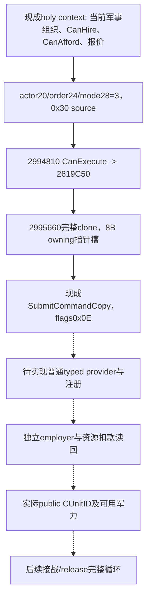

# 普通军事圣骑士团 hire 命令构造：exact 1.20.0.3

2026-10-05后台研究增量。绑定 CK3 1.20.0.3 / Steam25652598，冻结EXE SHA-256 `94b55397abb687a3dcd436805a5d885e6be90fa6c693feb44a9e3bbeeade02a6`；源码库存 `Z:/g78` / `d22e9a1cd3fb1062f6c66282f044daafa016718a`。本包是 research，未实现、编译、测试或执行普通 typed hire。

现有 `ck3_query_player_holy_order_context_v1(expected_revision)` 已发布实际军事组织full ID、Faith/Rite、patron/employer、final CanHire/reasons、十槽Q100000报价、独立CanAfford/reasons与current_soldiers；不需新增报价查询。资格先复用 [原生战争资格](religion-holy-order-war-eligibility-12003.md)，最终native leaf仍是权威，不能按CB名称排除候选。主系统入口为 [holy-order原生树](religion-holy-order-systems-native-ai-12003.md)。

## 已闭合的构造与提交链

缓存 `HiredTroopItem.Hire` 的641B调用体 `CCC670..CCC8F1` 中，kind0实际提交分支 `CCC767..CCC803` inline构造：primary vtable `476D9C8`、secondary `476D998`、actor Character full ID `+20`、order full ID `+24`、固定mode `+28=3`，metadata `+8 byte=0`、`+C qword=0`、`+14 dword=0`。primary `+30` 的 `2994810` 只是CanExecute，最终调用 `2619C50(order,actor,reasons)`，不是执行器。

primary `+40` 是clone `2995660`。冻结副本唯一功能体 `2995660..29956E2` 共130B已闭合，span SHA-256 `5323c0832f64eb5584bcbfab2d846895cd83a9d406e417b9492f5e5e547980b6`；headers、pdata与leaf累计窄读906B，无整EXE扫描或重新hash。clone调用allocator `4223BB4` 分配 **0x30字节**，复制source `+8 byte`、`+C/+10/+14/+20/+24/+28 dword` 并写固定双vtable。hidden return storage和queue owned参数都是 **8字节 owning void*槽**；没有第二qword/controlblock/shared_ptr，也不需另补default factory。padding `+9..B/+2C..2F` 未被读取，不能赋予业务含义。

实际caller以flags **0x0E**、embedded manager `5CC1240` 调用receiver `37F06F0`。现有 `SubmitCommandCopy` 已覆盖该无窗口clone/submit入口。完整UI callback尾部有camera动作，provider应复用明确的inline构造和通用submit，不能直接调用整段UI callback。普通动作只需实际player及所选组织fullrefs，没有证据要求额外war_id或开放其它mode。

## 接手施工与真实结果

外置 `Z:/ck3_mod_rewrite_process_assets/g2-resume-20261005/background-user-session-round02/holy-order-hire/ROOT-DELIVERY.json` 提供source pins、原生树和wire库存；`HANDOFF-SUMMARY.md`提供具体施工顺序，`holy_order_hire_mode3_source_layout.hpp`只是未编译的值构造reference。首先接普通typed provider/现有动作框架，复用CanExecute与SubmitCommandCopy；新增接线仅作一次必要验证，不重跑旧宗教矩阵。

实际执行后独立重读所选full OrderID的employer变为真实player及资源实际扣款。组织current_soldiers可能不变，不能将其当作玩家净增兵数；若声称新增可控军力，还须现有public-ID生产链给出真实CUnitID及owner关联。ACK只代表待验证，不能填成雇佣成功。普通provider、真实合法候选、扣款/军力和完整loop均未完成；现有只读primitive沿用各自原artifact/date资格。
