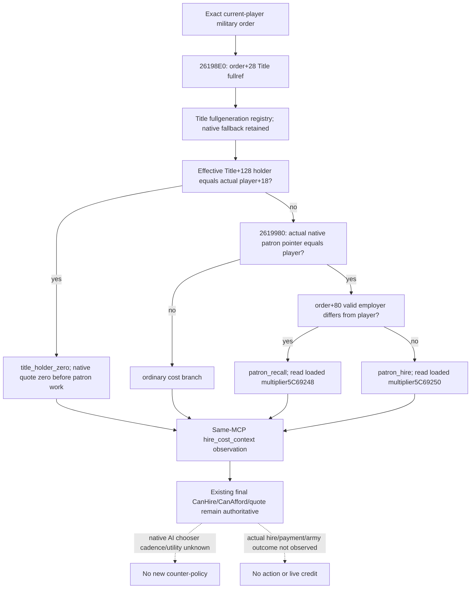

# Holy-order current hire cost branches — exact CK3 1.20.0.3

Source plan recorded at **2026-10-06 23:42 Asia/Shanghai**, before observer code. This work adds a present quote input to the existing `ck3_query_player_holy_order_context_v1`; the existing final CanHire, CanAfford, ten-slot quote, current-war eligibility, service lifecycle and troop association keep their existing qualification. The new observer is **research / implementation pending**, with compilation, new fixture and registered consumer **NOTRUN**. No game, SDK, pipe, UI, Steam, save, profile or runtime operation belongs to this package.

The exact build is CK3 **1.20.0.3 / Steam25652598**, executable SHA-256 `94B55397ABB687A3DCD436805A5D885E6BE90FA6C693FEB44A9E3BBEEADE02A6`; isolated source preimage `69a2fe5c560e399ef5a0e98e60a45b0cabbc4b1b`. Original native tree and stock costs are already frozen in [the holy-order systems topic](religion-holy-order-systems-native-ai-12003.md); ordinary typed hire and its closed command ABI are in [the command construction topic](religion-holy-order-hire-command-construction-12003.md). These are reused, with no new EXE read, scan or hash.

## Missing useful input

Current rows expose the first leased titles, dynamic patron and employer, but do not expose the **distinct order title at order+28 and its current holder**. The native quote checks that holder before evaluating the patron fee branch. A player who is this holder receives the zero-cost branch even when the first lease or patron differs. For a patron, an order employed by another character selects the recall multiplier, while empty or current-player employment selects the ordinary patron multiplier. Publishing the exact title/holder branch and the actually loaded patron multiplier explains a present zero or nonzero quote without guessing from founder, leases or stock define defaults. The existing native quote remains authoritative; this observer does not rebuild its regiment/modifier calculation.

## Cached source closure and costs

Only the named existing cached source files were read. Their original native spans are:

| Evidence | Original native bytes / SHA-256 | Closed input |
| --- | --- | --- |
| `span-026198e0-02619980.txt` | 160 / `600271fa8a0f2b1d6b8630921d81c6f4b6c0eee121e9478082e18b508b6b8d10` | order+28 full Title ref; registry `5D1DAF8`, fallback `5D1DAE0`; fullgeneration match at Title+10; effective Title+128 holder compared to player+18; matching holder returns ten zero slots before patron calculation. |
| `span-02619980-02619c32.txt` | 690 / `ef5e17e22ff4d6e046e38567f935354521d1f8faef15a1c9022bfc3668b2046b` | native dynamic patron pointer compared to actual player pointer; order+80 employer distinguishes other employment; selected loaded signed Q100000 patron multiplier at `5C69248` (recall) or `5C69250` (empty/current-player employer). Nonpatron uses the ordinary path. |

Both cached files reside under `Z:/ck3_mod_rewrite/artifacts/g2-maintainer-2026-10-02/resume-12003/religion-holy-order-systems-12003/native/`. Source-derived bytes reused: **850**, newly read EXE code/metadata/data bytes: **0**. The cached final gate and existing query inventory were read only to select this missing input; no old closure or test was redone. External source/owned-file packet: `C:/codex-ck3-background/packets/holy-order-next-decision-20261006/hire-inputs/`; resource name `source:c-holy-order-hire-inputs`.

The Title resolver in the actual cost leaf checks the full ID and follows the native fallback for a null registry, range miss, null slot or generation miss. It does **not** impose a new type-tag condition. The observer records whether the original Title resolved, while reading the same effective fallback holder. A missing binding or failed memory read is unavailable; a native sentinel or canonical fallback is an observed resolution outcome. The holder field keeps its full Character reference; it does not resolve that character or relabel it as patron.

## Minimal additive observer contract

`military_terms.hire_cost_context` will publish `available`, `unavailable_reason`, raw full `order_title_id`, `order_title_resolved`, effective nullable `order_title_holder_id`, nullable `title_holder_is_player`, nullable direct native `patron_is_player`, nullable `employed_by_other`, nullable `cost_branch` (`title_holder_zero`, `ordinary`, `patron_hire`, `patron_recall`), nullable signed `selected_patron_multiplier_raw` and `resource_scale=100000`. Early holder exemption leaves later patron/employer/multiplier inputs unsampled. Ordinary and title-holder branches have no selected patron multiplier. Native values and branch selection remain independent of final hire/resource-term availability. Nonmilitary rows retain `military_terms=null`; historical frozen packets may omit the additive member.

The helper and fixtures use dedicated `ck3_12003_holy_order_hire_cost_context` names. One new native target will invoke the real production reader and both production serializers to emit genuine synthetic native wire bytes; one new registered-MCP consumer will use those compiled bytes through the existing Service/driver/query path. Root owns the central FIRST compilation and execution. Tests, imports/dispatch execution and live calls in this lane remain **NOTRUN**. A positive static fixture will qualify this bounded observer only, not real hire, payment, automatic release or a full holy-order decision loop.

## Source implementation handoff — 2026-10-06 23:52 Asia/Shanghai

The bounded observer is implemented in the dedicated header `ck3_12003_holy_order_hire_cost_context.hpp` and the existing whole context reader/serializer. Bindings are appended to the existing DTO so older fixture aggregates retain their prior fields. The optional Python normalizer delegates to `player_holy_order_hire_cost_context.py`; the existing registered tool and Service route are retained. Independent source availability can be true even when the native quote is unavailable or final CanHire is false. Null means a branch was not demanded or an explicitly unavailable read; all four branches have implemented present-value paths.

The new target is `xar_ck3_12003_holy_order_hire_cost_context_test`, with only its dedicated fixture CPP as a source and **PRIVATE linkage to `xar_ck3_12002_runtime`**. CTest `ck3_12003_holy_order_hire_cost_context` writes `ck3_12003_holy_order_hire_cost_context_wire.json`. It prepares four whole production-reader samples, each with eight military rows and one nonmilitary row. Source inputs cover the early holder branch, ordinary cost, empty/current-player/other employer patron branches, actual signed loaded multipliers `-25000`/`175000`, stale fullgeneration and sentinel native fallback, legal zero holder, independent resource quote unavailability, missing title binding and missing demanded recall multiplier. World memory and native callback outcomes are synthetic; the whole reader, domain serializer and command-result serializer are the actual runtime members. No baseline is transplanted around a leaf.

`test_holy_order_hire_cost_context_registered_mcp_v1.py` requires that compiled JSON, takes `--source-root`, `--native-fixture`, `--output-dir`, and consumes every original native domain through the actual registered MCP/Service/driver/protocol/normalizer path. It does not construct replacement native output. The external `research-plan.json` and generated `NATIVE-TREE.md` bind the two cached source files and render their declared graph; record/file consistency is checked by the existing tool, without claiming semantic or live verification. The prose source tree was recorded before implementation; the formal JSON/render was written during handoff, not backdated.

Only `git diff --check` was run for candidate file hygiene. Native compilation, CTest, Python test/import execution, new genuine wire production and compiled registered consumer remain **NOTRUN**, so the candidate is **research / source-implemented**, pending Root central FIRST. The external packet preserves the source-record tool path failure, a missing Windows tzdata dependency corrected to explicit UTC+08 timestamping, and shell selector failures as tooling attempts; none is a capability RED. Original closed hire/war/lifecycle/troop tests were not repeated. New EXE bytes, game operations, automatic days and live evidence are all zero. Root merges the actual October 6 / W41 report fields and publishes centrally; this lane makes an English local commit and does not push.
